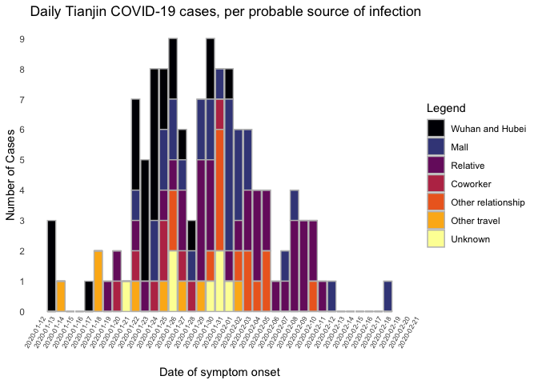

## Load packages and data

```
## ── Attaching packages ────────────────────────────────────────────────────────────────────────────────────────────────────── tidyverse 1.3.0 ──
```

```
## ✓ ggplot2 3.3.0     ✓ purrr   0.3.3
## ✓ tibble  2.1.3     ✓ dplyr   0.8.5
## ✓ tidyr   1.0.2     ✓ stringr 1.4.0
## ✓ readr   1.3.1     ✓ forcats 0.5.0
```

```
## ── Conflicts ───────────────────────────────────────────────────────────────────────────────────────────────────────── tidyverse_conflicts() ──
## x dplyr::filter() masks stats::filter()
## x dplyr::lag()    masks stats::lag()
```

```
## 
## Attaching package: 'lubridate'
```

```
## The following object is masked from 'package:base':
## 
##     date
```

```
## Loading required package: viridisLite
```

```
## 
## Attaching package: 'scales'
```

```
## The following object is masked from 'package:viridis':
## 
##     viridis_pal
```

```
## The following object is masked from 'package:purrr':
## 
##     discard
```

```
## The following object is masked from 'package:readr':
## 
##     col_factor
```

## Select variables of interest and clean for incidence plotting purposes
There are two possible choices of dates we can use to demonstrate the incidence curve of the epidemic: the date of symptom onset or the date of COVID-19 confirmation. The date of symptom onset is biologically more consistent (there is nothing about the nature of the virus that would suggest each case should be confirmed on the same day post-infection); however, there is missing data for 10 cases (in both Tianjin and Singapore datasets). But we have chosen to do the primary analysis with the raw (non-imputed data) so we will use this for the plots and just remove any missing cases.

#### Notes on how cases were grouped based on source of infection
It is important to note in the making of source of infection grouping labels, that some cases in the *Tianjin dataset* have multiple possible sources of infection listed (which may or may not represent the same "source" of infection, eg 'wuhan; train import' could be both a 'train' source, a from 'Wuhan' source, or—most likely—arrived on a train coming from Wuhan). 
Because the infection_source column can contain multiple possible sources of infection (for a handful of cases), it is important to consistently apply a decision rule for when each case would be assigned to a particular infection source group. Here we are emphasizing the Wuhan/Hubei and other known mall outbreak clusters over known interpersonal relationships, as it seems to best represent the introduction of the outbreak. **These groups are NOT used in the estimation of the serial intervals or incubation periods - only to help visualize the incidence plot and network graph.**

Decision rule applied to source_group label classification:

1. Known outbreak cluster locations (e.g. Wuhan/Hubei, mall, or church) *highest priority*

2. Known close relationship to another case (i. family; ii. work; iii. other known direct contact)

3. Known travel history to non-outbreak locations or unclear destinations

4. Any other listed associations (e.g. being part of a particular at-risk group such as airport worker)

5. No known source of possible viral exposure *lowest priority*

For instance, with case TJ60 (where 'Infection_source is 'wuhan; tj1'), the highest priority is a close relationship with another known case ('known relationship') over travel in 'Wuhan', thus for case TJ60 the 'source_group' becomes 'Known relationship'. 

It should also be noted that a similar decision rule is implicit in the coding for selecting infection source group labels ('presumed_reason_group') in the *Singapore dataset*; however, at this time, the data does not have cases with multiple possible sources in the 'presumed_reason' column that could lead to multiple labels.

Make these grouped columns has all been done in the 'serial_interval_revised' rmds for each respective location; see those files for the code. No need to repeat here as already saved in objects we loaded above.


## Plot daily incidence curves grouped by source of infection, for both clusters
What happens when we look at the incidence plots for each source of infection? Can either use the incidence package in R and base graphics plotting device or I can make the same plot using ggplot. We will use the ggplot versions for the manuscript so it is consistent with the other figures.

### For Singapore dataset

```
## Warning: Column `presumed_reason_group` joining factors with different levels,
## coercing to character vector
```

<!-- -->

### For Tianjin dataset

```
## Warning: Column `source_group` joining factors with different levels, coercing
## to character vector
```

<!-- -->

