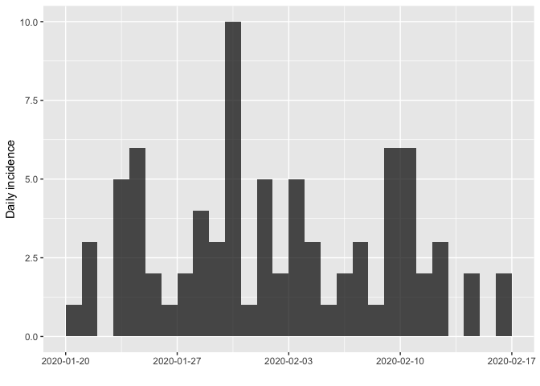
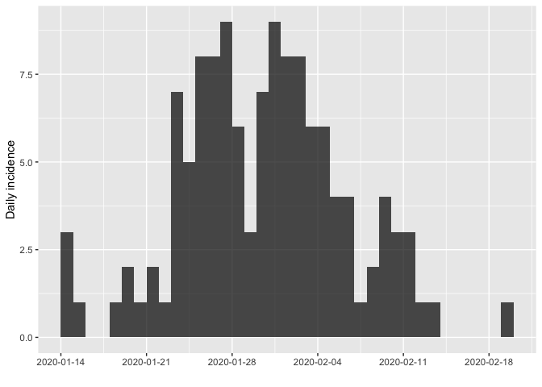
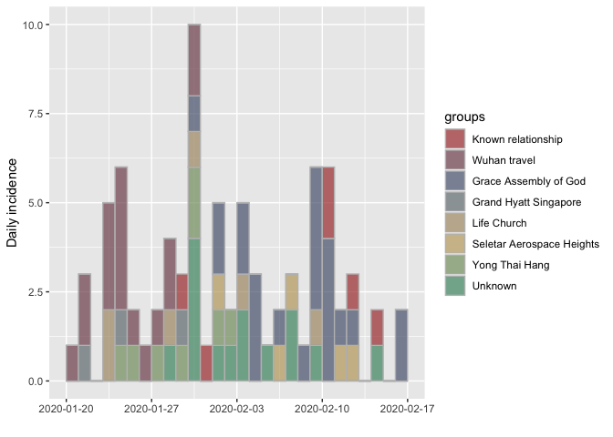
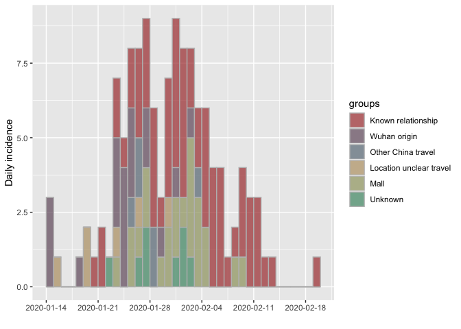
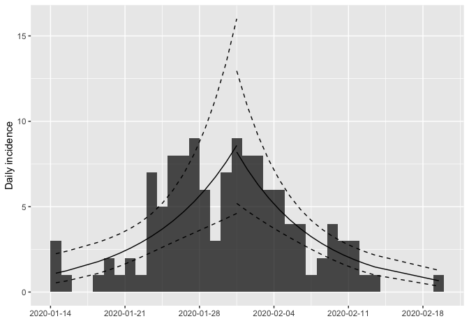

## Load packages and data

```
## ── Attaching packages ─────────────────────────────────────────────────────────────────────────────────────── tidyverse 1.3.0 ──
```

```
## ✓ ggplot2 3.2.1     ✓ purrr   0.3.3
## ✓ tibble  2.1.3     ✓ dplyr   0.8.3
## ✓ tidyr   1.0.0     ✓ stringr 1.4.0
## ✓ readr   1.3.1     ✓ forcats 0.4.0
```

```
## ── Conflicts ────────────────────────────────────────────────────────────────────────────────────────── tidyverse_conflicts() ──
## x dplyr::filter() masks stats::filter()
## x dplyr::lag()    masks stats::lag()
```

```
## 
## Attaching package: 'lubridate'
```

```
## The following object is masked from 'package:base':
## 
##     date
```

```
## Loading required package: viridisLite
```

```
## 
## Attaching package: 'scales'
```

```
## The following object is masked from 'package:viridis':
## 
##     viridis_pal
```

```
## The following object is masked from 'package:purrr':
## 
##     discard
```

```
## The following object is masked from 'package:readr':
## 
##     col_factor
```

```
## Parsed with column specification:
## cols(
##   .default = col_character(),
##   CaseID = col_double(),
##   age = col_double()
## )
```

```
## See spec(...) for full column specifications.
```

```
## Parsed with column specification:
## cols(
##   case_id = col_character(),
##   gender = col_character(),
##   age = col_double(),
##   symptom_onset = col_character(),
##   symptom_type = col_character(),
##   confirm_date = col_character(),
##   Infection_source = col_character(),
##   start_source = col_character(),
##   end_source = col_character(),
##   severity = col_character(),
##   death = col_character(),
##   recorrection = col_character(),
##   notes = col_character()
## )
```

## Select variables of interest and clean for incidence plotting purposes
There are two possible choices of dates we can use to demonstrate the incidence curve of the epidemic: the date of symptom onset or the date of COVID-19 confirmation. The date of symptom onset is biologically more consistent (there is nothing about the nature of the virus that would suggest each case should be confirmed on the same day post-infection); however, there is missing data for 10 cases (in both Tianjin and Singapore datasets). Therefore, I will make the curves using the date of symptom onset.

However, we could also run the same analysis using the date of confirmation instead as a sensitivity analysis to make sure it does not impact the results.

For the time being, I have also deleted cases that do not have a date of symptom onset (in both datasets); however, these also could be imputed and all cases used for analysis instead.

### Notes on how cases were grouped based on source of infection
It is important to note in the making of source of infection grouping labels, that some cases in the *Tianjin dataset* have multiple possible sources of infection listed (which may or may not represent the same "source" of infection, eg 'wuhan; train import' could be both a 'train' source, a from 'Wuhan' source, or—most likely—arrived on a train coming from Wuhan). 
To keep things consistent, a decision rule was made to try apply a source of infection group label as broadly as possible, based on the information provided in the 'Infection_source' column. Thus, sources listed as types of travel or regions of travel were grouped into 'Wuhan origin', 'Other China travel', or 'Location unclear travel'. 
However, there were still instances when a case could fall into multiple grouping labels. For instance, in Tianjin dataset case_id TJ60 has 'wuhan; tj1' listed under the 'Infection_source' column; so should we say the source is Wuhan, or from case TJ1? To be consistent across the whole dataset, a heirarchical decision rule was applied where infection sources, where the highest valued label would get priority if there were multiple possible source of infection grouping labels. The source grouping hierarchy is as follows: 
*(highest) Known relationship > Wuhan origin > Other China travel > Location unclear travel > Mall (for shoppers, workers, or individuals living near to the Baodi mall outbreak) > Unknown (lowest)*

For instance, with case TJ60 (where 'Infection_source is 'wuhan; tj1'), the highest priority is a close relationship with another known case ('known relationship') over travel in 'Wuhan', thus for case TJ60 the 'source_group' becomes 'Known relationship'. 

It should also be noted that a similar decision rule is implicit in the coding for selecting infection source group labels ('presumed_reason_group') in the *Singapore dataset*; however, at this time, the data does not have cases with multiple possible sources in the 'presumed_reason' column that could lead to multiple labels. But to keep things consistent between the analysis of both datasets, the Singapore source grouping hierarchy is as follows:
*(highest) Known relationship > Wuhan travel > Grace Assembly of God > Grand Hyatt Singapore > Life Church > Seletar Aerospace Heights > Yong Thai Hang > Unknown (lowest)*


```
## [1] "20/01/2020" "21/01/2020" "23/01/2020" "23/01/2020" "24/01/2020"
## [6] "25/01/2020"
```

```
## [1] 12
```

```
## 
##                                                                   arrived from wuhan 
##                                                                                    4 
##                                                    arrived from wuhan (asymptomatic) 
##                                                                                   13 
##         arrived from wuhan (evacuated when boarded flight, quarantined upon arrival) 
##                                                                                    1 
##                asymptomatic but detected a fever during medical screening at airport 
##                                                                                    1 
## evacuated from wuhan (asymptomatic when boarded, fever upon arrival and quarantined) 
##                                                                                    1 
##           evacuated from wuhan (asymptomatic when boarded, quarantined upon arrival) 
##                                                                                    2 
##                        evacuated from wuhan (asymptomatic, quarantined upon arrival) 
##                                                                                    2 
##                                                                grace assembly of god 
##                                                                                   22 
##                                                                grand hyatt singapore 
##                                                                                    3 
##                                                                          life church 
##                                                                                    6 
##                                                            seletar aerospace heights 
##                                                                                    5 
##                                                via 13, 26 (date of 13 symptom onset) 
##                                                                                    1 
##                                                    via 41 (date of 41 symptom onset) 
##                                                                                    1 
##                                                    via 50 (date of 50 symptom onset) 
##                                                                                    1 
##                                                 via 50,55 (date of 55 symptom onset) 
##                                                                                    1 
##                                                    via 59 (date of 59 symptom onset) 
##                                                                                    1 
##                                             via 72 via 59 (date of 72 symptom onset) 
##                                                                                    1 
##                                                    via 82 (date of 82 symptom onset) 
##                                                                                    1 
##                                                    via 83,91 at chinese ny gathering 
##                                                                                    1 
##                                                                       yong thai hang 
##                                                                                    9
```

```
## [1] 16
```

```
## 
##     Grace Assembly of God     Grand Hyatt Singapore        Known relationship 
##                        22                         3                         8 
##               Life Church Seletar Aerospace Heights                   Unknown 
##                         6                         5                        16 
##              Wuhan travel            Yong Thai Hang 
##                        24                         9
```

```
## 
##         Gatherings Known relationship            Unknown       Wuhan travel 
##                 45                  8                 16                 24
```

```
## [1] "14/01/2020" "18/01/2020" "14/01/2020" "14/01/2020" "15/01/2020"
## [6] "19/01/2020"
```

```
## [1] 10
```

```
## 
##                          appeared in workplaces of tj37/tj43 
##                                                            1 
##                                             business partner 
##                                                            1 
##                                         clos contact of tj68 
##                                                            1 
##                    close contact of cases tj72 tj85 and tj86 
##                                                            1 
##                close contact of tj93, tj107, tj119 and tj121 
##                                                            1 
##                           close contacts of cases tj64; tj99 
##                                                            1 
##                             colleague of cases tj34 and tj37 
##                                                            1 
##                                             colleague of tj6 
##                                                            1 
##                                            confirmed patient 
##                                                            3 
##                         confirmed patient and family of tj39 
##                                                            2 
##            contact with shoppers living in the same viliiage 
##                                                            1 
##                              coworker of a person from wuhan 
##                                                            1 
##                                              coworker of tj5 
##                                                            1 
##                                  coworkers of cases tj2; tj6 
##                                                            1 
##                                            dshopping in mall 
##                                                            1 
##                           family member of cases tj95; tj116 
##                                                            1 
##                                             family of  tj124 
##                                                            1 
##                                      family of tj14 and tj25 
##                                                            1 
##                                               family of tj17 
##                                                            1 
##                                               family of tj20 
##                                                            1 
##                                               family of tj32 
##                                                            1 
##                                               family of tj34 
##                                                            1 
##                                                family of tj9 
##                                                            1 
##                                                        hubei 
##                                                            3 
##                                                  hubei; tj45 
##                                                            1 
##                                             husband of tj119 
##                                                            1 
## living at the proximity of the mail, wife shoped at the mall 
##                                                            1 
##                                              living in hubei 
##                                                            1 
##                                 living in the mall proximity 
##                                                            3 
##                                                         mall 
##                                                            2 
##                         mother of tj115, travel to huhehaote 
##                                                            1 
##                                 relative of cases tj20, tj35 
##                                                            1 
##                                             relative of tj32 
##                                                            1 
##                                             relative of tj53 
##                                                            1 
##                                          shooper in the mall 
##                                                            1 
##                                          shopper at the mall 
##                                                            4 
##                                          shopper in the mall 
##                                                            7 
##                                    shopper in the mall, tj64 
##                                                            1 
##                                             shopping in mall 
##                                                            2 
##                                           shuperstore worker 
##                                                            1 
##                                              sister of tj109 
##                                                            1 
##                                   son of cases  tj119; tj121 
##                                                            1 
##                                                        tj100 
##                                                            1 
##                                                tj100， tj103 
##                                                            1 
##                                          tj100, tj103, tj108 
##                                                            1 
##                                                        tj102 
##                                                            1 
##                                                        tj103 
##                                                            1 
##                                                        tj114 
##                                                            1 
##                                                         tj27 
##                                                            1 
##                                                         tj38 
##                                                            1 
##                                                         tj43 
##                                                            1 
##                                                 tj5 (family) 
##                                                            2 
##                                                  tj5(family) 
##                                                            1 
##                                                 tj50  family 
##                                                            1 
##                                                         tj51 
##                                                            1 
##                                                 tj6 (family) 
##                                                            1 
##                                                          tj7 
##                                                            1 
##                                                         tj70 
##                                                            1 
##                                                         tj72 
##                                                            2 
##                                                   tj72, tj85 
##                                                            1 
##                                                         tj75 
##                                                            1 
##                                                   tj75; tj87 
##                                                            1 
##                                                         tj82 
##                                                            2 
##                                                         tj87 
##                                                            1 
##                                                    tj9; tj21 
##                                                            1 
##                                                         tj93 
##                                                            1 
##                                        tj93, living in baodi 
##                                                            1 
##                                  tj93, tj96, living in baodi 
##                                                            1 
##                                                   tj93, tj97 
##                                                            1 
##                                                  tj93; tj107 
##                                                            1 
##                                                         tj95 
##                                                            1 
##                                                  tj95, tj101 
##                                                            1 
##                                                        train 
##                                                            1 
##                                                   train crew 
##                                                            1 
##                                                 train import 
##                                                            2 
##                                                       travel 
##                                                            1 
##                                              travle to wuhan 
##                                                            1 
##                                               trip to dalian 
##                                                            1 
##                                                trip to hebei 
##                                                            1 
##                                                      unclear 
##                                                            1 
##                                                      unknown 
##                                                            5 
##               wife of tj110 shopping at the baodi superstore 
##                                                            1 
##            wife of tj117;living at the proximity of the mall 
##                                                            1 
##     wife of tj82, living at proximity of baodi shopping mall 
##                                                            1 
##                                                 wife of tj95 
##                                                            1 
##                                           worker in the mall 
##                                                            1 
##                                 worker in the train compoany 
##                                                            1 
##                                                        wuhan 
##                                                           16 
##                                                   wuhan; tj1 
##                                                            1 
##                                          wuhan; train import 
##                                                            2
```

```
## [1] 3
```

```
## 
##      Known relationship Location unclear travel                    Mall 
##                      71                       6                      24 
##      Other China travel                 Unknown            Wuhan origin 
##                       6                       9                      19
```

## Plot daily incidence curves for both clusters
Now to make the incidence plots using the R package 'incidence'. First, we will plot all the weekly cases in each cluster, without any type of grouping. Our cluster outbreaks have only been going for about 1 month so plotting daily incidence makes more sense.

```
## <incidence object>
## [81 cases from days 2020-01-20 to 2020-02-16]
## 
## $counts: matrix with 28 rows and 1 columns
## $n: 81 cases in total
## $dates: 28 dates marking the left-side of bins
## $interval: 1 day
## $timespan: 28 days
## $cumulative: FALSE
```

<!-- -->

```
## <incidence object>
## [125 cases from days 2020-01-14 to 2020-02-19]
## 
## $counts: matrix with 37 rows and 1 columns
## $n: 125 cases in total
## $dates: 37 dates marking the left-side of bins
## $interval: 1 day
## $timespan: 37 days
## $cumulative: FALSE
```

<!-- -->

## Plot daily incidence curves grouped by source of infection, for both clusters
What happens when we look at the incidence plots for each source of infection? Can either use the incidence package in R and base graphics plotting device or I can make the same plot using ggplot. We will use the ggplot versions for the manuscript so it is consistent with the other figures.

### For Singapore dataset

```
## <incidence object>
## [81 cases from days 2020-01-20 to 2020-02-16]
## [8 groups: Known relationship, Wuhan travel, Grace Assembly of God, Grand Hyatt Singapore, Life Church, Seletar Aerospace Heights, Yong Thai Hang, Unknown]
## 
## $counts: matrix with 28 rows and 8 columns
## $n: 81 cases in total
## $dates: 28 dates marking the left-side of bins
## $interval: 1 day
## $timespan: 28 days
## $cumulative: FALSE
```

<!-- -->

```
## Warning: Column `presumed_reason_group` joining factors with different levels,
## coercing to character vector
```

<!-- -->

```
## [1] "#000004FF" "#280B54FF" "#65156EFF" "#9F2A63FF" "#D44842FF" "#F57D15FF"
## [7] "#FAC127FF" "#FCFFA4FF"
```

```
## quartz_off_screen 
##                 2
```

### For Tianjin dataset

```
## <incidence object>
## [125 cases from days 2020-01-14 to 2020-02-19]
## [6 groups: Known relationship, Wuhan origin, Other China travel, Location unclear travel, Mall, Unknown]
## 
## $counts: matrix with 37 rows and 6 columns
## $n: 125 cases in total
## $dates: 37 dates marking the left-side of bins
## $interval: 1 day
## $timespan: 37 days
## $cumulative: FALSE
```

<!-- -->

```
## Warning: Column `source_group` joining factors with different levels, coercing
## to character vector
```

<!-- -->

```
## [1] "#000004FF" "#420A68FF" "#932667FF" "#DD513AFF" "#FCA50AFF" "#FCFFA4FF"
```

```
## quartz_off_screen 
##                 2
```


## Predictions of incidence
If we would like to know what the incidence might be in the future, which can be done by using two log-linear regressions of the incidence data (excluding zeros), where the first regression is fit to the growth phase of the epidemic and a second regression model is fit the decreasing phase of the epidemic. The 'incidence' package, will do this for us, as well as also automatically determine what is the date of the peak of the epidemic (and thus where to split the two regressions). Note that it splits the two regressions but doesn't actually seem to join them.

Another option would be to use a generalized additive model (GAM) to fit the curve of the data: would need to group by date, count # of cases, and I think put in zeros for the dates that had no cases. Could additionally do this by infection source groups.

As we don't have a lot of data to built a good model and an accurate prediction, it is probably better to stay away from publishing these results, given the high level of uncertainty and the potential for misinterpretation. 


```
## $df
##        dates      mean.R2
## 1 2020-01-26 -0.152667710
## 2 2020-01-27 -0.117156919
## 3 2020-01-28 -0.083937177
## 4 2020-01-29 -0.076868702
## 5 2020-01-30  0.004142608
## 6 2020-01-31 -0.084919934
## 7 2020-02-01 -0.055732877
## 8 2020-02-02 -0.081077558
## 9 2020-02-03 -0.064067944
## 
## $split
## [1] "2020-01-30"
## 
## $fit
## <list of incidence_fit objects>
## 
## attr(x, 'locations'): list of vectors with the locations of each incidence_fit object
## 
## 'before'
## 'after'
## 
## $model: regression of log-incidence over time
## 
## $info: list containing the following items:
##   $r (daily growth rate):
##      before       after 
##  0.08836552 -0.02244666 
## 
##   $r.conf (confidence interval):
##              2.5 %     97.5 %
## before -0.07913345 0.25586450
## after  -0.09947919 0.05458586
## 
##   $doubling (doubling time in days):
##   before 
## 7.844091 
## 
##   $doubling.conf (confidence interval):
##          2.5 %    97.5 %
## before 2.70904 -8.759219
## 
##   $halving (halving time in days):
##    after 
## 30.87974 
## 
##   $halving.conf (confidence interval):
##          2.5 %    97.5 %
## after 6.967761 -12.69829
## 
##   $pred: data.frame of incidence predictions (26 rows, 6 columns)
## 
## $plot
```

<!-- -->

```
## [1] "2020-01-30"
```

```
## [1] "2020-01-20" "2020-02-16"
```

<!-- -->

```
## $df
##         dates   mean.R2
## 1  2020-01-22 0.1121236
## 2  2020-01-23 0.2459169
## 3  2020-01-24 0.3217863
## 4  2020-01-25 0.4306124
## 5  2020-01-26 0.4878898
## 6  2020-01-27 0.5286192
## 7  2020-01-28 0.5238827
## 8  2020-01-29 0.4752552
## 9  2020-01-30 0.5590968
## 10 2020-01-31 0.5791444
## 11 2020-02-01 0.5697951
## 
## $split
## [1] "2020-01-31"
## 
## $fit
## <list of incidence_fit objects>
## 
## attr(x, 'locations'): list of vectors with the locations of each incidence_fit object
## 
## 'before'
## 'after'
## 
## $model: regression of log-incidence over time
## 
## $info: list containing the following items:
##   $r (daily growth rate):
##     before      after 
##  0.1206981 -0.1324890 
## 
##   $r.conf (confidence interval):
##              2.5 %      97.5 %
## before  0.05320853  0.18818760
## after  -0.18402441 -0.08095362
## 
##   $doubling (doubling time in days):
##   before 
## 5.742819 
## 
##   $doubling.conf (confidence interval):
##           2.5 %   97.5 %
## before 3.683278 13.02699
## 
##   $halving (halving time in days):
##    after 
## 5.231733 
## 
##   $halving.conf (confidence interval):
##          2.5 %   97.5 %
## after 3.766604 8.562275
## 
##   $pred: data.frame of incidence predictions (31 rows, 6 columns)
## 
## $plot
```

<!-- -->

```
## [1] "2020-01-31"
```

```
## [1] "2020-01-14" "2020-02-19"
```

<!-- -->

Interestingly, both models have the same split date for the optimal fit...possibly because the date range of cases is very similar? Also, the incidence does seem to be tailing off in both areas; however, it is possible this is a sampling artifact, as perhaps we have not yet found/diagnosed all the individuals that have come down with symptoms during the last week or so. This might be particularly true of the Singapore data where the daily incidence seems to be a little more steady than the daily incidence in Tianjin, which does seem to be showing a more pronounced decrease in daily incidence rate. 

Alternatively, we may be seeing the impact of the travel ban that is leading to tappering numbers of cases, as the Wuhan origin cases are primarily at the start of the epidemic curves for both locations.
