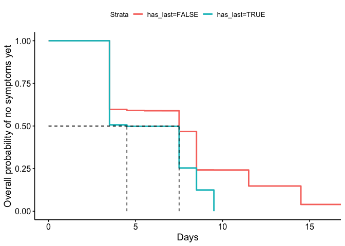
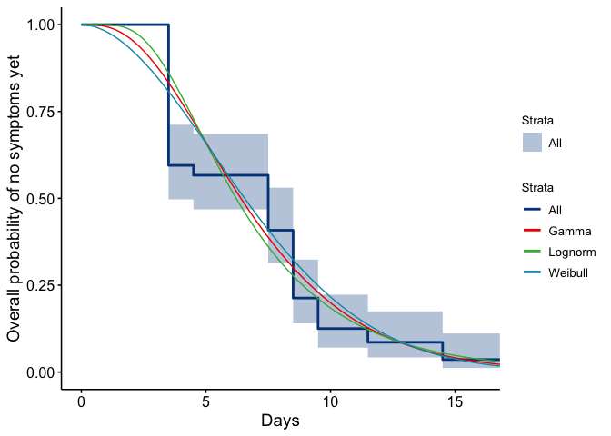
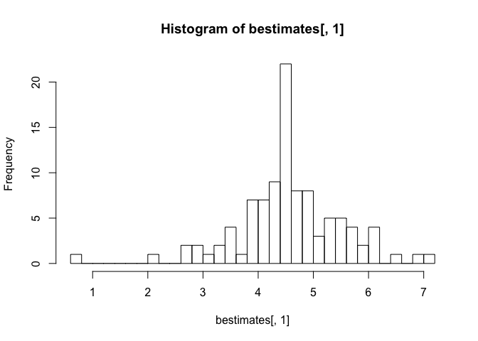
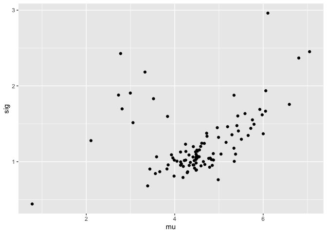
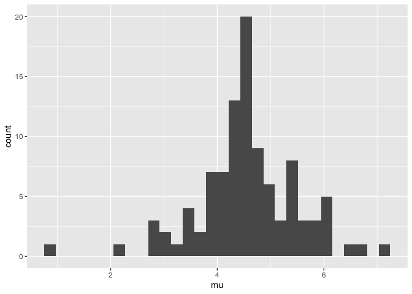
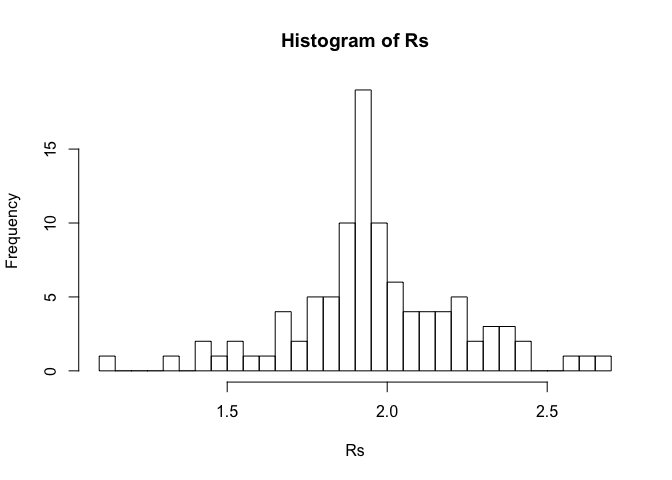

  


## Data 

Thanks to EpiCoronaHack Cluster team. These data are manually entered from postings from the Government of Singapore website: [website](https://www.moh.gov.sg/covid-19).
  


```r
spdata <- read_csv("data/COVID-19_Singapore.csv")
```

```
## Parsed with column specification:
## cols(
##   .default = col_character(),
##   CaseID = col_double(),
##   age = col_double()
## )
```

```
## See spec(...) for full column specifications.
```

```r
# Ensure properly imported
glimpse(spdata)
```

```
## Observations: 93
## Variables: 23
## $ CaseID                 <dbl> 1, 2, 3, 4, 5, 6, 7, 8, 9, 10, 11, 12, 13, 14,…
## $ `Related cases`        <chr> "2,3", "1,3", "1,2", "11", NA, NA, NA, "9", "8…
## $ `Cluster links`        <chr> NA, NA, NA, NA, NA, NA, NA, "9,31,33,38,83, 90…
## $ `Relationship notes`   <chr> NA, NA, "Son of 1", NA, NA, NA, NA, "Married t…
## $ Case                   <chr> "Case 1, 66M, Wuhan", "Case 2, 53F, Wuhan", "C…
## $ age                    <dbl> 66, 53, 37, 36, 56, 56, 35, 56, 56, 56, 31, 37…
## $ sex                    <chr> "M", "F", "M", "M", "F", "M", "M", "F", "M", "…
## $ country                <chr> "Singapore", "Singapore", "Singapore", "Singap…
## $ hospital               <chr> "Singapore General Hospital", "National Centre…
## $ presumed_infected_date <chr> "20/01/2020", "20/01/2020", "20/01/2020", "22/…
## $ presumed_reason        <chr> "Arrived from Wuhan", "Arrived from Wuhan", "A…
## $ last_poss_exposure     <chr> "20/01/2020", "20/01/2020", "20/01/2020", "22/…
## $ symp_presumed_infector <chr> NA, NA, NA, NA, NA, NA, NA, NA, NA, NA, NA, NA…
## $ date_onset_symptoms    <chr> "20/01/2020", "21/01/2020", "23/01/2020", "23/…
## $ date_quarantine        <chr> NA, NA, NA, NA, NA, NA, NA, NA, NA, NA, "26/01…
## $ date_hospital          <chr> "22/01/2020", "22/01/2020", "23/01/2020", "24/…
## $ date_confirmation      <chr> "23/01/2020", "24/01/2020", "24/01/2020", "25/…
## $ outcome                <chr> "Discharged", "Discharged", "Discharged", "Dis…
## $ date_discharge         <chr> "19/02/2020", "07/02/2020", "21/02/2020", "12/…
## $ travel_history         <chr> "Wuhan", "Wuhan", "Wuhan", "Wuhan", "Wuhan", "…
## $ additional_information <chr> "Travelled with Case 3 (son) and M1 (wife) ;MO…
## $ cluster                <chr> "Wuhan", "Wuhan", "Wuhan", "Wuhan", "Wuhan", "…
## $ citizenship            <chr> "China", "China", "China", "China", "China", "…
```

```r
colSums(is.na(spdata))
```

```
##                 CaseID          Related cases          Cluster links 
##                      0                     42                     88 
##     Relationship notes                   Case                    age 
##                     64                      0                      0 
##                    sex                country               hospital 
##                      0                      0                      0 
## presumed_infected_date        presumed_reason     last_poss_exposure 
##                     16                     16                     65 
## symp_presumed_infector    date_onset_symptoms        date_quarantine 
##                     42                     12                     80 
##          date_hospital      date_confirmation                outcome 
##                      0                      0                     31 
##         date_discharge         travel_history additional_information 
##                     31                      0                     55 
##                cluster            citizenship 
##                     23                      0
```

```r
# Rename columns 2, 3 and 4 so no spaces
spdata <- rename(spdata, related_cases = starts_with("Related"),
                 cluster_links = "Cluster links",
                 relationship_notes = starts_with("Relation"))
# Change date columns into date objects
spdata <- mutate(spdata, presumed_infected_date = dmy(presumed_infected_date),
                 last_poss_exposure = dmy(last_poss_exposure),
                 symp_presumed_infector = dmy(symp_presumed_infector),
                 date_onset_symptoms = dmy(date_onset_symptoms),
                 date_quarantine = dmy(date_quarantine),
                 date_hospital = dmy(date_hospital),
                 date_confirmation = dmy(date_confirmation),
                 date_discharge = dmy(date_discharge))
# make sure dates parsed properly
range(spdata$presumed_infected_date, na.rm = T)
```

```
## [1] "2020-01-18" "2020-02-10"
```

```r
range(spdata$last_poss_exposure, na.rm = T)
```

```
## [1] "2020-01-18" "2020-02-09"
```

```r
range(spdata$symp_presumed_infector, na.rm = T)
```

```
## [1] "2020-01-19" "2020-02-09"
```

```r
range(spdata$date_onset_symptoms, na.rm = T)
```

```
## [1] "2020-01-20" "2020-02-16"
```

```r
range(spdata$date_quarantine, na.rm = T)
```

```
## [1] "2020-01-26" "2020-02-15"
```

```r
range(spdata$date_hospital, na.rm = T)
```

```
## [1] "2020-01-22" "2020-02-25"
```

```r
range(spdata$date_confirmation, na.rm = T)
```

```
## [1] "2020-01-23" "2020-02-26"
```

```r
range(spdata$date_discharge, na.rm = T)
```

```
## [1] "2020-02-04" "2020-02-26"
```

```r
# Note that case 36 is listed has having symptoms 16 days AFTER being hospitalized; suspect a typo in the month, fixing: 
# spdata$date_onset_symptoms[spdata$CaseID==36] <- ymd("2020-01-24")
# Note that the date of symp_presumed_infector for CaseID 79 changed was originally listed as 2020-02-07 (based on online visualizations) but was changed to 2020-02-10, due to Feb 10, 2020 being on the earliest date of onset of symptoms from case 72, as from online info provided, presumed infective contact for CaseID 79 is from 72 (family member), rather than directly from case 52
spdata$symp_presumed_infector[spdata$CaseID == 79] <- ymd("2020-02-10")
# Change symp_presumed_infector to Feb 10, 2020 (date of symptom onset from caseID 72, the presumed infector)
spdata <- filter(spdata, !is.na(date_onset_symptoms)) #Remove all the cases that do not have info on date of symptom onset 
# NOTE NOTE 12 of these, but they have a date of confiramation and dates of presumed infection - COULD FIX 
```


## Incubation period

The incubation period is the time between exposure and the onset of symptoms. We estimate this directly from the stated start and end times for cases' exposure windows. These are explicitly listed for the Tianjin dataset but in Singapore they are approximated using contact tracing and the route by which a case was exposed. Because it is explicitly about the symptom onset, we remove those who don't have symptom onset defined. (These are a small minority of 12 cases and the alternative would be to impute their symptom onset time using the others' delay to confirmation time.  For now, we remove them).   

Then, if no other end time for the exposure is given or if the end of the exposure time is after the time of symptom onset, set the last exposure time to the symptom onset time. This is because they must have been exposed before symptom onset.   We use four ideas to set the end time for the exposure window: 

* 1: the end source is last possible exposure, if this is given 

* 2:  if it is not given, then we set the end of the exposure window to the time of  symptoms of the presumed infector plus a noise term epsilon (eps)

* 3: and if neither the last possible expsure or the symptom time of the presumed infector are given, the last exposure time is set to the time of symptom onset. 

* 4 Finally, we do not let the last possible exposure time be later than the time of symptom onset 


```r
spdata$end_source = spdata$last_poss_exposure # 1 above 

eps=4
hasPresInf = which(is.na(spdata$last_poss_exposure) & !(is.na(spdata$symp_presumed_infector))) # 2 above 
spdata$end_source[hasPresInf] = spdata$presumed_infected_date[hasPresInf]+eps

hasNone = which(is.na(spdata$last_poss_exposure) & is.na(spdata$symp_presumed_infector)) # 3 above 
spdata$end_source[hasNone] = spdata$date_onset_symptoms[hasNone]

spdata$end_source = pmin(spdata$end_source, spdata$date_onset_symptoms) # 4
```

Model the start source 

* 1 if the time of presumed infector is given, use that - epsilon 

* If it is not given use symptom onset minus say 20 days, based on prior 
knowledge 


```r
spdata$start_source = spdata$presumed_infected_date - eps # 1
spdata$start_source[is.na(spdata$presumed_infected_date)] = spdata$date_onset_symptoms[is.na(spdata$presumed_infected_date)]-20
```


```r
spdata$minIncTimes <- spdata$date_onset_symptoms - spdata$end_source
spdata$maxIncTimes <- spdata$date_onset_symptoms - spdata$start_source
```

We use survival analysis in the icenReg package to make parametric estimates, and we use the regular survival package to estimate the time to onset of symptoms. 


```r
ggsurvplot(
fit <- survfit(Surv(spdata$minIncTimes, spdata$maxIncTimes, type="interval2") ~ 1, data = spdata), 
xlab="Days",
ylab = "Overall probability of no symptoms yet")
```

<!-- -->


Just try one where data are stratifed by whether the person has a last possible exposure given, or not. 


```r
spcopy = spdata; spcopy$has_last = as.factor(!(is.na(spdata$last_poss_exposure)))
spcopyfit <- ic_par(Surv(spcopy$minIncTimes, spcopy$maxIncTimes, type="interval2") ~ has_last, data = spcopy, dist = "weibull")
summary(spcopyfit) 
```

```
## 
## Model:  Cox PH
## Dependency structure assumed: Independence
## Baseline:  weibull 
## Call: ic_par(formula = Surv(spcopy$minIncTimes, spcopy$maxIncTimes, 
##     type = "interval2") ~ has_last, data = spcopy, dist = "weibull")
## 
##              Estimate Exp(Est) Std.Error z-value        p
## log_shape       0.717     2.05    0.1271    5.64 1.70e-08
## log_scale       2.100     8.17    0.0718   29.24 0.00e+00
## has_lastTRUE    0.733     2.08    0.3090    2.37 1.77e-02
## 
## final llk =  -62.3 
## Iterations =  8
```

```r
getFitEsts(spcopyfit, newdata = data.frame(has_last=as.factor(TRUE)), p
                      =c(0.025, 0.05, 0.25, 0.5, 0.75, 0.95, 0.975))
```

```
## [1]  1.04  1.46  3.40  5.22  7.32 10.66 11.80
```

```r
getFitEsts(spcopyfit, newdata = data.frame(has_last=as.factor(FALSE)), p
                      =c(0.025, 0.05, 0.25, 0.5, 0.75, 0.95, 0.975))
```

```
## [1]  1.48  2.09  4.86  7.46 10.47 15.25 16.88
```

```r
ggsurvplot(
fit <- survfit(Surv(spcopy$minIncTimes, spcopy$maxIncTimes, type="interval2") ~ spcopy$has_last), data = spcopy, 
xlab="Days",
ylab = "Overall probability of no symptoms yet",
surv.median.line = c('hv'))
```

<!-- -->

```r
#ggsave("inc_sing_by_haslastexp.pdf", height = 6, width = 8)
```


 We use interval censoring, because we know only that exposure was some time between the minimum and maximum possible values. 


```r
# sum(is.na(spdata$minIncTimes)) # 0

# to switch: choose from these two lines

# spfirst = spcopy[which(spcopy$has_last ==TRUE),]
getthreefits=function(spfirst) {
myfit <- ic_par(Surv(spfirst$minIncTimes, spfirst$maxIncTimes, type="interval2") ~ 1, data = spdata, dist = "weibull")


myfit_gamma<- ic_par(Surv(spfirst$minIncTimes, spfirst$maxIncTimes, type="interval2") ~ 1, data = spdata, dist = "gamma")


myfit_lnorm =  ic_par(Surv(spfirst$minIncTimes, spfirst$maxIncTimes, type="interval2") ~ 1, data = spdata, dist = "lnorm")
return(list(myfit=myfit, myfit_gamma=myfit_gamma, myfit_lnorm=myfit_lnorm))
}

allthree=getthreefits(spdata)
myfit=allthree$myfit
myfit_gamma=allthree$myfit_gamma
myfit_lnorm=allthree$myfit_lnorm
```


We want to report (1) the parameters for these fits and the quantiles (including median). This describes the distribution.

Then we want to report (2) the resulting mean (95% CI for the mean). This describes our uncertainty in the distribution. 

(1) For the point estimates, get the parameters and quantiles for these  distributions. For Weibull and gamma distributions, the two parameters are shape and scale. For log normal they are mu and sdlog. 


```r
getQuantileDF <- function(myfit,myfit_gamma,myfit_lnorm) {
interqs=getFitEsts(myfit, newdata = NULL, p=c(0.025, 0.25, 0.5, 0.75,0.975)) #
interqs_gamma <- getFitEsts(myfit_gamma, newdata=NULL,  p
                      =c(0.025, 0.25, 0.5, 0.75, 0.975))

interqs_lnorm <- getFitEsts(myfit_lnorm, newdata=NULL,  p
                      =c(0.025,  0.25, 0.5, 0.75, 0.975))
mm=rbind(interqs, interqs_gamma, interqs_lnorm)
colnames(mm)=paste("q_",c(0.025, 0.25, 0.5, 0.75, 0.975),sep="")

df=as.data.frame(mm); df$distr =c("Weibull","Gamma","Log normal")
df$par1=c(exp(myfit$coefficients[1]), exp(myfit_gamma$coefficients[1]), 
          myfit_lnorm$coefficients[1])
df$par2=c(exp(myfit$coefficients[2]), exp(myfit_gamma$coefficients[2]), 
          exp(myfit_lnorm$coefficients[2]))
rownames(df)=NULL

return(df[,c(6,7,8,1:5)])
}

getQuantileDF(myfit,myfit_gamma,myfit_lnorm)
```

```
##        distr par1  par2 q_0.025 q_0.25 q_0.5 q_0.75 q_0.975
## 1    Weibull 1.88 7.968    1.12   4.10  6.55   9.48    16.0
## 2      Gamma 3.36 2.114    1.64   4.25  6.40   9.19    16.5
## 3 Log normal 1.83 0.529    2.20   4.35  6.21   8.88    17.5
```


(2) Now we want the mean and 95% CIs on this mean. The "myfit" objects contain the estimates and covariance for these. Without wanting to code up the theory, the quick approach is to resample the shape and scale with appropriate covariance and compute the resampled means, then take the 95\% CIs. The functional form is different for the three different distributions. 


```r
getMeanCI <- function(statfit, dist = "weibull") {
  if (dist == "weibull") {
  x=exp(rmvnorm(n=10000, mean = statfit$coefficients, sigma=statfit$var))
  mymeans=x[,2]*gamma(1+1/x[,1]) # shape, scale for weibull 
  par1=exp(statfit$coefficients[1])
   par2=exp(statfit$coefficients[2])
  par1range=c(exp(log(par1)-1.96*sqrt(statfit$var[1,1])), exp(log(par1)+1.96*sqrt(myfit$var[1,1])))
   par2range=c(exp(log(par2)-1.96*sqrt(statfit$var[2,2])), exp(log(par2)+1.96*sqrt(myfit$var[2,2])))
  }
  if (dist == "gamma") {
      x=exp(rmvnorm(n=10000, mean = statfit$coefficients, sigma=statfit$var)) # shape, scale for gamma
      mymeans = x[,1]*x[,2] # gamma: mean  is shape*scale
  par1=exp(statfit$coefficients[1])
   par2=exp(statfit$coefficients[2])
  par1range=c(exp(log(par1)-1.96*sqrt(statfit$var[1,1])), exp(log(par1)+1.96*sqrt(myfit$var[1,1])))
   par2range=c(exp(log(par2)-1.96*sqrt(statfit$var[2,2])), exp(log(par2)+1.96*sqrt(myfit$var[2,2])))
  }
  if (dist == "lognorm") {
  x=rmvnorm(n=10000, mean = statfit$coefficients, sigma=statfit$var) 
  # these are the log of the mean, and the log of sd? 
  # mean is exp(mu + 0.5 sig^2) 
  mymeans=exp(x[,1]+0.5*exp(x[,2])^2) # i think
  par1=statfit$coefficients[1]
   par2=exp(statfit$coefficients[2])
    par1range=c(par1-1.96*sqrt(statfit$var[1,1]), par1+1.96*sqrt(myfit$var[1,1]))
   par2range=c(exp(statfit$coefficients[2]-1.96*sqrt(statfit$var[2,2])), exp(statfit$coefficients[2]+1.96*sqrt(statfit$var[2,2])))
  }
return(list(par1=par1,par2=par2, par1range=par1range, par2range=par2range, means=mymeans, qs = quantile(mymeans, probs = c(0.025, 0.5, 0.975)), meanmeans=mean(mymeans), sdmeans=sd(mymeans)))
}
```

Table for unstratified mean incubation period and CI for these fits: 


```r
getMeanCI_DF = function(myfit,myfit_gamma,myfit_lnorm) {
out_weib=getMeanCI(statfit = myfit, dist = "weibull")
out_gamm = getMeanCI(statfit =myfit_gamma, dist = "gamma")
out_lnorm=getMeanCI(statfit =myfit_lnorm, dist="lognorm")
return(data.frame(par1s=c(out_weib$par1, 
                          out_gamm$par1, 
                          out_lnorm$par1),
                   par1lower=c(out_weib$par1range[1], 
                          out_gamm$par1range[1], 
                          out_lnorm$par1range[1]),
                  par1upper=c(out_weib$par1range[2], 
                          out_gamm$par1range[2], 
                          out_lnorm$par1range[2]), # there is a better way .. but.
                  par2s=c(out_weib$par2, 
                          out_gamm$par2, 
                          out_lnorm$par2),
               par2lower=c(out_weib$par2range[1], 
                          out_gamm$par2range[1], 
                          out_lnorm$par2range[1]),
                  par2upper=c(out_weib$par2range[2], 
                          out_gamm$par2range[2], 
                          out_lnorm$par2range[2]), # there is a better way .. but.
                  means=c(out_weib$meanmeans, 
                          out_gamm$meanmeans, 
                          out_lnorm$meanmeans),
           meanlower=c(out_weib$qs[1], out_gamm$qs[1],
                     out_lnorm$qs[1]),
           meanupper=c(out_weib$qs[3],out_gamm$qs[3],
                     out_lnorm$qs[3])))
}
getMeanCI_DF(myfit,myfit_gamma,myfit_lnorm)
```

```
##   par1s par1lower par1upper par2s par2lower par2upper means meanlower meanupper
## 1  1.88      1.47      2.39 7.968     6.848     9.272  7.11      6.13      8.25
## 2  3.36      2.09      4.28 2.114     1.315     2.459  7.12      6.14      8.20
## 3  1.83      1.67      2.07 0.529     0.413     0.678  7.20      6.18      8.31
```

Here is a plot of the estimated distribution together with the empirical survival curve from the data. This is Figure 3a (upper panel) in the manuscript.

### Generating figure 3a above panel for paper
This is to plot the Kaplan-Meier survival curve and estimated probability distribution of days post-infection for a case not to be showing symptoms yet (using three possible distributions: weibull, gamma, and log-normal).

```r
spdays <- seq(0,20, by=0.05)

ggsp = ggsurvplot(
fit=survfit(Surv(spdata$minIncTimes, spdata$maxIncTimes, type="interval2")~1, data=spdata), combine = TRUE,
xlab="Days",  ylab = "Overall probability of no symptoms yet", palette = "lancet",legend=c('right'))

pdata <- data.frame(days=rep(spdays,3),  
            fitsurv=c(1-pweibull(spdays, shape = exp(myfit$coefficients[1]), scale = exp(myfit$coefficients[2])),
        1-pgamma(spdays,  shape = exp(myfit_gamma$coefficients[1]), scale = exp(myfit_gamma$coefficients[2])),
        1-plnorm(spdays,  meanlog = myfit_lnorm$coefficients[1], sdlog = exp(myfit_lnorm$coefficients[2]))),distn=c(rep("Weibull", length(spdays)), rep("Gamma",length(spdays)), rep("Lognorm", length(spdays)) )) 
                                                            
ggsp$plot+geom_line(data = pdata, aes(x = days, y = fitsurv, color=distn))
```

<!-- -->

```r
  ggsave(filename = "final_figures/Fig3_inc_Sing_all.pdf", width = 8, height = 6)
```

Finally, we want to do this all again but stratifying the data between early occurring cases and late. 


```r
earlydata = spcopy[which(spcopy$has_last ==TRUE),]
latedata=spcopy[which(spcopy$has_last==FALSE),]
```


Fit to the three distributions: 


```r
Eallthree=getthreefits(earlydata)
Lallthree=getthreefits(latedata)
```

EARLY: parameter point estimates and the quantiles


```r
getQuantileDF(Eallthree[[1]],Eallthree[[2]], Eallthree[[3]])
```

```
##        distr par1  par2 q_0.025 q_0.25 q_0.5 q_0.75 q_0.975
## 1    Weibull 2.35 6.385    1.34   3.76  5.46   7.34    11.1
## 2      Gamma 4.64 1.224    1.74   3.75  5.28   7.17    11.9
## 3 Log normal 1.64 0.457    2.12   3.81  5.18   7.05    12.7
```

LATE: parameter point estimates and the quantiles


```r
getQuantileDF(Lallthree[[1]],Lallthree[[2]], Lallthree[[3]])
```

```
##        distr par1  par2 q_0.025 q_0.25 q_0.5 q_0.75 q_0.975
## 1    Weibull 1.93 8.791    1.31   4.61  7.27  10.41    17.3
## 2      Gamma 3.57 2.189    1.93   4.79  7.11  10.08    17.8
## 3 Log normal 1.94 0.504    2.58   4.94  6.94   9.75    18.7
```

EARLY: how variable are these point estimates? Look at mean and 95\% CI


```r
getMeanCI_DF(Eallthree[[1]],Eallthree[[2]], Eallthree[[3]])
```

```
##   par1s par1lower par1upper par2s par2lower par2upper means meanlower meanupper
## 1  2.35      1.50      3.00 6.385     5.144     7.430  5.71      4.55      7.06
## 2  4.64      1.94      5.92 1.224     0.513     1.424  5.72      4.54      7.10
## 3  1.64      1.41      1.89 0.457     0.286     0.729  5.86      4.65      7.39
```

LATE: how variable are these point estimates? Look at mean and 95\% CI


```r
getMeanCI_DF(Lallthree[[1]],Lallthree[[2]], Lallthree[[3]])
```

```
##   par1s par1lower par1upper par2s par2lower par2upper means meanlower meanupper
## 1  1.93      1.43      2.46 8.791     7.353    10.229  7.86      6.57      9.38
## 2  3.57      1.96      4.56 2.189     1.219     2.547  7.85      6.60      9.25
## 3  1.94      1.75      2.18 0.504     0.372     0.684  7.95      6.68      9.38
```

### Generating Fig 3a below panel for the paper
This is to plot the Kaplan-Meier survival curves and estimated probability distribution of days post-infection for a case not to be showing symptoms yet, when stratifying the data pre and post quarantine procedures in China. As per tables above, having a specified last possible exposure date (which are all on or before Jan 30, 2020) is the cut-off for what defines an "early" case. 

```r
#generating figure 3 below panel from the paper
spdays <- seq(0,20, by=0.05)

fit1<-survfit(Surv(earlydata$minIncTimes, earlydata$maxIncTimes, type="interval2")~1, data=earlydata)
fit2<-survfit(Surv(latedata$minIncTimes, latedata$maxIncTimes, type="interval2")~1, data=latedata)

fit <- list(early = fit1, late = fit2)
ggsp2=ggsurvplot(fit, data = spcopy, combine = TRUE, # Combine curves
             # Clean risk table
           xlab="Days",  ylab = "Overall probability of no symptoms yet", palette = "lancet",legend.labs=c("Stratum:Early","Stratum:Late"),legend=c('right'))


pdata <- data.frame(days=rep(spdays,3),  
            fitsurv=c(1-pweibull(spdays, shape = exp(Eallthree$myfit$coefficients[1]), scale = exp(Eallthree$myfit$coefficients[2])),
        1-pgamma(spdays,  shape = exp(Eallthree$myfit_gamma$coefficients[1]), scale = exp(Eallthree$myfit_gamma$coefficients[2])),
        1-plnorm(spdays,  meanlog = Eallthree$myfit_lnorm$coefficients[1], sdlog = exp(Eallthree$myfit_lnorm$coefficients[2]))),distn=c(rep("Weibull", length(spdays)), rep("Gamma",length(spdays)), rep("Lognorm", length(spdays)) )) 
                                                            
pdata1 <- data.frame(days=rep(spdays,3),  
            fitsurv=c(1-pweibull(spdays, shape = exp(Lallthree$myfit$coefficients[1]), scale = exp(Lallthree$myfit$coefficients[2])),
        1-pgamma(spdays,  shape = exp(Lallthree$myfit_gamma$coefficients[1]), scale = exp(Lallthree$myfit_gamma$coefficients[2])),
        1-plnorm(spdays,  meanlog = Lallthree$myfit_lnorm$coefficients[1], sdlog = exp(Lallthree$myfit_lnorm$coefficients[2]))),distn=c(rep("Weibull", length(spdays)), rep("Gamma",length(spdays)), rep("Lognorm", length(spdays)) )) 
                                                            
ggsp2$plot + geom_line(data = pdata, aes(x = days, y = fitsurv,color=distn)) +geom_line(data = pdata1, aes(x = days, y = fitsurv,color=distn)) 
```

<!-- -->

```r
  ggsave(filename = "final_figures/Fig3_inc_Sing_strata.pdf", width = 8, height = 6)
```


## Serial interval 

The simplest serial interval estimate we can make with these data is a direct estimate based on the time of symptoms of the presumed infector, and the time of symptoms of the case. However, this does not account for the fact that the presumed infector is not necessarily the infector. There are missing intermediate cases (with reasonable probability), or two cases could both be infected by a third unknown case.  


```r
directSI=spdata$date_onset_symptoms - spdata$symp_presumed_infector
directSI=as.numeric(directSI[!is.na(directSI)])
mean(directSI)
```

```
## [1] 7.75
```

```r
sd(directSI)
```

```
## [1] 4.95
```


We will estimate the serial interval using the 'interval case to case' approach given in Vink et al (https://academic.oup.com/aje/article/180/9/865/2739204). 

The dataset has several instances where a putative infector or contact is known. These are listed in the 'related_cases' column. We first make a graph in which nodes are individuals and edges are present from cases listed as possible sources, to the cases for whom they are possible sources. 


```r
spnodes <- spdata$CaseID
## How to extract caseIDs from related_cases column - there are multiple values in some cells, separated by commas
spdata$related_cases #7 max within one cell
```

```
##  [1] "2,3"                    "1,3"                    "1,2"                   
##  [4] "11"                     NA                       NA                      
##  [7] NA                       "9"                      "8"                     
## [10] NA                       "4"                      "18"                    
## [13] "26, 2"                  NA                       NA                      
## [16] NA                       "12"                     "20,21,24,27,28,34,40"  
## [19] "24,19"                  "19"                     "19,20,25"              
## [22] "24"                     "28,19"                  NA                      
## [25] NA                       NA                       NA                      
## [28] NA                       "19,20"                  NA                      
## [31] "30,39"                  NA                       NA                      
## [34] NA                       "19,20"                  NA                      
## [37] NA                       NA                       "13,26"                 
## [40] NA                       NA                       NA                      
## [43] NA                       "55,65,77"               NA                      
## [46] NA                       "\n"                     "57,58"                 
## [49] "50"                     NA                       "54,58"                 
## [52] "54,57"                  "72,79"                  NA                      
## [55] "67"                     NA                       NA                      
## [58] NA                       "68, 70, 71, 80, 83, 91" "61"                    
## [61] "66, 70, 71, 80"         "42,47,52,56"            "66, 68, 71, 80"        
## [64] "66, 68, 70, 71, 80"     "59, 79"                 "51"                    
## [67] NA                       "50"                     NA                      
## [70] "72"                     "66"                     NA                      
## [73] "86"                     NA                       "66"                    
## [76] NA                       "82"                     "66"                    
## [79] NA                       NA                       "66"
```

```r
# Split into separate columns
spdata <- separate(spdata,
col = related_cases,
into = paste("contactID", 1:7, sep = "_"),
fill = "right")
# Turn into numeric values
spdata <- mutate(spdata, 
contactID_1 = as.numeric(contactID_1),
contactID_2 = as.numeric(contactID_2),
contactID_3 = as.numeric(contactID_3),
contactID_4 = as.numeric(contactID_4),
contactID_5 = as.numeric(contactID_5),
contactID_6 = as.numeric(contactID_6),
contactID_7 = as.numeric(contactID_7))
# Select down to columns of interest
spedges <- select(spdata, c(CaseID, starts_with("contactID")))
# Remove rows with NAs for at least one contact
spedges <- filter(spedges, !is.na(spedges$contactID_1)) #43 CasesIDs with 1 or more possible contacts
```

That is nice but visNetwork and igraph require an edge list with from, to nodes. So for each row of spedges we create entries like these.

NOTE still need to check whether the related cases came prior to the stated cases.. (but this may come out in the wash, in the ICC method) 


```r
singedges = data.frame(from=2,to=1) 
for (n in 1:nrow(spedges)) {
 for (k in 2:ncol(spedges)) { 
   if (!is.na(spedges[n,k])) {
     singedges=rbind(singedges, c(spedges[[n,k]],spedges[[n,1]])) 
   }  
   }
}
singedges=singedges[-1,]
# create undirected graph by removing duplicates
undir=data.frame(from = pmin(singedges[,1],singedges[,2]), 
                 to=pmax(singedges[,1], singedges[,2]))
undir=unique(undir)
undir = undir[-which(undir[,1]==undir[,2]),]
fedges = data.frame(from=paste("case",undir[,1],sep=""), 
               to=paste("case",undir[,2],sep=""))
```


From this edge list we can use visNetwork to visualise the graph. Make 'group' based on source of probably infection. Colours are from the infection source column (but we could have a better colour scheme, like date of symptom onset). 


```r
# Turn 'presumed_reason' into lower case and get trim any whitespace so don't have issues with case sensitivity, etc
spdata$presumed_reason <- str_to_lower(spdata$presumed_reason)
spdata$presumed_reason <- str_trim(spdata$presumed_reason)
table(spdata$presumed_reason)
```

```
## 
##                                                    arrived from wuhan 
##                                                                     3 
##                                     arrived from wuhan (asymptomatic) 
##                                                                    13 
## asymptomatic but detected a fever during medical screening at airport 
##                                                                     1 
##                                                 grace assembly of god 
##                                                                    22 
##                                                 grand hyatt singapore 
##                                                                     3 
##                                                           life church 
##                                                                     6 
##                                             seletar aerospace heights 
##                                                                     5 
##                                 via 13, 26 (date of 13 symptom onset) 
##                                                                     1 
##                                     via 50 (date of 50 symptom onset) 
##                                                                     1 
##                                     via 59 (date of 59 symptom onset) 
##                                                                     1 
##                              via 72 via 59 (date of 72 symptom onset) 
##                                                                     1 
##                                     via 82 (date of 82 symptom onset) 
##                                                                     1 
##                                     via 83,91 at chinese ny gathering 
##                                                                     1 
##                                                        yong thai hang 
##                                                                     8
```

```r
sum(is.na(spdata$presumed_reason)) #15 NAs
```

```
## [1] 14
```

```r
# Make a new column where we group the 'presumed_reason' under a label (known relationship, gathering, wuhan travel) for each of the above three groups
spdata <- mutate(spdata, presumed_reason_group = case_when(!is.na(str_match(presumed_reason, "symptom onset|via")) ~ "Known relationship",
                                                           !is.na(str_match(presumed_reason, "grace")) ~ "Grace Assembly of God",
                                                           !is.na(str_match(presumed_reason, "grand")) ~ "Grand Hyatt Singapore",
                                                           !is.na(str_match(presumed_reason, "life")) ~ "Life Church",
                                                           !is.na(str_match(presumed_reason, "seletar")) ~ "Seletar Aerospace Heights",
                                                           !is.na(str_match(presumed_reason, "yong")) ~ "Yong Thai Hang",
                                                           !is.na(str_match(presumed_reason, "wuhan|airport")) ~ "Wuhan travel", #'airport' case (CaseID 17) does not have 'wuhan' in reason but does have it under 'Case' column that they are from Wuhan
                                                           is.na(presumed_reason) ~ "Unknown",
                                                           TRUE ~ "other")) #should not be any other, so is just a double check this has run correctly, especially as dataset grows
table(spdata$presumed_reason_group)
```

```
## 
##     Grace Assembly of God     Grand Hyatt Singapore        Known relationship 
##                        22                         3                         6 
##               Life Church Seletar Aerospace Heights                   Unknown 
##                         6                         5                        14 
##              Wuhan travel            Yong Thai Hang 
##                        17                         8
```


```r
nodes.df <- data.frame(id=paste("case",spdata$CaseID,sep=""), label=spdata$CaseID, group=spdata$presumed_reason_group)
glimpse(nodes.df)
```

```
## Observations: 81
## Variables: 3
## $ id    <fct> case1, case2, case3, case4, case5, case6, case7, case8, case9, …
## $ label <dbl> 1, 2, 3, 4, 5, 6, 7, 8, 9, 10, 11, 12, 13, 14, 16, 17, 18, 19, …
## $ group <fct> Wuhan travel, Wuhan travel, Wuhan travel, Wuhan travel, Wuhan t…
```

```r
spdata$graphID = paste("case",spdata$CaseID,sep="")
visNetwork(nodes.df, fedges) %>% visLegend() 
```

<!--html_preserve--><div id="htmlwidget-429a8017b362d8ce7b25" style="width:672px;height:480px;" class="visNetwork html-widget"></div>
<script type="application/json" data-for="htmlwidget-429a8017b362d8ce7b25">{"x":{"nodes":{"id":["case1","case2","case3","case4","case5","case6","case7","case8","case9","case10","case11","case12","case13","case14","case16","case17","case18","case19","case20","case21","case24","case25","case27","case29","case30","case31","case32","case33","case34","case35","case36","case37","case38","case39","case40","case41","case42","case43","case44","case46","case47","case48","case49","case50","case51","case52","case53","case54","case55","case56","case57","case58","case59","case60","case61","case62","case63","case64","case66","case67","case68","case69","case70","case71","case72","case73","case74","case77","case78","case79","case80","case81","case82","case83","case84","case85","case86","case88","case89","case90","case91"],"label":[1,2,3,4,5,6,7,8,9,10,11,12,13,14,16,17,18,19,20,21,24,25,27,29,30,31,32,33,34,35,36,37,38,39,40,41,42,43,44,46,47,48,49,50,51,52,53,54,55,56,57,58,59,60,61,62,63,64,66,67,68,69,70,71,72,73,74,77,78,79,80,81,82,83,84,85,86,88,89,90,91],"group":["Wuhan travel","Wuhan travel","Wuhan travel","Wuhan travel","Wuhan travel","Wuhan travel","Wuhan travel","Wuhan travel","Wuhan travel","Wuhan travel","Wuhan travel","Wuhan travel","Wuhan travel","Wuhan travel","Wuhan travel","Wuhan travel","Wuhan travel","Yong Thai Hang","Yong Thai Hang","Yong Thai Hang","Yong Thai Hang","Yong Thai Hang","Yong Thai Hang","Unknown","Grand Hyatt Singapore","Life Church","Unknown","Life Church","Yong Thai Hang","Unknown","Grand Hyatt Singapore","Unknown","Life Church","Grand Hyatt Singapore","Yong Thai Hang","Unknown","Seletar Aerospace Heights","Unknown","Known relationship","Unknown","Seletar Aerospace Heights","Grace Assembly of God","Grace Assembly of God","Unknown","Grace Assembly of God","Seletar Aerospace Heights","Grace Assembly of God","Grace Assembly of God","Unknown","Seletar Aerospace Heights","Grace Assembly of God","Grace Assembly of God","Unknown","Grace Assembly of God","Grace Assembly of God","Grace Assembly of God","Grace Assembly of God","Unknown","Known relationship","Grace Assembly of God","Grace Assembly of God","Seletar Aerospace Heights","Grace Assembly of God","Grace Assembly of God","Known relationship","Grace Assembly of God","Grace Assembly of God","Known relationship","Grace Assembly of God","Known relationship","Grace Assembly of God","Grace Assembly of God","Unknown","Life Church","Grace Assembly of God","Unknown","Known relationship","Grace Assembly of God","Unknown","Life Church","Life Church"]},"edges":{"from":["case1","case1","case2","case4","case8","case12","case13","case2","case19","case19","case19","case19","case19","case19","case19","case20","case24","case27","case20","case30","case36","case20","case13","case26","case50","case50","case50","case54","case54","case57","case59","case59","case61","case66","case66","case66","case66","case66","case66","case68","case68","case68","case42","case47","case52","case56","case70","case70","case71","case72","case51","case82","case66","case66"],"to":["case2","case3","case3","case11","case9","case18","case26","case13","case20","case21","case24","case27","case28","case34","case40","case24","case25","case28","case34","case36","case39","case40","case44","case44","case55","case65","case77","case57","case58","case58","case72","case79","case67","case68","case70","case71","case80","case83","case91","case70","case71","case80","case69","case69","case69","case69","case71","case80","case80","case79","case73","case86","case84","case88"]},"nodesToDataframe":true,"edgesToDataframe":true,"options":{"width":"100%","height":"100%","nodes":{"shape":"dot"},"manipulation":{"enabled":false}},"groups":["Wuhan travel","Yong Thai Hang","Unknown","Grand Hyatt Singapore","Life Church","Seletar Aerospace Heights","Known relationship","Grace Assembly of God"],"width":null,"height":null,"idselection":{"enabled":false},"byselection":{"enabled":false},"main":null,"submain":null,"footer":null,"background":"rgba(0, 0, 0, 0)","legend":{"width":0.2,"useGroups":true,"position":"left","ncol":1,"stepX":100,"stepY":100,"zoom":true}},"evals":[],"jsHooks":[]}</script><!--/html_preserve-->

Now we estimate the serial interval using the ICC method; for this we first construct a graph. The "interval case to case" data are from identifying a putative first infector each small cluster in the graph, and finding the times between symptom onset in the first observed case and the others. See Vink et al. 


```r
sgraph = graph_from_edgelist(as.matrix(fedges[,1:2]), directed = FALSE)
ccs=components(sgraph)

spdata$component=vapply(spdata$graphID, function(x)
  { if (x %in% names(ccs$membership)) { return(ccs$membership[match(x, names(ccs$membership))])
  } else { 
    return(NA)}}, FUN.VALUE = 3)
```

Now knowing the components of the graph I can extract the ICC intervals. 
I did this in a few ways (commented out lines): taking the first 
case for each cluster to be the first reported symptoms (I get a 5 day serial interval); the first start exposure time (now there are negative ICCs so I get a 4.5 day serial interval) and the latest end exposure time.


Extract ICC interval data: a function 


```r
 getICCs <- function(thisdata, ccs, K, orderby= "onset" ) {
  iccs=1
for (n in 1:max(ccs$membership)) {
  mycases  = which(thisdata$component==n)
  if (orderby == "onset")
  {  myonsets = sort(thisdata$date_onset_symptoms[mycases])[1:min(K, length(mycases))]}
  if (orderby == "exposure") {
 myonsets =thisdata$date_onset_symptoms[mycases][order(thisdata$end_source[mycases])][1:min(K,length(mycases))]
 # myonsets =  spdata$date_onset_symptoms[mycases[order(spdata$start_source[mycases])]] # alternative also ORDERS by earliest exposure 
 
 }
  iccs =c(iccs, myonsets[-1]-myonsets[1])
}
  return(iccs[-1]) 
  }
```


```r
icc3 = getICCs(spdata,ccs,3)
icc4 = getICCs(spdata,ccs,4)
icc5 = getICCs(spdata,ccs,5)
icc6 = getICCs(spdata,ccs,6)
icc_expose = getICCs(spdata, ccs, 4, orderby ="exposure")
```


```r
source("TianjinSI_VinkWallinga_CC.R")
myest3 = serial_mix_est(data=icc3, N=50, startmu=10, startsig =4)
```

```
## [1] 5.97 2.69
## [1] 4.89 2.07
## [1] 4.53 1.69
## [1] 4.41 1.43
## [1] 4.39 1.25
## [1] 4.38 1.15
## [1] 4.37 1.12
## [1] 4.36 1.11
## [1] 4.36 1.11
## [1] 4.36 1.11
## [1] 4.36 1.11
## [1] 4.36 1.11
## [1] 4.36 1.11
## [1] 4.36 1.11
## [1] 4.36 1.11
## [1] 4.36 1.11
## [1] 4.36 1.11
## [1] 4.36 1.11
## [1] 4.36 1.11
## [1] 4.36 1.11
## [1] 4.36 1.11
## [1] 4.36 1.11
## [1] 4.36 1.11
## [1] 4.36 1.11
## [1] 4.36 1.11
## [1] 4.36 1.11
## [1] 4.36 1.11
## [1] 4.36 1.11
## [1] 4.36 1.11
## [1] 4.36 1.11
## [1] 4.36 1.11
## [1] 4.36 1.11
## [1] 4.36 1.11
## [1] 4.36 1.11
## [1] 4.36 1.11
## [1] 4.36 1.11
## [1] 4.36 1.11
## [1] 4.36 1.11
## [1] 4.36 1.11
## [1] 4.36 1.11
## [1] 4.36 1.11
## [1] 4.36 1.11
## [1] 4.36 1.11
## [1] 4.36 1.11
## [1] 4.36 1.11
## [1] 4.36 1.11
## [1] 4.36 1.11
## [1] 4.36 1.11
## [1] 4.36 1.11
## [1] 4.36 1.11
```

```r
myest4 = serial_mix_est(data=icc4, N=50, startmu=10, startsig =4)
```

```
## [1] 6.50 2.62
## [1] 5.66 2.19
## [1] 5.27 1.90
## [1] 5.07 1.69
## [1] 4.96 1.54
## [1] 4.88 1.43
## [1] 4.81 1.35
## [1] 4.75 1.29
## [1] 4.70 1.25
## [1] 4.66 1.22
## [1] 4.63 1.20
## [1] 4.61 1.18
## [1] 4.59 1.17
## [1] 4.58 1.17
## [1] 4.57 1.16
## [1] 4.57 1.16
## [1] 4.56 1.16
## [1] 4.56 1.16
## [1] 4.56 1.16
## [1] 4.56 1.16
## [1] 4.56 1.16
## [1] 4.56 1.16
## [1] 4.56 1.16
## [1] 4.56 1.16
## [1] 4.56 1.16
## [1] 4.56 1.16
## [1] 4.56 1.16
## [1] 4.56 1.16
## [1] 4.56 1.16
## [1] 4.56 1.16
## [1] 4.56 1.16
## [1] 4.56 1.16
## [1] 4.56 1.16
## [1] 4.56 1.16
## [1] 4.56 1.16
## [1] 4.56 1.16
## [1] 4.56 1.16
## [1] 4.56 1.16
## [1] 4.56 1.16
## [1] 4.56 1.16
## [1] 4.56 1.16
## [1] 4.56 1.16
## [1] 4.56 1.16
## [1] 4.56 1.16
## [1] 4.56 1.16
## [1] 4.56 1.16
## [1] 4.56 1.16
## [1] 4.56 1.16
## [1] 4.56 1.16
## [1] 4.56 1.16
```

```r
myest5 = serial_mix_est(data=icc5, N=50, startmu=10, startsig =4)
```

```
## [1] 7.24 2.81
## [1] 6.50 2.53
## [1] 6.05 2.33
## [1] 5.75 2.15
## [1] 5.54 1.97
## [1] 5.39 1.81
## [1] 5.29 1.68
## [1] 5.20 1.58
## [1] 5.14 1.50
## [1] 5.08 1.44
## [1] 5.03 1.39
## [1] 4.99 1.36
## [1] 4.95 1.33
## [1] 4.92 1.31
## [1] 4.90 1.29
## [1] 4.87 1.28
## [1] 4.86 1.27
## [1] 4.85 1.26
## [1] 4.84 1.26
## [1] 4.83 1.25
## [1] 4.82 1.25
## [1] 4.82 1.25
## [1] 4.82 1.24
## [1] 4.81 1.24
## [1] 4.81 1.24
## [1] 4.81 1.24
## [1] 4.81 1.24
## [1] 4.81 1.24
## [1] 4.81 1.24
## [1] 4.81 1.24
## [1] 4.81 1.24
## [1] 4.81 1.24
## [1] 4.81 1.24
## [1] 4.81 1.24
## [1] 4.81 1.24
## [1] 4.81 1.24
## [1] 4.81 1.24
## [1] 4.81 1.24
## [1] 4.81 1.24
## [1] 4.81 1.24
## [1] 4.81 1.24
## [1] 4.81 1.24
## [1] 4.81 1.24
## [1] 4.81 1.24
## [1] 4.81 1.24
## [1] 4.81 1.24
## [1] 4.81 1.24
## [1] 4.81 1.24
## [1] 4.81 1.24
## [1] 4.81 1.24
```

```r
myest6 = serial_mix_est(data=icc6, N=50, startmu=10, startsig =4)
```

```
## [1] 7.43 2.83
## [1] 6.74 2.58
## [1] 6.31 2.40
## [1] 6.00 2.23
## [1] 5.77 2.05
## [1] 5.60 1.88
## [1] 5.48 1.72
## [1] 5.38 1.59
## [1] 5.31 1.50
## [1] 5.26 1.44
## [1] 5.21 1.40
## [1] 5.17 1.37
## [1] 5.14 1.35
## [1] 5.11 1.34
## [1] 5.09 1.32
## [1] 5.08 1.32
## [1] 5.06 1.31
## [1] 5.05 1.30
## [1] 5.05 1.30
## [1] 5.04 1.30
## [1] 5.04 1.29
## [1] 5.03 1.29
## [1] 5.03 1.29
## [1] 5.03 1.29
## [1] 5.03 1.29
## [1] 5.02 1.29
## [1] 5.02 1.29
## [1] 5.02 1.29
## [1] 5.02 1.29
## [1] 5.02 1.29
## [1] 5.02 1.29
## [1] 5.02 1.29
## [1] 5.02 1.29
## [1] 5.02 1.28
## [1] 5.02 1.28
## [1] 5.02 1.28
## [1] 5.02 1.28
## [1] 5.02 1.28
## [1] 5.02 1.28
## [1] 5.02 1.28
## [1] 5.02 1.28
## [1] 5.02 1.28
## [1] 5.02 1.28
## [1] 5.02 1.28
## [1] 5.02 1.28
## [1] 5.02 1.28
## [1] 5.02 1.28
## [1] 5.02 1.28
## [1] 5.02 1.28
## [1] 5.02 1.28
```

```r
myest_exp= serial_mix_est(data=icc_expose, N=50, startmu=10, startsig =4)
```

```
## [1] 6.70 3.12
## [1] 5.40 2.78
## [1] 4.64 2.46
## [1] 4.20 2.18
## [1] 3.94 1.97
## [1] 3.77 1.80
## [1] 3.68 1.67
## [1] 3.64 1.58
## [1] 3.63 1.51
## [1] 3.64 1.46
## [1] 3.66 1.42
## [1] 3.69 1.39
## [1] 3.72 1.36
## [1] 3.74 1.34
## [1] 3.77 1.32
## [1] 3.79 1.31
## [1] 3.82 1.29
## [1] 3.83 1.28
## [1] 3.85 1.27
## [1] 3.86 1.26
## [1] 3.87 1.26
## [1] 3.88 1.25
## [1] 3.89 1.25
## [1] 3.90 1.24
## [1] 3.90 1.24
## [1] 3.91 1.24
## [1] 3.91 1.23
## [1] 3.91 1.23
## [1] 3.91 1.23
## [1] 3.92 1.23
## [1] 3.92 1.23
## [1] 3.92 1.23
## [1] 3.92 1.23
## [1] 3.92 1.23
## [1] 3.92 1.23
## [1] 3.92 1.23
## [1] 3.92 1.23
## [1] 3.92 1.23
## [1] 3.92 1.23
## [1] 3.92 1.23
## [1] 3.92 1.23
## [1] 3.92 1.23
## [1] 3.92 1.23
## [1] 3.92 1.23
## [1] 3.92 1.23
## [1] 3.92 1.23
## [1] 3.92 1.23
## [1] 3.92 1.23
## [1] 3.92 1.23
## [1] 3.92 1.23
```

```r
mm=rbind(myest3, myest4, myest5,myest6, myest_exp)
colnames(mm)=c("mu","sig")
mm=as.data.frame(mm)
mm$NumCasesPerCluster=c( 3,4, 5, 6, 4) 
mm$ordering = c("Onset","Onset","Onset","Onset","LastExposure")
print(mm[,c(4,3,1,2)]) 
```

```
##               ordering NumCasesPerCluster   mu  sig
## myest3           Onset                  3 4.36 1.11
## myest4           Onset                  4 4.56 1.16
## myest5           Onset                  5 4.81 1.24
## myest6           Onset                  6 5.02 1.28
## myest_exp LastExposure                  4 3.92 1.23
```


```r
days = seq(from=0, to=10, by=0.1) 
 sp.density= dnorm(days, mean = myest4[1], sd = myest4[2])
ggplot(data=data.frame(days=days, density=sp.density), aes(x=days,y=density)) + geom_line() + ggtitle("ICC estimate of the Singapore cluster serial interval")
#ggsave(file="final_figures/sing_serialint.pdf", height = 4, width = 6)
```

I note that the serial interval gets longer if we include more cases per cluster (because the mixture of 4 pathways in Vink et al does not include longer transmission chains, which forces the assumption that everyone in the cluster was infected by the initial case, which in turn lengthens the estimated serial interval). We do not know the true infection pathways but it is reasonable not to constrain the model to enforce that most are infected by the first few cases. 


The mean SI is 4.558. The standard deviation of the serial intervals is 1.155.

We need CIs for the mean. For this we use bootstrapping. 


```r
# bootstrap analysis
Nboot=100
bestimates=myest4 # NOTE this loop had errors a few times; I just restarted it. 
for (kk in 1:Nboot) {
bdata = sample(x=icc4, size = length(icc4), replace = T)
bestimates = rbind(bestimates, serial_mix_est(data=bdata, N=50, startmu=10, startsig =4))
}

#The mean of the mean serial intervals is`r mean(bestimates[,1])` days and the standard deviation of these means is `r sd(bestimates[,1])`. 
```


```r
load("sing_boots_100.Rdata") # in case in Rmd with above evals set to FALSE 
hist(bestimates[,1],breaks = 30)
```

<!-- -->

```r
bootdf=data.frame(mu=bestimates[,1], sig=bestimates[,2])
ggplot(bootdf, aes(x=mu, y=sig))+geom_point()
```

<!-- -->

```r
ggplot(bootdf, aes(x=mu))+geom_histogram()
```

```
## `stat_bin()` using `bins = 30`. Pick better value with `binwidth`.
```

<!-- -->

```r
ggsave(file = "final_figures/FigS1_bootst_SI_sing.pdf", width = 6, height = 4)
```

```
## `stat_bin()` using `bins = 30`. Pick better value with `binwidth`.
```


```r
#load("sing_boots_100.Rdata") # in case in Rmd with above evals set to FALSE 
mean(bestimates[,1]) 
```

```
## [1] 4.57
```

```r
median(bestimates[,1])
```

```
## [1] 4.49
```

```r
sd(bestimates[,1])
```

```
## [1] 0.953
```

```r
mean(bestimates[,2])
```

```
## [1] 1.24
```

```r
sd(bestimates[,2])
```

```
## [1] 0.411
```


The 95% range for the mean serial interval is (2.691, 6.425).

## Presymptomatic transmission 


## R0 estimation 

We estimate R0 from Wallinga and Lipsitch Proc. Roy. Soc. B 2007 using the equation $R=\exp{r \mu - 1/2 r^2 \sigma^2}$. To obtain CIs for R, we could use our bootstrap estimates of $\mu$ and $\sigma^2$ and simply resample R using this equation. 

Jung et al Scenario 1


```r
myrate=0.15

Rs=0*(1:100) 
for (n in 1:100) {
  Rs[n]= exp(myrate*bestimates[n,1] - 0.5*(myrate)^2*bestimates[n,2]^2)
}
hist(Rs,breaks = 30)
```

<!-- -->

```r
mean(Rs)
```

```
## [1] 1.97
```

```r
sd(Rs)
```

```
## [1] 0.264
```

```r
quantile(Rs, probs = c(0.025, 0.975))
```

```
##  2.5% 97.5% 
##  1.43  2.51
```


The mean R is 1.965 and the range is (1.448, 2.483), based on the 1.96 standard deviations from the mean.  This agrees closely with the above quantiles. 


### Additional (uninteresting we think)  - Jung et al Scenario 2 (faster doubling time, higher R values ) 


```r
myrate=0.29
Rs=0*(1:100) 
for (n in 1:100) {
  Rs[n]= exp(myrate*bestimates[n,1] - 0.5*(myrate)^2*bestimates[n,2]^2)
}
hist(Rs,breaks = 30)
mean(Rs)
quantile(Rs, probs = c(0.025, 0.975))
```


