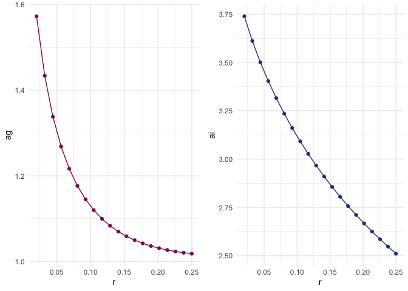
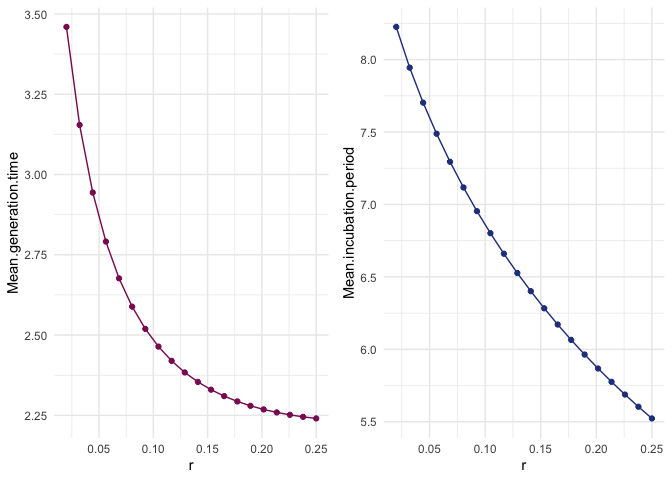
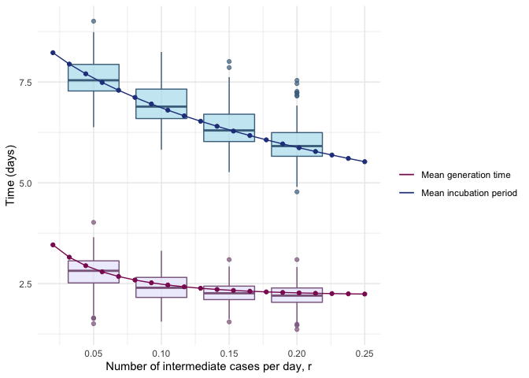
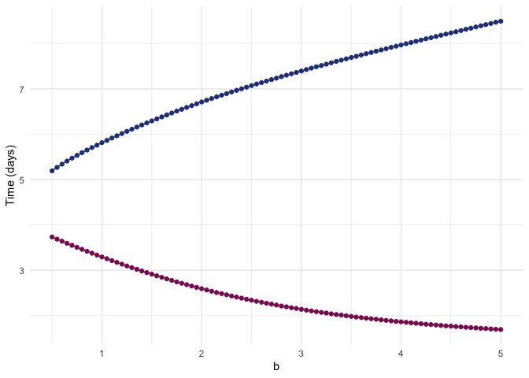

  


## Data 

Thanks to EpiCoronaHack Cluster team. These data are manually entered from postings from the Government of Singapore website: [website](https://www.moh.gov.sg/covid-19).
  

```r
tdata=read.csv("data/Tianjin135cases_revised.csv",na.strings = "", stringsAsFactors = F)

tdata$symptom_onset=as.Date(tdata$symptom_onset, format = "%d/%m/%Y")
tdata$start_source=as.Date(tdata$start_source, format = "%d/%m/%Y")
tdata$end_source=as.Date(tdata$end_source,format = "%d/%m/%Y" )
tdata$confirm_date=as.Date(tdata$confirm_date,format = "%d/%m/%Y" )
names(tdata)[1] = "case_id"
str(tdata)
```

```
## 'data.frame':	135 obs. of  13 variables:
##  $ case_id                              : chr  "TJ1" "TJ2" "TJ3" "TJ4" ...
##  $ gender                               : chr  "F" "M" "F" "M" ...
##  $ age                                  : int  59 57 68 40 46 56 29 39 57 30 ...
##  $ symptom_onset                        : Date, format: "2020-01-14" "2020-01-18" ...
##  $ symptom_type                         : chr  "NA" "NA" "NA" "NA" ...
##  $ confirm_date                         : Date, format: "2020-01-21" "2020-01-21" ...
##  $ Infection_source                     : chr  "Wuhan" "Wuhan; train import" "Wuhan" "Wuhan" ...
##  $ start_source                         : Date, format: "2020-01-05" NA ...
##  $ end_source                           : Date, format: "2020-01-14" "2020-01-18" ...
##  $ severity                             : chr  "severe" "severe" "severe" "normal" ...
##  $ death                                : chr  NA NA NA NA ...
##  $ recorrection.for.start.and.end.source: chr  "symptom onset as ending source " "added end source" NA NA ...
##  $ notes                                : chr  "sometimes Tianjin didn't mention the patient's severity" "Tianjin didn't tell which patient got cured, but they report death cases" "source1: http://wsjk.tj.gov.cn/col/col87/index.html#!uid=259&pageNum=1 (Tianjin health commission official webs"| __truncated__ "source2: https://weibo.com/u/2967529507 (Jinyun News, Tianjin offical local media weibo account, for patient sy"| __truncated__ ...
```


## Incubation period

The incubation period is the time between exposure and the onset of symptoms. We estimate this directly from the stated start and end times for cases' exposure windows. Because it is explicitly about the symptom onset, we remove those who don't have symptom onset defined. These are a small minority of cases (10) and the alternative would be to impute their symptom onset time using the others' delay to confirmation time.  For now, we remove them.  Then, if no other end time for the exposure is given or if the end of the exposure time is after the time of symptom onset, set the last exposure time to the symptom onset time. This is because they must have been exposed before symptom onset.  

If no other start time is given, we assume that they must have been exposed within the 20 days previous to their symptom onset. We set this as an upper bound on the incubation period given prior knowledge.

These give us the maximum and minimum incubation times.


```r
goodii=which(!is.na(tdata$symptom_onset))  # Remove the 10 individuals without symptom onset
tdata_orig <- tdata # save the full dataset in case
tdata <- tdata[goodii,]

tdata$end_source[which(is.na(tdata$end_source))]=tdata$symptom_onset[which(is.na(tdata$end_source))]  # if no end exposure: set to symptom onset 
tdata$end_source = pmin(tdata$end_source, tdata$symptom_onset) # if end exposure after onset, set to onset 
tdata$start_source[which(is.na(tdata$start_source))]= tdata$symptom_onset[which(is.na(tdata$start_source))] - 20 # if no start, set to symptom onset - 20

# Let's confirm that the end_source is always before or equal to the symptom onset date
sum(tdata$end_source>tdata$symptom_onset) # =0. Good
```

```
## [1] 0
```

```r
tdata$maxIncTimes=tdata$symptom_onset-tdata$start_source 
tdata$minIncTimes = tdata$symptom_onset-tdata$end_source

tdata$maxIncTimes
```

```
## Time differences in days
##   [1]  9 20 20 20 20 20 20  4 20  6 20 20 20 20 20 20 20  7  4 20  9 20 20 20 20
##  [26] 20  8 20 11  9  5 20 20  8 20 20  9  7 11 11 20  3 20 20 20  6 15 11  7  7
##  [51] 20 20 20  8  9  6 20 20  9 20 20 20 14 11  6  9 20 20  6 20  3  6 13 12 20
##  [76]  3 11 10 20 20 20 20 20 20 13 20 20 20 20  7 20 20 20 20 20 20 20 16 20 11
## [101] 20 20 20 20  3 11 20 19 16 20 17 20 11 20 20  6 19 20 20 14 20 16 20 20 20
```

```r
tdata$minIncTimes
```

```
## Time differences in days
##   [1]  0  0  0  0  0  0  1  1  7  4  0  0  0  6  2  0  7  7  4  7  2  3  3 12  8
##  [26]  5  8  0  7  5  2  3  4  0  4  1  8  1  5  5  0  0  4  1  5  6  9 11  7  0
##  [51]  8  3  7  8  9  6 14  0  0  0  0  0  1  8  0  9  0  0  6  0  3  6 12  1  0
##  [76]  3 11 10  0  0  0  0  0  0 13  0 12  0  0  7  0  0  0  0  0  0  0 16  0  4
## [101]  0  0  0  0  3 11  0  0  0  0 17  0  4  0  0  6 19  0  0 11  6 16 11  0  2
```

Define the maximum and minimum exposure times based on these assumptions. These are the times $t_{min}^i$ and $t_{max}^i$ in the notation. 


We assume that incubation times have to be at least 1 day, based on prior knowledge. We set the maximum incubation times as at least 3 days, to take into account some uncertainty on symptom onset reporting.


```r
#spdata = filter(spdata, maxIncTimes > 2)
tdata$maxIncTimes = pmax(3, tdata$maxIncTimes)
tdata$minIncTimes = pmax(1, tdata$minIncTimes)
```

From here this file diverges from the ..wtables Rmd file.

First define the relevant times for truncation $T_i$


```r
tdata$Ti = as.numeric(ymd("2020-02-27")-tdata$start_source)
# last Tianjin confirm date is 22/02
```

Specify some fixed and initial parameters.  
In the paper on medrxiv our estimates for the incubation period were shape: 4.06 (2.69, 5.11) and scale:  2.218 (1.405, 2.53). 

Here we will have a shape $a_g$ for the generation time and $a_i$ for the incubation period, and the same scale $b$ for both. 


```r
b=2.2 # common scale parameter 
ai= 4.1 # shape for incubation period ,as estimated in first round. true value less than this? 
ag = 3 #starting point for shape for generation time. 
n=3  # max number of intermediate cases 
r = 0.1 # add on average 1 intermediate per 10 days? who knows. must look at sensitivity to this parameter 
```

Functions

```r
source("incufuncs.R")
```


These functions seem to work. Yay! Now we have to set up the relevant data inputs, and maximize the likelihood to solve for several parameters. 

We have spdata's minIncTimes and maxIncTimes, which are the 'mintime' and 'maxtime' inputs. We already computed Ti which are the rtTime input. 


```r
# negative log likelihood function for optim 
l_optim <- function( twopars, allmaxtimes, allmintimes, allrtTimes, 
                     maxinters=n, rate=r, comscale=b) {
  gs=twopars[1] # gen time scale parameter
  is=twopars[2] # incubation period scale parameter
  Ncases = length(allmaxtimes) 
  # now compute lirt for each case i 
  indelikes = vapply(1:Ncases, 
                     function(ind) lirt(maxtime=allmaxtimes[ind],
                                        mintime=allmintimes[ind],
                                        rtTime=allrtTimes[ind],
                                        maxinters=maxinters, rate=rate, 
                                        genshape = gs, incshape=is, 
                                        comscale=comscale),
                     FUN.VALUE = 1)
  # the product is the likelihood. the negative sum is the negative log likelihood
  return(-sum(indelikes))
}
```


Testing: seems to work *except* if max and min times are the same, so we correct for this by adding a small noise term in those cases; then 


```r
l_optim(c(1,2), allmaxtimes = tdata$maxIncTimes, 
        allmintimes=tdata$minIncTimes,allrtTimes = tdata$Ti, 
         maxinters=n, rate=r, comscale=b)
```

```
## [1] 137
```

So now let's optimize! 


```r
optim(c(1,2), l_optim, allmaxtimes = tdata$maxIncTimes, allmintime=tdata$minIncTimes,
               allrtTimes = tdata$Ti, maxinters=n, rate=r, comscale=b,
      lower = c(0,0), upper = c(20,20), method = "L-BFGS-B")
```

```
## $par
## [1] 1.13 3.12
## 
## $value
## [1] 123
## 
## $counts
## function gradient 
##       10       10 
## 
## $convergence
## [1] 0
## 
## $message
## [1] "CONVERGENCE: REL_REDUCTION_OF_F <= FACTR*EPSMCH"
```

Take a look at a heatmap:


```r
# Grid of likelihood values
x <- c(seq(0.1,5, length.out=50))
y <- c(seq(0.1,5, length.out=50))
data <- expand.grid(X=x, Y=y)
for (i in 1:dim(data)[1]){
    data$Z[i] <- -l_optim(c(data[i,1],data[i,2]), allmaxtimes = tdata$maxIncTimes, 
        allmintime=tdata$minIncTimes,allrtTimes = tdata$Ti, 
         maxinters=n, rate=r, comscale=b)
}


# Plot them
ggplot(data, aes(X, Y, fill= Z)) + 
  geom_tile() +
  scale_fill_viridis(discrete=FALSE) 
```

<!-- -->

We can test for sensitivity to rate r - the number of intermediates 'arriving' per day


```r
# current MLEs: gen time shape 1.13, incubation period shape 3.12, for r=0.1

r_cur = c(seq(0.02, 0.25, length.out=20))
rec<-matrix(NA, length(r_cur), 2)
for (i in 1:length(r_cur)){
  ans <- optim(c(1,2), l_optim, allmaxtimes = tdata$maxIncTimes, allmintime=tdata$minIncTimes,
               allrtTimes = tdata$Ti, maxinters=n, rate=r_cur[i], comscale=b ,
               lower = c(0,0), upper = c(20,20), method = "L-BFGS-B")
  rec[i,]<-ans$par
}

df1 <- data.frame(r=r_cur, ag=rec[,1])
df2 <- data.frame(r=r_cur, ai=rec[,2])

plot1 <- ggplot(df1, aes(x=r, y=ag)) + geom_line(color="maroon4")+ geom_point(color="maroon4") + theme_minimal()
plot2 <- ggplot(df2, aes(x=r, y=ai)) + geom_line(color="royalblue4")+ geom_point(color="royalblue4") + theme_minimal()

grid.arrange(plot1, plot2, ncol=2)
```

<!-- -->

```r
# Plot mean estimate instead (scale 2.2)
df3 <- data.frame(r=r_cur, "Mean generation time"=rec[,1]*2.2)
df4 <- data.frame(r=r_cur, "Mean incubation period"=rec[,2]*2.2)

plot1 <- ggplot(df3, aes(x=r, y=Mean.generation.time)) + geom_line(color="maroon4")+ geom_point(color="maroon4") + theme_minimal()
plot2 <- ggplot(df4, aes(x=r, y=Mean.incubation.period)) + geom_line(color="royalblue4")+ geom_point(color="royalblue4") + theme_minimal()

grid.arrange(plot1, plot2, ncol=2)
```

<!-- -->

```r
# on the same plot
df5 <- data.frame(r=r_cur, "Mean generation time"=rec[,1]*2.2, "Mean incubation period"=rec[,2]*2.2)

ggplot(df5) + geom_line(aes(x=r, y=Mean.generation.time, color="Mean generation time",))+ geom_point(color="maroon4", aes(x=r, y=Mean.generation.time)) + theme_minimal() + geom_line(aes(x=r, y=Mean.incubation.period, color="Mean incubation period"))+ geom_point(color="royalblue4", aes(x=r, y=Mean.incubation.period)) + ylab("Time (days)") +
  scale_color_manual(values = c("Mean generation time" = 'maroon4','Mean incubation period' = 'royalblue4')) +
  labs(color = ' ')
```

<!-- -->

```r
#ggsave(filename = "final_figures/incubation_generation_tianjin_woboot.pdf", width = 8, height = 6)
```


Some kind of uncertainty estimate around the parameters would be helpful 

We explore this at $r=0.05, r=0.1, r=0.15$ to start; we resample the data using bootstrapping, and get empirical 90% CIs for example around the $ai$ and $ag$ parameters. 


```r
nboot = 200

getBootstraps = function(nboot, dataset=spdata, therate=0.1) {
bootresults= lapply(1:nboot, function(x) {
  bootind = sample(1:nrow(dataset), nrow(dataset), replace = T)
  return(optim(c(1,2), l_optim, allmaxtimes = dataset$maxIncTimes[bootind], allmintime=dataset$minIncTimes[bootind],
               allrtTimes = dataset$Ti[bootind], maxinters=n, rate=therate, comscale=b ))
})
gsboots= 0*1:100
isboots = 0*1:100
for (n in 1:nboot) {gsboots[n]=bootresults[[n]]$par[1]}
for (n in 1:nboot) {isboots[n]=bootresults[[n]]$par[2]}
return(data.frame(gsboots = gsboots, isboots = isboots, rate = therate))
}

boot1=getBootstraps(nboot, tdata,therate = 0.05) 
boot2=getBootstraps(nboot, tdata,therate = 0.1) 
boot3=getBootstraps(nboot, tdata,therate = 0.15) 
boot4=getBootstraps(nboot, tdata,therate = 0.2) 
#save(boot1, boot2, boot3, boot4, file = "data/interbooty2_tianjin.Rdata")
```

Table of quantile information


```r
load("data/interbooty2_tianjin.Rdata")

quantile(boot1$isboots*b, p=c(0.025, 0.5, 0.975))
```

```
##  2.5%   50% 97.5% 
##  6.76  7.54  8.56
```

```r
quantile(boot2$isboots*b, p=c(0.025, 0.5, 0.975))
```

```
##  2.5%   50% 97.5% 
##  6.02  6.89  8.01
```

```r
quantile(boot3$isboots*b, p=c(0.025, 0.5, 0.975))
```

```
##  2.5%   50% 97.5% 
##  5.47  6.30  7.45
```

```r
quantile(boot4$isboots*b, p=c(0.025, 0.5, 0.975))
```

```
##  2.5%   50% 97.5% 
##  5.10  5.91  7.17
```

And quantile information for the generation time 


```r
quantile(boot1$gsboots*b, p=c(0.025, 0.5, 0.975))
```

```
##  2.5%   50% 97.5% 
##  1.83  2.82  3.52
```

```r
quantile(boot2$gsboots*b, p=c(0.025, 0.5, 0.975))
```

```
##  2.5%   50% 97.5% 
##  1.63  2.40  3.13
```

```r
quantile(boot3$gsboots*b, p=c(0.025, 0.5, 0.975))
```

```
##  2.5%   50% 97.5% 
##  1.73  2.26  2.84
```

```r
quantile(boot4$gsboots*b, p=c(0.025, 0.5, 0.975))
```

```
##  2.5%   50% 97.5% 
##  1.65  2.20  2.67
```


We overlay the previous plots with boxplots for the bootstraps (**Figure 5 lower panel**)


```r
value <- c(boot1[,1], boot2[,1], boot3[,1], boot4[,1])
group <- c(boot1[,3], boot2[,3], boot3[,3], boot4[,3])
gen_bootdata <- data.frame(value, r=group)

value <- c(boot1[,2], boot2[,2], boot3[,2], boot4[,2])
group <- c(boot1[,3], boot2[,3], boot3[,3], boot4[,3])
inc_bootdata <- data.frame(value, r=group)

# Plot a_g and a_i

df1 <- data.frame(r=r_cur, ag=rec[,1])
df2 <- data.frame(r=r_cur, ai=rec[,2])

plot1 <- ggplot(df1, aes(x=r, y=ag)) + geom_boxplot(data = gen_bootdata, aes(group=r, y=value), fill = 'lavender', colour = 'plum4', alpha = 0.7) + geom_line(color="maroon4")+ geom_point(color="maroon4") + theme_minimal() +  scale_y_continuous(name = "Generation time shape parameter") +  scale_x_continuous(name = "Number of intermediate cases per day, r")
plot2 <- ggplot(df2, aes(x=r, y=ai)) + geom_boxplot(data = inc_bootdata, aes(group=r, y=value), fill = 'lightblue2', colour = 'skyblue4', alpha = 0.7) + geom_line(color="royalblue4")+ geom_point(color="royalblue4") + theme_minimal() +  scale_y_continuous(name = "Incubation period shape parameter") +  scale_x_continuous(name = "Number of intermediate cases per day, r")

grid.arrange(plot1, plot2, ncol=2)
```

<!-- -->

```r
#save
g <- arrangeGrob(plot1, plot2, ncol=2) #generates g
#ggsave(filename = "final_figures/incgen_tianjin_shapes.pdf", g, width = 10, height = 6)


# Plot mean estimates instead (scale b=2.2)

value <- c(boot1[,1]*b, boot2[,1]*b, boot3[,1]*b, boot4[,1]*b)
group <- c(boot1[,3], boot2[,3], boot3[,3], boot4[,3])
gen_bootdata <- data.frame(value, r=group)

value <- c(boot1[,2]*b, boot2[,2]*b, boot3[,2]*b, boot4[,2]*b)
group <- c(boot1[,3], boot2[,3], boot3[,3], boot4[,3])
inc_bootdata <- data.frame(value, r=group)

df5 <- data.frame(r=r_cur, "Mean generation time"=rec[,1]*b, "Mean incubation period"=rec[,2]*b)

ggplot(df5, aes(x=r, y=Mean.generation.time)) + geom_boxplot(data = gen_bootdata, aes(group=r, y=value), fill = 'lavender', colour = 'plum4', alpha = 0.7) + geom_boxplot(data = inc_bootdata, aes(group=r, y=value), fill = 'lightblue2', colour = 'skyblue4', alpha = 0.7) + geom_line(aes(x=r, y=Mean.generation.time, color="Mean generation time",)) + geom_point(color="maroon4", aes(x=r, y=Mean.generation.time)) + theme_minimal() + geom_line(aes(x=r, y=Mean.incubation.period, color="Mean incubation period"))+ geom_point(color="royalblue4", aes(x=r, y=Mean.incubation.period)) + ylab("Time (days)") +
  scale_color_manual(values = c("Mean generation time" = 'maroon4','Mean incubation period' = 'royalblue4')) +
  labs(color = ' ') +  scale_x_continuous(name = "Number of intermediate cases per day, r")
```

<!-- -->

```r
#ggsave(filename = "final_figures/Fig5lower_incgen_tianjin_means.pdf", width = 10, height = 6)
```

Then the remaining question is to see if we want to handle right truncation without intermediate cases. And the uncertainty and so on there. There, we could continue to do the 3 models (gamma, Weibull, lognormal) because without intermediate cases, it's just the CDFs (which we have access to in R). 


We can also optimize the shared scale parameter b


```r
# negative log likelihood function for optim 
l_optim_3 <- function( threepars, allmaxtimes, allmintimes, allrtTimes, 
                     maxinters=n, rate=r) {
  gs=threepars[1] # gen time scale parameter
  is=threepars[2] # incubation period scale parameter
  comscale=threepars[3]
  Ncases = length(allmaxtimes) 
  # now compute lirt for each case i 
  indelikes = vapply(1:Ncases, 
                     function(ind) lirt(maxtime=allmaxtimes[ind],
                                        mintime=allmintimes[ind],
                                        rtTime=allrtTimes[ind],
                                        maxinters=maxinters, rate=rate, 
                                        genshape = gs, incshape=is, 
                                        comscale=comscale),
                     FUN.VALUE = 1)
  # the product is the likelihood. the negative sum is the negative log likelihood
  return(-sum(indelikes))
}

l_optim_3(c(3,4,b), allmaxtimes = tdata$maxIncTimes, 
        allmintimes=tdata$minIncTimes,allrtTimes = tdata$Ti, 
         maxinters=n, rate=r) # matches the 2 par version
```

```
## [1] 157
```

```r
optim(c(3,4, b), l_optim_3, allmaxtimes = tdata$maxIncTimes, allmintime=tdata$minIncTimes,
               allrtTimes = tdata$Ti, maxinters=n, rate=r)
```

```
## $par
## [1]  9.433 12.402  0.405
## 
## $value
## [1] 112
## 
## $counts
## function gradient 
##      182       NA 
## 
## $convergence
## [1] 0
## 
## $message
## NULL
```

It wants to make scale b really small and the shape parameters really big  - but actually if you look at the resulting distribution it has a very similar mean to b=2.2 so that's good. Lets try running 2 par optim for a reasonable range of b values instead. 


```r
res<-matrix(NA,91,2)
for (i in 10:100){
ans <- optim(c(40/i,40/i), l_optim, allmaxtimes = tdata$maxIncTimes, allmintime=tdata$minIncTimes,
               allrtTimes = tdata$Ti, maxinters=n, rate=r, comscale=i/20 )
res[i-9,] <- ans$par
}


# Plot mean estimate instead (scale 2.1)
dfbg <- data.frame(b=seq(10/20,100/20,length.out=91), ag=res[,1])
dfbi <- data.frame(b=seq(10/20,100/20,length.out=91), ai = res[,2])

dfbg2 <- data.frame(b=seq(10/20,100/20,length.out=91), "Mean generation time"=res[,1]*seq(10/20,100/20,length.out=91))
dfbi2 <- data.frame(b=seq(10/20,100/20,length.out=91), "Mean incubation period" = res[,2]*seq(10/20,100/20,length.out=91))

plot1 <- ggplot(dfbg, aes(x=b, y=ag)) + geom_line(color="maroon4")+ geom_point(color="maroon4") + theme_minimal()
plot2 <- ggplot(dfbi, aes(x=b, y=ai)) + geom_line(color="royalblue4")+ geom_point(color="royalblue4") + theme_minimal()

grid.arrange(plot1, plot2, ncol=2)
```

<!-- -->

```r
plot1 <- ggplot(dfbg2, aes(x=b, y=Mean.generation.time)) + geom_line(color="maroon4")+ geom_point(color="maroon4") + theme_minimal()
plot2 <- ggplot(dfbi2, aes(x=b, y=Mean.incubation.period)) + geom_line(color="royalblue4")+ geom_point(color="royalblue4") + theme_minimal()

grid.arrange(plot1, plot2, ncol=2)
```

<!-- -->

```r
# on the same plot
df_together <- data.frame(b=seq(10/20,100/20,length.out=91), "Mean generation time"=res[,1]*seq(10/20,100/20,length.out=91), "Mean incubation period"=res[,2]*seq(10/20,100/20,length.out=91))

ggplot(df_together) + geom_line(color="maroon4", aes(x=b, y=Mean.generation.time))+ geom_point(color="maroon4", aes(x=b, y=Mean.generation.time)) + theme_minimal() + geom_line(color="royalblue4", aes(x=b, y=Mean.incubation.period))+ geom_point(color="royalblue4", aes(x=b, y=Mean.incubation.period)) + ylab("Time (days)")
```

<!-- -->
