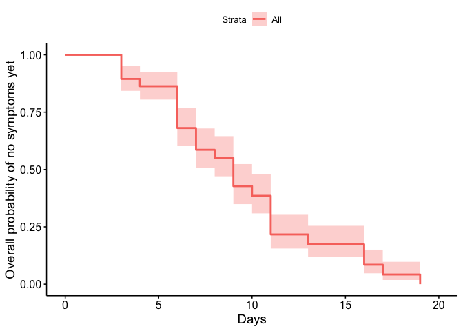
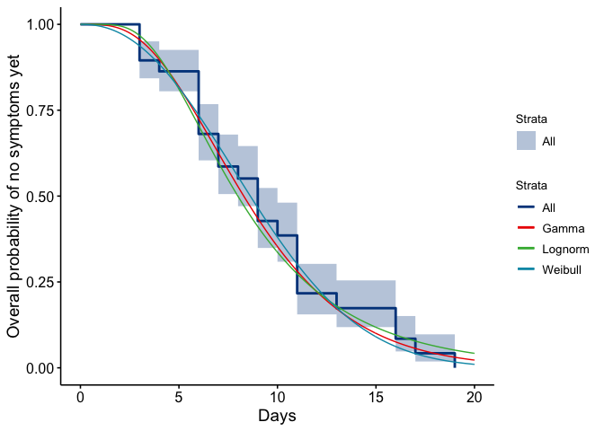

## Data 

Thanks to Dongxuan Chen and Louxin Zhang. These data are from three main sources:

* source1: http://wsjk.tj.gov.cn/col/col87/index.html#!uid=259&pageNum=1 (Tianjin health commission official website, for daily announcements)

* source2: https://weibo.com/u/2967529507 (Jinyun News, Tianjin offical local media weibo account, for patient symptom onset reference)

* source3: https://m.weibo.cn/status/IrrHI1FHm?jumpfrom=weibocom (another Tianjin local media weibo link, for mall cluster reference)


```r
tdata=read.csv("data/Tianjin135casesFeb22.csv",na.strings = "", stringsAsFactors = F)
tdata$symptom_onset=as.Date(tdata$symptom_onset, format = "%d/%m/%Y")
tdata$start_source=as.Date(tdata$start_source, format = "%d/%m/%Y")
tdata$end_source=as.Date(tdata$end_source,format = "%d/%m/%Y" )
tdata$confirm_date=as.Date(tdata$confirm_date,format = "%d/%m/%Y" )
str(tdata)
```

```
## 'data.frame':	135 obs. of  13 variables:
##  $ case_id         : chr  "TJ1" "TJ2" "TJ3" "TJ4" ...
##  $ gender          : chr  "F" "M" "F" "M" ...
##  $ age             : int  59 57 68 40 46 56 29 39 57 30 ...
##  $ symptom_onset   : Date, format: "2020-01-14" "2020-01-18" ...
##  $ symptom_type    : chr  "NA" "NA" "NA" "NA" ...
##  $ confirm_date    : Date, format: "2020-01-21" "2020-01-21" ...
##  $ Infection_source: chr  "Wuhan" "Wuhan; train import" "Wuhan" "Wuhan" ...
##  $ start_source    : Date, format: "2020-01-05" NA ...
##  $ end_source      : Date, format: "2020-01-14" "2020-01-18" ...
##  $ severity        : chr  "severe" "severe" "severe" "normal" ...
##  $ death           : chr  NA NA NA NA ...
##  $ recorrection    : chr  "added end source" "added end source" NA NA ...
##  $ notes           : chr  "sometimes Tianjin didn't mention the patient's severity" "Tianjin didn't tell which patient got cured, but they report death cases" "source1: http://wsjk.tj.gov.cn/col/col87/index.html#!uid=259&pageNum=1 (Tianjin health commission official webs"| __truncated__ "source2: https://weibo.com/u/2967529507 (Jinyun News, Tianjin offical local media weibo account, for patient sy"| __truncated__ ...
```


## Incubation period

The incubation period is the time between exposure and the onset of symptoms. We estimate this directly from the stated start and end times for cases' exposure windows. Because it is explicitly about the symptom onset, we remove those who don't have symptom onset defined. These are a small minority of cases and the alternative would be to impute their symptom onset time using the others' delay to confirmation time.  For now, we remove them.  Then,  if no other end time for the exposure is given or  if the end of the exposure time is after the time of symptom onset, set the last exposure time to the symptom onset time. This is because they must have been exposed before symptom onset.  If no other start time is given, they must have been exposed since the start of the outbreak (Dec 1, 2019). These give us  the maximum and minimun incubation times. 


```r
goodii=which(!is.na(tdata$symptom_onset))

tdata$end_source[which(is.na(tdata$end_source))]=tdata$symptom_onset[which(is.na(tdata$end_source))]  # if no end exposure: set to symptom onset 
tdata$end_source = pmin(tdata$end_source, tdata$symptom_onset) # if end exposure after onset, set to onset 
tdata$start_source[which(is.na(tdata$start_source))]=as.Date("2019-12-01") # start date 

tdata$maxIncTimes=tdata$symptom_onset-tdata$start_source 
tdata$minIncTimes = tdata$symptom_onset-tdata$end_source

tdata$maxIncTimes
```

```
## Time differences in days
##   [1]   9  48  44  44  45  49  54   4  54   6  53  54  50  55  55  51  56   7
##  [19]   4  56  56  56  54  53  57  57 -23  49  11   9   5  53  60   8  60  58
##  [37]   9  NA   7  11  11  57   3  60  55  NA  53   6  15  11   7   7  61  57
##  [55]  62   8   9   6  63  20   9  60  62  62  14  11   6   9  64  52   6  62
##  [73]   3   6  63  12  57   3  11  10  61  64  64  65  57  61  13  58  65  63
##  [91]  66   7  64  67  62  68  70  62  NA  61  NA  NA  16  NA  71  11  66  63
## [109]  71  63   3  11  72  19  16  71  17  67  11  73  72   6  NA  19  70  66
## [127]  NA  11  NA  67  16  80  65  74  NA
```

```r
tdata$minIncTimes
```

```
## Time differences in days
##   [1]  0  0  0  0  0  0  1  1  7  4  0  0  0  6  2  0  7  7  4  7  9  3  3 12  8
##  [26]  5  0  0  7  5  2  3  6  0  4  3  8 NA  1  5  5  0  0  4  1 NA  5  6  9 11
##  [51]  7  0  8  3  0  8  9  6 14  0  0  0  0  0  0  8  0  9  0  0  6  0  3  6  0
##  [76]  1  0  3 11 10  0  0  0  0  0  0 13  0 12  0  0  7  0  0  0  0  0  0 NA  0
## [101] NA NA 14 NA  0  4  0  0  0  0  3 11  0  3  0  0 17  0  4  0  0  6 NA 19  0
## [126]  0 NA 11 NA  6 16 11  0  2 NA
```

```r
tdata$maxIncTimes[27] = 50 # for some reason this was coming up negative 
```

We use survival analysis in the icenReg package to make parametric estimates, and we use the regular survival package to estimate the time to onset of symptoms. 


```r
ggsurvplot(
  fit=survfit(Surv(tdata$minIncTimes, tdata$maxIncTimes, type="interval2")~1, data=tdata), 
  xlab="Days",
  ylab = "Overall probability of no symptoms yet")
```

<!-- -->

The median is about 8 days. For a parametric estimate we remove any remaining NAs and use interval censoring, because we know only that exposure was some time between the minimum and maximum possible values. 


```r
reddata=tdata[which(!is.na(tdata$minIncTimes)),]

getthreefits = function(reddata) {
  myfit = ic_par(Surv(reddata$minIncTimes, reddata$maxIncTimes,type="interval2")~1, data = reddata,dist="weibull")

myfit_gamma<- ic_par(Surv(reddata$minIncTimes, reddata$maxIncTimes, type="interval2") ~ 1, data = reddata, dist = "gamma")


myfit_lnorm =  ic_par(Surv(reddata$minIncTimes, reddata$maxIncTimes, type="interval2") ~ 1, data = reddata, dist = "lnorm")
return(list(myfit=myfit, myfit_gamma=myfit_gamma, myfit_lnorm=myfit_lnorm))
}

allthree=getthreefits(reddata)
myfit=allthree$myfit
myfit_gamma=allthree$myfit_gamma
myfit_lnorm=allthree$myfit_lnorm
```

We want to report (1) the parameters for these fits and the quantiles (including median). This describes the distribution.

Then we want to report (2) the resulting mean (95% CI for the mean). This describes our uncertainty in the distribution. 

(1) For the point estimates, get the parameters and quantiles for these  distributions. For Weibull and gamma distributions, the two parameters are shape and scale. For log normal they are mu and sdlog. 


```r
getQuantileDF <- function(myfit,myfit_gamma,myfit_lnorm) {
interqs=getFitEsts(myfit, newdata = NULL, p=c(0.025, 0.25, 0.5, 0.75,0.975)) #
interqs_gamma <- getFitEsts(myfit_gamma, newdata=NULL,  p
                      =c(0.025, 0.25, 0.5, 0.75, 0.975))

interqs_lnorm <- getFitEsts(myfit_lnorm, newdata=NULL,  p
                      =c(0.025,  0.25, 0.5, 0.75, 0.975))
mm=rbind(interqs, interqs_gamma, interqs_lnorm)
colnames(mm)=paste("q_",c(0.025, 0.25, 0.5, 0.75, 0.975),sep="")

df=as.data.frame(mm); df$distr =c("Weibull","Gamma","Log normal")
df$par1=c(exp(myfit$coefficients[1]), exp(myfit_gamma$coefficients[1]), 
          myfit_lnorm$coefficients[1])
df$par2=c(exp(myfit$coefficients[2]), exp(myfit_gamma$coefficients[2]), 
          exp(myfit_lnorm$coefficients[2]))
rownames(df)=NULL

return(df[,c(6,7,8,1:5)])
}

getQuantileDF(myfit,myfit_gamma,myfit_lnorm)
```

```
##        distr par1   par2 q_0.025 q_0.25 q_0.5 q_0.75 q_0.975
## 1    Weibull 2.25 10.150    1.98   5.83  8.62   11.7    18.1
## 2      Gamma 4.06  2.218    2.49   5.74  8.29   11.5    19.7
## 3 Log normal 2.08  0.531    2.82   5.58  7.99   11.4    22.6
```


(2) Now we want the mean and 95% CIs on the shape, the scale and the resulting  mean. The "myfit" objects contain the estimates and covariance for these. Without wanting to code up the theory, the quick approach is to resample the shape and scale with appropriate covariance and compute the resampled means, then take the 95\% CIs. The functional form is different for the three different distributions. 


```r
getMeanCI <- function(statfit, dist = "weibull") {
  if (dist == "weibull") {
  x=exp(rmvnorm(n=10000, mean = statfit$coefficients, sigma=statfit$var))
  mymeans=x[,2]*gamma(1+1/x[,1]) # shape, scale for weibull 
  par1=exp(statfit$coefficients[1])
   par2=exp(statfit$coefficients[2])
  par1range=c(exp(log(par1)-1.96*sqrt(statfit$var[1,1])), exp(log(par1)+1.96*sqrt(myfit$var[1,1])))
   par2range=c(exp(log(par2)-1.96*sqrt(statfit$var[2,2])), exp(log(par2)+1.96*sqrt(myfit$var[2,2])))
  }
  if (dist == "gamma") {
      x=exp(rmvnorm(n=10000, mean = statfit$coefficients, sigma=statfit$var)) # shape, scale for gamma
      mymeans = x[,1]*x[,2] # gamma: mean  is shape*scale
  par1=exp(statfit$coefficients[1])
   par2=exp(statfit$coefficients[2])
  par1range=c(exp(log(par1)-1.96*sqrt(statfit$var[1,1])), exp(log(par1)+1.96*sqrt(myfit$var[1,1])))
   par2range=c(exp(log(par2)-1.96*sqrt(statfit$var[2,2])), exp(log(par2)+1.96*sqrt(myfit$var[2,2])))
  }
  if (dist == "lognorm") {
  x=rmvnorm(n=10000, mean = statfit$coefficients, sigma=statfit$var) 
  # these are the log of the mean, and the log of sd? 
  # mean is exp(mu + 0.5 sig^2) 
  mymeans=exp(x[,1]+0.5*exp(x[,2])^2) # i think
  par1=statfit$coefficients[1]
   par2=exp(statfit$coefficients[2])
    par1range=c(par1-1.96*sqrt(statfit$var[1,1]), par1+1.96*sqrt(myfit$var[1,1]))
   par2range=c(exp(statfit$coefficients[2]-1.96*sqrt(statfit$var[2,2])), exp(statfit$coefficients[2]+1.96*sqrt(statfit$var[2,2])))
  }
return(list(par1=par1,par2=par2, par1range=par1range, par2range=par2range, means=mymeans, qs = quantile(mymeans, probs = c(0.025, 0.5, 0.975)), meanmeans=mean(mymeans), sdmeans=sd(mymeans)))
}
```

Table for parameters and their CIs, and the  mean incubation period and its CI, for unstratified data: 


```r
getMeanCI_DF = function(myfit,myfit_gamma,myfit_lnorm) {
out_weib=getMeanCI(statfit = myfit, dist = "weibull")
out_gamm = getMeanCI(statfit =myfit_gamma, dist = "gamma")
out_lnorm=getMeanCI(statfit =myfit_lnorm, dist="lognorm")
return(data.frame(par1s=c(out_weib$par1, 
                          out_gamm$par1, 
                          out_lnorm$par1),
                   par1lower=c(out_weib$par1range[1], 
                          out_gamm$par1range[1], 
                          out_lnorm$par1range[1]),
                  par1upper=c(out_weib$par1range[2], 
                          out_gamm$par1range[2], 
                          out_lnorm$par1range[2]), # there is a better way .. but.
                  par2s=c(out_weib$par2, 
                          out_gamm$par2, 
                          out_lnorm$par2),
               par2lower=c(out_weib$par2range[1], 
                          out_gamm$par2range[1], 
                          out_lnorm$par2range[1]),
                  par2upper=c(out_weib$par2range[2], 
                          out_gamm$par2range[2], 
                          out_lnorm$par2range[2]), # there is a better way .. but.
                  means=c(out_weib$meanmeans, 
                          out_gamm$meanmeans, 
                          out_lnorm$meanmeans),
           meanlower=c(out_weib$qs[1], out_gamm$qs[1],
                     out_lnorm$qs[1]),
           meanupper=c(out_weib$qs[3],out_gamm$qs[3],
                     out_lnorm$qs[3])))
}
getMeanCI_DF(myfit,myfit_gamma,myfit_lnorm)
```

```
##   par1s par1lower par1upper  par2s par2lower par2upper means meanlower
## 1  2.25      1.79      2.83 10.150     8.911    11.561  9.02      7.92
## 2  4.06      2.69      5.11  2.218     1.405     2.527  9.04      7.83
## 3  2.08      1.93      2.31  0.531     0.426     0.663  9.28      7.88
##   meanupper
## 1      10.2
## 2      10.4
## 3      10.9
```


Plot a fit and the KM curve together. 


```r
# days=seq(0,20,by=0.05)
# density=dweibull(days, shape = exp(myfit$coefficients[1]), scale = exp(myfit$coefficients[2]))
# 
# ggs = ggsurvplot(
#   fit=survfit(Surv(tdata$minIncTimes, tdata$maxIncTimes, type="interval2")~1, data=tdata), 
#   xlab="Days",  ylab = "Overall probability of no symptoms yet")
# 
# pdata <- data.frame(days=rep(days,3),  
#             fitsurv=c(1-pweibull(days, shape = exp(myfit$coefficients[1]), scale = exp(myfit$coefficients[2])),
#         1-pgamma(days,  shape = exp(myfit_gamma$coefficients[1]), scale = exp(myfit_gamma$coefficients[2])),
#         1-plnorm(days,  meanlog = myfit_lnorm$coefficients[1], sdlog = exp(myfit_lnorm$coefficients[2]))),distn=c(rep("Weibull", length(days)), rep("Gamma",length(days)), rep("Lognorm", length(days)) ))  # i know, i know... 
# 
# 
# tmp=data.frame(days=days,  fitsurv=1-pweibull(days, shape = exp(myfit$coefficients[1]),
#                       scale = exp(myfit$coefficients[2])))
# ggs$plot + geom_line(data = tmp, aes(x = days, y = fitsurv))
# ggsave(filename = "inc_Tianjin.pdf", width = 8, height = 6)
```

### Make Figure 3b upper panel (non-stratified) for the manuscript
This is to plot the Kaplan-Meier survival curve and estimated probability distribution of days post-infection for a case not to be showing symptoms yet (using three possible distributions: weibull, gamma, and log-normal).

```r
days=seq(0,20,by=0.05)

ggs = ggsurvplot(
  fit=survfit(Surv(tdata$minIncTimes, tdata$maxIncTimes, type="interval2")~1, data=tdata),
  xlab="Days",  ylab = "Overall probability of no symptoms yet",palette = 'lancet',legend=c('right'))

pdata <- data.frame(days=rep(days,3),  
            fitsurv=c(1-pweibull(days, shape = exp(allthree$myfit$coefficients[1]), scale = exp(allthree$myfit$coefficients[2])),
        1-pgamma(days,  shape = exp(allthree$myfit_gamma$coefficients[1]), scale = exp(allthree$myfit_gamma$coefficients[2])),
        1-plnorm(days,  meanlog = allthree$myfit_lnorm$coefficients[1], sdlog = exp(allthree$myfit_lnorm$coefficients[2]))),distn=c(rep("Weibull", length(days)), rep("Gamma",length(days)), rep("Lognorm", length(days)) ))  # i know, i know... 

ggs$plot +geom_line(data = pdata, aes(x = days, y = fitsurv,color=distn))
```

<!-- -->

```r
 ggsave(filename = "final_figures/Fig3b_inc_Tianjin_all.pdf", width = 8, height = 6)
```


### Stratified early and late 
Finally, we want to do this all again but stratifying the data between early occurring cases and late. This is why we used functions in the above, though it was clumsy. 


```r
earlydata=tdata[which(!is.na(tdata$minIncTimes) & tdata$symptom_onset <= as.Date("2020-01-31")),]
latedata=tdata[which(!is.na(tdata$minIncTimes) & tdata$symptom_onset > as.Date("2020-01-31")),]
```

Fit to the three distributions: 


```r
Eallthree=getthreefits(earlydata)
Lallthree=getthreefits(latedata)
```

EARLY: parameter point estimates and the quantiles


```r
getQuantileDF(Eallthree[[1]],Eallthree[[2]], Eallthree[[3]])
```

```
##        distr par1  par2 q_0.025 q_0.25 q_0.5 q_0.75 q_0.975
## 1    Weibull 2.73 7.849    2.04   4.97  6.86   8.85    12.7
## 2      Gamma 5.42 1.307    2.43   4.86  6.65   8.83    14.2
## 3 Log normal 1.87 0.463    2.62   4.76  6.51   8.89    16.1
```

LATE: parameter point estimates and the quantiles


```r
getQuantileDF(Lallthree[[1]],Lallthree[[2]], Lallthree[[3]])
```

```
##        distr  par1   par2 q_0.025 q_0.25 q_0.5 q_0.75 q_0.975
## 1    Weibull  3.95 13.636    5.37   9.94  12.4   14.8    19.0
## 2      Gamma 14.33  0.866    6.84  10.07  12.1   14.4    19.6
## 3 Log normal  2.49  0.263    7.18  10.06  12.0   14.3    20.1
```

EARLY: how variable are these point estimates? Look at mean and 95\% CI


```r
getMeanCI_DF(Eallthree[[1]],Eallthree[[2]], Eallthree[[3]])
```

```
##   par1s par1lower par1upper par2s par2lower par2upper means meanlower meanupper
## 1  2.73      2.00      3.43 7.849     6.848      8.94  7.01      6.09      8.04
## 2  5.42      3.13      6.82 1.307     0.716      1.49  7.11      6.08      8.24
## 3  1.87      1.72      2.10 0.463     0.346      0.62  7.30      6.09      8.75
```

LATE: how variable are these point estimates? Look at mean and 95\% CI


```r
getMeanCI_DF(Lallthree[[1]],Lallthree[[2]], Lallthree[[3]])
```

```
##   par1s par1lower par1upper  par2s par2lower par2upper means meanlower
## 1  3.95      2.66      4.97 13.636    11.987    15.531  12.4      10.8
## 2 14.33      6.60     18.03  0.866     0.395     0.986  12.4      10.9
## 3  2.49      2.36      2.72  0.263     0.177     0.390  12.5      11.0
##   meanupper
## 1      14.2
## 2      14.1
## 3      14.2
```

### Generating Figure 3b (lower panel) for manuscript
This is to plot the Kaplan-Meier survival curves and estimated probability distribution of days post-infection for a case not to be showing symptoms yet, when stratifying the data pre and post quarantine procedures in China. As per tables above, the symptom onset date of on or before Jan 31, 2020 is the cut-off for what defines an "early" case. 

```r
#Generating Figure 3 for the paper
tdays=seq(0,20,by=0.05)

fit1<-survfit(Surv(earlydata$minIncTimes, earlydata$maxIncTimes, type="interval2")~1, data=earlydata)
fit2<-survfit(Surv(latedata$minIncTimes, latedata$maxIncTimes, type="interval2")~1, data=latedata)

fit <- list(early = fit1, late = fit2)
ggsp2=ggsurvplot(fit, data = tdata, combine = TRUE, # Combine curves
             # Clean risk table
           palette = "lancet",legend.labs=c("Pre-quarantine","Post-quarantine"),legend=c('right'))

pdata <- data.frame(days=rep(tdays,3),  
            fitsurv=c(1-pweibull(tdays, shape = exp(Eallthree$myfit$coefficients[1]), scale = exp(Eallthree$myfit$coefficients[2])),
        1-pgamma(tdays, shape = exp(Eallthree$myfit_gamma$coefficients[1]), scale = exp(Eallthree$myfit_gamma$coefficients[2])),
        1-plnorm(tdays,  meanlog = Eallthree$myfit_lnorm$coefficients[1], sdlog = exp(Eallthree$myfit_lnorm$coefficients[2]))),distn=c(rep("Weibull", length(tdays)), rep("Gamma",length(tdays)), rep("Lognorm", length(tdays)) )) 
                                                            
pdata1 <- data.frame(days=rep(tdays,3),  
            fitsurv=c(1-pweibull(tdays, shape = exp(Lallthree$myfit$coefficients[1]), scale = exp(Lallthree$myfit$coefficients[2])),
        1-pgamma(tdays,  shape = exp(Lallthree$myfit_gamma$coefficients[1]), scale = exp(Lallthree$myfit_gamma$coefficients[2])),
        1-plnorm(tdays,  meanlog = Lallthree$myfit_lnorm$coefficients[1], sdlog = exp(Lallthree$myfit_lnorm$coefficients[2]))), distn=c(rep("Weibull", length(tdays)), rep("Gamma",length(tdays)), rep("Lognorm", length(tdays)) )) 
                                                            
ggsp2$plot + geom_line(data = pdata, aes(x = days, y = fitsurv, color=distn)) +geom_line(data = pdata1, aes(x = days, y = fitsurv, color=distn)) 
```

<!-- -->

```r
ggsave(filename = "final_figures/Fig3b_inc_Tianjin_strata.pdf", width = 8, height = 6)
#ggsave(filename = "inc_Tianjin_strata.png", width = 8, height = 6)
```


## Serial interval 


We will estimate the serial interval using the 'interval case to case' approach given in Vink et al (https://academic.oup.com/aje/article/180/9/865/2739204). 

The dataset has quite a few instances where a putative infector or contact is known. These are listed in the 'Infection_source' column. We first make a graph in which nodes are individuals and edges are present from cases listed as possible sources, to the cases for whom they are possible sources. 


```r
mynodes = tdata$case_id
edges = data.frame(from=mynodes[9],to=mynodes[21],stringsAsFactors = F ) # i read this one manually 
for (id in 1:nrow(tdata)) {
tonode=tdata$case_id[id]
fromnodes=str_extract_all(tdata$Infection_source[id], "TJ\\d+", simplify = T)
  if (length(fromnodes)>0) {
    for (k in 1:length(fromnodes)) {
      edges=rbind(edges, c(fromnodes[k], tonode))
    }
  }
}
head(edges)
```

```
##   from   to
## 1  TJ9 TJ21
## 2  TJ6 TJ11
## 3  TJ5 TJ12
## 4  TJ5 TJ13
## 5  TJ5 TJ16
## 6  TJ5 TJ17
```

```r
edges=edges[-1,]
edges=edges[-which(is.na(edges[,1])),] # NAs arose from a few empty entries for Infection_source 
```

From this edge list we can use visNetwork to visualise the graph. Colours are from the infection source column (but we should have a better colour scheme, like date of symptom onset). 


```r
edges$arrows="to"
nodes = data.frame(id=tdata$case_id, label=tdata$case_id,
                   group=tdata$Infection_source)
visNetwork(nodes,edges)
```

<!--html_preserve--><div id="htmlwidget-a61a727865cbeb732d6d" style="width:672px;height:480px;" class="visNetwork html-widget"></div>
<script type="application/json" data-for="htmlwidget-a61a727865cbeb732d6d">{"x":{"nodes":{"id":["TJ1","TJ2","TJ3","TJ4","TJ5","TJ6","TJ7","TJ8","TJ9","TJ10","TJ11","TJ12","TJ13","TJ14","TJ15","TJ16","TJ17","TJ18","TJ19","TJ20","TJ21","TJ22","TJ23","TJ24","TJ25","TJ26","TJ27","TJ28","TJ29","TJ30","TJ31","TJ32","TJ33","TJ34","TJ35","TJ36","TJ37","TJ38","TJ39","TJ40","TJ41","TJ42","TJ43","TJ44","TJ45","TJ46","TJ47","TJ48","TJ49","TJ50","TJ51","TJ52","TJ53","TJ54","TJ55","TJ56","TJ57","TJ58","TJ59","TJ60","TJ61","TJ62","TJ63","TJ64","TJ65","TJ66","TJ67","TJ68","TJ69","TJ70","TJ71","TJ72","TJ73","TJ74","TJ75","TJ76","TJ77","TJ78","TJ79","TJ80","TJ81","TJ82","TJ83","TJ84","TJ85","TJ86","TJ87","TJ88","TJ89","TJ90","TJ91","TJ92","TJ93","TJ94","TJ95","TJ96","TJ97","TJ98","TJ99","TJ100","TJ101","TJ102","TJ103","TJ104","TJ105","TJ106","TJ107","TJ108","TJ109","TJ110","TJ111","TJ112","TJ113","TJ114","TJ115","TJ116","TJ117","TJ118","TJ119","TJ120","TJ121","TJ122","TJ123","TJ124","TJ125","TJ126","TJ127","TJ128","TJ129","TJ130","TJ131","TJ132","TJ133","TJ134","TJ135"],"label":["TJ1","TJ2","TJ3","TJ4","TJ5","TJ6","TJ7","TJ8","TJ9","TJ10","TJ11","TJ12","TJ13","TJ14","TJ15","TJ16","TJ17","TJ18","TJ19","TJ20","TJ21","TJ22","TJ23","TJ24","TJ25","TJ26","TJ27","TJ28","TJ29","TJ30","TJ31","TJ32","TJ33","TJ34","TJ35","TJ36","TJ37","TJ38","TJ39","TJ40","TJ41","TJ42","TJ43","TJ44","TJ45","TJ46","TJ47","TJ48","TJ49","TJ50","TJ51","TJ52","TJ53","TJ54","TJ55","TJ56","TJ57","TJ58","TJ59","TJ60","TJ61","TJ62","TJ63","TJ64","TJ65","TJ66","TJ67","TJ68","TJ69","TJ70","TJ71","TJ72","TJ73","TJ74","TJ75","TJ76","TJ77","TJ78","TJ79","TJ80","TJ81","TJ82","TJ83","TJ84","TJ85","TJ86","TJ87","TJ88","TJ89","TJ90","TJ91","TJ92","TJ93","TJ94","TJ95","TJ96","TJ97","TJ98","TJ99","TJ100","TJ101","TJ102","TJ103","TJ104","TJ105","TJ106","TJ107","TJ108","TJ109","TJ110","TJ111","TJ112","TJ113","TJ114","TJ115","TJ116","TJ117","TJ118","TJ119","TJ120","TJ121","TJ122","TJ123","TJ124","TJ125","TJ126","TJ127","TJ128","TJ129","TJ130","TJ131","TJ132","TJ133","TJ134","TJ135"],"group":["Wuhan","Wuhan; train import","Wuhan","Wuhan","train import","train import","Wuhan","Wuhan; train import","Wuhan","Wuhan","TJ6 (family)","TJ5 (family)","TJ5 (family)","Wuhan","Wuhan","TJ5(family)","coworker of TJ5","Wuhan","Wuhan","colleague of TJ6","family of TJ9","train","Wuhan","Wuhan","Wuhan","Wuhan","coworker of a person from wuhan","train crew ","Wuhan","Hubei","Hubei","travel ","family of TJ17","mall","family of TJ20","family of TJ34","business partner","family of TJ32","confirmed patient","confirmed patient and family of TJ39","confirmed patient and family of TJ39","unknown","colleague of cases TJ34 and TJ37","relative of cases TJ20, TJ35","living in Hubei","relative of TJ32","coworkers of cases TJ2; TJ6","appeared in workplaces of TJ37/TJ43","travle to Wuhan","shopping in mall","dshopping in mall","TJ50  family","shuperstore worker","family of TJ14 and TJ25","TJ9; TJ21","TJ38","shopper in the mall","shopper in the mall","Wuhan","Wuhan; TJ1","Hubei; TJ45","worker in the train compoany ","TJ27","TJ51","trip to Dalian","shopper in the mall","Hubei","shopper in the mall","relative of TJ53","unknown","shopper in the mall","unclear","shopper in the mall",null,"TJ87","confirmed patient",null,"shopper at the mall","confirmed patient","shopper at the mall","TJ72","living in the mall proximity ","shopper at the mall","TJ43","TJ72","TJ72, TJ85","shopper in the mall","TJ70","worker in the mall","living in the mall proximity ","TJ82","shooper in the mall","living in the mall proximity ","TJ75","unknown","TJ93, TJ97","TJ93, TJ96, living in Baodi","TJ82","shopper in the mall, TJ64","unknown","wife of TJ95","unknown","TJ100","TJ95, TJ101","TJ103","trip to Hebei","TJ93","TJ100， TJ103","TJ102",null,"mall","TJ7","TJ100, TJ103, TJ108","mother of TJ115, travel to Huhehaote","TJ114","TJ95","TJ93, living in Baodi","TJ75; TJ87","TJ93; TJ107","sister of TJ109","husband of TJ119","wife of TJ110 shopping at the BaoDi Superstore","family member of cases TJ95; TJ116","shopping in mall","son of cases  TJ119; TJ121","clos contact of TJ68","close contact of TJ93, TJ107, TJ119 and TJ121","family of  TJ124","close contact of cases TJ72 TJ85 and TJ86","close contacts of cases TJ64; TJ99","shopper at the mall","wife of TJ82, living at proximity of Baodi shopping mall","contact with shoppers living in the same viliiage","wife of TJ117;living at the proximity of the mall","living at the proximity of the mail, wife shoped at the mall"]},"edges":{"from":["TJ6","TJ5","TJ5","TJ5","TJ5","TJ6","TJ9","TJ17","TJ20","TJ34","TJ32","TJ39","TJ39","TJ34","TJ37","TJ20","TJ35","TJ32","TJ2","TJ6","TJ37","TJ43","TJ50","TJ14","TJ25","TJ9","TJ21","TJ38","TJ1","TJ45","TJ27","TJ51","TJ53","TJ87","TJ72","TJ43","TJ72","TJ72","TJ85","TJ70","TJ82","TJ75","TJ93","TJ97","TJ93","TJ96","TJ82","TJ64","TJ95","TJ100","TJ95","TJ101","TJ103","TJ93","TJ100","TJ103","TJ102","TJ7","TJ100","TJ103","TJ108","TJ115","TJ114","TJ95","TJ93","TJ75","TJ87","TJ93","TJ107","TJ109","TJ119","TJ110","TJ95","TJ116","TJ119","TJ121","TJ68","TJ93","TJ107","TJ119","TJ121","TJ124","TJ72","TJ85","TJ86","TJ64","TJ99","TJ82","TJ117"],"to":["TJ11","TJ12","TJ13","TJ16","TJ17","TJ20","TJ21","TJ33","TJ35","TJ36","TJ38","TJ40","TJ41","TJ43","TJ43","TJ44","TJ44","TJ46","TJ47","TJ47","TJ48","TJ48","TJ52","TJ54","TJ54","TJ55","TJ55","TJ56","TJ60","TJ61","TJ63","TJ64","TJ69","TJ75","TJ81","TJ84","TJ85","TJ86","TJ86","TJ88","TJ91","TJ94","TJ96","TJ96","TJ97","TJ97","TJ98","TJ99","TJ101","TJ103","TJ104","TJ104","TJ105","TJ107","TJ108","TJ108","TJ109","TJ112","TJ113","TJ113","TJ113","TJ114","TJ115","TJ116","TJ117","TJ118","TJ118","TJ119","TJ119","TJ120","TJ121","TJ122","TJ123","TJ123","TJ125","TJ125","TJ126","TJ127","TJ127","TJ127","TJ127","TJ128","TJ129","TJ129","TJ129","TJ130","TJ130","TJ132","TJ134"],"arrows":["to","to","to","to","to","to","to","to","to","to","to","to","to","to","to","to","to","to","to","to","to","to","to","to","to","to","to","to","to","to","to","to","to","to","to","to","to","to","to","to","to","to","to","to","to","to","to","to","to","to","to","to","to","to","to","to","to","to","to","to","to","to","to","to","to","to","to","to","to","to","to","to","to","to","to","to","to","to","to","to","to","to","to","to","to","to","to","to","to"]},"nodesToDataframe":true,"edgesToDataframe":true,"options":{"width":"100%","height":"100%","nodes":{"shape":"dot"},"manipulation":{"enabled":false}},"groups":["Wuhan","Wuhan; train import","train import","TJ6 (family)","TJ5 (family)","TJ5(family)","coworker of TJ5","colleague of TJ6","family of TJ9","train","coworker of a person from wuhan","train crew ","Hubei","travel ","family of TJ17","mall","family of TJ20","family of TJ34","business partner","family of TJ32","confirmed patient","confirmed patient and family of TJ39","unknown","colleague of cases TJ34 and TJ37","relative of cases TJ20, TJ35","living in Hubei","relative of TJ32","coworkers of cases TJ2; TJ6","appeared in workplaces of TJ37/TJ43","travle to Wuhan","shopping in mall","dshopping in mall","TJ50  family","shuperstore worker","family of TJ14 and TJ25","TJ9; TJ21","TJ38","shopper in the mall","Wuhan; TJ1","Hubei; TJ45","worker in the train compoany ","TJ27","TJ51","trip to Dalian","relative of TJ53","unclear",null,"TJ87","shopper at the mall","TJ72","living in the mall proximity ","TJ43","TJ72, TJ85","TJ70","worker in the mall","TJ82","shooper in the mall","TJ75","TJ93, TJ97","TJ93, TJ96, living in Baodi","shopper in the mall, TJ64","wife of TJ95","TJ100","TJ95, TJ101","TJ103","trip to Hebei","TJ93","TJ100， TJ103","TJ102","TJ7","TJ100, TJ103, TJ108","mother of TJ115, travel to Huhehaote","TJ114","TJ95","TJ93, living in Baodi","TJ75; TJ87","TJ93; TJ107","sister of TJ109","husband of TJ119","wife of TJ110 shopping at the BaoDi Superstore","family member of cases TJ95; TJ116","son of cases  TJ119; TJ121","clos contact of TJ68","close contact of TJ93, TJ107, TJ119 and TJ121","family of  TJ124","close contact of cases TJ72 TJ85 and TJ86","close contacts of cases TJ64; TJ99","wife of TJ82, living at proximity of Baodi shopping mall","contact with shoppers living in the same viliiage","wife of TJ117;living at the proximity of the mall","living at the proximity of the mail, wife shoped at the mall"],"width":null,"height":null,"idselection":{"enabled":false},"byselection":{"enabled":false},"main":null,"submain":null,"footer":null,"background":"rgba(0, 0, 0, 0)"},"evals":[],"jsHooks":[]}</script><!--/html_preserve-->

The interval case to case (ICC) data are the times between the (presumed) index case for a small cluster and the other cases in the cluster. The Vink et al approach allows these intervals to be one of 4 types, and estimates the serial interval and the probability of each type. To extract ICC intervals, we let the clusters be the components of the graph, and we let the presumed index case be the first to develop symptoms. For each cluster, we subtract the index cases' symptom time from the symtom times of the rest of the cluster (or just the first few; it turns out that the estimate is not sensitive to this). This results in a list of time intervals between symptom onset in presumed index cases and symptom onset in other cases in the same cluster (graph component). 


First construct the graph


```r
#serialdata=edges # REMOVE? 
#serialdata$symps_from = tdata$symptom_onset[match(edges$from, tdata$case_id)]
#serialdata$symps_to=tdata$symptom_onset[match(edges$to, tdata$case_id)]
tgraph = graph_from_edgelist(as.matrix(edges[,1:2]), directed = FALSE)
ccs=components(tgraph)

tdata$component=vapply(tdata$case_id, function(x)
  { if (x %in% names(ccs$membership)) { return(ccs$membership[match(x, names(ccs$membership))])
  } else { 
    return(NA)}}, FUN.VALUE = 3)
```


Extract ICC interval data: a function 


```r
 getICCs <- function(thisdata, ccs, K, orderby= "onset" ) {
  iccs=1
for (n in 1:max(ccs$membership)) {
  mycases  = which(thisdata$component==n)
  if (orderby == "onset")
  {  myonsets = sort(thisdata$symptom_onset[mycases])[1:min(K, length(mycases))]}
  if (orderby == "exposure") {
 myonsets =thisdata$symptom_onset[mycases][order(thisdata$end_source[mycases])][1:min(K,length(mycases))]
  }
  iccs =c(iccs, myonsets[-1]-myonsets[1])
}
  return(iccs[-1]) 
  }
```


```r
stdata = tdata[which(!is.na(tdata$symptom_onset)),]

icc3 = getICCs(stdata,ccs,3)
icc4 = getICCs(stdata,ccs,4)
icc5 = getICCs(stdata,ccs,5)
icc6 = getICCs(stdata,ccs,6)
icc_expose = getICCs(stdata, ccs, 4, orderby ="exposure")
```

Perform the estimate using the Vink et al method, and display the result:


```r
source("TianjinSI_VinkWallinga_CC.R")

myest3 = serial_mix_est(data=icc3, N=100, startmu=10, startsig =4)
```

```
## [1] 6.59 2.88
## [1] 5.43 2.48
## [1] 4.76 2.07
## [1] 4.36 1.67
## [1] 4.16 1.36
## [1] 4.08 1.18
## [1] 4.05 1.10
## [1] 4.04 1.07
## [1] 4.04 1.06
## [1] 4.03 1.05
## [1] 4.03 1.05
## [1] 4.03 1.05
## [1] 4.03 1.05
## [1] 4.03 1.05
## [1] 4.03 1.05
## [1] 4.03 1.05
## [1] 4.03 1.05
## [1] 4.03 1.05
## [1] 4.03 1.05
## [1] 4.03 1.05
## [1] 4.03 1.05
## [1] 4.03 1.05
## [1] 4.03 1.05
## [1] 4.03 1.05
## [1] 4.03 1.05
## [1] 4.03 1.05
## [1] 4.03 1.05
## [1] 4.03 1.05
## [1] 4.03 1.05
## [1] 4.03 1.05
## [1] 4.03 1.05
## [1] 4.03 1.05
## [1] 4.03 1.05
## [1] 4.03 1.05
## [1] 4.03 1.05
## [1] 4.03 1.05
## [1] 4.03 1.05
## [1] 4.03 1.05
## [1] 4.03 1.05
## [1] 4.03 1.05
## [1] 4.03 1.05
## [1] 4.03 1.05
## [1] 4.03 1.05
## [1] 4.03 1.05
## [1] 4.03 1.05
## [1] 4.03 1.05
## [1] 4.03 1.05
## [1] 4.03 1.05
## [1] 4.03 1.05
## [1] 4.03 1.05
## [1] 4.03 1.05
## [1] 4.03 1.05
## [1] 4.03 1.05
## [1] 4.03 1.05
## [1] 4.03 1.05
## [1] 4.03 1.05
## [1] 4.03 1.05
## [1] 4.03 1.05
## [1] 4.03 1.05
## [1] 4.03 1.05
## [1] 4.03 1.05
## [1] 4.03 1.05
## [1] 4.03 1.05
## [1] 4.03 1.05
## [1] 4.03 1.05
## [1] 4.03 1.05
## [1] 4.03 1.05
## [1] 4.03 1.05
## [1] 4.03 1.05
## [1] 4.03 1.05
## [1] 4.03 1.05
## [1] 4.03 1.05
## [1] 4.03 1.05
## [1] 4.03 1.05
## [1] 4.03 1.05
## [1] 4.03 1.05
## [1] 4.03 1.05
## [1] 4.03 1.05
## [1] 4.03 1.05
## [1] 4.03 1.05
## [1] 4.03 1.05
## [1] 4.03 1.05
## [1] 4.03 1.05
## [1] 4.03 1.05
## [1] 4.03 1.05
## [1] 4.03 1.05
## [1] 4.03 1.05
## [1] 4.03 1.05
## [1] 4.03 1.05
## [1] 4.03 1.05
## [1] 4.03 1.05
## [1] 4.03 1.05
## [1] 4.03 1.05
## [1] 4.03 1.05
## [1] 4.03 1.05
## [1] 4.03 1.05
## [1] 4.03 1.05
## [1] 4.03 1.05
## [1] 4.03 1.05
## [1] 4.03 1.05
```

```r
myest4 = serial_mix_est(data=icc4, N=100, startmu=10, startsig =4)
```

```
## [1] 6.84 2.99
## [1] 5.73 2.51
## [1] 5.11 2.15
## [1] 4.71 1.80
## [1] 4.45 1.45
## [1] 4.32 1.20
## [1] 4.26 1.07
## [1] 4.24 1.01
## [1] 4.23 0.99
## [1] 4.225 0.982
## [1] 4.223 0.979
## [1] 4.223 0.978
## [1] 4.222 0.978
## [1] 4.222 0.978
## [1] 4.222 0.978
## [1] 4.222 0.978
## [1] 4.222 0.978
## [1] 4.222 0.978
## [1] 4.222 0.978
## [1] 4.222 0.978
## [1] 4.222 0.978
## [1] 4.222 0.978
## [1] 4.222 0.978
## [1] 4.222 0.978
## [1] 4.222 0.978
## [1] 4.222 0.978
## [1] 4.222 0.978
## [1] 4.222 0.978
## [1] 4.222 0.978
## [1] 4.222 0.978
## [1] 4.222 0.978
## [1] 4.222 0.978
## [1] 4.222 0.978
## [1] 4.222 0.978
## [1] 4.222 0.978
## [1] 4.222 0.978
## [1] 4.222 0.978
## [1] 4.222 0.978
## [1] 4.222 0.978
## [1] 4.222 0.978
## [1] 4.222 0.978
## [1] 4.222 0.978
## [1] 4.222 0.978
## [1] 4.222 0.978
## [1] 4.222 0.978
## [1] 4.222 0.978
## [1] 4.222 0.978
## [1] 4.222 0.978
## [1] 4.222 0.978
## [1] 4.222 0.978
## [1] 4.222 0.978
## [1] 4.222 0.978
## [1] 4.222 0.978
## [1] 4.222 0.978
## [1] 4.222 0.978
## [1] 4.222 0.978
## [1] 4.222 0.978
## [1] 4.222 0.978
## [1] 4.222 0.978
## [1] 4.222 0.978
## [1] 4.222 0.978
## [1] 4.222 0.978
## [1] 4.222 0.978
## [1] 4.222 0.978
## [1] 4.222 0.978
## [1] 4.222 0.978
## [1] 4.222 0.978
## [1] 4.222 0.978
## [1] 4.222 0.978
## [1] 4.222 0.978
## [1] 4.222 0.978
## [1] 4.222 0.978
## [1] 4.222 0.978
## [1] 4.222 0.978
## [1] 4.222 0.978
## [1] 4.222 0.978
## [1] 4.222 0.978
## [1] 4.222 0.978
## [1] 4.222 0.978
## [1] 4.222 0.978
## [1] 4.222 0.978
## [1] 4.222 0.978
## [1] 4.222 0.978
## [1] 4.222 0.978
## [1] 4.222 0.978
## [1] 4.222 0.978
## [1] 4.222 0.978
## [1] 4.222 0.978
## [1] 4.222 0.978
## [1] 4.222 0.978
## [1] 4.222 0.978
## [1] 4.222 0.978
## [1] 4.222 0.978
## [1] 4.222 0.978
## [1] 4.222 0.978
## [1] 4.222 0.978
## [1] 4.222 0.978
## [1] 4.222 0.978
## [1] 4.222 0.978
## [1] 4.222 0.978
```

```r
myest5 = serial_mix_est(data=icc5, N=100, startmu=10, startsig =4)
```

```
## [1] 7.23 2.96
## [1] 6.31 2.61
## [1] 5.77 2.39
## [1] 5.38 2.18
## [1] 5.08 1.96
## [1] 4.84 1.74
## [1] 4.66 1.52
## [1] 4.52 1.32
## [1] 4.43 1.18
## [1] 4.38 1.10
## [1] 4.35 1.06
## [1] 4.34 1.04
## [1] 4.33 1.03
## [1] 4.33 1.03
## [1] 4.33 1.03
## [1] 4.33 1.03
## [1] 4.33 1.03
## [1] 4.32 1.03
## [1] 4.32 1.03
## [1] 4.32 1.03
## [1] 4.32 1.03
## [1] 4.32 1.03
## [1] 4.32 1.03
## [1] 4.32 1.03
## [1] 4.32 1.03
## [1] 4.32 1.03
## [1] 4.32 1.03
## [1] 4.32 1.03
## [1] 4.32 1.03
## [1] 4.32 1.03
## [1] 4.32 1.03
## [1] 4.32 1.03
## [1] 4.32 1.03
## [1] 4.32 1.03
## [1] 4.32 1.03
## [1] 4.32 1.03
## [1] 4.32 1.03
## [1] 4.32 1.03
## [1] 4.32 1.03
## [1] 4.32 1.03
## [1] 4.32 1.03
## [1] 4.32 1.03
## [1] 4.32 1.03
## [1] 4.32 1.03
## [1] 4.32 1.03
## [1] 4.32 1.03
## [1] 4.32 1.03
## [1] 4.32 1.03
## [1] 4.32 1.03
## [1] 4.32 1.03
## [1] 4.32 1.03
## [1] 4.32 1.03
## [1] 4.32 1.03
## [1] 4.32 1.03
## [1] 4.32 1.03
## [1] 4.32 1.03
## [1] 4.32 1.03
## [1] 4.32 1.03
## [1] 4.32 1.03
## [1] 4.32 1.03
## [1] 4.32 1.03
## [1] 4.32 1.03
## [1] 4.32 1.03
## [1] 4.32 1.03
## [1] 4.32 1.03
## [1] 4.32 1.03
## [1] 4.32 1.03
## [1] 4.32 1.03
## [1] 4.32 1.03
## [1] 4.32 1.03
## [1] 4.32 1.03
## [1] 4.32 1.03
## [1] 4.32 1.03
## [1] 4.32 1.03
## [1] 4.32 1.03
## [1] 4.32 1.03
## [1] 4.32 1.03
## [1] 4.32 1.03
## [1] 4.32 1.03
## [1] 4.32 1.03
## [1] 4.32 1.03
## [1] 4.32 1.03
## [1] 4.32 1.03
## [1] 4.32 1.03
## [1] 4.32 1.03
## [1] 4.32 1.03
## [1] 4.32 1.03
## [1] 4.32 1.03
## [1] 4.32 1.03
## [1] 4.32 1.03
## [1] 4.32 1.03
## [1] 4.32 1.03
## [1] 4.32 1.03
## [1] 4.32 1.03
## [1] 4.32 1.03
## [1] 4.32 1.03
## [1] 4.32 1.03
## [1] 4.32 1.03
## [1] 4.32 1.03
## [1] 4.32 1.03
```

```r
myest6 = serial_mix_est(data=icc6, N=100, startmu=10, startsig =4)
```

```
## [1] 7.73 3.33
## [1] 6.64 2.89
## [1] 6.02 2.58
## [1] 5.60 2.33
## [1] 5.29 2.09
## [1] 5.04 1.86
## [1] 4.84 1.64
## [1] 4.69 1.44
## [1] 4.58 1.28
## [1] 4.52 1.18
## [1] 4.48 1.12
## [1] 4.46 1.09
## [1] 4.45 1.08
## [1] 4.44 1.08
## [1] 4.44 1.07
## [1] 4.43 1.07
## [1] 4.43 1.07
## [1] 4.43 1.07
## [1] 4.43 1.07
## [1] 4.43 1.07
## [1] 4.43 1.07
## [1] 4.43 1.07
## [1] 4.43 1.07
## [1] 4.43 1.07
## [1] 4.43 1.07
## [1] 4.43 1.07
## [1] 4.43 1.07
## [1] 4.43 1.07
## [1] 4.43 1.07
## [1] 4.43 1.07
## [1] 4.43 1.07
## [1] 4.43 1.07
## [1] 4.43 1.07
## [1] 4.43 1.07
## [1] 4.43 1.07
## [1] 4.43 1.07
## [1] 4.43 1.07
## [1] 4.43 1.07
## [1] 4.43 1.07
## [1] 4.43 1.07
## [1] 4.43 1.07
## [1] 4.43 1.07
## [1] 4.43 1.07
## [1] 4.43 1.07
## [1] 4.43 1.07
## [1] 4.43 1.07
## [1] 4.43 1.07
## [1] 4.43 1.07
## [1] 4.43 1.07
## [1] 4.43 1.07
## [1] 4.43 1.07
## [1] 4.43 1.07
## [1] 4.43 1.07
## [1] 4.43 1.07
## [1] 4.43 1.07
## [1] 4.43 1.07
## [1] 4.43 1.07
## [1] 4.43 1.07
## [1] 4.43 1.07
## [1] 4.43 1.07
## [1] 4.43 1.07
## [1] 4.43 1.07
## [1] 4.43 1.07
## [1] 4.43 1.07
## [1] 4.43 1.07
## [1] 4.43 1.07
## [1] 4.43 1.07
## [1] 4.43 1.07
## [1] 4.43 1.07
## [1] 4.43 1.07
## [1] 4.43 1.07
## [1] 4.43 1.07
## [1] 4.43 1.07
## [1] 4.43 1.07
## [1] 4.43 1.07
## [1] 4.43 1.07
## [1] 4.43 1.07
## [1] 4.43 1.07
## [1] 4.43 1.07
## [1] 4.43 1.07
## [1] 4.43 1.07
## [1] 4.43 1.07
## [1] 4.43 1.07
## [1] 4.43 1.07
## [1] 4.43 1.07
## [1] 4.43 1.07
## [1] 4.43 1.07
## [1] 4.43 1.07
## [1] 4.43 1.07
## [1] 4.43 1.07
## [1] 4.43 1.07
## [1] 4.43 1.07
## [1] 4.43 1.07
## [1] 4.43 1.07
## [1] 4.43 1.07
## [1] 4.43 1.07
## [1] 4.43 1.07
## [1] 4.43 1.07
## [1] 4.43 1.07
## [1] 4.43 1.07
```

```r
myest_exp= serial_mix_est(data=icc_expose, N=100, startmu=10, startsig =4)
```

```
## [1] 7.05 3.23
## [1] 5.86 2.75
## [1] 5.24 2.39
## [1] 4.86 2.04
## [1] 4.63 1.72
## [1] 4.50 1.43
## [1] 4.46 1.21
## [1] 4.45 1.06
## [1] 4.465 0.985
## [1] 4.481 0.953
## [1] 4.493 0.942
## [1] 4.500 0.938
## [1] 4.504 0.936
## [1] 4.506 0.936
## [1] 4.507 0.936
## [1] 4.507 0.936
## [1] 4.507 0.936
## [1] 4.507 0.936
## [1] 4.507 0.936
## [1] 4.507 0.936
## [1] 4.507 0.936
## [1] 4.507 0.936
## [1] 4.507 0.936
## [1] 4.507 0.936
## [1] 4.507 0.936
## [1] 4.507 0.936
## [1] 4.507 0.936
## [1] 4.507 0.936
## [1] 4.507 0.936
## [1] 4.507 0.936
## [1] 4.507 0.936
## [1] 4.507 0.936
## [1] 4.507 0.936
## [1] 4.507 0.936
## [1] 4.507 0.936
## [1] 4.507 0.936
## [1] 4.507 0.936
## [1] 4.507 0.936
## [1] 4.507 0.936
## [1] 4.507 0.936
## [1] 4.507 0.936
## [1] 4.507 0.936
## [1] 4.507 0.936
## [1] 4.507 0.936
## [1] 4.507 0.936
## [1] 4.507 0.936
## [1] 4.507 0.936
## [1] 4.507 0.936
## [1] 4.507 0.936
## [1] 4.507 0.936
## [1] 4.507 0.936
## [1] 4.507 0.936
## [1] 4.507 0.936
## [1] 4.507 0.936
## [1] 4.507 0.936
## [1] 4.507 0.936
## [1] 4.507 0.936
## [1] 4.507 0.936
## [1] 4.507 0.936
## [1] 4.507 0.936
## [1] 4.507 0.936
## [1] 4.507 0.936
## [1] 4.507 0.936
## [1] 4.507 0.936
## [1] 4.507 0.936
## [1] 4.507 0.936
## [1] 4.507 0.936
## [1] 4.507 0.936
## [1] 4.507 0.936
## [1] 4.507 0.936
## [1] 4.507 0.936
## [1] 4.507 0.936
## [1] 4.507 0.936
## [1] 4.507 0.936
## [1] 4.507 0.936
## [1] 4.507 0.936
## [1] 4.507 0.936
## [1] 4.507 0.936
## [1] 4.507 0.936
## [1] 4.507 0.936
## [1] 4.507 0.936
## [1] 4.507 0.936
## [1] 4.507 0.936
## [1] 4.507 0.936
## [1] 4.507 0.936
## [1] 4.507 0.936
## [1] 4.507 0.936
## [1] 4.507 0.936
## [1] 4.507 0.936
## [1] 4.507 0.936
## [1] 4.507 0.936
## [1] 4.507 0.936
## [1] 4.507 0.936
## [1] 4.507 0.936
## [1] 4.507 0.936
## [1] 4.507 0.936
## [1] 4.507 0.936
## [1] 4.507 0.936
## [1] 4.507 0.936
## [1] 4.507 0.936
```

```r
mm=rbind(myest3, myest4, myest5,myest6, myest_exp)
colnames(mm)=c("mu","sig")
mm=as.data.frame(mm)
mm$NumCasesPerCluster=c( 3, 4, 5, 6, 4) 
mm$ordering = c("Onset","Onset","Onset","Onset","LastExposure")
print(mm[,c(4,3,1,2)]) 
```

```
##               ordering NumCasesPerCluster   mu   sig
## myest3           Onset                  3 4.03 1.049
## myest4           Onset                  4 4.22 0.978
## myest5           Onset                  5 4.32 1.028
## myest6           Onset                  6 4.43 1.071
## myest_exp LastExposure                  4 4.51 0.936
```

The mean SI is 4.222. The standard deviation of the serial intervals is 0.978.

We need CIs for the mean. For this we use bootstrapping. 

Bootstrap analysis code - have left it set to eval=FALSE in the Rmd because it takes time. Bootstraps computed on March 1 are in the file tianjin_bootstraps.Rdata. 


```r
# bootstrap analysis
Nboot=100
bestimates=myestimate 
for (kk in 1:Nboot) {
bdata = sample(x=icc4, size = length(iccall), replace = T)
bestimates = rbind(bestimates, serial_mix_est(data=bdata, N=50, startmu=10, startsig =4))
}
```


```r
load("tianjin_bootstraps.Rdata")
mean(bestimates[,1]) # mean of the mean serial intervals
```

```
## [1] 4.23
```

```r
median(bestimates[,1])
```

```
## [1] 4.26
```

```r
mean(bestimates[,2]) # sd of the sd serial intervals 
```

```
## [1] 0.952
```

```r
sd(bestimates[,1]) # sd of the MEAN serial intervals 
```

```
## [1] 0.402
```

The 95% range for the mean serial interval is (3.434, 5.01).


Note, you need to run and save the following figure (part of Figure S1) manually (vs using knitr) for some reason:

```r
hist(bestimates[,1],breaks = 10)
bootdf=data.frame(mu=bestimates[,1], sig=bestimates[,2])
ggplot(bootdf, aes(x=mu, y=sig))+geom_point()

ggplot(bootdf, aes(x=mu))+geom_histogram()
 ggsave(file = "final_figures/FigS1_bootst_SI_tianjin.pdf", width = 6, height = 4)
```

### R0 estimation

We estimate R0 from Wallinga and Lipsitch Proc. Roy. Soc. B 2007 using the equation $R=\exp{r \mu - 1/2 r^2 \sigma^2}$. To obtain CIs for R, we use our bootstrap estimates of $\mu$ and $\sigma^2$ and simply resample R using this equation. 

Jung et al Scenario 1


```r
 load("tianjin_bootstraps.Rdata") # in case in Rmd with above evals set to FALSE 
myrate=0.15

Rs=0*(1:100) 
for (n in 1:100) {
  Rs[n]= exp(myrate*bestimates[n,1] - 0.5*(myrate)^2*bestimates[n,2]^2)
}
hist(Rs,breaks = 30)
```

<!-- -->

```r
mean(Rs)
```

```
## [1] 1.87
```

```r
sd(Rs)
```

```
## [1] 0.112
```

```r
hist(Rs)
```

<!-- -->

```r
quantile(Rs, probs = c(0.025, 0.975))
```

```
##  2.5% 97.5% 
##  1.65  2.07
```

The mean R is 1.87 and the range is (1.651, 2.09), based on the 1.96 standard deviations from the mean.  This agrees closely with the above quantiles. 


### Additional (uninteresting, we think) points we explored: 


The direct infections from case 34 according to the figure at https://mp.weixin.qq.com/s/x4HBXGFw5vnWU7nXXdyWVg. These were not included in the paper because the links were compiled by volunteers and they differed from the offical reports. 


```r
tdata$direct34=FALSE
contacts_fig = c(43,37,53,83,89,131,124,48,71,51,57,58,
                 66,68,50,73,74,87,78,80,36,92,110,111)
contacts_id=paste("TJ",contacts_fig,sep="")
tdata$direct34[match(contacts_id, tdata$case_id)]=TRUE
# now i need to subtract 34's onset time from these infectees' onset times 
SI34s= as.numeric(tdata$symptom_onset[which(tdata$direct34)])-as.numeric(tdata$symptom_onset[which(tdata$case_id=="TJ34")])
mean(as.numeric((SI34s)))# don't actually need all the as.numerics 
sd(SI34s)
```
Scenario 2: leads to  high R values, not in keeping with most analyses to date. 


```r
myrate=0.29
Rs=0*(1:100) 
for (n in 1:100) {
  Rs[n]= exp(myrate*bestimates[n,1] - 0.5*(myrate)^2*bestimates[n,2]^2)
}
hist(Rs,breaks = 30)
mean(Rs)
quantile(Rs, probs = c(0.025, 0.975))
```


