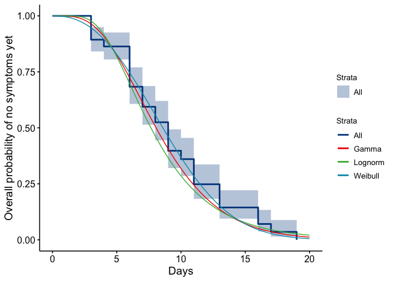
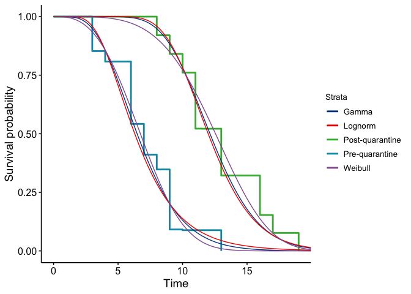

## Data 

Thanks to Dongxuan Chen and Louxin Zhang. These data are from three main sources:

* source1: http://wsjk.tj.gov.cn/col/col87/index.html#!uid=259&pageNum=1 (Tianjin health commission official website, for daily announcements)

* source2: https://weibo.com/u/2967529507 (Jinyun News, Tianjin offical local media weibo account, for patient symptom onset reference)

* source3: https://m.weibo.cn/status/IrrHI1FHm?jumpfrom=weibocom (another Tianjin local media weibo link, for mall cluster reference)


```r
tdata=read.csv("data/Tianjin135cases_revised.csv",na.strings = "", stringsAsFactors = F)
tdata$symptom_onset=as.Date(tdata$symptom_onset, format = "%d/%m/%Y")
tdata$start_source=as.Date(tdata$start_source, format = "%d/%m/%Y")
tdata$end_source=as.Date(tdata$end_source,format = "%d/%m/%Y" )
tdata$confirm_date=as.Date(tdata$confirm_date,format = "%d/%m/%Y" )
names(tdata)[1] = "case_id"
str(tdata)
```

```
## 'data.frame':	135 obs. of  13 variables:
##  $ case_id                              : chr  "TJ1" "TJ2" "TJ3" "TJ4" ...
##  $ gender                               : chr  "F" "M" "F" "M" ...
##  $ age                                  : int  59 57 68 40 46 56 29 39 57 30 ...
##  $ symptom_onset                        : Date, format: "2020-01-14" "2020-01-18" ...
##  $ symptom_type                         : chr  "NA" "NA" "NA" "NA" ...
##  $ confirm_date                         : Date, format: "2020-01-21" "2020-01-21" ...
##  $ Infection_source                     : chr  "Wuhan" "Wuhan; train import" "Wuhan" "Wuhan" ...
##  $ start_source                         : Date, format: "2020-01-05" NA ...
##  $ end_source                           : Date, format: "2020-01-14" "2020-01-18" ...
##  $ severity                             : chr  "severe" "severe" "severe" "normal" ...
##  $ death                                : chr  NA NA NA NA ...
##  $ recorrection.for.start.and.end.source: chr  "symptom onset as ending source " "added end source" NA NA ...
##  $ notes                                : chr  "sometimes Tianjin didn't mention the patient's severity" "Tianjin didn't tell which patient got cured, but they report death cases" "source1: http://wsjk.tj.gov.cn/col/col87/index.html#!uid=259&pageNum=1 (Tianjin health commission official webs"| __truncated__ "source2: https://weibo.com/u/2967529507 (Jinyun News, Tianjin offical local media weibo account, for patient sy"| __truncated__ ...
```


## Incubation period

The incubation period is the time between exposure and the onset of symptoms. We estimate this directly from the stated start and end times for cases' exposure windows. Because it is explicitly about the symptom onset, we remove those who don't have symptom onset defined. These are a small minority of cases (10) and the alternative would be to impute their symptom onset time using the others' delay to confirmation time.  For now, we remove them.  Then, if no other end time for the exposure is given or if the end of the exposure time is after the time of symptom onset, set the last exposure time to the symptom onset time. This is because they must have been exposed before symptom onset.  

If no other start time is given, we assume that they must have been exposed within the 20 days previous to their symptom onset. We set this as an upper bound on the incubation period given prior knowledge.

These give us the maximum and minimum incubation times. 


```r
# they must have been exposed since the start of the outbreak (Dec 1, 2019). - is what we used to use, now symptom onset - 20. 

goodii=which(!is.na(tdata$symptom_onset))  # Remove the 10 individuals without symptom onset
tdata_orig <- tdata # save the full dataset in case
tdata <- tdata[goodii,]

tdata$end_source[which(is.na(tdata$end_source))]=tdata$symptom_onset[which(is.na(tdata$end_source))]  # if no end exposure: set to symptom onset 
tdata$end_source = pmin(tdata$end_source, tdata$symptom_onset) # if end exposure after onset, set to onset 
tdata$start_source[which(is.na(tdata$start_source))]= tdata$symptom_onset[which(is.na(tdata$start_source))] - 20 # if no start, set to symptom onset - 20
            # was as.Date("2019-12-01") # outbreak start date 

tdata$maxIncTimes=tdata$symptom_onset-tdata$start_source 
tdata$minIncTimes = tdata$symptom_onset-tdata$end_source

tdata$maxIncTimes
```

```
## Time differences in days
##   [1]  9 20 20 20 20 20 20  4 20  6 20 20 20 20 20 20 20  7  4 20  9 20 20
##  [24] 20 20 20  8 20 11  9  5 20 20  8 20 20  9  7 11 11 20  3 20 20 20  6
##  [47] 15 11  7  7 20 20 20  8  9  6 20 20  9 20 20 20 14 11  6  9 20 20  6
##  [70] 20  3  6 13 12 20  3 11 10 20 20 20 20 20 20 13 20 20 20 20  7 20 20
##  [93] 20 20 20 20 20 16 20 11 20 20 20 20  3 11 20 19 16 20 17 20 11 20 20
## [116]  6 19 20 20 14 20 16 20 20 20
```

```r
tdata$minIncTimes
```

```
## Time differences in days
##   [1]  0  0  0  0  0  0  1  1  7  4  0  0  0  6  2  0  7  7  4  7  2  3  3
##  [24] 12  8  5  8  0  7  5  2  3  4  0  4  1  8  1  5  5  0  0  4  1  5  6
##  [47]  9 11  7  0  8  3  7  8  9  6 14  0  0  0  0  0  1  8  0  9  0  0  6
##  [70]  0  3  6 12  1  0  3 11 10  0  0  0  0  0  0 13  0 12  0  0  7  0  0
##  [93]  0  0  0  0  0 16  0  4  0  0  0  0  3 11  0  0  0  0 17  0  4  0  0
## [116]  6 19  0  0 11  6 16 11  0  2
```


We assume that incubation times have to be at least 1 day, based on prior knowledge. We set the maximum incubation times as at least 3 days, to take into account some uncertainty on symptom onset reporting - though actually here in Tianjin they were all already at least 3 days.


```r
#spdata = filter(spdata, maxIncTimes > 2)
tdata$maxIncTimes = pmax(3, tdata$maxIncTimes)
tdata$minIncTimes = pmax(1, tdata$minIncTimes)
```


We use survival analysis in the icenReg package to make parametric estimates, and we use the regular survival package to estimate the time to onset of symptoms. 


```r
ggsurvplot(
  fit=survfit(Surv(tdata$minIncTimes, tdata$maxIncTimes, type="interval2")~1, data=tdata), 
  xlab="Days",
  ylab = "Overall probability of no symptoms yet")
```

<!-- -->

The median is about 8-9 days. For a parametric estimate we remove any remaining NAs and use interval censoring, because we know only that exposure was some time between the minimum and maximum possible values. 


```r
reddata=tdata[which(!is.na(tdata$minIncTimes)),]

getthreefits = function(reddata) {
  myfit = ic_par(Surv(reddata$minIncTimes, reddata$maxIncTimes,type="interval2")~1, data = reddata,dist="weibull")

myfit_gamma<- ic_par(Surv(reddata$minIncTimes, reddata$maxIncTimes, type="interval2") ~ 1, data = reddata, dist = "gamma")


myfit_lnorm =  ic_par(Surv(reddata$minIncTimes, reddata$maxIncTimes, type="interval2") ~ 1, data = reddata, dist = "lnorm")
return(list(myfit=myfit, myfit_gamma=myfit_gamma, myfit_lnorm=myfit_lnorm))
}

allthree=getthreefits(reddata)
myfit=allthree$myfit
myfit_gamma=allthree$myfit_gamma
myfit_lnorm=allthree$myfit_lnorm
```

We want to report (1) the parameters for these fits and the quantiles (including median). This describes the distribution.

Then we want to report (2) the resulting mean (95% CI for the mean). This describes our uncertainty in the distribution. 

(1) For the point estimates, get the parameters and quantiles for these  distributions. For Weibull and gamma distributions, the two parameters are shape and scale. For log normal they are mu and sdlog. 


```r
getQuantileDF <- function(myfit,myfit_gamma,myfit_lnorm) {
interqs=getFitEsts(myfit, newdata = NULL, p=c(0.025, 0.25, 0.5, 0.75,0.975)) #
interqs_gamma <- getFitEsts(myfit_gamma, newdata=NULL,  p
                      =c(0.025, 0.25, 0.5, 0.75, 0.975))

interqs_lnorm <- getFitEsts(myfit_lnorm, newdata=NULL,  p
                      =c(0.025,  0.25, 0.5, 0.75, 0.975))
mm=rbind(interqs, interqs_gamma, interqs_lnorm)
colnames(mm)=paste("q_",c(0.025, 0.25, 0.5, 0.75, 0.975),sep="")

df=as.data.frame(mm); df$distr =c("Weibull","Gamma","Log normal")
df$par1=c(exp(myfit$coefficients[1]), exp(myfit_gamma$coefficients[1]), 
          myfit_lnorm$coefficients[1])
df$par2=c(exp(myfit$coefficients[2]), exp(myfit_gamma$coefficients[2]), 
          exp(myfit_lnorm$coefficients[2]))
rownames(df)=NULL

return(df[,c(6,7,8,1:5)])
}

getQuantileDF(myfit,myfit_gamma,myfit_lnorm)
```

```
##        distr par1   par2 q_0.025 q_0.25 q_0.5 q_0.75 q_0.975
## 1    Weibull 2.41 10.006    2.17   5.96  8.59   11.5    17.2
## 2      Gamma 4.74  1.827    2.71   5.76  8.06   10.9    18.0
## 3 Log normal 2.04  0.471    3.05   5.58  7.66   10.5    19.3
```


(2) Now we want the mean and 95% CIs on the shape, the scale and the resulting  mean. The "myfit" objects contain the estimates and covariance for these. Without wanting to code up the theory, the quick approach is to resample the shape and scale with appropriate covariance and compute the resampled means, then take the 95\% CIs. The functional form is different for the three different distributions. 


```r
getMeanCI <- function(statfit, dist = "weibull") {
  if (dist == "weibull") {
  x=exp(rmvnorm(n=10000, mean = statfit$coefficients, sigma=statfit$var))
  mymeans=x[,2]*gamma(1+1/x[,1]) # shape, scale for weibull 
  par1=exp(statfit$coefficients[1])
   par2=exp(statfit$coefficients[2])
  par1range=c(exp(log(par1)-1.96*sqrt(statfit$var[1,1])), exp(log(par1)+1.96*sqrt(myfit$var[1,1])))
   par2range=c(exp(log(par2)-1.96*sqrt(statfit$var[2,2])), exp(log(par2)+1.96*sqrt(myfit$var[2,2])))
  }
  if (dist == "gamma") {
      x=exp(rmvnorm(n=10000, mean = statfit$coefficients, sigma=statfit$var)) # shape, scale for gamma
      mymeans = x[,1]*x[,2] # gamma: mean  is shape*scale
  par1=exp(statfit$coefficients[1])
   par2=exp(statfit$coefficients[2])
  par1range=c(exp(log(par1)-1.96*sqrt(statfit$var[1,1])), exp(log(par1)+1.96*sqrt(myfit$var[1,1])))
   par2range=c(exp(log(par2)-1.96*sqrt(statfit$var[2,2])), exp(log(par2)+1.96*sqrt(myfit$var[2,2])))
  }
  if (dist == "lognorm") {
  x=rmvnorm(n=10000, mean = statfit$coefficients, sigma=statfit$var) 
  # these are the log of the mean, and the log of sd? 
  # mean is exp(mu + 0.5 sig^2) 
  mymeans=exp(x[,1]+0.5*exp(x[,2])^2) # i think
  par1=statfit$coefficients[1]
   par2=exp(statfit$coefficients[2])
    par1range=c(par1-1.96*sqrt(statfit$var[1,1]), par1+1.96*sqrt(myfit$var[1,1]))
   par2range=c(exp(statfit$coefficients[2]-1.96*sqrt(statfit$var[2,2])), exp(statfit$coefficients[2]+1.96*sqrt(statfit$var[2,2])))
  }
return(list(par1=par1,par2=par2, par1range=par1range, par2range=par2range, means=mymeans, qs = quantile(mymeans, probs = c(0.025, 0.5, 0.975)), meanmeans=mean(mymeans), sdmeans=sd(mymeans)))
}
```

Table for parameters and their CIs, and the  mean incubation period and its CI, for unstratified data: 


```r
getMeanCI_DF = function(myfit,myfit_gamma,myfit_lnorm) {
out_weib=getMeanCI(statfit = myfit, dist = "weibull")
out_gamm = getMeanCI(statfit =myfit_gamma, dist = "gamma")
out_lnorm=getMeanCI(statfit =myfit_lnorm, dist="lognorm")
return(data.frame(par1s=c(out_weib$par1, 
                          out_gamm$par1, 
                          out_lnorm$par1),
                   par1lower=c(out_weib$par1range[1], 
                          out_gamm$par1range[1], 
                          out_lnorm$par1range[1]),
                  par1upper=c(out_weib$par1range[2], 
                          out_gamm$par1range[2], 
                          out_lnorm$par1range[2]), # there is a better way .. but.
                  par2s=c(out_weib$par2, 
                          out_gamm$par2, 
                          out_lnorm$par2),
               par2lower=c(out_weib$par2range[1], 
                          out_gamm$par2range[1], 
                          out_lnorm$par2range[1]),
                  par2upper=c(out_weib$par2range[2], 
                          out_gamm$par2range[2], 
                          out_lnorm$par2range[2]), # there is a better way .. but.
                  means=c(out_weib$meanmeans, 
                          out_gamm$meanmeans, 
                          out_lnorm$meanmeans),
           meanlower=c(out_weib$qs[1], out_gamm$qs[1],
                     out_lnorm$qs[1]),
           meanupper=c(out_weib$qs[3],out_gamm$qs[3],
                     out_lnorm$qs[3])))
}
getMeanCI_DF(myfit,myfit_gamma,myfit_lnorm)
```

```
##   par1s par1lower par1upper  par2s par2lower par2upper means meanlower
## 1  2.41      1.99      2.90 10.006     8.940    11.198  8.89      7.94
## 2  4.74      3.35      5.72  1.827     1.285     2.045  8.68      7.72
## 3  2.04      1.92      2.22  0.471     0.395     0.561  8.60      7.62
##   meanupper
## 1      9.93
## 2      9.70
## 3      9.67
```


Plot a fit and the KM curve together. 


```r
# days=seq(0,20,by=0.05)
# density=dweibull(days, shape = exp(myfit$coefficients[1]), scale = exp(myfit$coefficients[2]))
# 
# ggs = ggsurvplot(
#   fit=survfit(Surv(tdata$minIncTimes, tdata$maxIncTimes, type="interval2")~1, data=tdata), 
#   xlab="Days",  ylab = "Overall probability of no symptoms yet")
# 
# pdata <- data.frame(days=rep(days,3),  
#             fitsurv=c(1-pweibull(days, shape = exp(myfit$coefficients[1]), scale = exp(myfit$coefficients[2])),
#         1-pgamma(days,  shape = exp(myfit_gamma$coefficients[1]), scale = exp(myfit_gamma$coefficients[2])),
#         1-plnorm(days,  meanlog = myfit_lnorm$coefficients[1], sdlog = exp(myfit_lnorm$coefficients[2]))),distn=c(rep("Weibull", length(days)), rep("Gamma",length(days)), rep("Lognorm", length(days)) ))  # i know, i know... 
# 
# 
# tmp=data.frame(days=days,  fitsurv=1-pweibull(days, shape = exp(myfit$coefficients[1]),
#                       scale = exp(myfit$coefficients[2])))
# ggs$plot + geom_line(data = tmp, aes(x = days, y = fitsurv))
# ggsave(filename = "inc_Tianjin.pdf", width = 8, height = 6)
```

### Make Figure 3b upper panel (non-stratified) for the manuscript
This is to plot the Kaplan-Meier survival curve and estimated probability distribution of days post-infection for a case not to be showing symptoms yet (using three possible distributions: weibull, gamma, and log-normal).

```r
days=seq(0,20,by=0.05)

ggs = ggsurvplot(
  fit=survfit(Surv(tdata$minIncTimes, tdata$maxIncTimes, type="interval2")~1, data=tdata),
  xlab="Days",  ylab = "Overall probability of no symptoms yet",palette = 'lancet',legend=c('right'))

pdata <- data.frame(days=rep(days,3),  
            fitsurv=c(1-pweibull(days, shape = exp(allthree$myfit$coefficients[1]), scale = exp(allthree$myfit$coefficients[2])),
        1-pgamma(days,  shape = exp(allthree$myfit_gamma$coefficients[1]), scale = exp(allthree$myfit_gamma$coefficients[2])),
        1-plnorm(days,  meanlog = allthree$myfit_lnorm$coefficients[1], sdlog = exp(allthree$myfit_lnorm$coefficients[2]))),distn=c(rep("Weibull", length(days)), rep("Gamma",length(days)), rep("Lognorm", length(days)) ))  # i know, i know... 

ggs$plot +geom_line(data = pdata, aes(x = days, y = fitsurv,color=distn))
```

<!-- -->

```r
 ggsave(filename = "final_figures/Fig3b_inc_Tianjin_all.pdf", width = 8, height = 6)
```


### Stratified early and late 
Finally, we want to do this all again but stratifying the data between early occurring cases and late. This is why we used functions in the above, though it was clumsy. 


```r
earlydata=tdata[which(!is.na(tdata$minIncTimes) & tdata$symptom_onset <= as.Date("2020-01-31")),]
latedata=tdata[which(!is.na(tdata$minIncTimes) & tdata$symptom_onset > as.Date("2020-01-31")),]
```

Fit to the three distributions: 


```r
Eallthree=getthreefits(earlydata)
Lallthree=getthreefits(latedata)
```

EARLY: parameter point estimates and the quantiles


```r
getQuantileDF(Eallthree[[1]],Eallthree[[2]], Eallthree[[3]])
```

```
##        distr par1  par2 q_0.025 q_0.25 q_0.5 q_0.75 q_0.975
## 1    Weibull 2.88 7.643    2.13   4.96  6.73   8.56    12.0
## 2      Gamma 6.01 1.140    2.52   4.82  6.48   8.48    13.3
## 3 Log normal 1.84 0.426    2.73   4.72  6.30   8.39    14.5
```

LATE: parameter point estimates and the quantiles


```r
getQuantileDF(Lallthree[[1]],Lallthree[[2]], Lallthree[[3]])
```

```
##        distr  par1   par2 q_0.025 q_0.25 q_0.5 q_0.75 q_0.975
## 1    Weibull  4.34 13.661    5.85   10.3  12.6   14.7    18.5
## 2      Gamma 17.78  0.695    7.30   10.3  12.1   14.2    18.7
## 3 Log normal  2.48  0.233    7.60   10.2  12.0   14.0    18.9
```

EARLY: how variable are these point estimates? Look at mean and 95\% CI


```r
getMeanCI_DF(Eallthree[[1]],Eallthree[[2]], Eallthree[[3]])
```

```
##   par1s par1lower par1upper par2s par2lower par2upper means meanlower
## 1  2.88      2.16      3.48 7.643     6.735     8.553  6.83      5.99
## 2  6.01      3.61      7.26 1.140     0.660     1.276  6.88      5.97
## 3  1.84      1.70      2.03 0.426     0.331     0.547  6.93      5.96
##   meanupper
## 1      7.77
## 2      7.87
## 3      8.03
```

LATE: how variable are these point estimates? Look at mean and 95\% CI


```r
getMeanCI_DF(Lallthree[[1]],Lallthree[[2]], Lallthree[[3]])
```

```
##   par1s par1lower par1upper  par2s par2lower par2upper means meanlower
## 1  4.34      3.10      5.24 13.661    12.245    15.289  12.5      11.0
## 2 17.78      9.52     21.47  0.695     0.379     0.778  12.4      11.1
## 3  2.48      2.38      2.67  0.233     0.172     0.315  12.4      11.1
##   meanupper
## 1      14.1
## 2      13.7
## 3      13.7
```

### Generating Figure 3b (lower panel) for manuscript
This is to plot the Kaplan-Meier survival curves and estimated probability distribution of days post-infection for a case not to be showing symptoms yet, when stratifying the data pre and post quarantine procedures in China. As per tables above, the symptom onset date of on or before Jan 31, 2020 is the cut-off for what defines an "early" case. 


```r
#Generating Figure 3 for the paper
tdays=seq(0,20,by=0.05)

fit1<-survfit(Surv(earlydata$minIncTimes, earlydata$maxIncTimes, type="interval2")~1, data=earlydata)
fit2<-survfit(Surv(latedata$minIncTimes, latedata$maxIncTimes, type="interval2")~1, data=latedata)

fit <- list(early = fit1, late = fit2)
ggsp2=ggsurvplot(fit, data = tdata, combine = TRUE, # Combine curves
             # Clean risk table
           palette = "lancet",legend.labs=c("Pre-quarantine","Post-quarantine"),legend=c('right'))

pdata <- data.frame(days=rep(tdays,3),  
            fitsurv=c(1-pweibull(tdays, shape = exp(Eallthree$myfit$coefficients[1]), scale = exp(Eallthree$myfit$coefficients[2])),
        1-pgamma(tdays, shape = exp(Eallthree$myfit_gamma$coefficients[1]), scale = exp(Eallthree$myfit_gamma$coefficients[2])),
        1-plnorm(tdays,  meanlog = Eallthree$myfit_lnorm$coefficients[1], sdlog = exp(Eallthree$myfit_lnorm$coefficients[2]))),distn=c(rep("Weibull", length(tdays)), rep("Gamma",length(tdays)), rep("Lognorm", length(tdays)) )) 
                                                            
pdata1 <- data.frame(days=rep(tdays,3),  
            fitsurv=c(1-pweibull(tdays, shape = exp(Lallthree$myfit$coefficients[1]), scale = exp(Lallthree$myfit$coefficients[2])),
        1-pgamma(tdays,  shape = exp(Lallthree$myfit_gamma$coefficients[1]), scale = exp(Lallthree$myfit_gamma$coefficients[2])),
        1-plnorm(tdays,  meanlog = Lallthree$myfit_lnorm$coefficients[1], sdlog = exp(Lallthree$myfit_lnorm$coefficients[2]))), distn=c(rep("Weibull", length(tdays)), rep("Gamma",length(tdays)), rep("Lognorm", length(tdays)) )) 
                                                            
ggsp2$plot + geom_line(data = pdata, aes(x = days, y = fitsurv, color=distn)) +geom_line(data = pdata1, aes(x = days, y = fitsurv, color=distn)) 
```

<!-- -->

```r
ggsave(filename = "final_figures/Fig3b_inc_Tianjin_strata.pdf", width = 8, height = 6)
#ggsave(filename = "inc_Tianjin_strata.png", width = 8, height = 6)
```


