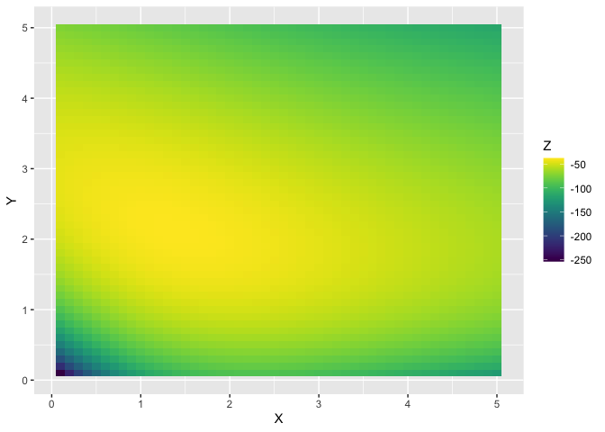
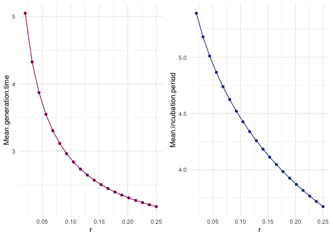
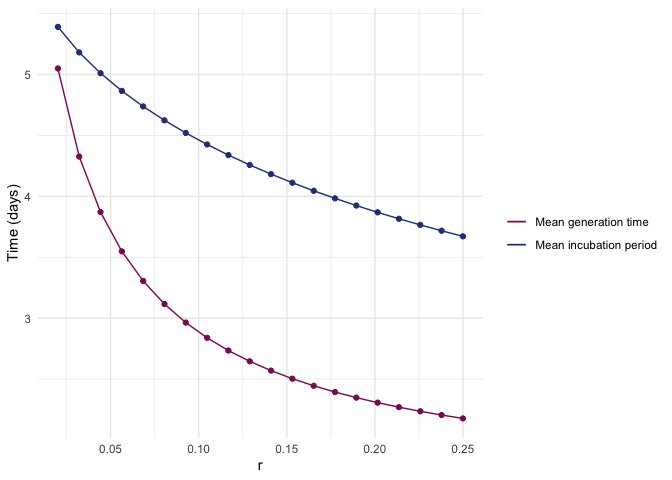

  


## Data 

Thanks to EpiCoronaHack Cluster team. These data are manually entered from postings from the Government of Singapore website: [website](https://www.moh.gov.sg/covid-19).
  

```r
#spdata <- read_csv("data/COVID-19_Singapore_data_revised.csv")
spdata <-read_csv("data/COVID-19_Singapore_data_revised.csv", col_types = list(presumed_infected_date = col_datetime())) # This seems to make the dates read in correctly

# Ensure properly imported
glimpse(spdata)
```

```
## Observations: 93
## Variables: 25
## $ CaseID                 <dbl> 1, 2, 3, 26, 4, 5, 6, 7, 8, 9, 10, 11, ...
## $ `Related cases`        <chr> "2,3", "1,3", "1,2", "13", "11", NA, NA...
## $ `Cluster links`        <chr> NA, NA, NA, NA, NA, NA, NA, NA, "9,31,3...
## $ `Relationship notes`   <chr> NA, NA, "Son of 1", "Daughter of 13", N...
## $ Case                   <chr> "Case 1, 66M, Wuhan", "Case 2, 53F, Wuh...
## $ age                    <dbl> 66, 53, 37, 42, 36, 56, 56, 35, 56, 56,...
## $ sex                    <chr> "M", "F", "M", "F", "M", "F", "M", "M",...
## $ country                <chr> "Singapore", "Singapore", "Singapore", ...
## $ hospital               <chr> "Singapore General Hospital", "National...
## $ presumed_infected_date <dttm> 2020-01-20, 2020-01-20, 2020-01-20, 20...
## $ presumed_reason        <chr> "Arrived from Wuhan", "Arrived from Wuh...
## $ last_poss_exposure     <date> 2020-01-20, 2020-01-20, 2020-01-20, 20...
## $ contact_based_exposure <date> NA, NA, NA, NA, NA, NA, NA, NA, NA, NA...
## $ start_source           <date> 2019-12-31, 2020-01-01, 2020-01-03, NA...
## $ end_source             <date> 2020-01-20, 2020-01-20, 2020-01-20, 20...
## $ date_onset_symptoms    <date> 2020-01-20, 2020-01-21, 2020-01-23, NA...
## $ date_quarantine        <date> NA, NA, NA, NA, NA, NA, NA, NA, NA, NA...
## $ date_hospital          <date> 2020-01-22, 2020-01-22, 2020-01-23, 20...
## $ date_confirmation      <date> 2020-01-23, 2020-01-24, 2020-01-24, 20...
## $ outcome                <chr> "Discharged", "Discharged", "Discharged...
## $ date_discharge         <date> 2020-02-19, 2020-02-07, 2020-02-21, 20...
## $ travel_history         <chr> "Wuhan", "Wuhan", "Wuhan", "Wuhan", "Wu...
## $ additional_information <chr> "Travelled with Case 3 (son) and M1 (wi...
## $ cluster                <chr> "Wuhan", "Wuhan", "Wuhan", "Wuhan", "Wu...
## $ citizenship            <chr> "China", "China", "China", "China", "Ch...
```

```r
colSums(is.na(spdata))
```

```
##                 CaseID          Related cases          Cluster links 
##                      0                     41                     88 
##     Relationship notes                   Case                    age 
##                     64                      0                      0 
##                    sex                country               hospital 
##                      0                      0                      0 
## presumed_infected_date        presumed_reason     last_poss_exposure 
##                     16                     16                     65 
## contact_based_exposure           start_source             end_source 
##                     42                      7                      0 
##    date_onset_symptoms        date_quarantine          date_hospital 
##                     10                     78                      0 
##      date_confirmation                outcome         date_discharge 
##                      0                     31                     31 
##         travel_history additional_information                cluster 
##                      0                     55                     23 
##            citizenship 
##                      0
```

```r
table(spdata$`Related cases`) # There is one cell with "\n", needs to be changed to 'NA'
```

```
## 
##                     \n                    1,2                    1,3 
##                      1                      1                      1 
##                     11                     12                     13 
##                      1                      1                      1 
##                  13,26                     18                     19 
##                      1                      1                      1 
##                  19,20               19,20,25                  19,27 
##                      2                      1                      1 
##                    2,3   20,21,24,27,28,34,40                     22 
##                      1                      1                      1 
##                     23                     24                  24,19 
##                      1                      1                      1 
##                  26, 2                  28,19                  30,39 
##                      1                      1                      1 
##                      4                     41            42,47,52,56 
##                      1                      1                      1 
##                     50                  50,55                     51 
##                      2                      1                      1 
##                  54,57                  54,58               55,65,77 
##                      1                      1                      1 
##                  57,58                 59, 79                     61 
##                      1                      1                      1 
##                     66     66, 68, 70, 71, 80         66, 68, 71, 80 
##                      3                      1                      1 
##         66, 70, 71, 80                 66, 83                     67 
##                      1                      1                      1 
## 68, 70, 71, 80, 83, 91                     72                  72,79 
##                      1                      1                      1 
##                     76                      8                     82 
##                      1                      1                      1 
##                     86    9,83,91,90,38,33,31                     91 
##                      1                      1                      1
```

```r
spdata$`Related cases`[which(spdata$`Related cases` == "\n")] <- NA
colSums(is.na(spdata))
```

```
##                 CaseID          Related cases          Cluster links 
##                      0                     42                     88 
##     Relationship notes                   Case                    age 
##                     64                      0                      0 
##                    sex                country               hospital 
##                      0                      0                      0 
## presumed_infected_date        presumed_reason     last_poss_exposure 
##                     16                     16                     65 
## contact_based_exposure           start_source             end_source 
##                     42                      7                      0 
##    date_onset_symptoms        date_quarantine          date_hospital 
##                     10                     78                      0 
##      date_confirmation                outcome         date_discharge 
##                      0                     31                     31 
##         travel_history additional_information                cluster 
##                      0                     55                     23 
##            citizenship 
##                      0
```

```r
# Rename columns 2, 3 and 4 so no spaces
spdata <- rename(spdata, related_cases = starts_with("Related"),
                 cluster_links = "Cluster links",
                 relationship_notes = starts_with("Relation"))

# make sure dates parsed properly
range(spdata$presumed_infected_date, na.rm = T)
```

```
## [1] "2020-01-18 UTC" "2020-02-10 UTC"
```

```r
range(spdata$last_poss_exposure, na.rm = T)
```

```
## [1] "2020-01-18" "2020-02-09"
```

```r
range(spdata$contact_based_exposure, na.rm = T)
```

```
## [1] "2020-01-19" "2020-02-10"
```

```r
range(spdata$date_onset_symptoms, na.rm = T)
```

```
## [1] "2020-01-20" "2020-02-17"
```

```r
range(spdata$date_quarantine, na.rm = T)
```

```
## [1] "2020-01-26" "2020-02-25"
```

```r
range(spdata$date_hospital, na.rm = T)
```

```
## [1] "2020-01-22" "2020-02-25"
```

```r
range(spdata$date_confirmation, na.rm = T)
```

```
## [1] "2020-01-23" "2020-02-26"
```

```r
range(spdata$date_discharge, na.rm = T)
```

```
## [1] "2020-02-04" "2020-02-26"
```

```r
range(spdata$start_source, na.rm = T)
```

```
## [1] "2019-12-31" "2020-02-02"
```

```r
range(spdata$end_source, na.rm = T)
```

```
## [1] "2020-01-18" "2020-02-17"
```

```r
spdata <- filter(spdata, !is.na(date_onset_symptoms)) #Remove all the cases that do not have info on date of symptom onset 
# NOTE: 10 of these
```


## Incubation period

The incubation period is the time between exposure and the onset of symptoms. We estimate this directly from the stated start and end times for cases' exposure windows. These are now explicitly listed for both Tianjin and Singapore datasets in the 'start_source' and 'end_source' columns.

The rules for defining these start and end dates are as follows:

- For Wuhan travel cases, their end_source is equal to the time they travelled from Wuhan. In the absence of any other contact info, their start_source is equal to their symptom onset - 20 days, to account for wide uncertainty. 

- For cluster cases thought to originate from an index case (but with no further known dates of contact), the start source is set to the 1st symptom onset in the cluster - 7 days. The end date is set to the minimum of the earliest quarantine, hospitalization or hospitalization in the cluster, and the symptom onset date of the case in question. (We assume that once a case in a cluster was identified, people were well aware of this and stopped mixing).

- For cluster cases thought to originate from a specific meeting/event (e.g. company meeting at Grand Hyatt hotel), the start_source is set to the 1st known meeting day. The end_source is set to that day + 4. (4 to account for some error/uncertainty)

- For cases with no known contact or travel info, their start_source is their symptom onset - 20 and their end_source is their symptom onset date (essentially, we have no information on these cases)

If no other end time for the exposure is given (by a known epidemiological route) or if the end of the exposure time is after the time of symptom onset, we set the last exposure time to the symptom onset time. This is because they must have been exposed before symptom onset.


```r
# Let's confirm that the end_source is always before or equal to the symptom onset date
sum(spdata$end_source>spdata$date_onset_symptoms) # =0. Good
```

```
## [1] 0
```

Define the maximum and minimum exposure times based on these assumptions. These are the times $t_{min}^i$ and $t_{max}^i$ in the notation. 


```r
spdata$minIncTimes <- spdata$date_onset_symptoms - spdata$end_source
spdata$maxIncTimes <- spdata$date_onset_symptoms - spdata$start_source
```

We assume that incubation times have to be at least 1 day, based on prior knowledge. We set the maximum incubation times as at least 3 days, to take into account some uncertainty on symptom onset reporting.


```r
#spdata = filter(spdata, maxIncTimes > 2)
spdata$maxIncTimes = pmax(3, spdata$maxIncTimes)
spdata$minIncTimes = pmax(1, spdata$minIncTimes)
```

From here this file diverges from the ..wtables Rmd files .

First define the relevant times for truncation $T_i$


```r
spdata$Ti = as.numeric(ymd("2020-02-27")-spdata$start_source)
```

Specify some fixed and initial parameters.  
In the paper on medrxiv our estimates for the incubation period were shape: 3.36 (2.09, 4.28) and scale: 2.11 (1.32,2.46). 

Here we will have a shape $a_g$ for the generation time and $a_i$ for the incubation period, and the same scale $b$ for both. 


```r
b=2.1 # common scale parameter 
ai=3.4 # shape for incubation period ,as estimated in first round. true value less than this? 
ag = 3 #starting point for shape for generation time. 
n=3  # max number of intermediate cases 
r = 0.1 # add on average 1 intermediate per 10 days? who knows. must look at sensitivity to this parameter 
```

Functions

```r
source("incufuncs.R")
```


These functions seem to work. Yay! Now we have to set up the relevant data inputs, and maximize the likelihood to solve for several parameters. 

We have spdata's minIncTimes and maxIncTimes, which are the 'mintime' and 'maxtime' inputs. We already computed Ti which are the rtTime input. 


```r
# negative log likelihood function for optim 
l_optim <- function( twopars, allmaxtimes, allmintimes, allrtTimes, 
                     maxinters=n, rate=r, comscale=b) {
  gs=twopars[1] # gen time scale parameter
  is=twopars[2] # incubation period scale parameter
  Ncases = length(allmaxtimes) 
  # now compute lirt for each case i 
  indelikes = vapply(1:Ncases, 
                     function(ind) lirt(maxtime=allmaxtimes[ind],
                                        mintime=allmintimes[ind],
                                        rtTime=allrtTimes[ind],
                                        maxinters=maxinters, rate=rate, 
                                        genshape = gs, incshape=is, 
                                        comscale=comscale),
                     FUN.VALUE = 1)
  # the product is the likelihood. the negative sum is the negative log likelihood
  return(-sum(indelikes))
}
```


Testing: seems to work *except* if max and min times are the same, so we correct for this by adding a small noise term in those cases; then 


```r
l_optim(c(1,2), allmaxtimes = spdata$maxIncTimes, 
        allmintimes=spdata$minIncTimes,allrtTimes = spdata$Ti, 
         maxinters=n, rate=r, comscale=b)
```

```
## [1] 38.9
```

So now let's optimize! 


```r
optim(c(1,2), l_optim, allmaxtimes = spdata$maxIncTimes, allmintime=spdata$minIncTimes,
               allrtTimes = spdata$Ti, maxinters=n, rate=r, comscale=b,
      lower = c(0,0), upper = c(20,20), method = "L-BFGS-B")
```

```
## $par
## [1] 1.37 2.12
## 
## $value
## [1] 37.7
## 
## $counts
## function gradient 
##        9        9 
## 
## $convergence
## [1] 0
## 
## $message
## [1] "CONVERGENCE: REL_REDUCTION_OF_F <= FACTR*EPSMCH"
```

Take a look at a heatmap:


```r
# Grid of likelihood values
x <- c(seq(0.1,5, length.out=50))
y <- c(seq(0.1,5, length.out=50))
data <- expand.grid(X=x, Y=y)
for (i in 1:dim(data)[1]){
    data$Z[i] <- -l_optim(c(data[i,1],data[i,2]), allmaxtimes = spdata$maxIncTimes, 
        allmintime=spdata$minIncTimes,allrtTimes = spdata$Ti, 
         maxinters=n, rate=r, comscale=b)
}


# Plot them
ggplot(data, aes(X, Y, fill= Z)) + 
  geom_tile() +
  scale_fill_viridis(discrete=FALSE) 
```

<!-- -->

We can test for sensitivity to rate r - the number of intermediates 'arriving' per day


```r
# current MLEs: gen time shape 1.37, incubation period shape 2.12, for r=0.1

r_cur = c(seq(0.02, 0.25, length.out=20))
rec<-matrix(NA, length(r_cur), 2)
for (i in 1:length(r_cur)){
  ans <- optim(c(1,2), l_optim, allmaxtimes = spdata$maxIncTimes, allmintime=spdata$minIncTimes,
               allrtTimes = spdata$Ti, maxinters=n, rate=r_cur[i], comscale=b ,
               lower = c(0,0), upper = c(20,20), method = "L-BFGS-B")
  rec[i,]<-ans$par
}

df1 <- data.frame(r=r_cur, ag=rec[,1])
df2 <- data.frame(r=r_cur, ai=rec[,2])

plot1 <- ggplot(df1, aes(x=r, y=ag)) + geom_line(color="maroon4")+ geom_point(color="maroon4") + theme_minimal()
plot2 <- ggplot(df2, aes(x=r, y=ai)) + geom_line(color="royalblue4")+ geom_point(color="royalblue4") + theme_minimal()

grid.arrange(plot1, plot2, ncol=2)
```

<!-- -->

```r
# Plot mean estimate instead (scale 2.1)
df3 <- data.frame(r=r_cur, "Mean generation time"=rec[,1]*2.1)
df4 <- data.frame(r=r_cur, "Mean incubation period"=rec[,2]*2.1)

plot1 <- ggplot(df3, aes(x=r, y=Mean.generation.time)) + geom_line(color="maroon4")+ geom_point(color="maroon4") + theme_minimal()
plot2 <- ggplot(df4, aes(x=r, y=Mean.incubation.period)) + geom_line(color="royalblue4")+ geom_point(color="royalblue4") + theme_minimal()

grid.arrange(plot1, plot2, ncol=2)
```

<!-- -->

```r
# on the same plot
df5 <- data.frame(r=r_cur, "Mean generation time"=rec[,1]*2.1, "Mean incubation period"=rec[,2]*2.1)

ggplot(df5) + geom_line(aes(x=r, y=Mean.generation.time, color="Mean generation time",))+ geom_point(color="maroon4", aes(x=r, y=Mean.generation.time)) + theme_minimal() + geom_line(aes(x=r, y=Mean.incubation.period, color="Mean incubation period"))+ geom_point(color="royalblue4", aes(x=r, y=Mean.incubation.period)) + ylab("Time (days)") +
  scale_color_manual(values = c("Mean generation time" = 'maroon4','Mean incubation period' = 'royalblue4')) +
  labs(color = ' ')
```

<!-- -->

```r
#ggsave(filename = "final_figures/incubation_generation_sing_woboot.pdf", width = 8, height = 6)
```


Some kind of uncertainty estimate around the parameters would be helpful 

We explore this at $r=0.05, r=0.1, r=0.15$ to start; we resample the data using bootstrapping, and get empirical 90% CIs for example around the $ai$ and $ag$ parameters. 


```r
nboot = 200

getBootstraps = function(nboot, dataset=spdata, therate=0.1) {
bootresults= lapply(1:nboot, function(x) {
  bootind = sample(1:nrow(dataset), nrow(dataset), replace = T)
  return(optim(c(1,2), l_optim, allmaxtimes = dataset$maxIncTimes[bootind], allmintime=dataset$minIncTimes[bootind],
               allrtTimes = dataset$Ti[bootind], maxinters=n, rate=therate, comscale=b ))
})
gsboots= 0*1:100
isboots = 0*1:100
for (n in 1:nboot) {gsboots[n]=bootresults[[n]]$par[1]}
for (n in 1:nboot) {isboots[n]=bootresults[[n]]$par[2]}
return(data.frame(gsboots = gsboots, isboots = isboots, rate = therate))
}

boot1=getBootstraps(nboot, spdata,therate = 0.05) 
boot2=getBootstraps(nboot, spdata,therate = 0.1) 
boot3=getBootstraps(nboot, spdata,therate = 0.15) 
boot4=getBootstraps(nboot, spdata,therate = 0.2) 
save(boot1, boot2, boot3, boot4, file = "interbooty2.Rdata")
```

We overlay the previous plots with boxplots for the bootstraps


```r
load("interbooty2.Rdata")

value <- c(boot1[,1], boot2[,1], boot3[,1], boot4[,1])
group <- c(boot1[,3], boot2[,3], boot3[,3], boot4[,3])
gen_bootdata <- data.frame(value, r=group)

value <- c(boot1[,2], boot2[,2], boot3[,2], boot4[,2])
group <- c(boot1[,3], boot2[,3], boot3[,3], boot4[,3])
inc_bootdata <- data.frame(value, r=group)

# Plot a_g and a_i

df1 <- data.frame(r=r_cur, ag=rec[,1])
df2 <- data.frame(r=r_cur, ai=rec[,2])

plot1 <- ggplot(df1, aes(x=r, y=ag)) + geom_boxplot(data = gen_bootdata, aes(group=r, y=value), fill = 'lavender', colour = 'plum4', alpha = 0.7) + geom_line(color="maroon4")+ geom_point(color="maroon4") + theme_minimal() +  scale_y_continuous(name = "Generation time shape parameter") +  scale_x_continuous(name = "Number of intermediate cases per day, r")
plot2 <- ggplot(df2, aes(x=r, y=ai)) + geom_boxplot(data = inc_bootdata, aes(group=r, y=value), fill = 'lightblue2', colour = 'skyblue4', alpha = 0.7) + geom_line(color="royalblue4")+ geom_point(color="royalblue4") + theme_minimal() +  scale_y_continuous(name = "Incubation period shape parameter") +  scale_x_continuous(name = "Number of intermediate cases per day, r")

grid.arrange(plot1, plot2, ncol=2)
```

<!-- -->

```r
#save
g <- arrangeGrob(plot1, plot2, ncol=2) #generates g
ggsave(filename = "final_figures/incgen_sing_shapes.pdf", g, width = 10, height = 6)


# Plot mean estimates instead (scale b=2.1)

value <- c(boot1[,1]*b, boot2[,1]*b, boot3[,1]*b, boot4[,1]*b)
group <- c(boot1[,3], boot2[,3], boot3[,3], boot4[,3])
gen_bootdata <- data.frame(value, r=group)

value <- c(boot1[,2]*b, boot2[,2]*b, boot3[,2]*b, boot4[,2]*b)
group <- c(boot1[,3], boot2[,3], boot3[,3], boot4[,3])
inc_bootdata <- data.frame(value, r=group)

df5 <- data.frame(r=r_cur, "Mean generation time"=rec[,1]*b, "Mean incubation period"=rec[,2]*b)

ggplot(df5, aes(x=r, y=Mean.generation.time)) + geom_boxplot(data = gen_bootdata, aes(group=r, y=value), fill = 'lavender', colour = 'plum4', alpha = 0.7) + geom_boxplot(data = inc_bootdata, aes(group=r, y=value), fill = 'lightblue2', colour = 'skyblue4', alpha = 0.7) + geom_line(aes(x=r, y=Mean.generation.time, color="Mean generation time",)) + geom_point(color="maroon4", aes(x=r, y=Mean.generation.time)) + theme_minimal() + geom_line(aes(x=r, y=Mean.incubation.period, color="Mean incubation period"))+ geom_point(color="royalblue4", aes(x=r, y=Mean.incubation.period)) + ylab("Time (days)") +
  scale_color_manual(values = c("Mean generation time" = 'maroon4','Mean incubation period' = 'royalblue4')) +
  labs(color = ' ') +  scale_x_continuous(name = "Number of intermediate cases per day, r")
```

<!-- -->

```r
ggsave(filename = "final_figures/incgen_sing_means.pdf", width = 10, height = 6)
```

Then the remaining question is to see if we want to handle right truncation without intermediate cases. And the uncertainty and so on there. There, we could continue to do the 3 models (gamma, Weibull, lognormal) because without intermediate cases, it's just the CDFs (which we have access to in R). 


JS: Can we also try to optimize the shared scale parameter b? CC: I think we discuss this but don't show it (re optimizing b). 


```r
# negative log likelihood function for optim 
l_optim_3 <- function( threepars, allmaxtimes, allmintimes, allrtTimes, 
                     maxinters=n, rate=r) {
  gs=threepars[1] # gen time scale parameter
  is=threepars[2] # incubation period scale parameter
  comscale=threepars[3]
  Ncases = length(allmaxtimes) 
  # now compute lirt for each case i 
  indelikes = vapply(1:Ncases, 
                     function(ind) lirt(maxtime=allmaxtimes[ind],
                                        mintime=allmintimes[ind],
                                        rtTime=allrtTimes[ind],
                                        maxinters=maxinters, rate=rate, 
                                        genshape = gs, incshape=is, 
                                        comscale=comscale),
                     FUN.VALUE = 1)
  # the product is the likelihood. the negative sum is the negative log likelihood
  return(-sum(indelikes))
}

l_optim_3(c(3,4,b), allmaxtimes = spdata$maxIncTimes, 
        allmintimes=spdata$minIncTimes,allrtTimes = spdata$Ti, 
         maxinters=n, rate=r) # matches the 2 par version
```

```
## [1] 73.1
```

```r
optim(c(3,4, b), l_optim_3, allmaxtimes = spdata$maxIncTimes, allmintime=spdata$minIncTimes,
               allrtTimes = spdata$Ti, maxinters=n, rate=r)
```

```
## $par
## [1] 30.288 17.547  0.154
## 
## $value
## [1] 26.5
## 
## $counts
## function gradient 
##      320       NA 
## 
## $convergence
## [1] 0
## 
## $message
## NULL
```

It wants to make scale b really small and the shape parameters really big  - but actually if you look at the resulting disribution it has a very similar mean to b=2.1 so that's good. Lets try running 2 par optim for a reasonable range of b values instead. 


```r
res<-matrix(NA,90,2)
for (i in 10:100){
ans <- optim(c(40/i,40/i), l_optim, allmaxtimes = spdata$maxIncTimes, allmintime=spdata$minIncTimes,
               allrtTimes = spdata$Ti, maxinters=n, rate=r, comscale=i/20 )
res[i-9,] <- ans$par
}


# Plot mean estimate instead (scale 2.1)
dfbg <- data.frame(b=seq(10/20,100/20,length.out=90), ag=res[,1])
dfbi <- data.frame(b=seq(10/20,100/20,length.out=90), ai = res[,2])

dfbg2 <- data.frame(b=seq(10/20,100/20,length.out=90), "Mean generation time"=res[,1]*seq(10/20,100/20,length.out=90))
dfbi2 <- data.frame(b=seq(10/20,100/20,length.out=90), "Mean incubation period" = res[,2]*seq(10/20,100/20,length.out=90))

plot1 <- ggplot(dfbg, aes(x=b, y=ag)) + geom_line(color="maroon4")+ geom_point(color="maroon4") + theme_minimal()
plot2 <- ggplot(dfbi, aes(x=b, y=ai)) + geom_line(color="royalblue4")+ geom_point(color="royalblue4") + theme_minimal()

grid.arrange(plot1, plot2, ncol=2)

plot1 <- ggplot(dfbg2, aes(x=b, y=Mean.generation.time)) + geom_line(color="maroon4")+ geom_point(color="maroon4") + theme_minimal()
plot2 <- ggplot(dfbi2, aes(x=b, y=Mean.incubation.period)) + geom_line(color="royalblue4")+ geom_point(color="royalblue4") + theme_minimal()

grid.arrange(plot1, plot2, ncol=2)

# on the same plot
df_together <- data.frame(b=seq(10/20,100/20,length.out=90), "Mean generation time"=res[,1]*seq(10/20,100/20,length.out=90), "Mean incubation period"=res[,2]*seq(10/20,100/20,length.out=90))

ggplot(df_together) + geom_line(color="maroon4", aes(x=b, y=Mean.generation.time))+ geom_point(color="maroon4", aes(x=b, y=Mean.generation.time)) + theme_minimal() + geom_line(color="royalblue4", aes(x=b, y=Mean.incubation.period))+ geom_point(color="royalblue4", aes(x=b, y=Mean.incubation.period)) + ylab("Time (days)")
```
