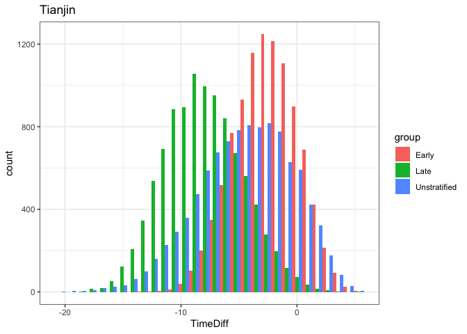

## Pre-symptomatic transmission 

The mean of (incubation time - serial interval) is the difference in means if the two are sampled independently. While this is a big assumption, we don't know the covariance. 

Mean differences in Tianjin: 8.89 - 4.31 = 4.58. 

Early:  6.83-4.31 = 2.52

Late: 12.5-4.31 = 8.19

Mean differences in Singapore:  6.18 - 4.17 = 2.01

Early: 5.92-4.17 = 1.75

Late: 6.30-4.17 = 2.13


Finally - let's sample the distribution of the time between symptom onset of a case to its infecting others (the distribution of  serial interval minus incubation time). The proportion of this duration that is negative gives the proportion of infections caused before symptom onset, which is per Fraser et al. PNAS 2004 one of the key factors that determines if an outbreak is controllable by non-pharmaceutical measures. Here we use either the conservative estimate of the incubation period 

We'll use estimates in the manuscript for all distributions. These are: serial interval mean 4.31 (sd 0.935) for Tianjin and mean 4.17 (sd 1.057) for Singapore, and for incubation period we have Weibull distributions:

Tianjin 

* Early median 6.73 shape 2.88  (2.16, 3.48) scale 7.643 (6.735, 8.553)

* Late median 12.6 shape 17.78 (9.52, 21.47) scale 0.695 (0.379,0.778)


Singapore (I will load these in, below, so as not to mistake numbers etc). 

* Early median 5.51 shape 2.05 (1.34,2.58) scale 6.587 (5.077,7.897) 

* Late median 5.67 shape 1.75 (1.29,2.21) scale 6.989 (5.048,8.38)


```r
tianjin=list()
tianjin[[1]]=list(median=6.73,shape=2.88,minshape=2.16, maxshape=3.48, scale=7.643, minscale=6.735, maxscale=8.553)
tianjin[[2]]=list(median=12.6,shape=4.34,minshape=3.1,maxshape=5.24,scale=13.661, minscale=12.245, maxscale=15.289)
tianjin[[3]]=list(median= 8.59, shape= 2.41, minshape=1.99, maxshape=2.9,scale =10.01,minscale=8.94, maxscale=11.2)  # actually I won't need all of that information here 

singapore=list()
singapore[[1]]=list(median= 5.51, shape= 2.05, scale= 6.587)
singapore[[2]]=list(median= 5.67, shape= 1.75, scale= 6.989)
singapore[[3]]=list(median=5.66 , shape=1.83 , scale =6.91)
```

We will perform 6 experiments: Tianjin early, late, unstratified; Singapore early, late, unstratified.

## Tianjin 


```r
Nsamp=10000
inctimesE = rweibull(Nsamp, shape = tianjin[[1]]$shape, scale = tianjin[[1]]$scale)
inctimesL = rweibull(Nsamp, shape = tianjin[[2]]$shape, scale = tianjin[[2]]$scale)
inctimesU = rweibull(Nsamp, shape = tianjin[[3]]$shape, scale = tianjin[[3]]$scale)


sertimes= rnorm(Nsamp, mean = 4.31 , sd = 0.935)

d1=data.frame(TimeDiff=sertimes-inctimesE, group="Early")
d2=data.frame(TimeDiff=sertimes-inctimesL, group="Late")
d3=data.frame(TimeDiff=sertimes-inctimesU, group="Unstratified")

df=rbind(d1,d2, d3) 

ggplot(data=df, aes(x=TimeDiff, fill=group))+geom_histogram(position="dodge")+theme_bw()+ggtitle("Tianjin")
```

```
## `stat_bin()` using `bins = 30`. Pick better value with `binwidth`.
```

<!-- -->

```r
ggsave(file="portion_pre_Tianjin.pdf", height=4,width = 6)
```

```
## `stat_bin()` using `bins = 30`. Pick better value with `binwidth`.
```

The portion of transmission that occurs pre-symptoms is estimated (very simply) by the fraction of (incubation - serial interval) that is negative. Note that this assumes independence of symptom onset and incubation time and so may be an overestimate. We report cautiously in the paper for this reason. 


```r
# portion pre-symptom: early
sum(d1$TimeDiff<0)/length(d1$TimeDiff)
```

```
## [1] 0.8107
```

```r
# portion pre-symptom: late
sum(d2$TimeDiff<0)/length(d2$TimeDiff)
```

```
## [1] 0.991
```

```r
# portion pre-symptom: unstratified 
sum(d3$TimeDiff<0)/length(d3$TimeDiff)
```

```
## [1] 0.8702
```


## With covariance. 

In the file cov_tianjin_cc.Rmd we estimated the covariation between the incubation period and serial interval. Now we can sample these, using multivariate distributions, to see how having some dependence structure may alter the proportion. 

The estimate of correlation was 0.289 but there was some variation in this, of course. 

Here is the approach I take now. 

- sample incubation period parameters using the fits to data in the main text. These fits include a variance estimate between the shape and scale parameters, so I sample shape and scale together keeping that in mind . Create 100 samples. This is 100 incubation period shape, scale pairs. 

- we have a multivariate gamma sampler and a multivariate normal one but not one with a gamma on one margin and a normal on the other.

- therefore, we use a gamma distribution for the serial interval, with the same mean and variance as the normal we estimated with the ICC method. We obtain 100 serial interval gamma shape, scale pairs with mean and variance as they should be. 

- For each of these 100 distributions, sample *jointly* 500 incubation periods and serial intervals, with correlation of 0.3 (ish). 

- Now we have 100x 500 samples of incubation period and serial interval. Their difference, SI - inc period, should be the fraction pre-symptomatic. 


```r
load("tianjin_inc_fits.Rdata") 

getMyDiffs = function(statfit, cormean=0.29) {
  # choose shape and scale according to our fits 
  incparsamps = exp(mvtnorm::rmvnorm(n=100,
                          mean = statfit$coefficients,
                          sigma=statfit$var))
  # choose mean SI with a bit of uncertainty too, but not too much 
  sishapes = rnorm(100, mean=21, sd=1)
# we don't really even know the correlation between inc and si
  corvals = rnorm(100, mean=cormean, sd = 0.04)
# sample: 
  bigsamps = lapply(1:100, function(x) 
  lcmix::rmvgamma(n=500, shape=c(incparsamps[x,1], sishapes[x]), 
           rate=c(1/incparsamps[x,2], 1/0.203),
           corr = matrix(c(1, corvals[x], corvals[x], 1), nrow = 2)))
# glue together 
  bigsamps = do.call(rbind, bigsamps)
  return(data.frame(incs=bigsamps[,1], sis=bigsamps[,2],
                    diffs= bigsamps[,2] - bigsamps[,1]))
}


earlydiffs = getMyDiffs(Eallthree$myfit_gamma)
anydiffs=getMyDiffs(allthree$myfit_gamma)
latediffs= getMyDiffs(Lallthree$myfit_gamma)


d1=data.frame(TimeDiff=earlydiffs$diffs, group="Early")
d2=data.frame(TimeDiff=latediffs$diffs, group="Late")
d3=data.frame(TimeDiff=anydiffs$diffs, group="Unstratified")

df=rbind(d1,d2, d3) 


ggplot(data=df, aes(x=TimeDiff, fill=group))+geom_histogram(position="dodge", bins=30)+theme_bw()+ggtitle("Tianjin")
```

<!-- -->


```r
ggsave(file="portion_pre_Tianjin_corr.pdf", height=4,width = 6)
```


```r
# portion pre-symptom: early
sum(d1$TimeDiff<0)/length(d1$TimeDiff)
```

```
## [1] 0.83956
```

```r
# portion pre-symptom: late
sum(d2$TimeDiff<0)/length(d2$TimeDiff)
```

```
## [1] 0.9994
```

```r
# portion pre-symptom: unstratified 
sum(d3$TimeDiff<0)/length(d3$TimeDiff)
```

```
## [1] 0.89926
```

It remains to look at the estimates from the intermediates: what would they say? there, we don't have the true fits, just a bunch of bootstraps, so we would need another function and a bit more code. 

## Tianjin, with estimates from intermediate analysis

```r
load("interbooty2_tianjin.Rdata") # bootstraps for 0.05, 0.1, 0.15, 2, incubation period means
b=2
quantile(boot1$isboots*b, p=c(0.025, 0.5, 0.975))
```

```
##     2.5%      50%    97.5% 
## 6.142519 6.856608 7.782918
```

```r
quantile(boot2$isboots*b, p=c(0.025, 0.5, 0.975))
```

```
##     2.5%      50%    97.5% 
## 5.473160 6.263023 7.280707
```

```r
quantile(boot3$isboots*b, p=c(0.025, 0.5, 0.975))
```

```
##     2.5%      50%    97.5% 
## 4.973456 5.726323 6.772213
```

```r
quantile(boot4$isboots*b, p=c(0.025, 0.5, 0.975))
```

```
##     2.5%      50%    97.5% 
## 4.633173 5.372779 6.520411
```


For this part, we have the generation time and incubation period. The fraction pre-symp is the fraction of generation time - incubation period that is negative.

Let's blindly assume the same kind of correlation we have from the direct estimates, but use the intermediates to explore how much pre-symp transmission there would be. We do the same as above, but now the scale is fixed at 2 and we sample multivariate gamma for the incubation period and generation time (instead of serial interval and incubation period). Now I can sample the gsboots and isboots for the shapes. eg boot1$gsboots: gamma shape for generation time; boot1$isboots is the inc period


```r
getDiffsInter = function(myboot, cormean=0.289) {
  gamshape= sample(myboot$gsboots, 100)
  incshape=sample(myboot$isboots,100)
  corvals = rnorm(100, mean=cormean, sd = 0.04)
  bigsamps = lapply(1:100, function(x) 
  lcmix::rmvgamma(n=500, shape=c(gamshape[x], incshape[x]), 
           rate=c(1/2, 1/2),
           corr = matrix(c(1, corvals[x], corvals[x], 1), nrow = 2)))
  bigsamps = do.call(rbind, bigsamps)
  return(data.frame(gens=bigsamps[,1], incs=bigsamps[,2],
                    TimeDiff= bigsamps[,1] - bigsamps[,2], rate=myboot$rate[1])) 
}

dif1=getDiffsInter(boot1)
dif2=getDiffsInter(boot2)
dif3=getDiffsInter(boot3)
dif4=getDiffsInter(boot4)

diffd=rbind(dif1,dif2, dif3,dif4) 
diffd$rate=as.factor(diffd$rate)


ggplot(data=diffd, aes(x=TimeDiff, fill=rate))+geom_histogram(position="stack",
                                                           bins=90)+theme_bw()+ggtitle("Tianjin")
```

<!-- -->

```r
ggplot(data=diffd, aes(x=TimeDiff, fill=rate))+geom_density(alpha=0.2)+theme_bw()+ggtitle("Tianjin")
```

<!-- -->


```r
ggsave(file="portion_pre_Tianjin_inter_corr.pdf", height=4,width = 6)
```


```r
sum(dif1$TimeDiff < 0)/nrow(dif1)
```

```
## [1] 0.90606
```

```r
sum(dif2$TimeDiff < 0)/nrow(dif2)
```

```
## [1] 0.91258
```

```r
sum(dif3$TimeDiff < 0)/nrow(dif3)
```

```
## [1] 0.89712
```

```r
sum(dif4$TimeDiff < 0)/nrow(dif4)
```

```
## [1] 0.88026
```


## Singapore 


```r
Nsamp=10000
inctimesE = rweibull(Nsamp, shape = singapore[[1]]$shape, scale = singapore[[1]]$scale)
inctimesL = rweibull(Nsamp, shape = singapore[[2]]$shape, scale = singapore[[2]]$scale)
inctimesU = rweibull(Nsamp, shape = singapore[[3]]$shape, scale = singapore[[3]]$scale)


sertimes= rnorm(Nsamp, mean = 4.17, sd = 1.057) 

d1=data.frame(TimeDiff=sertimes-inctimesE, group="Early")
d2=data.frame(TimeDiff=sertimes-inctimesL, group="Late")
d3=data.frame(TimeDiff=sertimes-inctimesU, group="Unstratified")

df=rbind(d1,d2, d3) 

ggplot(data=df, aes(x=TimeDiff, fill=group))+geom_histogram(position="dodge")+theme_bw()+ggtitle("Singapore")
```

```
## `stat_bin()` using `bins = 30`. Pick better value with `binwidth`.
```

<!-- -->

```r
ggsave(file="portion_pre_Singapore.pdf", height=4,width = 6)
```

```
## `stat_bin()` using `bins = 30`. Pick better value with `binwidth`.
```


The portion of transmission that occurs pre-symptoms is estimated (very simply) by the fraction of (incubation - serial interval) that is negative. Note that this assumes independence of symptom onset and incubation time and so may be an overestimate. We report cautiously in the paper for this reason. 


```r
# portion pre-symptom: early
sum(d1$TimeDiff<0)/length(d1$TimeDiff)
```

```
## [1] 0.6628
```

```r
# portion pre-symptom: late
sum(d2$TimeDiff<0)/length(d2$TimeDiff)
```

```
## [1] 0.6622
```

```r
# portion pre-symptom: unstratified
sum(d3$TimeDiff<0)/length(d3$TimeDiff)
```

```
## [1] 0.6665
```


### leftover 

Now a broader experiment where we sample the shape and scale parameters from the above distribution, assuming they themselves are normal. 


```r
Nsamp=10000
shapes=rnorm(Nsamp, tianjin[[1]]$shape, (tianjin[[1]]$maxshape-tianjin[[1]]$shape)/1.96)
scales=rnorm(Nsamp, tianjin[[1]]$scale, (tianjin[[1]]$maxscale-tianjin[[1]]$scale)/1.96)
inctimes = rweibull(Nsamp, shape=shapes, scale=scales)
# tianjin mean 4.22 (3.15, 5.29) so sd of the means is 
serialmeansd=(4.22-3.15)/1.96
sermeans = rnorm(Nsamp, 4.22, serialmeansd)
sersd=1 # sd in the mean  ... ok 
sertimes= rnorm(Nsamp, mean =sermeans, sd=sersd)
hist(sertimes-inctimes,breaks = 30) 
```

<!-- -->

```r
sum(sertimes-inctimes < 0)/length(sertimes)
```

```
## [1] 0.8165
```

This is consistent with the other estimates. 


## Singapore: with covariance. 

In the file cov_sing_cc.Rmd we estimated the covariation between the incubation period and serial interval. Now we can sample these, using multivariate distributions, to see how having some dependence structure may alter the proportion. 

The estimate of correlation was 0.429 but there was some variation in this, of course. 

I take the same approach as above. 


```r
load("singapore_inc_fits.Rdata") 
library(lcmix)
```

```
## Loading required package: R.methodsS3
```

```
## R.methodsS3 v1.8.0 (2020-02-14 07:10:20 UTC) successfully loaded. See ?R.methodsS3 for help.
```

```
## Loading required package: matrixStats
```

```
## Loading required package: MASS
```

```
## Loading required package: nnls
```

```r
getMyDiffs = function(statfit, cormean=0.429) {
  # choose shape and scale according to our fits 
  incparsamps = exp(mvtnorm::rmvnorm(n=100,
                          mean = statfit$coefficients,
                          sigma=statfit$var))
  # choose mean SI with a bit of uncertainty too, but not too much 
  sishapes = rnorm(100, mean=21, sd=1)
# we don't really even know the correlation between inc and si
  corvals = rnorm(100, mean=cormean, sd = 0.04)
# sample: 
  bigsamps = lapply(1:100, function(x) 
  rmvgamma(n=500, shape=c(incparsamps[x,1], sishapes[x]), 
           rate=c(1/incparsamps[x,2], 1/0.203),
           corr = matrix(c(1, corvals[x], corvals[x], 1), nrow = 2)))
# glue together 
  bigsamps = do.call(rbind, bigsamps)
  return(data.frame(incs=bigsamps[,1], sis=bigsamps[,2],
                    diffs= bigsamps[,2] - bigsamps[,1]))
}


earlydiffs = getMyDiffs(Eallthree$myfit_gamma)
anydiffs=getMyDiffs(allthree$myfit_gamma)
latediffs= getMyDiffs(Lallthree$myfit_gamma)


d1=data.frame(TimeDiff=earlydiffs$diffs, group="Early")
d2=data.frame(TimeDiff=latediffs$diffs, group="Late")
d3=data.frame(TimeDiff=anydiffs$diffs, group="Unstratified")

df=rbind(d1,d2, d3) 


ggplot(data=df, aes(x=TimeDiff, fill=group))+geom_histogram(position="dodge", bins=30)+theme_bw()+ggtitle("Singapore")
```

<!-- -->


```r
ggsave(file="portion_pre_Singapore_corr.pdf", height=4,width = 6)
```


```r
# portion pre-symptom: early
sum(d1$TimeDiff<0)/length(d1$TimeDiff)
```

```
## [1] 0.64586
```

```r
# portion pre-symptom: late
sum(d2$TimeDiff<0)/length(d2$TimeDiff)
```

```
## [1] 0.65014
```

```r
# portion pre-symptom: unstratified 
sum(d3$TimeDiff<0)/length(d3$TimeDiff)
```

```
## [1] 0.6629
```

It remains to look at the estimates from the intermediates: what would they say? there, we don't have the true fits, just a bunch of bootstraps, so we would need another function and a bit more code. 

## Singapore, with estimates from intermediate analysis

```r
load("interbooty2.Rdata") # bootstraps for 0.05, 0.1, 0.15, 2, incubation period means
b=2
quantile(boot1$isboots*b, p=c(0.025, 0.5, 0.975))
```

```
##     2.5%      50%    97.5% 
## 4.140700 4.680827 5.423466
```

```r
quantile(boot2$isboots*b, p=c(0.025, 0.5, 0.975))
```

```
##     2.5%      50%    97.5% 
## 3.839479 4.217617 5.006032
```

```r
quantile(boot3$isboots*b, p=c(0.025, 0.5, 0.975))
```

```
##     2.5%      50%    97.5% 
## 3.545912 3.925385 4.519083
```

```r
quantile(boot4$isboots*b, p=c(0.025, 0.5, 0.975))
```

```
##     2.5%      50%    97.5% 
## 3.347159 3.706753 4.276773
```


For this part, we have the generation time and incubation period. The fraction pre-symp is the fraction of generation time - incubation period that is negative.

Let's blindly assume the same kind of correlation we have from the direct estimates, but use the intermediates to explore how much pre-symp transmission there would be. We do the same as above, but now the scale is fixed at 2 and we sample multivariate gamma for the incubation period and generation time (instead of serial interval and incubation period). Now I can sample the gsboots and isboots for the shapes. eg boot1$gsboots: gamma shape for generation time; boot1$isboots is the inc period


```r
getDiffsInter = function(myboot, cormean=0.429) {
  gamshape= sample(myboot$gsboots, 100)
  incshape=sample(myboot$isboots,100)
  corvals = rnorm(100, mean=cormean, sd = 0.04)
  bigsamps = lapply(1:100, function(x) 
  rmvgamma(n=500, shape=c(gamshape[x], incshape[x]), 
           rate=c(1/2, 1/2),
           corr = matrix(c(1, corvals[x], corvals[x], 1), nrow = 2)))
  bigsamps = do.call(rbind, bigsamps)
  return(data.frame(gens=bigsamps[,1], incs=bigsamps[,2],
                    TimeDiff= bigsamps[,1] - bigsamps[,2], rate=myboot$rate[1])) 
}

dif1=getDiffsInter(boot1)
dif2=getDiffsInter(boot2)
dif3=getDiffsInter(boot3)
dif4=getDiffsInter(boot4)

diffd=rbind(dif1,dif2, dif3,dif4) 
diffd$rate=as.factor(diffd$rate)


ggplot(data=diffd, aes(x=TimeDiff, fill=rate))+geom_histogram(position="stack",
                                                           bins=90)+theme_bw()+ggtitle("Singapore")
```

<!-- -->

```r
ggplot(data=diffd, aes(x=TimeDiff, fill=rate))+geom_density(alpha=0.2)+theme_bw()+ggtitle("Singapore")
```

<!-- -->


```r
ggsave(file="portion_pre_Sing_inter_corr.pdf", height=4,width = 6)
```


```r
sum(dif1$TimeDiff < 0)/nrow(dif1)
```

```
## [1] 0.66612
```

```r
sum(dif2$TimeDiff < 0)/nrow(dif2)
```

```
## [1] 0.72836
```

```r
sum(dif3$TimeDiff < 0)/nrow(dif3)
```

```
## [1] 0.75276
```

```r
sum(dif4$TimeDiff < 0)/nrow(dif4)
```

```
## [1] 0.75862
```

