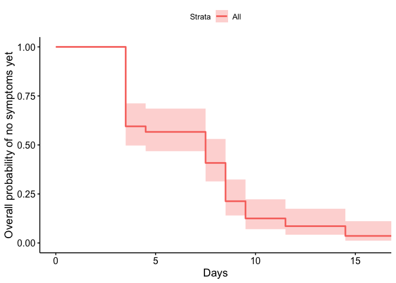
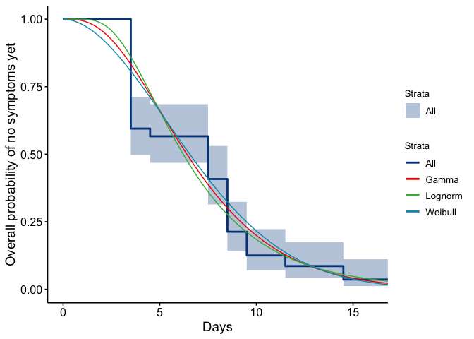
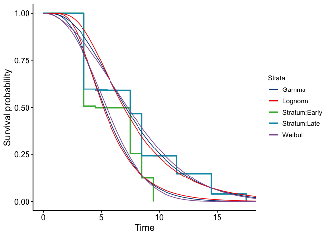

  


## Data 

Thanks to EpiCoronaHack Cluster team. These data are manually entered from postings from the Government of Singapore website: [website](https://www.moh.gov.sg/covid-19).
  
  


```r
spdata <- read_csv("data/COVID-19_Singapore.csv")
```

```
## Parsed with column specification:
## cols(
##   .default = col_character(),
##   CaseID = col_double(),
##   age = col_double()
## )
```

```
## See spec(...) for full column specifications.
```

```r
# Ensure properly imported
glimpse(spdata)
```

```
## Observations: 93
## Variables: 23
## $ CaseID                 <dbl> 1, 2, 3, 4, 5, 6, 7, 8, 9, 10, 11, 12, 13, 14,…
## $ `Related cases`        <chr> "2,3", "1,3", "1,2", "11", NA, NA, NA, "9", "8…
## $ `Cluster links`        <chr> NA, NA, NA, NA, NA, NA, NA, "9,31,33,38,83, 90…
## $ `Relationship notes`   <chr> NA, NA, "Son of 1", NA, NA, NA, NA, "Married t…
## $ Case                   <chr> "Case 1, 66M, Wuhan", "Case 2, 53F, Wuhan", "C…
## $ age                    <dbl> 66, 53, 37, 36, 56, 56, 35, 56, 56, 56, 31, 37…
## $ sex                    <chr> "M", "F", "M", "M", "F", "M", "M", "F", "M", "…
## $ country                <chr> "Singapore", "Singapore", "Singapore", "Singap…
## $ hospital               <chr> "Singapore General Hospital", "National Centre…
## $ presumed_infected_date <chr> "20/01/2020", "20/01/2020", "20/01/2020", "22/…
## $ presumed_reason        <chr> "Arrived from Wuhan", "Arrived from Wuhan", "A…
## $ last_poss_exposure     <chr> "20/01/2020", "20/01/2020", "20/01/2020", "22/…
## $ symp_presumed_infector <chr> NA, NA, NA, NA, NA, NA, NA, NA, NA, NA, NA, NA…
## $ date_onset_symptoms    <chr> "20/01/2020", "21/01/2020", "23/01/2020", "23/…
## $ date_quarantine        <chr> NA, NA, NA, NA, NA, NA, NA, NA, NA, NA, "26/01…
## $ date_hospital          <chr> "22/01/2020", "22/01/2020", "23/01/2020", "24/…
## $ date_confirmation      <chr> "23/01/2020", "24/01/2020", "24/01/2020", "25/…
## $ outcome                <chr> "Discharged", "Discharged", "Discharged", "Dis…
## $ date_discharge         <chr> "19/02/2020", "07/02/2020", "21/02/2020", "12/…
## $ travel_history         <chr> "Wuhan", "Wuhan", "Wuhan", "Wuhan", "Wuhan", "…
## $ additional_information <chr> "Travelled with Case 3 (son) and M1 (wife) ;MO…
## $ cluster                <chr> "Wuhan", "Wuhan", "Wuhan", "Wuhan", "Wuhan", "…
## $ citizenship            <chr> "China", "China", "China", "China", "China", "…
```

```r
colSums(is.na(spdata))
```

```
##                 CaseID          Related cases          Cluster links 
##                      0                     42                     88 
##     Relationship notes                   Case                    age 
##                     64                      0                      0 
##                    sex                country               hospital 
##                      0                      0                      0 
## presumed_infected_date        presumed_reason     last_poss_exposure 
##                     16                     16                     65 
## symp_presumed_infector    date_onset_symptoms        date_quarantine 
##                     42                     12                     80 
##          date_hospital      date_confirmation                outcome 
##                      0                      0                     31 
##         date_discharge         travel_history additional_information 
##                     31                      0                     55 
##                cluster            citizenship 
##                     23                      0
```

```r
# Rename columns 2, 3 and 4 so no spaces
spdata <- rename(spdata, related_cases = starts_with("Related"),
                 cluster_links = "Cluster links",
                 relationship_notes = starts_with("Relation"))
# Change date columns into date objects
spdata <- mutate(spdata, presumed_infected_date = dmy(presumed_infected_date),
                 last_poss_exposure = dmy(last_poss_exposure),
                 symp_presumed_infector = dmy(symp_presumed_infector),
                 date_onset_symptoms = dmy(date_onset_symptoms),
                 date_quarantine = dmy(date_quarantine),
                 date_hospital = dmy(date_hospital),
                 date_confirmation = dmy(date_confirmation),
                 date_discharge = dmy(date_discharge))
# make sure dates parsed properly
range(spdata$presumed_infected_date, na.rm = T)
```

```
## [1] "2020-01-18" "2020-02-10"
```

```r
range(spdata$last_poss_exposure, na.rm = T)
```

```
## [1] "2020-01-18" "2020-02-09"
```

```r
range(spdata$symp_presumed_infector, na.rm = T)
```

```
## [1] "2020-01-19" "2020-02-09"
```

```r
range(spdata$date_onset_symptoms, na.rm = T)
```

```
## [1] "2020-01-20" "2020-02-16"
```

```r
range(spdata$date_quarantine, na.rm = T)
```

```
## [1] "2020-01-26" "2020-02-15"
```

```r
range(spdata$date_hospital, na.rm = T)
```

```
## [1] "2020-01-22" "2020-02-25"
```

```r
range(spdata$date_confirmation, na.rm = T)
```

```
## [1] "2020-01-23" "2020-02-26"
```

```r
range(spdata$date_discharge, na.rm = T)
```

```
## [1] "2020-02-04" "2020-02-26"
```

```r
# Note that case 36 is listed has having symptoms 16 days AFTER being hospitalized; suspect a typo in the month, fixing: 
# spdata$date_onset_symptoms[spdata$CaseID==36] <- ymd("2020-01-24")
# Note that the date of symp_presumed_infector for CaseID 79 changed was originally listed as 2020-02-07 (based on online visualizations) but was changed to 2020-02-10, due to Feb 10, 2020 being on the earliest date of onset of symptoms from case 72, as from online info provided, presumed infective contact for CaseID 79 is from 72 (family member), rather than directly from case 52
spdata$symp_presumed_infector[spdata$CaseID == 79] <- ymd("2020-02-10")
# Change symp_presumed_infector to Feb 10, 2020 (date of symptom onset from caseID 72, the presumed infector)
spdata <- filter(spdata, !is.na(date_onset_symptoms)) #Remove all the cases that do not have info on date of symptom onset 
# NOTE NOTE 12 of these, but they have a date of confiramation and dates of presumed infection - COULD FIX 
```


## Incubation period

The incubation period is the time between exposure and the onset of symptoms. We estimate this directly from the stated start and end times for cases' exposure windows. These are explicitly listed for the Tianjin dataset but in Singapore they are approximated using contact tracing and the route by which a case was exposed. Because it is explicitly about the symptom onset, we remove those who don't have symptom onset defined. (These are a small minority of 12 cases and the alternative would be to impute their symptom onset time using the others' delay to confirmation time.  For now, we remove them).   

Then, if no other end time for the exposure is given or if the end of the exposure time is after the time of symptom onset, set the last exposure time to the symptom onset time. This is because they must have been exposed before symptom onset.   We use four ideas to set the end time for the exposure window: 

* 1: the end source is last possible exposure, if this is given 

* 2:  if it is not given, then we set the end of the exposure window to the time of  symptoms of the presumed infector plus a noise term epsilon (eps)

* 3: and if neither the last possible expsure or the symptom time of the presumed infector are given, the last exposure time is set to the time of symptom onset. 

* 4 Finally, we do not let the last possible exposure time be later than the time of symptom onset 


```r
spdata$end_source = spdata$last_poss_exposure # 1 above 

eps=4
hasPresInf = which(is.na(spdata$last_poss_exposure) & !(is.na(spdata$symp_presumed_infector))) # 2 above 
spdata$end_source[hasPresInf] = spdata$presumed_infected_date[hasPresInf]+eps

hasNone = which(is.na(spdata$last_poss_exposure) & is.na(spdata$symp_presumed_infector)) # 3 above 
spdata$end_source[hasNone] = spdata$date_onset_symptoms[hasNone]

spdata$end_source = pmin(spdata$end_source, spdata$date_onset_symptoms) # 4
```

Model the start source 

* 1 if the time of presumed infector is given, use that - epsilon 

* If it is not given use symptom onset minus say 20 days, based on prior 
knowledge 


```r
spdata$start_source = spdata$presumed_infected_date - eps # 1
spdata$start_source[is.na(spdata$presumed_infected_date)] = spdata$date_onset_symptoms[is.na(spdata$presumed_infected_date)]-20
```


```r
spdata$minIncTimes <- spdata$date_onset_symptoms - spdata$end_source
spdata$maxIncTimes <- spdata$date_onset_symptoms - spdata$start_source
```

We use survival analysis in the icenReg package to make parametric estimates, and we use the regular survival package to estimate the time to onset of symptoms. 


```r
ggsurvplot(
fit <- survfit(Surv(spdata$minIncTimes, spdata$maxIncTimes, type="interval2") ~ 1, data = spdata), 
xlab="Days",
ylab = "Overall probability of no symptoms yet")
```

<!-- -->

Next we obtain parameter estimates from various distributions for this data


```r
spfit <- ic_par(Surv(spdata$minIncTimes, spdata$maxIncTimes, type="interval2") ~ 1, data = spdata, dist = "weibull")
summary(spfit)
```

```
## 
## Model:  Cox PH
## Dependency structure assumed: Independence
## Baseline:  weibull 
## Call: ic_par(formula = Surv(spdata$minIncTimes, spdata$maxIncTimes, 
##     type = "interval2") ~ 1, data = spdata, dist = "weibull")
## 
##           Estimate Exp(Est) Std.Error z-value        p
## log_shape    0.629     1.88    0.1239    5.08 3.82e-07
## log_scale    2.075     7.97    0.0773   26.85 0.00e+00
## 
## final llk =  -65 
## Iterations =  4
```

```r
spfit_gamma<- ic_par(Surv(spdata$minIncTimes, spdata$maxIncTimes, type="interval2") ~ 1, data = spdata, dist = "gamma")
summary(spfit_gamma)
```

```
## 
## Model:  Cox PH
## Dependency structure assumed: Independence
## Baseline:  gamma 
## Call: ic_par(formula = Surv(spdata$minIncTimes, spdata$maxIncTimes, 
##     type = "interval2") ~ 1, data = spdata, dist = "gamma")
## 
##           Estimate Exp(Est) Std.Error z-value        p
## log_shape    1.211     3.36     0.242    4.99 5.91e-07
## log_scale    0.748     2.11     0.242    3.09 1.98e-03
## 
## final llk =  -64.6 
## Iterations =  3
```

```r
spfit_lnorm =  ic_par(Surv(spdata$minIncTimes, spdata$maxIncTimes, type="interval2") ~ 1, data = spdata, dist = "lnorm")
summary(spfit_lnorm)
```

```
## 
## Model:  Cox PH
## Dependency structure assumed: Independence
## Baseline:  lnorm 
## Call: ic_par(formula = Surv(spdata$minIncTimes, spdata$maxIncTimes, 
##     type = "interval2") ~ 1, data = spdata, dist = "lnorm")
## 
##       Estimate Exp(Est) Std.Error z-value     p
## mu       1.827    6.215    0.0794   23.01 0e+00
## log_s   -0.636    0.529    0.1266   -5.03 5e-07
## 
## final llk =  -65.1 
## Iterations =  4
```


#generating figure 3 above panel from paper

```r
spdays <- seq(0,20, by=0.05)
spdensity <- dweibull(spdays, shape = exp(spfit$coefficients[1]), scale = exp(spfit$coefficients[2]))
spdens_gamma=dgamma(spdays, shape = exp(spfit_gamma$coefficients[1]), scale = exp(spfit_gamma$coefficients[2]))
spdens_lnorm=dlnorm(spdays, meanlog = spfit_lnorm$coefficients[1], sdlog = exp(spfit_lnorm$coefficients[2]))

ggsp = ggsurvplot(
fit=survfit(Surv(spdata$minIncTimes, spdata$maxIncTimes, type="interval2")~1, data=spdata), combine = TRUE,
xlab="Days",  ylab = "Overall probability of no symptoms yet",palette = "lancet",legend=c('right'))
pdata <- data.frame(days=rep(spdays,3),  
            fitsurv=c(1-pweibull(spdays, shape = exp(spfit$coefficients[1]), scale = exp(spfit$coefficients[2])),
        1-pgamma(spdays,  shape = exp(spfit_gamma$coefficients[1]), scale = exp(spfit_gamma$coefficients[2])),
        1-plnorm(spdays,  meanlog = spfit_lnorm$coefficients[1], sdlog = exp(spfit_lnorm$coefficients[2]))),distn=c(rep("Weibull", length(spdays)), rep("Gamma",length(spdays)), rep("Lognorm", length(spdays)) )) 
                                                            

 ggsp$plot+geom_line(data = pdata, aes(x = days, y = fitsurv,color=distn))
```

<!-- -->

```r
  ggsave(filename = "inc_Sing_all.pdf", width = 8, height = 6)
```


Next we do a stratified analysis by whether the person has a last possible exposure given, or not. 


```r
spcopy = spdata; spcopy$has_last = as.factor(!(is.na(spdata$last_poss_exposure)))
spcopyfit <- ic_par(Surv(spcopy$minIncTimes, spcopy$maxIncTimes, type="interval2") ~ has_last, data = spcopy, dist = "weibull")
summary(spcopyfit) 
```

```
## 
## Model:  Cox PH
## Dependency structure assumed: Independence
## Baseline:  weibull 
## Call: ic_par(formula = Surv(spcopy$minIncTimes, spcopy$maxIncTimes, 
##     type = "interval2") ~ has_last, data = spcopy, dist = "weibull")
## 
##              Estimate Exp(Est) Std.Error z-value        p
## log_shape       0.717     2.05    0.1271    5.64 1.70e-08
## log_scale       2.100     8.17    0.0718   29.24 0.00e+00
## has_lastTRUE    0.733     2.08    0.3090    2.37 1.77e-02
## 
## final llk =  -62.3 
## Iterations =  8
```

```r
getFitEsts(spcopyfit, newdata = data.frame(has_last=as.factor(TRUE)), p
                      =c(0.025, 0.05, 0.25, 0.5, 0.75, 0.95, 0.975))
```

```
## [1]  1.04  1.46  3.40  5.22  7.32 10.66 11.80
```

```r
getFitEsts(spcopyfit, newdata = data.frame(has_last=as.factor(FALSE)), p
                      =c(0.025, 0.05, 0.25, 0.5, 0.75, 0.95, 0.975))
```

```
## [1]  1.48  2.09  4.86  7.46 10.47 15.25 16.88
```

```r
# OK - so for those who have a last poss exposure we have inc of 5.22 days , and for everyone, 7.46 days (!) suggesting that using the infected times for those presumed
# infectors is not correct. there are missing intermediate cases. 
ggsurvplot(
fit <- survfit(Surv(spcopy$minIncTimes, spcopy$maxIncTimes, type="interval2") ~ spcopy$has_last), data = spcopy, 
xlab="Days",
ylab = "Overall probability of no symptoms yet",
surv.median.line = c('hv'))
```

<!-- -->

```r
ggsave("inc_sing_by_haslastexp.pdf", height = 6, width = 8)
```


 We use interval censoring, because we know only that exposure was some time between the minimum and maximum possible values. 


```r
# sum(is.na(spdata$minIncTimes)) # 0

# here we create two dataframes, spfirst for early onset and sp_late for late onset 

spfirst = spcopy[which(spcopy$has_last ==TRUE),]
#spfirst = spdata 


#fitting different distributions for early onset
spfit <- ic_par(Surv(spfirst$minIncTimes, spfirst$maxIncTimes, type="interval2") ~ 1, data = spdata, dist = "weibull")
summary(spfit)
```

```
## 
## Model:  Cox PH
## Dependency structure assumed: Independence
## Baseline:  weibull 
## Call: ic_par(formula = Surv(spfirst$minIncTimes, spfirst$maxIncTimes, 
##     type = "interval2") ~ 1, data = spdata, dist = "weibull")
## 
##           Estimate Exp(Est) Std.Error z-value        p
## log_shape    0.854     2.35     0.227    3.76 0.000171
## log_scale    1.854     6.38     0.110   16.82 0.000000
## 
## final llk =  -20.7 
## Iterations =  3
```

```r
spfit_gamma<- ic_par(Surv(spfirst$minIncTimes, spfirst$maxIncTimes, type="interval2") ~ 1, data = spdata, dist = "gamma")
summary(spfit_gamma)
```

```
## 
## Model:  Cox PH
## Dependency structure assumed: Independence
## Baseline:  gamma 
## Call: ic_par(formula = Surv(spfirst$minIncTimes, spfirst$maxIncTimes, 
##     type = "interval2") ~ 1, data = spdata, dist = "gamma")
## 
##           Estimate Exp(Est) Std.Error z-value        p
## log_shape    1.535     4.64     0.445   3.452 0.000557
## log_scale    0.202     1.22     0.444   0.455 0.649400
## 
## final llk =  -20.9 
## Iterations =  2
```

```r
spfit_lnorm =  ic_par(Surv(spfirst$minIncTimes, spfirst$maxIncTimes, type="interval2") ~ 1, data = spdata, dist = "lnorm")
summary(spfit_lnorm)
```

```
## 
## Model:  Cox PH
## Dependency structure assumed: Independence
## Baseline:  lnorm 
## Call: ic_par(formula = Surv(spfirst$minIncTimes, spfirst$maxIncTimes, 
##     type = "interval2") ~ 1, data = spdata, dist = "lnorm")
## 
##       Estimate Exp(Est) Std.Error z-value       p
## mu       1.644    5.178     0.121   13.63 0.00000
## log_s   -0.784    0.457     0.238   -3.29 0.00101
## 
## final llk =  -21.2 
## Iterations =  2
```

```r
sp_late = spcopy[which(spcopy$has_last ==FALSE),]

#fitting different distributions for late onset
spfit_late <- ic_par(Surv(sp_late$minIncTimes, sp_late$maxIncTimes, type="interval2") ~ 1, data = spdata, dist = "weibull")
summary(spfit_late)
```

```
## 
## Model:  Cox PH
## Dependency structure assumed: Independence
## Baseline:  weibull 
## Call: ic_par(formula = Surv(sp_late$minIncTimes, sp_late$maxIncTimes, 
##     type = "interval2") ~ 1, data = spdata, dist = "weibull")
## 
##           Estimate Exp(Est) Std.Error z-value        p
## log_shape    0.658     1.93    0.1537    4.28 1.86e-05
## log_scale    2.174     8.79    0.0912   23.85 0.00e+00
## 
## final llk =  -41.3 
## Iterations =  3
```

```r
spfit_gamma_late<- ic_par(Surv(sp_late$minIncTimes, sp_late$maxIncTimes, type="interval2") ~ 1, data = spdata, dist = "gamma")
summary(spfit_gamma_late)
```

```
## 
## Model:  Cox PH
## Dependency structure assumed: Independence
## Baseline:  gamma 
## Call: ic_par(formula = Surv(sp_late$minIncTimes, sp_late$maxIncTimes, 
##     type = "interval2") ~ 1, data = spdata, dist = "gamma")
## 
##           Estimate Exp(Est) Std.Error z-value        p
## log_shape    1.274     3.58     0.306    4.16 3.23e-05
## log_scale    0.783     2.19     0.299    2.62 8.71e-03
## 
## final llk =  -41.3 
## Iterations =  2
```

```r
spfit_lnorm_late =  ic_par(Surv(sp_late$minIncTimes, sp_late$maxIncTimes, type="interval2") ~ 1, data = spdata, dist = "lnorm")
summary(spfit_lnorm_late)
```

```
## 
## Model:  Cox PH
## Dependency structure assumed: Independence
## Baseline:  lnorm 
## Call: ic_par(formula = Surv(sp_late$minIncTimes, sp_late$maxIncTimes, 
##     type = "interval2") ~ 1, data = spdata, dist = "lnorm")
## 
##       Estimate Exp(Est) Std.Error z-value        p
## mu       1.937    6.940    0.0936    20.7 0.00e+00
## log_s   -0.684    0.504    0.1556    -4.4 1.09e-05
## 
## final llk =  -41.8 
## Iterations =  2
```

The log of the shape parameter is 0.854 $\pm$ 0.227, which gives a shape parameter of 2.35 with a 1.96-sd (in the log) giving the range (1.505, 3.669).

Similarly the log scale parameter is 1.854 $\pm$ 0.11, which gives a scale parameter of 6.385 with a one-sd (in the log) giving the range (5.144, 7.925). 


```r
interqs <- getFitEsts(spfit, newdata = NULL, p
                      =c(0.025, 0.05, 0.25, 0.5, 0.75, 0.95, 0.975)) #
interqs
```

```
## [1]  1.34  1.80  3.76  5.46  7.34 10.18 11.13
```

```r
interqs_gamma <- getFitEsts(spfit_gamma, newdata=NULL,  p
                      =c(0.025, 0.05, 0.25, 0.5, 0.75, 0.95, 0.975))
interqs_gamma
```

```
## [1]  1.74  2.14  3.75  5.28  7.17 10.59 11.89
```

```r
interqs_lnorm <- getFitEsts(spfit_lnorm, newdata=NULL,  p
                      =c(0.025, 0.05, 0.25, 0.5, 0.75, 0.95, 0.975))
interqs_lnorm
```

```
## [1]  2.12  2.44  3.81  5.18  7.05 10.97 12.67
```


Here is a plot of the estimated distribution together with the empirical survival curve from the data. 


```r
#generating figure 3 below panel from the paper
spdays <- seq(0,20, by=0.05)
spdensity <- dweibull(spdays, shape = exp(spfit$coefficients[1]), scale = exp(spfit$coefficients[2]))
spdens_gamma=dgamma(spdays, shape = exp(spfit_gamma$coefficients[1]), scale = exp(spfit_gamma$coefficients[2]))
spdens_lnorm=dlnorm(spdays, meanlog = spfit_lnorm$coefficients[1], sdlog = exp(spfit_lnorm$coefficients[2]))

spdensity_late <- dweibull(spdays, shape = exp(spfit_late$coefficients[1]), scale = exp(spfit_late$coefficients[2]))
spdens_gamma_late=dgamma(spdays, shape = exp(spfit_gamma_late$coefficients[1]), scale = exp(spfit_gamma_late$coefficients[2]))
spdens_lnorm_late=dlnorm(spdays, meanlog = spfit_lnorm_late$coefficients[1], sdlog = exp(spfit_lnorm_late$coefficients[2]))


fit1<-survfit(Surv(spfirst$minIncTimes, spfirst$maxIncTimes, type="interval2")~1, data=spfirst)
fit2<-survfit(Surv(sp_late$minIncTimes, sp_late$maxIncTimes, type="interval2")~1, data=sp_late)

fit <- list(early = fit1, late = fit2)
ggsp2=ggsurvplot(fit, data = spcopy, combine = TRUE, # Combine curves
             # Clean risk table
           palette = "lancet",legend.labs=c("Stratum:Early","Stratum:Late"),legend=c('right'))


pdata <- data.frame(days=rep(spdays,3),  
            fitsurv=c(1-pweibull(spdays, shape = exp(spfit$coefficients[1]), scale = exp(spfit$coefficients[2])),
        1-pgamma(spdays,  shape = exp(spfit_gamma$coefficients[1]), scale = exp(spfit_gamma$coefficients[2])),
        1-plnorm(spdays,  meanlog = spfit_lnorm$coefficients[1], sdlog = exp(spfit_lnorm$coefficients[2]))),distn=c(rep("Weibull", length(spdays)), rep("Gamma",length(spdays)), rep("Lognorm", length(spdays)) )) 
                                                            
pdata1 <- data.frame(days=rep(spdays,3),  
            fitsurv=c(1-pweibull(spdays, shape = exp(spfit_late$coefficients[1]), scale = exp(spfit_late$coefficients[2])),
        1-pgamma(spdays,  shape = exp(spfit_gamma_late$coefficients[1]), scale = exp(spfit_gamma_late$coefficients[2])),
        1-plnorm(spdays,  meanlog = spfit_lnorm_late$coefficients[1], sdlog = exp(spfit_lnorm_late$coefficients[2]))),distn=c(rep("Weibull", length(spdays)), rep("Gamma",length(spdays)), rep("Lognorm", length(spdays)) )) 
                                                            
ggsp2$plot + geom_line(data = pdata, aes(x = days, y = fitsurv,color=distn)) +geom_line(data = pdata1, aes(x = days, y = fitsurv,color=distn)) 
```

<!-- -->

```r
  ggsave(filename = "inc_Sing_strata.pdf", width = 8, height = 6)
```
# Generating Supplementary Table Data
#early onset

#gamma distribution parameters
The log of the shape parameter is 1.535 $\pm$ 0.445, which gives a shape parameter of 4.641 with a 1.96-sd (in the log) giving the range (1.941, 11.093).

Similarly the log scale parameter is 0.202 $\pm$ 0.444, which gives a scale parameter of 1.224 with a one-sd (in the log) giving the range (0.513, 2.922). 


#lognormal  distribution parameters
The  mean parameter is 1.644 $\pm$ 0.121, which gives a shape parameter of 1.644 with a 1.96-sd giving the range (1.408, 1.881).

Similarly the log sd parameter is -0.784 $\pm$ 0.238, which gives sd parameter of 0.457 with a one-sd (in the log) giving the range (0.286, 0.729)


#weibull distribution parameters
The log of the shape parameter is 0.854 $\pm$ 0.227, which gives a shape parameter of 2.35 with a 1.96-sd (in the log) giving the range (1.505, 3.669).

Similarly the log scale parameter is 1.854 $\pm$ 0.11, which gives a scale parameter of 6.385 with a one-sd (in the log) giving the range (5.144, 7.925)

#late onset

#gamma distribution parameters
The log of the shape parameter is 1.274 $\pm$ 0.306, which gives a shape parameter of 3.575 with a 1.96-sd (in the log) giving the range (1.96, 6.518).

Similarly the log scale parameter is 0.783 $\pm$ 0.299, which gives a scale parameter of 2.189 with a one-sd (in the log) giving the range (1.219, 3.93). 


#lognormal distribution parameters
The  mean parameter is 1.937 $\pm$ 0.094, which gives a shape parameter of 1.937 with a 1.96-sd giving the range (1.754, 2.121).

Similarly the log sd parameter is -0.684 $\pm$ 0.156, which gives sd parameter of 0.504 with a one-sd (in the log) giving the range (0.372, 0.684)


#weibull distribution parameters
The log of the shape parameter is 0.658 $\pm$ 0.154, which gives a shape parameter of 1.931 with a 1.96-sd (in the log) giving the range (1.429, 2.61).

Similarly the log scale parameter is 2.174 $\pm$ 0.091, which gives a scale parameter of 8.791 with a one-sd (in the log) giving the range (7.353, 10.511)


