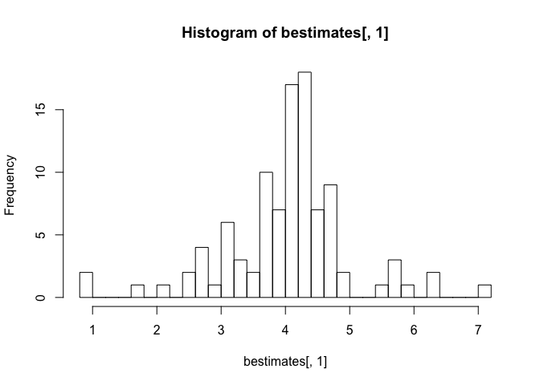
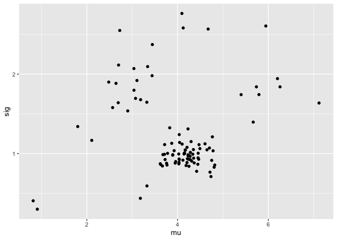
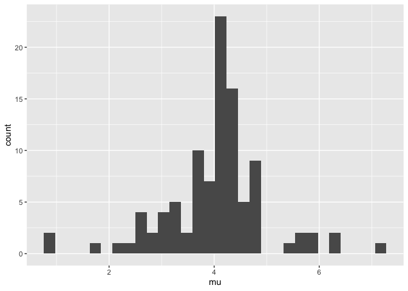
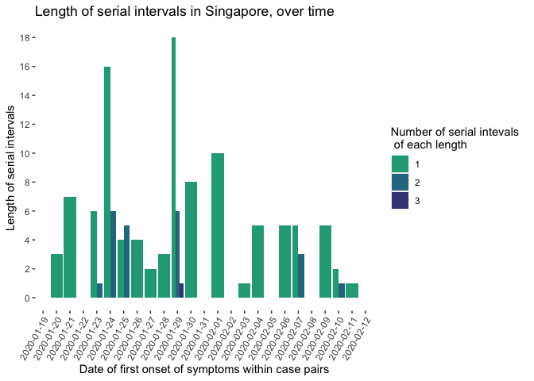
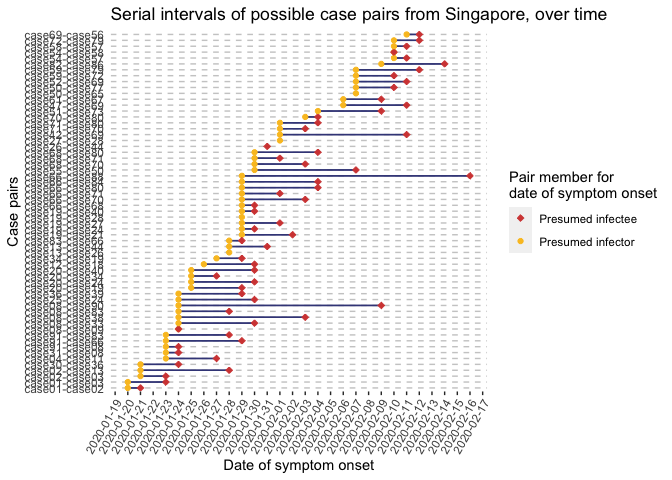
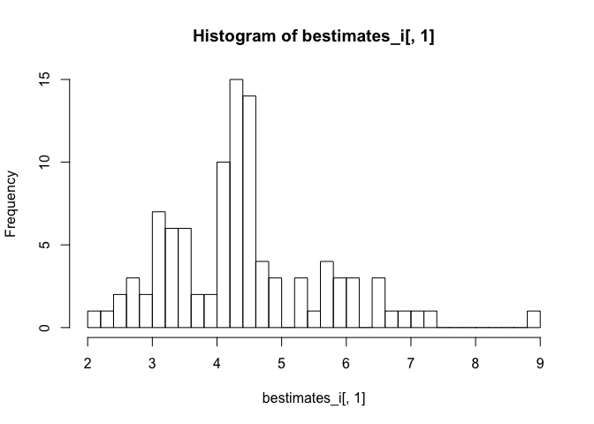
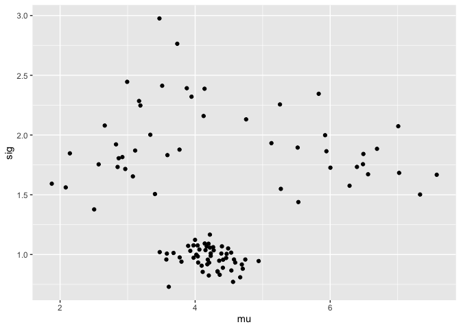
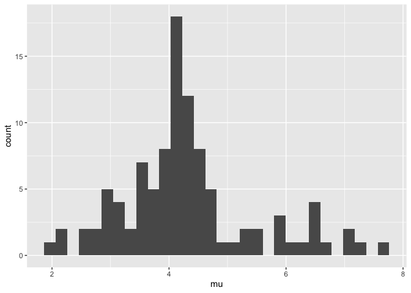

## Singapore data 
Thanks to EpiCoronaHack Cluster team. These data are manually entered from postings from the Government of Singapore website: [website](https://www.moh.gov.sg/covid-19). Data includes the 93 cases confirmed between Jan 19 to Feb 26, 2020. Date of symptom onset, close contacts and a few transmission clusters were identified for many of the Singapore cases.

Here we will upload and examine the data prior to analysis. 

```r
spdata <- read_csv("data/COVID-19_Singapore_formated_dates.csv")
```

```
## Parsed with column specification:
## cols(
##   .default = col_character(),
##   CaseID = col_double(),
##   age = col_double(),
##   presumed_infected_date = col_date(format = ""),
##   last_poss_exposure = col_date(format = ""),
##   symp_presumed_infector = col_date(format = ""),
##   date_onset_symptoms = col_date(format = ""),
##   date_quarantine = col_date(format = ""),
##   date_hospital = col_date(format = ""),
##   date_confirmation = col_date(format = ""),
##   date_discharge = col_date(format = "")
## )
```

```
## See spec(...) for full column specifications.
```

```r
# Ensure properly imported
glimpse(spdata)
```

```
## Observations: 93
## Variables: 23
## $ CaseID                 <dbl> 1, 2, 3, 4, 5, 6, 7, 8, 9, 10, 11, 12, 13, 14,…
## $ `Related cases`        <chr> "2,3", "1,3", "1,2", "11", NA, NA, NA, "9,83,9…
## $ `Cluster links`        <chr> NA, NA, NA, NA, NA, NA, NA, "9,31,33,38,83, 90…
## $ `Relationship notes`   <chr> NA, NA, "Son of 1", NA, NA, NA, NA, "Married t…
## $ Case                   <chr> "Case 1, 66M, Wuhan", "Case 2, 53F, Wuhan", "C…
## $ age                    <dbl> 66, 53, 37, 36, 56, 56, 35, 56, 56, 56, 31, 37…
## $ sex                    <chr> "M", "F", "M", "M", "F", "M", "M", "F", "M", "…
## $ country                <chr> "Singapore", "Singapore", "Singapore", "Singap…
## $ hospital               <chr> "Singapore General Hospital", "National Centre…
## $ presumed_infected_date <date> 2020-01-20, 2020-01-20, 2020-01-20, 2020-01-2…
## $ presumed_reason        <chr> "Arrived from Wuhan", "Arrived from Wuhan", "A…
## $ last_poss_exposure     <date> 2020-01-20, 2020-01-20, 2020-01-20, 2020-01-2…
## $ symp_presumed_infector <date> NA, NA, NA, NA, NA, NA, NA, NA, NA, NA, NA, N…
## $ date_onset_symptoms    <date> 2020-01-20, 2020-01-21, 2020-01-23, 2020-01-2…
## $ date_quarantine        <date> NA, NA, NA, NA, NA, NA, NA, NA, NA, NA, 2020-…
## $ date_hospital          <date> 2020-01-22, 2020-01-22, 2020-01-23, 2020-01-2…
## $ date_confirmation      <date> 2020-01-23, 2020-01-24, 2020-01-24, 2020-01-2…
## $ outcome                <chr> "Discharged", "Discharged", "Discharged", "Dis…
## $ date_discharge         <date> 2020-02-19, 2020-02-07, 2020-02-21, 2020-02-1…
## $ travel_history         <chr> "Wuhan", "Wuhan", "Wuhan", "Wuhan", "Wuhan", "…
## $ additional_information <chr> "Travelled with Case 3 (son) and M1 (wife) ;MO…
## $ cluster                <chr> "Wuhan", "Wuhan", "Wuhan", "Wuhan", "Wuhan", "…
## $ citizenship            <chr> "China", "China", "China", "China", "China", "…
```

```r
table(spdata$`Related cases`) # There is one cell with "\n", needs to be changed to 'NA'
```

```
## 
##                     \n                    1,2                    1,3 
##                      1                      1                      1 
##                     11                     12                     13 
##                      1                      1                      1 
##                  13,26                     18                     19 
##                      1                      1                      1 
##                  19,20               19,20,25                  19,27 
##                      2                      1                      1 
##                    2,3   20,21,24,27,28,34,40                     22 
##                      1                      1                      1 
##                     23                     24                  24,19 
##                      1                      1                      1 
##                  26, 2                  28,19                  30,39 
##                      1                      1                      1 
##                      4                     41            42,47,52,56 
##                      1                      1                      1 
##                     50                  50,55                     51 
##                      2                      1                      1 
##                  54,57                  54,58               55,65,77 
##                      1                      1                      1 
##                  57,58                 59, 79                     61 
##                      1                      1                      1 
##                     66     66, 68, 70, 71, 80         66, 68, 71, 80 
##                      3                      1                      1 
##         66, 70, 71, 80                 66, 83                     67 
##                      1                      1                      1 
## 68, 70, 71, 80, 83, 91                     72                  72,79 
##                      1                      1                      1 
##                     76                      8                     82 
##                      1                      1                      1 
##                     86    9,83,91,90,38,33,31                     91 
##                      1                      1                      1
```

```r
spdata$`Related cases`[which(spdata$`Related cases` == "\n")] <- NA

# Rename columns 2, 3 and 4 so no spaces
spdata <- rename(spdata, related_cases = starts_with("Related"),
                 cluster_links = "Cluster links",
                 relationship_notes = starts_with("Relation"))

# Make sure we are seeing the number of missing data we are expecting
colSums(is.na(spdata))
```

```
##                 CaseID          related_cases          cluster_links 
##                      0                     42                     88 
##     relationship_notes                   Case                    age 
##                     64                      0                      0 
##                    sex                country               hospital 
##                      0                      0                      0 
## presumed_infected_date        presumed_reason     last_poss_exposure 
##                     16                     16                     65 
## symp_presumed_infector    date_onset_symptoms        date_quarantine 
##                     42                     12                     80 
##          date_hospital      date_confirmation                outcome 
##                      0                      0                     31 
##         date_discharge         travel_history additional_information 
##                     31                      0                     55 
##                cluster            citizenship 
##                     23                      0
```

```r
# Make sure dates parsed properly
range(spdata$presumed_infected_date, na.rm = T)
```

```
## [1] "2020-01-18" "2020-02-10"
```

```r
range(spdata$last_poss_exposure, na.rm = T)
```

```
## [1] "2020-01-18" "2020-02-09"
```

```r
range(spdata$symp_presumed_infector, na.rm = T)
```

```
## [1] "2020-01-19" "2020-02-09"
```

```r
range(spdata$date_onset_symptoms, na.rm = T)
```

```
## [1] "2020-01-20" "2020-02-16"
```

```r
range(spdata$date_quarantine, na.rm = T)
```

```
## [1] "2020-01-26" "2020-02-15"
```

```r
range(spdata$date_hospital, na.rm = T)
```

```
## [1] "2020-01-22" "2020-02-25"
```

```r
range(spdata$date_confirmation, na.rm = T)
```

```
## [1] "2020-01-23" "2020-02-26"
```

```r
range(spdata$date_discharge, na.rm = T)
```

```
## [1] "2020-02-04" "2020-02-26"
```

```r
# Change symp_presumed_infector to Feb 10, 2020 (date of symptom onset from caseID 72, the presumed infector)
spdata$symp_presumed_infector[spdata$CaseID == 79] <- ymd("2020-02-10")
```

**Missing data and imputation**: We have 12 cases that are missing date of symptom onset. We will start the analysis by just removing these cases from the dataset; however, we will then repeat the analysis when imputing the data to determine the effect of removing these cases.

```r
# Keep a copy of the original dataset with missing data for imputation later
spdata_org <- spdata

# Remove all the cases that do not have info on date of symptom onset 
spdata <- filter(spdata, !is.na(date_onset_symptoms)) 
  # This removes 12 cases; we will examine the effect of imputing these values later on 
```

In order to determine ICC later, we need columns that define a window for possible start and end of exposure to the virus. To do this, we will define "start_source" and "end_source" columns as follows.

We estimate this directly from the stated start and end times for cases' exposure windows. These are explicitly listed for the Tianjin dataset but in Singapore they are approximated using contact tracing and the route by which a case was exposed. Because it is explicitly about the symptom onset, we removed those who don't have symptom onset defined. (But see effect of imputing those values later).   

**End_source column**:
If no estimated end time for the exposure is given, or if the end of the exposure time is after the time of symptom onset, set the last exposure time to the symptom onset time. This is because they must have been exposed before symptom onset. We use four ideas to set the end time for the exposure window: 

* 1: the end source is last possible exposure, if this is given 

* 2:  if it is not given, then we set the end of the exposure window to the time of symptoms of the presumed infector plus a noise term epsilon (eps)

* 3: and if neither the last possible expsure or the symptom time of the presumed infector are given, the last exposure time is set to the time of symptom onset. 

* 4 Finally, we do not let the last possible exposure time be later than the time of symptom onset 


```r
spdata$end_source = spdata$last_poss_exposure # 1 above 
(method1 <- sum(!is.na(spdata$end_source))) #20 cases can have date of last possible exposure provided by known end of exposure window
```

```
## [1] 20
```

```r
eps=4
hasPresInf = which(is.na(spdata$last_poss_exposure) & !(is.na(spdata$symp_presumed_infector))) # 2 above 
spdata$end_source[hasPresInf] = spdata$presumed_infected_date[hasPresInf]+eps
length(hasPresInf) #47 cases have date of last possible exposure estimated by method #2
```

```
## [1] 47
```

```r
hasNone = which(is.na(spdata$last_poss_exposure) & is.na(spdata$symp_presumed_infector)) # 3 above 
spdata$end_source[hasNone] = spdata$date_onset_symptoms[hasNone]
length(hasNone) #14 cases have date of last possible exposure estimated by method #3
```

```
## [1] 14
```

```r
spdata$end_source = pmin(spdata$end_source, spdata$date_onset_symptoms) # 4

rm(hasNone, hasPresInf, method1)
```

**Start_source column**: Model the start source by one of two methods:

* 1 if the time of presumed infector is given, use that - epsilon 

* If it is not given use symptom onset minus say 20 days, based on prior 
knowledge 


```r
spdata$start_source = spdata$presumed_infected_date - eps # 1
spdata$start_source[is.na(spdata$presumed_infected_date)] = spdata$date_onset_symptoms[is.na(spdata$presumed_infected_date)]-20
```


## Estimates of serial interval from Singapore data (without imputation)
The simplest serial interval estimate we can make with these data is a direct estimate based on the time of symptoms of the presumed infector, and the time of symptoms of the case. However, this does not account for the fact that the presumed infector is not necessarily the infector. There are missing intermediate cases (with reasonable probability), or two cases could both be infected by a third unknown case.  

```r
directSI = spdata$date_onset_symptoms - spdata$symp_presumed_infector
directSI = as.numeric(directSI[!is.na(directSI)])
mean(directSI)
```

```
## [1] 7.75
```

```r
sd(directSI)
```

```
## [1] 4.95
```

We will estimate the serial interval using the 'interval case to case' approach given in Vink et al (https://academic.oup.com/aje/article/180/9/865/2739204). 

The dataset has several instances where a putative infector or contact is known. These are listed in the 'related_cases' column. We first make a graph in which nodes are individuals and edges are present from cases listed as possible sources, to the cases for whom they are possible sources. 

```r
spnodes <- spdata$CaseID

## How to extract caseIDs from related_cases column - there are multiple values in some cells, separated by commas
  #The +1 is because the comma splits between 2 related caseIDs (i.e. related cases with only 1 entry will have no comma!) 
max(str_count(spdata$related_cases, pattern = ",") + 1, 
    na.rm = T) 
```

```
## [1] 7
```

```r
  #7 max within one cell

# Split into separate columns
spdata <- separate(spdata,
                      col = related_cases,
                      into = paste("contactID", 1:7, sep = "_"),
                      fill = "right")

# Turn into numeric values
spdata <- mutate(spdata, 
                    contactID_1 = as.numeric(contactID_1),
                    contactID_2 = as.numeric(contactID_2),
                    contactID_3 = as.numeric(contactID_3),
                    contactID_4 = as.numeric(contactID_4),
                    contactID_5 = as.numeric(contactID_5),
                    contactID_6 = as.numeric(contactID_6),
                    contactID_7 = as.numeric(contactID_7))

# Select down to columns of interest
spedges <- select(spdata, c(CaseID, starts_with("contactID")))

# Remove rows with NAs for at least one contact
spedges <- filter(spedges, !is.na(spedges$contactID_1)) #43 CasesIDs with 1 or more possible contacts
```

Both visNetwork and igraph require an edge list with "from" and "to" nodes. So for each row of spedges we create entries like these.

```r
singedges = data.frame(from=2,to=1) 
for (n in 1:nrow(spedges)) {
 for (k in 2:ncol(spedges)) { 
   if (!is.na(spedges[n,k])) {
     singedges=rbind(singedges, c(spedges[[n,k]],spedges[[n,1]])) 
   }  
   }
}
singedges=singedges[-1,]
# create undirected graph by removing duplicates
undir=data.frame(from = pmin(singedges[,1],singedges[,2]),  
                 to = pmax(singedges[,1], singedges[,2]))
undir = unique(undir)
undir = undir[-which(undir[,1]==undir[,2]),]
#fedges = data.frame(from=paste("case",undir[,1],sep=""), 
#               to=paste("case",undir[,2],sep=""))
```

As relationships in the 'related_cases' column were not directional, we need to make sure the cases labelled as "from" (aka the infectors) actually got the virus prior to those in the "to" column (aka the infectees). It is reasonable to assume that cases that were infected first will show signs of infection first, so within case-pairs we will assign the case with the earliest date of symptom onset as the "from" (infector) case and the case with the later date of symptom onset as "to".

To do this, let's start by making a new dataset from our case pairs ('undir') that contains date of symptom onset for each case. We will make a few new columns, both for determining which case has the earliest date of symptom onset, as well as to plot serial intervals over time later on. 

```r
# Make a smaller dataset of original spdata that contains only the CaseID and date of symptom onset
spdata_sympt <- select(spdata_org, CaseID, date_onset_symptoms)

# Add the date of symptom onset -for the caseID of the 'from' case - to the case pairs dataset (undir)
  #Do some renaming so the join is based on the caseID in the from column and that name of date column reflects this
names(spdata_sympt) <- str_replace(names(spdata_sympt), "CaseID", "from")
undir_dates <- left_join(undir, spdata_sympt, by = "from")
names(undir_dates) <- str_replace(names(undir_dates), "date_onset_symptoms", "from_sympt_date")

# Repeat, but add the date of symptom onset for the caseID of the 'to' case
names(spdata_sympt) <- str_replace(names(spdata_sympt), "from", "to")
undir_dates <- left_join(undir_dates, spdata_sympt, by = "to")
names(undir_dates) <- str_replace(names(undir_dates), "date_onset_symptoms", "to_sympt_date")

# Now add some extra columns which give us the raw serial interval (i.e. number of days between symptom onset in infector-infectee pairs)
  #As well as the absolute value of the serial interval (as some cases in the "from" and "to" columns should be switched around!)
  #And finally a 'direction' column in case we need to sort out which directions the arrows should be going in for a network graph and where we have missing dates
undir_dates <- mutate(undir_dates, earliest_sympt_onset = pmin(to_sympt_date, from_sympt_date, na.rm = T), 
                                   raw_serial_interval = to_sympt_date - from_sympt_date,   #5 NAs because only 1 case in the pair has a date of symptom onset
                                   abs_serial_interval = abs(raw_serial_interval))
```

Now we need to split the dataset apart so that we can switch around the directionality of presumed transmission for case-pairs where the serial interval is negative. Easiest way to do this is to rename columns and then join back to the other parts of the dataset, based on the column names.

```r
# Split dataset into positive (or 0) serial interval vs. negative vs. NA 
  #A negative serial interval means our "to" and "from" cases are mixed up
pos <- filter(undir_dates, raw_serial_interval >= 0)
neg <- filter(undir_dates, raw_serial_interval < 0)
onlyone <- filter(undir_dates, is.na(raw_serial_interval))

# Negative dataset needs the column headers changed to reflect that the 'from' and 'to' columns are backwards
  #as we are assuming that the 'case with the earliest onset of symptoms would have been infected first, 
  #and passed on the infection to the other case in the pair
names(neg)
```

```
## [1] "from"                 "to"                   "from_sympt_date"     
## [4] "to_sympt_date"        "earliest_sympt_onset" "raw_serial_interval" 
## [7] "abs_serial_interval"
```

```r
names(neg)[1] <- "to"
names(neg)[2] <- "from"
names(neg)[3] <- "to_sympt_date"
names(neg)[4] <- "from_sympt_date"
names(neg)
```

```
## [1] "to"                   "from"                 "to_sympt_date"       
## [4] "from_sympt_date"      "earliest_sympt_onset" "raw_serial_interval" 
## [7] "abs_serial_interval"
```

```r
# Now bind the rows of the seperated datasets back together based on column names
  #Must use dplyr::bind_rows to bind based on column name rather than position
undir_dates <- bind_rows(pos, neg, onlyone)

# For plotting - Add a column with padded to and from caseID numbers so they print in numerical order
  #Add a zero on the left of the number so all numbers have two digits  
undir_dates$pto <- str_pad(undir_dates$to, width = 2, side = "left", pad = "0")
undir_dates$pfrom <- str_pad(undir_dates$from, width = 2, side = "left", pad = "0")

# For plotting - Make a new column with case pair ID
undir_dates <- mutate(undir_dates, pairID = factor(paste("case", pfrom, "-", "case", pto, sep = "")))

rm(pos, neg, onlyone)
```

From this edge list we can use visNetwork to visualise the graph. Make 'group' based on source of probably infection. Colours are from the infection source column (but we could have a better colour scheme, like date of symptom onset). 

```r
# Turn 'presumed_reason' into lower case and get trim any whitespace so don't have issues with case sensitivity, etc
spdata$presumed_reason <- str_to_lower(spdata$presumed_reason)
spdata$presumed_reason <- str_trim(spdata$presumed_reason)
table(spdata$presumed_reason)
```

```
## 
##                                                    arrived from wuhan 
##                                                                     3 
##                                     arrived from wuhan (asymptomatic) 
##                                                                    13 
## asymptomatic but detected a fever during medical screening at airport 
##                                                                     1 
##                                                 grace assembly of god 
##                                                                    22 
##                                                 grand hyatt singapore 
##                                                                     3 
##                                                           life church 
##                                                                     6 
##                                             seletar aerospace heights 
##                                                                     5 
##                                 via 13, 26 (date of 13 symptom onset) 
##                                                                     1 
##                                     via 50 (date of 50 symptom onset) 
##                                                                     1 
##                                     via 59 (date of 59 symptom onset) 
##                                                                     1 
##                              via 72 via 59 (date of 72 symptom onset) 
##                                                                     1 
##                                     via 82 (date of 82 symptom onset) 
##                                                                     1 
##                                     via 83,91 at chinese ny gathering 
##                                                                     1 
##                                                        yong thai hang 
##                                                                     8
```

```r
sum(is.na(spdata$presumed_reason)) #15 NAs
```

```
## [1] 14
```

```r
# Make a new column where we group the 'presumed_reason' under a label (known relationship, gathering, wuhan travel) for each of the above three groups
spdata <- mutate(spdata, presumed_reason_group = case_when(!is.na(str_match(presumed_reason, "wuhan|airport")) ~ "Wuhan travel", 
                          #'airport' case (CaseID 17) does not have 'wuhan' in reason but does have it under 'Case' column that they are from Wuhan
                                                           !is.na(str_match(presumed_reason, "symptom onset|via")) ~ "Known relationship",
                                                           !is.na(str_match(presumed_reason, "grace")) ~ "Grace Assembly of God",
                                                           !is.na(str_match(presumed_reason, "grand")) ~ "Grand Hyatt Singapore",
                                                           !is.na(str_match(presumed_reason, "life")) ~ "Life Church",
                                                           !is.na(str_match(presumed_reason, "seletar")) ~ "Seletar Aerospace Heights",
                                                           !is.na(str_match(presumed_reason, "yong")) ~ "Yong Thai Hang",
                                                           is.na(presumed_reason) ~ "Unknown",
                                                           TRUE ~ "other")) #should not be any other, so is just a double check this has run correctly, especially as dataset grows
table(spdata$presumed_reason_group)
```

```
## 
##     Grace Assembly of God     Grand Hyatt Singapore        Known relationship 
##                        22                         3                         6 
##               Life Church Seletar Aerospace Heights                   Unknown 
##                         6                         5                        14 
##              Wuhan travel            Yong Thai Hang 
##                        17                         8
```

We also need to make a data frame of the edges (indicating direction of probable transmission) and nodes (the cases).

```r
# Make data frame of edges
fedges <- select(undir_dates, from, to)
fedges = data.frame(from = paste("case", fedges[ ,1], sep=""), 
                     to = paste("case", fedges[ ,2], sep=""))
fedges$arrows <- "to"  

# Make data frame of nodes
nodes.df <- data.frame(id=paste("case",spdata$CaseID,sep=""), label=spdata$CaseID, group=spdata$presumed_reason_group)
glimpse(nodes.df)
```

```
## Observations: 81
## Variables: 3
## $ id    <fct> case1, case2, case3, case4, case5, case6, case7, case8, case9, …
## $ label <dbl> 1, 2, 3, 4, 5, 6, 7, 8, 9, 10, 11, 12, 13, 14, 16, 17, 18, 19, …
## $ group <fct> Wuhan travel, Wuhan travel, Wuhan travel, Wuhan travel, Wuhan t…
```

```r
spdata$graphID = paste("case",spdata$CaseID,sep="")
visNetwork(nodes.df, fedges) %>% visLegend() 
```

<!--html_preserve--><div id="htmlwidget-51098584d74b8c0b22d4" style="width:672px;height:480px;" class="visNetwork html-widget"></div>
<script type="application/json" data-for="htmlwidget-51098584d74b8c0b22d4">{"x":{"nodes":{"id":["case1","case2","case3","case4","case5","case6","case7","case8","case9","case10","case11","case12","case13","case14","case16","case17","case18","case19","case20","case21","case24","case25","case27","case29","case30","case31","case32","case33","case34","case35","case36","case37","case38","case39","case40","case41","case42","case43","case44","case46","case47","case48","case49","case50","case51","case52","case53","case54","case55","case56","case57","case58","case59","case60","case61","case62","case63","case64","case66","case67","case68","case69","case70","case71","case72","case73","case74","case77","case78","case79","case80","case81","case82","case83","case84","case85","case86","case88","case89","case90","case91"],"label":[1,2,3,4,5,6,7,8,9,10,11,12,13,14,16,17,18,19,20,21,24,25,27,29,30,31,32,33,34,35,36,37,38,39,40,41,42,43,44,46,47,48,49,50,51,52,53,54,55,56,57,58,59,60,61,62,63,64,66,67,68,69,70,71,72,73,74,77,78,79,80,81,82,83,84,85,86,88,89,90,91],"group":["Wuhan travel","Wuhan travel","Wuhan travel","Wuhan travel","Wuhan travel","Wuhan travel","Wuhan travel","Wuhan travel","Wuhan travel","Wuhan travel","Wuhan travel","Wuhan travel","Wuhan travel","Wuhan travel","Wuhan travel","Wuhan travel","Wuhan travel","Yong Thai Hang","Yong Thai Hang","Yong Thai Hang","Yong Thai Hang","Yong Thai Hang","Yong Thai Hang","Unknown","Grand Hyatt Singapore","Life Church","Unknown","Life Church","Yong Thai Hang","Unknown","Grand Hyatt Singapore","Unknown","Life Church","Grand Hyatt Singapore","Yong Thai Hang","Unknown","Seletar Aerospace Heights","Unknown","Known relationship","Unknown","Seletar Aerospace Heights","Grace Assembly of God","Grace Assembly of God","Unknown","Grace Assembly of God","Seletar Aerospace Heights","Grace Assembly of God","Grace Assembly of God","Unknown","Seletar Aerospace Heights","Grace Assembly of God","Grace Assembly of God","Unknown","Grace Assembly of God","Grace Assembly of God","Grace Assembly of God","Grace Assembly of God","Unknown","Known relationship","Grace Assembly of God","Grace Assembly of God","Seletar Aerospace Heights","Grace Assembly of God","Grace Assembly of God","Known relationship","Grace Assembly of God","Grace Assembly of God","Known relationship","Grace Assembly of God","Known relationship","Grace Assembly of God","Grace Assembly of God","Unknown","Life Church","Grace Assembly of God","Unknown","Known relationship","Grace Assembly of God","Unknown","Life Church","Life Church"]},"edges":{"from":["case1","case1","case2","case4","case8","case8","case8","case8","case8","case12","case2","case19","case19","case19","case19","case20","case20","case30","case36","case20","case13","case50","case54","case54","case59","case59","case61","case66","case66","case66","case66","case68","case68","case68","case42","case47","case52","case70","case71","case72","case51","case82","case66","case66","case91","case31","case20","case34","case25","case55","case58","case83","case91","case69","case71","case91","case13","case19","case27","case26","case50"],"to":["case2","case3","case3","case11","case9","case83","case90","case38","case33","case18","case13","case21","case24","case27","case40","case24","case34","case36","case39","case40","case44","case77","case57","case58","case72","case79","case67","case68","case70","case71","case80","case70","case71","case80","case69","case69","case69","case80","case80","case79","case73","case86","case84","case88","case8","case8","case19","case19","case24","case50","case57","case66","case66","case56","case70","case83","case26","case28","case28","case44","case65"],"arrows":["to","to","to","to","to","to","to","to","to","to","to","to","to","to","to","to","to","to","to","to","to","to","to","to","to","to","to","to","to","to","to","to","to","to","to","to","to","to","to","to","to","to","to","to","to","to","to","to","to","to","to","to","to","to","to","to","to","to","to","to","to"]},"nodesToDataframe":true,"edgesToDataframe":true,"options":{"width":"100%","height":"100%","nodes":{"shape":"dot"},"manipulation":{"enabled":false}},"groups":["Wuhan travel","Yong Thai Hang","Unknown","Grand Hyatt Singapore","Life Church","Seletar Aerospace Heights","Known relationship","Grace Assembly of God"],"width":null,"height":null,"idselection":{"enabled":false},"byselection":{"enabled":false},"main":null,"submain":null,"footer":null,"background":"rgba(0, 0, 0, 0)","legend":{"width":0.2,"useGroups":true,"position":"left","ncol":1,"stepX":100,"stepY":100,"zoom":true}},"evals":[],"jsHooks":[]}</script><!--/html_preserve-->

Now we estimate the serial interval using the ICC method; for this we first construct a graph. The "interval case to case" data are from identifying a putative first infector each small cluster in the graph, and finding the times between symptom onset in the first observed case and the others. See Vink et al. 

```r
sgraph = graph_from_edgelist(as.matrix(fedges[,1:2]), directed = FALSE)
ccs = components(sgraph)
ccs
```

```
## $membership
##  case1  case2  case3  case4 case11  case8  case9 case83 case90 case38 case33 
##      1      1      1      2      2      3      3      3      3      3      3 
## case12 case18 case13 case19 case21 case24 case27 case40 case20 case34 case30 
##      4      4      1      5      5      5      5      5      5      5      6 
## case36 case39 case44 case50 case77 case54 case57 case58 case59 case72 case79 
##      6      6      1      7      7      8      8      8      9      9      9 
## case61 case67 case66 case68 case70 case71 case80 case42 case69 case47 case52 
##     10     10      3      3      3      3      3     11     11     11     11 
## case51 case73 case82 case86 case84 case88 case91 case31 case25 case55 case56 
##     12     12     13     13      3      3      3      3      5      7     11 
## case26 case28 case65 
##      1      5      7 
## 
## $csize
##  [1]  6  2 15  2  9  3  4  3  3  2  5  2  2
## 
## $no
## [1] 13
```

```r
spdata$component=vapply(spdata$graphID, function(x)
  { if (x %in% names(ccs$membership)) { return(ccs$membership[match(x, names(ccs$membership))])
  } else { 
    return(NA)}}, FUN.VALUE = 3)
```

Now knowing the components of the graph I can extract the ICC intervals. 
I did this in a few ways (commented out lines): taking the first case for each cluster to be the first reported symptoms (I get a 5 day serial interval); the first start exposure time (now there are negative ICCs so I get a 4.5 day serial interval) and the latest end exposure time.

Extract ICC interval data: a function 

```r
getICCs <- function(thisdata, ccs, K, orderby= "onset" ) {
  iccs=1
for (n in 1:max(ccs$membership)) {
  mycases  = which(thisdata$component==n)
  if (orderby == "onset")
  {  myonsets = sort(thisdata$date_onset_symptoms[mycases])[1:min(K, length(mycases))]}
  if (orderby == "exposure") {
 myonsets =thisdata$date_onset_symptoms[mycases][order(thisdata$end_source[mycases])][1:min(K,length(mycases))]
 # myonsets =  spdata$date_onset_symptoms[mycases[order(spdata$start_source[mycases])]] # alternative also ORDERS by earliest exposure 
 
 }
  iccs =c(iccs, myonsets[-1]-myonsets[1])
}
  return(iccs[-1]) 
  }
```


```r
icc3 = getICCs(spdata,ccs,3)
icc4 = getICCs(spdata,ccs,4)
icc5 = getICCs(spdata,ccs,5)
icc6 = getICCs(spdata,ccs,6)
icc_expose = getICCs(spdata, ccs, 4, orderby ="exposure")
```


```r
source("TianjinSI_VinkWallinga_CC.R")

myest3 = serial_mix_est(data=icc3, N=100, startmu=10, startsig =4)
```

```
## [1] 5.98 2.92
## [1] 4.63 2.35
## [1] 4.07 1.96
## [1] 3.84 1.70
## [1] 3.76 1.53
## [1] 3.77 1.41
## [1] 3.81 1.31
## [1] 3.88 1.22
## [1] 3.93 1.15
## [1] 3.98 1.11
## [1] 4.00 1.08
## [1] 4.02 1.07
## [1] 4.02 1.06
## [1] 4.03 1.06
## [1] 4.03 1.06
## [1] 4.03 1.06
## [1] 4.03 1.06
## [1] 4.03 1.06
## [1] 4.03 1.06
## [1] 4.03 1.06
## [1] 4.03 1.06
## [1] 4.03 1.06
## [1] 4.03 1.06
## [1] 4.03 1.06
## [1] 4.03 1.06
## [1] 4.03 1.06
## [1] 4.03 1.06
## [1] 4.03 1.06
## [1] 4.03 1.06
## [1] 4.03 1.06
## [1] 4.03 1.06
## [1] 4.03 1.06
## [1] 4.03 1.06
## [1] 4.03 1.06
## [1] 4.03 1.06
## [1] 4.03 1.06
## [1] 4.03 1.06
## [1] 4.03 1.06
## [1] 4.03 1.06
## [1] 4.03 1.06
## [1] 4.03 1.06
## [1] 4.03 1.06
## [1] 4.03 1.06
## [1] 4.03 1.06
## [1] 4.03 1.06
## [1] 4.03 1.06
## [1] 4.03 1.06
## [1] 4.03 1.06
## [1] 4.03 1.06
## [1] 4.03 1.06
## [1] 4.03 1.06
## [1] 4.03 1.06
## [1] 4.03 1.06
## [1] 4.03 1.06
## [1] 4.03 1.06
## [1] 4.03 1.06
## [1] 4.03 1.06
## [1] 4.03 1.06
## [1] 4.03 1.06
## [1] 4.03 1.06
## [1] 4.03 1.06
## [1] 4.03 1.06
## [1] 4.03 1.06
## [1] 4.03 1.06
## [1] 4.03 1.06
## [1] 4.03 1.06
## [1] 4.03 1.06
## [1] 4.03 1.06
## [1] 4.03 1.06
## [1] 4.03 1.06
## [1] 4.03 1.06
## [1] 4.03 1.06
## [1] 4.03 1.06
## [1] 4.03 1.06
## [1] 4.03 1.06
## [1] 4.03 1.06
## [1] 4.03 1.06
## [1] 4.03 1.06
## [1] 4.03 1.06
## [1] 4.03 1.06
## [1] 4.03 1.06
## [1] 4.03 1.06
## [1] 4.03 1.06
## [1] 4.03 1.06
## [1] 4.03 1.06
## [1] 4.03 1.06
## [1] 4.03 1.06
## [1] 4.03 1.06
## [1] 4.03 1.06
## [1] 4.03 1.06
## [1] 4.03 1.06
## [1] 4.03 1.06
## [1] 4.03 1.06
## [1] 4.03 1.06
## [1] 4.03 1.06
## [1] 4.03 1.06
## [1] 4.03 1.06
## [1] 4.03 1.06
## [1] 4.03 1.06
## [1] 4.03 1.06
```

```r
myest4 = serial_mix_est(data=icc4, N=100, startmu=10, startsig =4)
```

```
## [1] 6.48 2.91
## [1] 5.32 2.57
## [1] 4.66 2.30
## [1] 4.28 2.06
## [1] 4.05 1.87
## [1] 3.93 1.72
## [1] 3.88 1.59
## [1] 3.88 1.48
## [1] 3.92 1.39
## [1] 3.98 1.30
## [1] 4.04 1.21
## [1] 4.10 1.14
## [1] 4.13 1.10
## [1] 4.15 1.07
## [1] 4.16 1.06
## [1] 4.16 1.06
## [1] 4.16 1.06
## [1] 4.17 1.06
## [1] 4.17 1.06
## [1] 4.17 1.06
## [1] 4.17 1.06
## [1] 4.17 1.06
## [1] 4.17 1.06
## [1] 4.17 1.06
## [1] 4.17 1.06
## [1] 4.17 1.06
## [1] 4.17 1.06
## [1] 4.17 1.06
## [1] 4.17 1.06
## [1] 4.17 1.06
## [1] 4.17 1.06
## [1] 4.17 1.06
## [1] 4.17 1.06
## [1] 4.17 1.06
## [1] 4.17 1.06
## [1] 4.17 1.06
## [1] 4.17 1.06
## [1] 4.17 1.06
## [1] 4.17 1.06
## [1] 4.17 1.06
## [1] 4.17 1.06
## [1] 4.17 1.06
## [1] 4.17 1.06
## [1] 4.17 1.06
## [1] 4.17 1.06
## [1] 4.17 1.06
## [1] 4.17 1.06
## [1] 4.17 1.06
## [1] 4.17 1.06
## [1] 4.17 1.06
## [1] 4.17 1.06
## [1] 4.17 1.06
## [1] 4.17 1.06
## [1] 4.17 1.06
## [1] 4.17 1.06
## [1] 4.17 1.06
## [1] 4.17 1.06
## [1] 4.17 1.06
## [1] 4.17 1.06
## [1] 4.17 1.06
## [1] 4.17 1.06
## [1] 4.17 1.06
## [1] 4.17 1.06
## [1] 4.17 1.06
## [1] 4.17 1.06
## [1] 4.17 1.06
## [1] 4.17 1.06
## [1] 4.17 1.06
## [1] 4.17 1.06
## [1] 4.17 1.06
## [1] 4.17 1.06
## [1] 4.17 1.06
## [1] 4.17 1.06
## [1] 4.17 1.06
## [1] 4.17 1.06
## [1] 4.17 1.06
## [1] 4.17 1.06
## [1] 4.17 1.06
## [1] 4.17 1.06
## [1] 4.17 1.06
## [1] 4.17 1.06
## [1] 4.17 1.06
## [1] 4.17 1.06
## [1] 4.17 1.06
## [1] 4.17 1.06
## [1] 4.17 1.06
## [1] 4.17 1.06
## [1] 4.17 1.06
## [1] 4.17 1.06
## [1] 4.17 1.06
## [1] 4.17 1.06
## [1] 4.17 1.06
## [1] 4.17 1.06
## [1] 4.17 1.06
## [1] 4.17 1.06
## [1] 4.17 1.06
## [1] 4.17 1.06
## [1] 4.17 1.06
## [1] 4.17 1.06
## [1] 4.17 1.06
```

```r
myest5 = serial_mix_est(data=icc5, N=100, startmu=10, startsig =4)
```

```
## [1] 7.11 3.07
## [1] 6.04 2.82
## [1] 5.34 2.58
## [1] 4.88 2.32
## [1] 4.59 2.06
## [1] 4.43 1.84
## [1] 4.36 1.65
## [1] 4.35 1.48
## [1] 4.38 1.33
## [1] 4.41 1.21
## [1] 4.43 1.14
## [1] 4.44 1.10
## [1] 4.44 1.09
## [1] 4.43 1.09
## [1] 4.43 1.09
## [1] 4.43 1.09
## [1] 4.43 1.09
## [1] 4.43 1.09
## [1] 4.43 1.09
## [1] 4.43 1.09
## [1] 4.43 1.09
## [1] 4.43 1.09
## [1] 4.43 1.09
## [1] 4.43 1.09
## [1] 4.43 1.09
## [1] 4.43 1.09
## [1] 4.43 1.09
## [1] 4.43 1.09
## [1] 4.43 1.09
## [1] 4.43 1.09
## [1] 4.43 1.09
## [1] 4.43 1.09
## [1] 4.43 1.09
## [1] 4.43 1.09
## [1] 4.43 1.09
## [1] 4.43 1.09
## [1] 4.43 1.09
## [1] 4.43 1.09
## [1] 4.43 1.09
## [1] 4.43 1.09
## [1] 4.43 1.09
## [1] 4.43 1.09
## [1] 4.43 1.09
## [1] 4.43 1.09
## [1] 4.43 1.09
## [1] 4.43 1.09
## [1] 4.43 1.09
## [1] 4.43 1.09
## [1] 4.43 1.09
## [1] 4.43 1.09
## [1] 4.43 1.09
## [1] 4.43 1.09
## [1] 4.43 1.09
## [1] 4.43 1.09
## [1] 4.43 1.09
## [1] 4.43 1.09
## [1] 4.43 1.09
## [1] 4.43 1.09
## [1] 4.43 1.09
## [1] 4.43 1.09
## [1] 4.43 1.09
## [1] 4.43 1.09
## [1] 4.43 1.09
## [1] 4.43 1.09
## [1] 4.43 1.09
## [1] 4.43 1.09
## [1] 4.43 1.09
## [1] 4.43 1.09
## [1] 4.43 1.09
## [1] 4.43 1.09
## [1] 4.43 1.09
## [1] 4.43 1.09
## [1] 4.43 1.09
## [1] 4.43 1.09
## [1] 4.43 1.09
## [1] 4.43 1.09
## [1] 4.43 1.09
## [1] 4.43 1.09
## [1] 4.43 1.09
## [1] 4.43 1.09
## [1] 4.43 1.09
## [1] 4.43 1.09
## [1] 4.43 1.09
## [1] 4.43 1.09
## [1] 4.43 1.09
## [1] 4.43 1.09
## [1] 4.43 1.09
## [1] 4.43 1.09
## [1] 4.43 1.09
## [1] 4.43 1.09
## [1] 4.43 1.09
## [1] 4.43 1.09
## [1] 4.43 1.09
## [1] 4.43 1.09
## [1] 4.43 1.09
## [1] 4.43 1.09
## [1] 4.43 1.09
## [1] 4.43 1.09
## [1] 4.43 1.09
## [1] 4.43 1.09
```

```r
myest6 = serial_mix_est(data=icc6, N=100, startmu=10, startsig =4)
```

```
## [1] 7.02 2.94
## [1] 6.03 2.61
## [1] 5.45 2.31
## [1] 5.10 2.02
## [1] 4.93 1.76
## [1] 4.86 1.55
## [1] 4.84 1.38
## [1] 4.83 1.27
## [1] 4.81 1.21
## [1] 4.79 1.18
## [1] 4.78 1.16
## [1] 4.77 1.16
## [1] 4.76 1.16
## [1] 4.76 1.16
## [1] 4.76 1.15
## [1] 4.76 1.15
## [1] 4.76 1.15
## [1] 4.76 1.15
## [1] 4.76 1.15
## [1] 4.76 1.15
## [1] 4.76 1.15
## [1] 4.76 1.15
## [1] 4.76 1.15
## [1] 4.76 1.15
## [1] 4.76 1.15
## [1] 4.76 1.15
## [1] 4.76 1.15
## [1] 4.76 1.15
## [1] 4.76 1.15
## [1] 4.76 1.15
## [1] 4.76 1.15
## [1] 4.76 1.15
## [1] 4.76 1.15
## [1] 4.76 1.15
## [1] 4.76 1.15
## [1] 4.76 1.15
## [1] 4.76 1.15
## [1] 4.76 1.15
## [1] 4.76 1.15
## [1] 4.76 1.15
## [1] 4.76 1.15
## [1] 4.76 1.15
## [1] 4.76 1.15
## [1] 4.76 1.15
## [1] 4.76 1.15
## [1] 4.76 1.15
## [1] 4.76 1.15
## [1] 4.76 1.15
## [1] 4.76 1.15
## [1] 4.76 1.15
## [1] 4.76 1.15
## [1] 4.76 1.15
## [1] 4.76 1.15
## [1] 4.76 1.15
## [1] 4.76 1.15
## [1] 4.76 1.15
## [1] 4.76 1.15
## [1] 4.76 1.15
## [1] 4.76 1.15
## [1] 4.76 1.15
## [1] 4.76 1.15
## [1] 4.76 1.15
## [1] 4.76 1.15
## [1] 4.76 1.15
## [1] 4.76 1.15
## [1] 4.76 1.15
## [1] 4.76 1.15
## [1] 4.76 1.15
## [1] 4.76 1.15
## [1] 4.76 1.15
## [1] 4.76 1.15
## [1] 4.76 1.15
## [1] 4.76 1.15
## [1] 4.76 1.15
## [1] 4.76 1.15
## [1] 4.76 1.15
## [1] 4.76 1.15
## [1] 4.76 1.15
## [1] 4.76 1.15
## [1] 4.76 1.15
## [1] 4.76 1.15
## [1] 4.76 1.15
## [1] 4.76 1.15
## [1] 4.76 1.15
## [1] 4.76 1.15
## [1] 4.76 1.15
## [1] 4.76 1.15
## [1] 4.76 1.15
## [1] 4.76 1.15
## [1] 4.76 1.15
## [1] 4.76 1.15
## [1] 4.76 1.15
## [1] 4.76 1.15
## [1] 4.76 1.15
## [1] 4.76 1.15
## [1] 4.76 1.15
## [1] 4.76 1.15
## [1] 4.76 1.15
## [1] 4.76 1.15
## [1] 4.76 1.15
```

```r
myest_exp= serial_mix_est(data=icc_expose, N=100, startmu=10, startsig =4)
```

```
## [1] 6.53 3.22
## [1] 5.29 2.80
## [1] 4.70 2.49
## [1] 4.40 2.25
## [1] 4.25 2.08
## [1] 4.18 1.96
## [1] 4.15 1.85
## [1] 4.15 1.76
## [1] 4.17 1.68
## [1] 4.2 1.6
## [1] 4.23 1.52
## [1] 4.27 1.44
## [1] 4.30 1.37
## [1] 4.32 1.32
## [1] 4.34 1.27
## [1] 4.35 1.24
## [1] 4.36 1.23
## [1] 4.36 1.21
## [1] 4.36 1.21
## [1] 4.36 1.21
## [1] 4.36 1.20
## [1] 4.36 1.20
## [1] 4.36 1.20
## [1] 4.36 1.20
## [1] 4.36 1.20
## [1] 4.36 1.20
## [1] 4.36 1.20
## [1] 4.36 1.20
## [1] 4.36 1.20
## [1] 4.36 1.20
## [1] 4.36 1.20
## [1] 4.36 1.20
## [1] 4.36 1.20
## [1] 4.36 1.20
## [1] 4.36 1.20
## [1] 4.36 1.20
## [1] 4.36 1.20
## [1] 4.36 1.20
## [1] 4.36 1.20
## [1] 4.36 1.20
## [1] 4.36 1.20
## [1] 4.36 1.20
## [1] 4.36 1.20
## [1] 4.36 1.20
## [1] 4.36 1.20
## [1] 4.36 1.20
## [1] 4.36 1.20
## [1] 4.36 1.20
## [1] 4.36 1.20
## [1] 4.36 1.20
## [1] 4.36 1.20
## [1] 4.36 1.20
## [1] 4.36 1.20
## [1] 4.36 1.20
## [1] 4.36 1.20
## [1] 4.36 1.20
## [1] 4.36 1.20
## [1] 4.36 1.20
## [1] 4.36 1.20
## [1] 4.36 1.20
## [1] 4.36 1.20
## [1] 4.36 1.20
## [1] 4.36 1.20
## [1] 4.36 1.20
## [1] 4.36 1.20
## [1] 4.36 1.20
## [1] 4.36 1.20
## [1] 4.36 1.20
## [1] 4.36 1.20
## [1] 4.36 1.20
## [1] 4.36 1.20
## [1] 4.36 1.20
## [1] 4.36 1.20
## [1] 4.36 1.20
## [1] 4.36 1.20
## [1] 4.36 1.20
## [1] 4.36 1.20
## [1] 4.36 1.20
## [1] 4.36 1.20
## [1] 4.36 1.20
## [1] 4.36 1.20
## [1] 4.36 1.20
## [1] 4.36 1.20
## [1] 4.36 1.20
## [1] 4.36 1.20
## [1] 4.36 1.20
## [1] 4.36 1.20
## [1] 4.36 1.20
## [1] 4.36 1.20
## [1] 4.36 1.20
## [1] 4.36 1.20
## [1] 4.36 1.20
## [1] 4.36 1.20
## [1] 4.36 1.20
## [1] 4.36 1.20
## [1] 4.36 1.20
## [1] 4.36 1.20
## [1] 4.36 1.20
## [1] 4.36 1.20
## [1] 4.36 1.20
```

```r
mm=rbind(myest3, myest4, myest5,myest6, myest_exp)
colnames(mm)=c("mu","sig")
mm=as.data.frame(mm)
mm$NumCasesPerCluster=c( 3,4, 5, 6, 4) 
mm$ordering = c("Onset","Onset","Onset","Onset","LastExposure")
print(mm[,c(4,3,1,2)]) 
```

```
##               ordering NumCasesPerCluster   mu  sig
## myest3           Onset                  3 4.03 1.06
## myest4           Onset                  4 4.17 1.06
## myest5           Onset                  5 4.43 1.09
## myest6           Onset                  6 4.76 1.15
## myest_exp LastExposure                  4 4.36 1.20
```


```r
days = seq(from=0, to=10, by=0.1) 
 sp.density= dnorm(days, mean = myest4[1], sd = myest4[2])
ggplot(data=data.frame(days=days, density=sp.density), aes(x=days,y=density)) + geom_line() + ggtitle("ICC estimate of the Singapore cluster serial interval")
#ggsave(file="final_figures/sing_serialint.pdf", height = 4, width = 6)
```

I note that the serial interval gets longer if we include more cases per cluster (because the mixture of 4 pathways in Vink et al does not include longer transmission chains, which forces the assumption that everyone in the cluster was infected by the initial case, which in turn lengthens the estimated serial interval). We do not know the true infection pathways but it is reasonable not to constrain the model to enforce that most are infected by the first few cases. 

The mean SI is 4.166. The standard deviation of the serial intervals is 1.057.

We need CIs for the mean. For this we use bootstrapping. 

```r
# bootstrap analysis
Nboot=100

bestimates=myest4 

# NOTE this loop had errors a few times; I just restarted it. 
for (kk in 1:Nboot) {
  bdata = sample(x=icc4, size = length(icc4), replace = T)
  bestimates = rbind(bestimates, serial_mix_est(data=bdata, N=100, startmu=10, startsig =4))
  
  print(paste("loop iteration #", kk, sep = ": "))
}

bestimates <- bestimates[-1, ] #Remove the non-bootstrapped row (i.e. the myest4 object)
# save(bestimates, file = "data/sing_boots_100.Rdata")
```


```r
load("data/sing_boots_100.Rdata") # in case in Rmd with above evals set to FALSE 
hist(bestimates[,1],breaks = 30)
```

<!-- -->

```r
bootdf=data.frame(mu=bestimates[,1], sig=bestimates[,2])
ggplot(bootdf, aes(x=mu, y=sig))+geom_point()
```

<!-- -->

```r
ggplot(bootdf, aes(x=mu))+geom_histogram()
```

```
## `stat_bin()` using `bins = 30`. Pick better value with `binwidth`.
```

<!-- -->

```r
# ggsave(file = "final_figures/FigS1_bootst_SI_sing.pdf", width = 6, height = 4)
```


```r
#load("sing_boots_100.Rdata") # in case in Rmd with above evals set to FALSE 
mean(bestimates[,1]) 
```

```
## [1] 4.02
```

```r
median(bestimates[,1])
```

```
## [1] 4.13
```

```r
sd(bestimates[,1])
```

```
## [1] 0.962
```

```r
mean(bestimates[,2])
```

```
## [1] 1.23
```

```r
sd(bestimates[,2])
```

```
## [1] 0.513
```
The mean of the mean serial intervals is4.021 days and the standard deviation of these means is 0.962. 
The 95% range for the mean serial interval is (2.279, 6.052).


## Effect of time on serial interval estimates
To see the effects of the passage of time on the raw serial intervals, we will plot all possible infector-infectee pairs and the difference in their dates of symptom onset. To do this, we need a dataframe that has (1) case pairs (= 'undir'), (2) dates of symptom onset for both individuals in that pair, and (3) difference in days between those pairs.

```r
# Add an extra column that groups serial interval based on length 
  #We will do every two days, as otherwise there are too many bars next to each other!
undir_dates <- mutate(undir_dates, si_groups = factor(case_when(abs_serial_interval == 0 ~ "0",
                                                         abs_serial_interval == 1 | abs_serial_interval == 2 ~ "1 to 2",
                                                         abs_serial_interval == 3 | abs_serial_interval == 4 ~ "3 to 4",
                                                         abs_serial_interval == 5 | abs_serial_interval == 6 ~ "5 to 6",
                                                         abs_serial_interval == 7 | abs_serial_interval == 8 ~ "7 to 8",
                                                         abs_serial_interval == 9 | abs_serial_interval == 10 ~ "9 to 10",
                                                         abs_serial_interval > 10 ~ "over 10",
                                                         is.na(abs_serial_interval) ~ NA_character_,
                                                         T ~ "other")))
```


Now let's turn this into a dot plot and a bar chart so we can see if and how serial interval changes over time. The dates on the x-axis are the earliest date of symptom onset from each infected pair.

```r
### A) Histogram - length of serial interval on the y-axis
#Transform 'undir_dates' into a better format for making a bar chart...need counts of serial intervals as a factor
g_dates <- undir_dates %>% 
            group_by(earliest_sympt_onset, as.integer(abs_serial_interval)) %>% 
            summarise(count_si = n())  #Still seems to want this to be continous for some reason...
names(g_dates)[2] <- "serial_interval"
g_dates <- filter(g_dates, !is.na(serial_interval))

g_dates$count_si <- as.factor(g_dates$count_si)

#Define an object for fill colors - based on viridis colors?
count.cols <- c(#"1" = "#21908CFF", #Nicest teal color
                "1" = "#22A884FF",
                "2" = "#2A788EFF", 
                "3" = "#414487FF") 

#Plot
  #Note that the width of the columns are uneven; to fix this need a dataframe with zeros 
  #for the dates/serial_interval combinations that don't have a count
  #But that takes quite a bit of coding so I'm just going to ignore it for now as its not going in the manuscript
ggplot(g_dates, aes(x = earliest_sympt_onset, y = serial_interval)) +
  #The columns really need to be BESIDE each other, or it is really hard to see the actual length of the serial intervals
  geom_col(aes(fill = count_si), position = "dodge") +
  scale_fill_manual(name = "Number of serial intevals \n of each length", values = count.cols) +
  scale_x_date(date_breaks = "1 day") +
  scale_y_continuous(breaks = seq(from = 0, to = 20, by = 2)) +
  theme(axis.text.x = element_text(angle = 60, hjust = 1),
        panel.background = element_rect(fill = "white")) +
  labs(title = "Length of serial intervals in Singapore, over time",
       y = "Length of serial intervals",
       x = "Date of first onset of symptoms within case pairs")
```

<!-- -->

```r
### B) Histogram  - count of serial intervals on the y-axis
#Define count by serial interval group
sig_dates <- filter(undir_dates, !is.na(si_groups))

sig_dates <- sig_dates %>% 
            group_by(earliest_sympt_onset, si_groups) %>% 
            summarise(count_sig = n())  #Still seems to want this to be continous for some reason...
names(sig_dates)[2] <- "serial_interval_group"

#Define colors
sig_col <- c("0" = "#440154FF",      
             "1 to 2" = "#443A83FF", 
             "3 to 4" = "#31688EFF", 
             "5 to 6" = "#21908CFF",
             "7 to 8"  = "#35B779FF",
             "9 to 10" = "#8FD744FF",
             "over 10"  = "#FDE725FF")


#Plot
  #Note that the width of the columns are uneven; to fix this need a dataframe with zeros 
  #for the dates/serial_interval combinations that don't have a count
  #But that takes quite a bit of coding so I'm just going to ignore it for now as its not going in the manuscript
ggplot(sig_dates, aes(x = earliest_sympt_onset, y = count_sig, fill = serial_interval_group)) +
  #The columns really need to be BESIDE each other, or it is really hard to see the actual length of the serial intervals
  geom_col(position = "dodge") +
  scale_fill_manual(name = "Length of serial intervals", values = sig_col) +
  scale_x_date(date_breaks = "1 day") +
  scale_y_continuous(breaks = seq(from = 0, to = 4, by = 1)) +
  theme(axis.text.x = element_text(angle = 60, hjust = 1),
        panel.background = element_rect(fill = "white")) +
  labs(title = "Length of serial intervals in Singapore, over time",
       y = "Count of case-pairs",
       x = "Date of first onset of symptoms within case pairs")
```

<!-- -->

```r
###~~~~~~~~~~~ C) Cleaveland dotplot of raw serial intervals per possible case pair ~~~~~~~~~~~~~~~~~~~~~~~~~~~~###
  # This is the plot that has the easiest visual interpretation, so we will use it in our final manuscript

#Pivot the to/from dates of symptom onset column to a long format, so that can make a legend based on this variable
undir_dotplot <- pivot_longer(undir_dates, 
                              cols = contains("sympt_date"),
                              names_to = "pair_member",
                              values_to = "onset_date")

#Let's rename the values so it makes more sense in the legend
undir_dotplot$pair_member <- str_replace(undir_dotplot$pair_member, pattern = "from_sympt_date", replacement = "Presumed infector")
undir_dotplot$pair_member <- str_replace(undir_dotplot$pair_member, pattern = "to_sympt_date", replacement = "Presumed infectee")

#Make the Cleaveland dotplot
p <- ggplot(undir_dotplot, aes(y = reorder(pairID, earliest_sympt_onset))) +
          geom_segment(aes(x = earliest_sympt_onset, xend = earliest_sympt_onset + abs_serial_interval, yend = pairID), 
                       color = "#404788FF") +
          #geom_point(aes(x = from_sympt_date), shape = 21, fill = "#FAC127FF", color = "#FAC127FF") +
          #geom_point(aes(x = to_sympt_date), shape = 23, fill = "#D44842FF", color = "#D44842FF") +
          geom_point(aes(x = onset_date, color = pair_member, fill = pair_member, shape = pair_member)) +
          scale_x_date(date_breaks = "1 day") +
          scale_color_manual(name = "Pair member for \ndate of symptom onset", values = c("#D44842FF", "#FAC127FF")) +
          scale_fill_manual(name = "Pair member for \ndate of symptom onset", values = c("#D44842FF", "#FAC127FF")) +
          scale_shape_manual(name = "Pair member for \ndate of symptom onset", values = c(23, 21)) +
          theme(axis.text.x = element_text(angle = 60, hjust = 1),
                axis.ticks.y = element_blank(),
                panel.grid.major.x = element_blank(),
                panel.grid.minor.x = element_blank(),
                panel.grid.major.y = element_line(colour = "grey80", linetype = "dashed"),
                panel.background = element_rect(fill = "white")) +
          labs(title = "Serial intervals of possible case pairs from Singapore, over time",
               x = "Date of symptom onset",
               y = "Case pairs")
p
```

```
## Warning: Removed 10 rows containing missing values (geom_segment).
```

```
## Warning: Removed 5 rows containing missing values (geom_point).
```

<!-- -->

```r
# Write to PDF
# pdf("final_figures/Dotplot_raw_serial_intervals_Singapore.pdf", 
     #family = "Times", 
#     width = 8, height = 8)

# p

# dev.off()
```


## Imputataion of missing data
We want to see what the effect of cases with missing dates of symptom onset has on our estimates of serial intervals. To do this, we will impute the missing data by:
missing date of symptom onset = confirmation date - mean(confirmation data- symptom onset date)...where the mean is taken over the cases that do have a symptom onset date present. We will use the copy made of the original data so that we can repeat the full estimation process using the data with imputed dates of symptom onset.

```r
# Figure out which cases are missing date of symptom onset
no_date <- which(is.na(spdata_org$date_onset_symptoms))
spdata_org$CaseID[no_date]
```

```
##  [1] 15 22 23 26 28 45 65 75 76 87 92 93
```

```r
#Do all of the cases missing date of symptom onset have a date of confirmation? 
sum(is.na(spdata_org$date_confirmation[no_date])) #Yes! 
```

```
## [1] 0
```

```r
# Figure out the mean(confirmation date - symptom onset date) for cases that HAVE a symptom onset date
avg_date_diff <- spdata_org %>% 
                    filter(!is.na(date_onset_symptoms)) %>% 
                    select(CaseID, date_confirmation, date_onset_symptoms) %>% 
                    summarise(mean(date_confirmation - date_onset_symptoms)) %>% 
                    pluck(1) 
avg_date_diff   #Notice that this is a 'difftime' class variable; may become important later 
```

```
## Time difference of 7.4 days
```

```r
# Impute the missing date of symptom onset values by each cases' date of confirmation - avg_date_diff
imp_data <- spdata_org
imp_data$dso_imputed = if_else(is.na(imp_data$date_onset_symptoms),
                                     imp_data$date_confirmation - avg_date_diff,
                                     imp_data$date_onset_symptoms) 
```

Now we can re-run the serial estimates based on the imputed date of symptom onset column (dso_imputed).

Step 1: make the end_source and start_source columns to indicate possible exposure times. Uses same methods/decision rules as explained with non-imputed data set; except in method 3 and 4 where we use the imputed date of symptom onset instead of date of symptom onset.

```r
### End source column
imp_data$end_source = imp_data$last_poss_exposure # method 1 above 
(method1 <- sum(!is.na(imp_data$end_source))) #28 cases can have date of last possible exposure provided by known end of exposure window
```

```
## [1] 28
```

```r
eps=4
hasPresInf = which(is.na(imp_data$last_poss_exposure) & !(is.na(imp_data$symp_presumed_infector))) # method 2 above 
imp_data$end_source[hasPresInf] = imp_data$presumed_infected_date[hasPresInf]+eps
length(hasPresInf) #49 cases have date of last possible exposure estimated by method #2
```

```
## [1] 49
```

```r
#~~~~ Use the imputed date of symptom onset for method 3 this time ~~~~#
hasNone = which(is.na(imp_data$last_poss_exposure) & is.na(imp_data$symp_presumed_infector)) # method 3 above 
imp_data$end_source[hasNone] = imp_data$dso_imputed[hasNone]
length(hasNone) #16 cases have date of last possible exposure estimated by method #3
```

```
## [1] 16
```

```r
#~~~~ Use the imputed date of symptom onset for method 4 this time ~~~~#
sum(is.na(imp_data$end_source)) #2 cases remaining that could not be imputed by any other method
```

```
## [1] 0
```

```r
imp_data$end_source = pmin(imp_data$end_source, imp_data$dso_imputed, na.rm = T) # method 4 

### Start source column
imp_data$start_source = imp_data$presumed_infected_date - eps # method 1
imp_data$start_source[is.na(imp_data$presumed_infected_date)] = imp_data$dso_imputed[is.na(imp_data$presumed_infected_date)]-20 # method 2


rm(hasNone, hasPresInf, method1)
```

Step 2: split related cases column so that we can obtain nodes and edges for clusters.

```r
imp_nodes <- imp_data$CaseID

## How to extract caseIDs from related_cases column - there are multiple values in some cells, separated by commas
  #The +1 is because the comma splits between 2 related caseIDs (i.e. related cases with only 1 entry will have no comma!) 
max(str_count(imp_data$related_cases, pattern = ",") + 1, 
    na.rm = T) 
```

```
## [1] 7
```

```r
  #7 max within one cell

# Split into separate columns
imp_data <- separate(imp_data,
                      col = related_cases,
                      into = paste("contactID", 1:7, sep = "_"),
                      fill = "right")

# Turn into numeric values
imp_data <- mutate(imp_data, 
                    contactID_1 = as.numeric(contactID_1),
                    contactID_2 = as.numeric(contactID_2),
                    contactID_3 = as.numeric(contactID_3),
                    contactID_4 = as.numeric(contactID_4),
                    contactID_5 = as.numeric(contactID_5),
                    contactID_6 = as.numeric(contactID_6),
                    contactID_7 = as.numeric(contactID_7))

# Select down to columns of interest
imp_edges <- select(imp_data, c(CaseID, starts_with("contactID")))

# Remove rows with NAs for at least one contact
imp_edges <- filter(imp_edges, !is.na(imp_edges$contactID_1)) 

# Create a data frame with case pairs to indicate 'from' and 'to' cases for the definition of our nodes and edges later on
singedges_idf = data.frame(from=2,to=1) 

for (n in 1:nrow(imp_edges)) {
 for (k in 2:ncol(imp_edges)) { 
   if (!is.na(imp_edges[n,k])) {
     singedges_idf=rbind(singedges_idf, c(imp_edges[[n,k]],imp_edges[[n,1]])) 
   }  
   }
}

# Remove the first row we manually added
singedges_idf=singedges_idf[-1,]

# create undirected graph by removing duplicates
undir_i=data.frame(from = pmin(singedges_idf[,1],singedges_idf[,2]),  
                 to = pmax(singedges_idf[,1], singedges_idf[,2]))
undir_i = unique(undir_i)
undir_i = undir_i[-which(undir_i[,1]==undir_i[,2]),]
```

Step 3: ensure that the "from" cases have the earliest date of symptom onset and the "to" cases have the later date of symptom onset

```r
# Make a smaller dataset of original imp_data that contains only the CaseID and imputed date of symptom onset
imp_data_sympt <- select(imp_data, CaseID, dso_imputed)

# Add the date of symptom onset -for the caseID of the 'from' case - to the case pairs dataset (undir_i)
  #Do some renaming so the join is based on the caseID in the from column and that name of date column reflects this
names(imp_data_sympt) <- str_replace(names(imp_data_sympt), "CaseID", "from")
undir_i_dates <- left_join(undir_i, imp_data_sympt, by = "from")
names(undir_i_dates) <- str_replace(names(undir_i_dates), "dso_imputed", "from_sympt_date")

# Repeat, but add the date of symptom onset for the caseID of the 'to' case
names(imp_data_sympt) <- str_replace(names(imp_data_sympt), "from", "to")
undir_i_dates <- left_join(undir_i_dates, imp_data_sympt, by = "to")
names(undir_i_dates) <- str_replace(names(undir_i_dates), "dso_imputed", "to_sympt_date")

# Now add some extra columns which give us the raw serial interval (i.e. number of days between symptom onset in infector-infectee pairs)
  #As well as the absolute value of the serial interval (as some cases in the "from" and "to" columns should be switched around!)
  #And finally a 'direction' column in case we need to sort out which directions the arrows should be going in for a network graph and where we have missing dates
undir_i_dates <- mutate(undir_i_dates, earliest_sympt_onset = pmin(to_sympt_date, from_sympt_date, na.rm = T), 
                                   raw_serial_interval = to_sympt_date - from_sympt_date,   #5 NAs because only 1 case in the pair has a date of symptom onset
                                   abs_serial_interval = abs(raw_serial_interval))
```

Now we need to split the dataset apart so that we can switch around the directionality of presumed transmission for case-pairs where the serial interval is negative. Easiest way to do this is to rename columns and then join back to the other parts of the dataset, based on the column names.

```r
# Split dataset into positive (or 0) serial interval vs. negative vs. NA 
  #A negative serial interval means our "to" and "from" cases are mixed up
pos <- filter(undir_i_dates, raw_serial_interval >= 0)
neg <- filter(undir_i_dates, raw_serial_interval < 0)

# Negative dataset needs the column headers changed to reflect that the 'from' and 'to' columns are backwards
  #as we are assuming that the 'case with the earliest onset of symptoms would have been infected first, 
  #and passed on the infection to the other case in the pair
names(neg)
```

```
## [1] "from"                 "to"                   "from_sympt_date"     
## [4] "to_sympt_date"        "earliest_sympt_onset" "raw_serial_interval" 
## [7] "abs_serial_interval"
```

```r
names(neg)[1] <- "to"
names(neg)[2] <- "from"
names(neg)[3] <- "to_sympt_date"
names(neg)[4] <- "from_sympt_date"
names(neg)
```

```
## [1] "to"                   "from"                 "to_sympt_date"       
## [4] "from_sympt_date"      "earliest_sympt_onset" "raw_serial_interval" 
## [7] "abs_serial_interval"
```

```r
# Now bind the rows of the seperated datasets back together based on column names
  #Must use dplyr::bind_rows to bind based on column name rather than position
undir_i_dates <- bind_rows(pos, neg)

# For plotting - Add a column with padded to and from caseID numbers so they print in numerical order
  #Add a zero on the left of the number so all numbers have two digits  
undir_i_dates$pto <- str_pad(undir_i_dates$to, width = 2, side = "left", pad = "0")
undir_i_dates$pfrom <- str_pad(undir_i_dates$from, width = 2, side = "left", pad = "0")

# For plotting - Make a new column with case pair ID
undir_i_dates <- mutate(undir_i_dates, pairID = factor(paste("case", pfrom, "-", "case", pto, sep = "")))
```

Step 4: make a network diagram. This won't be our manuscript figure (it's not as pretty...) but gives us that picture here without copying that script here too. This involves making a column that gives a cluster group based on the presumed reason of infection.

```r
# Turn 'presumed_reason' into lower case and get trim any whitespace so don't have issues with case sensitivity, etc
imp_data$presumed_reason <- str_to_lower(imp_data$presumed_reason)
imp_data$presumed_reason <- str_trim(imp_data$presumed_reason)
table(imp_data$presumed_reason)
```

```
## 
##                                                                   arrived from wuhan 
##                                                                                    4 
##                                                    arrived from wuhan (asymptomatic) 
##                                                                                   13 
##         arrived from wuhan (evacuated when boarded flight, quarantined upon arrival) 
##                                                                                    1 
##                asymptomatic but detected a fever during medical screening at airport 
##                                                                                    1 
## evacuated from wuhan (asymptomatic when boarded, fever upon arrival and quarantined) 
##                                                                                    1 
##           evacuated from wuhan (asymptomatic when boarded, quarantined upon arrival) 
##                                                                                    2 
##                        evacuated from wuhan (asymptomatic, quarantined upon arrival) 
##                                                                                    2 
##                                                                grace assembly of god 
##                                                                                   22 
##                                                                grand hyatt singapore 
##                                                                                    3 
##                                                                          life church 
##                                                                                    6 
##                                                            seletar aerospace heights 
##                                                                                    5 
##                                                via 13, 26 (date of 13 symptom onset) 
##                                                                                    1 
##                                                    via 41 (date of 41 symptom onset) 
##                                                                                    1 
##                                                    via 50 (date of 50 symptom onset) 
##                                                                                    1 
##                                                 via 50,55 (date of 55 symptom onset) 
##                                                                                    1 
##                                                    via 59 (date of 59 symptom onset) 
##                                                                                    1 
##                                             via 72 via 59 (date of 72 symptom onset) 
##                                                                                    1 
##                                                    via 82 (date of 82 symptom onset) 
##                                                                                    1 
##                                                    via 83,91 at chinese ny gathering 
##                                                                                    1 
##                                                                       yong thai hang 
##                                                                                    9
```

```r
sum(is.na(imp_data$presumed_reason)) 
```

```
## [1] 16
```

```r
# Make a new column where we group the 'presumed_reason' under a label (known relationship, gathering, wuhan travel) for each of the above three groups
imp_data <- mutate(imp_data, presumed_reason_group = case_when(!is.na(str_match(presumed_reason, "wuhan|airport")) ~ "Wuhan travel", 
                          #'airport' case (CaseID 17) does not have 'wuhan' in reason but does have it under 'Case' column that they are from Wuhan
                                                           !is.na(str_match(presumed_reason, "symptom onset|via")) ~ "Known relationship",
                                                           !is.na(str_match(presumed_reason, "grace")) ~ "Grace Assembly of God",
                                                           !is.na(str_match(presumed_reason, "grand")) ~ "Grand Hyatt Singapore",
                                                           !is.na(str_match(presumed_reason, "life")) ~ "Life Church",
                                                           !is.na(str_match(presumed_reason, "seletar")) ~ "Seletar Aerospace Heights",
                                                           !is.na(str_match(presumed_reason, "yong")) ~ "Yong Thai Hang",
                                                           is.na(presumed_reason) ~ "Unknown",
                                                           TRUE ~ "other")) #should not be any other, so is just a double check this has run correctly, especially as dataset grows
table(imp_data$presumed_reason_group)
```

```
## 
##     Grace Assembly of God     Grand Hyatt Singapore        Known relationship 
##                        22                         3                         8 
##               Life Church Seletar Aerospace Heights                   Unknown 
##                         6                         5                        16 
##              Wuhan travel            Yong Thai Hang 
##                        24                         9
```

```r
# Make data frame of edges
fedges_i <- select(undir_i_dates, from, to)
fedges_i = data.frame(from = paste("case", fedges_i[ ,1], sep=""), 
                     to = paste("case", fedges_i[ ,2], sep=""))
fedges_i$arrows <- "to"  

# Make data frame of nodes
nodes.df.i <- data.frame(id=paste("case",imp_data$CaseID,sep=""), label=imp_data$CaseID, group=imp_data$presumed_reason_group)
glimpse(nodes.df.i)
```

```
## Observations: 93
## Variables: 3
## $ id    <fct> case1, case2, case3, case4, case5, case6, case7, case8, case9, …
## $ label <dbl> 1, 2, 3, 4, 5, 6, 7, 8, 9, 10, 11, 12, 13, 14, 15, 16, 17, 18, …
## $ group <fct> Wuhan travel, Wuhan travel, Wuhan travel, Wuhan travel, Wuhan t…
```

```r
imp_data$graphID = paste("case", imp_data$CaseID, sep="")
visNetwork(nodes.df.i, fedges_i) %>% visLegend() 
```

<!--html_preserve--><div id="htmlwidget-dddc36365aeeddf74690" style="width:672px;height:480px;" class="visNetwork html-widget"></div>
<script type="application/json" data-for="htmlwidget-dddc36365aeeddf74690">{"x":{"nodes":{"id":["case1","case2","case3","case4","case5","case6","case7","case8","case9","case10","case11","case12","case13","case14","case15","case16","case17","case18","case19","case20","case21","case22","case23","case24","case25","case26","case27","case28","case29","case30","case31","case32","case33","case34","case35","case36","case37","case38","case39","case40","case41","case42","case43","case44","case45","case46","case47","case48","case49","case50","case51","case52","case53","case54","case55","case56","case57","case58","case59","case60","case61","case62","case63","case64","case65","case66","case67","case68","case69","case70","case71","case72","case73","case74","case75","case76","case77","case78","case79","case80","case81","case82","case83","case84","case85","case86","case87","case88","case89","case90","case91","case92","case93"],"label":[1,2,3,4,5,6,7,8,9,10,11,12,13,14,15,16,17,18,19,20,21,22,23,24,25,26,27,28,29,30,31,32,33,34,35,36,37,38,39,40,41,42,43,44,45,46,47,48,49,50,51,52,53,54,55,56,57,58,59,60,61,62,63,64,65,66,67,68,69,70,71,72,73,74,75,76,77,78,79,80,81,82,83,84,85,86,87,88,89,90,91,92,93],"group":["Wuhan travel","Wuhan travel","Wuhan travel","Wuhan travel","Wuhan travel","Wuhan travel","Wuhan travel","Wuhan travel","Wuhan travel","Wuhan travel","Wuhan travel","Wuhan travel","Wuhan travel","Wuhan travel","Wuhan travel","Wuhan travel","Wuhan travel","Wuhan travel","Yong Thai Hang","Yong Thai Hang","Yong Thai Hang","Wuhan travel","Wuhan travel","Yong Thai Hang","Yong Thai Hang","Wuhan travel","Yong Thai Hang","Yong Thai Hang","Unknown","Grand Hyatt Singapore","Life Church","Unknown","Life Church","Yong Thai Hang","Unknown","Grand Hyatt Singapore","Unknown","Life Church","Grand Hyatt Singapore","Yong Thai Hang","Unknown","Seletar Aerospace Heights","Unknown","Known relationship","Wuhan travel","Unknown","Seletar Aerospace Heights","Grace Assembly of God","Grace Assembly of God","Unknown","Grace Assembly of God","Seletar Aerospace Heights","Grace Assembly of God","Grace Assembly of God","Unknown","Seletar Aerospace Heights","Grace Assembly of God","Grace Assembly of God","Unknown","Grace Assembly of God","Grace Assembly of God","Grace Assembly of God","Grace Assembly of God","Unknown","Known relationship","Known relationship","Grace Assembly of God","Grace Assembly of God","Seletar Aerospace Heights","Grace Assembly of God","Grace Assembly of God","Known relationship","Grace Assembly of God","Grace Assembly of God","Known relationship","Wuhan travel","Known relationship","Grace Assembly of God","Known relationship","Grace Assembly of God","Grace Assembly of God","Unknown","Life Church","Grace Assembly of God","Unknown","Known relationship","Wuhan travel","Grace Assembly of God","Unknown","Life Church","Life Church","Unknown","Unknown"]},"edges":{"from":["case1","case1","case2","case4","case8","case8","case8","case8","case8","case12","case13","case2","case19","case19","case19","case19","case19","case20","case22","case20","case30","case36","case20","case13","case26","case50","case50","case54","case54","case59","case59","case61","case55","case66","case66","case66","case66","case68","case68","case68","case42","case47","case52","case70","case71","case72","case51","case41","case82","case66","case76","case66","case91","case31","case20","case34","case25","case28","case55","case58","case83","case91","case69","case71","case91"],"to":["case2","case3","case3","case11","case9","case83","case90","case38","case33","case18","case26","case13","case21","case24","case27","case28","case40","case24","case23","case34","case36","case39","case40","case44","case44","case65","case77","case57","case58","case72","case79","case67","case65","case68","case70","case71","case80","case70","case71","case80","case69","case69","case69","case80","case80","case79","case73","case75","case86","case84","case87","case88","case8","case8","case19","case19","case24","case27","case50","case57","case66","case66","case56","case70","case83"],"arrows":["to","to","to","to","to","to","to","to","to","to","to","to","to","to","to","to","to","to","to","to","to","to","to","to","to","to","to","to","to","to","to","to","to","to","to","to","to","to","to","to","to","to","to","to","to","to","to","to","to","to","to","to","to","to","to","to","to","to","to","to","to","to","to","to","to"]},"nodesToDataframe":true,"edgesToDataframe":true,"options":{"width":"100%","height":"100%","nodes":{"shape":"dot"},"manipulation":{"enabled":false}},"groups":["Wuhan travel","Yong Thai Hang","Unknown","Grand Hyatt Singapore","Life Church","Seletar Aerospace Heights","Known relationship","Grace Assembly of God"],"width":null,"height":null,"idselection":{"enabled":false},"byselection":{"enabled":false},"main":null,"submain":null,"footer":null,"background":"rgba(0, 0, 0, 0)","legend":{"width":0.2,"useGroups":true,"position":"left","ncol":1,"stepX":100,"stepY":100,"zoom":true}},"evals":[],"jsHooks":[]}</script><!--/html_preserve-->

Step 5: determine the ICC intervals by extracting the components of the network graph list. Need to update the 'getICC' function defined earlier so it uses the column with imputed date of symptom onset (or else get NAs!).

```r
sgraph_i = graph_from_edgelist(as.matrix(fedges_i[,1:2]), directed = FALSE)
ccs_imp = components(sgraph_i)
ccs_imp
```

```
## $membership
##  case1  case2  case3  case4 case11  case8  case9 case83 case90 case38 case33 
##      1      1      1      2      2      3      3      3      3      3      3 
## case12 case18 case13 case26 case19 case21 case24 case27 case28 case40 case20 
##      4      4      1      1      5      5      5      5      5      5      5 
## case22 case23 case34 case30 case36 case39 case44 case50 case65 case77 case54 
##      6      6      5      7      7      7      1      8      8      8      9 
## case57 case58 case59 case72 case79 case61 case67 case55 case66 case68 case70 
##      9      9     10     10     10     11     11      8      3      3      3 
## case71 case80 case42 case69 case47 case52 case51 case73 case41 case75 case82 
##      3      3     12     12     12     12     13     13     14     14     15 
## case86 case84 case76 case87 case88 case91 case31 case25 case56 
##     15      3     16     16      3      3      3      5     12 
## 
## $csize
##  [1]  6  2 15  2  9  2  3  4  3  3  2  5  2  2  2  2
## 
## $no
## [1] 16
```

```r
imp_data$component=vapply(imp_data$graphID, function(x)
  { if (x %in% names(ccs_imp$membership)) { return(ccs_imp$membership[match(x, names(ccs_imp$membership))])
  } else { 
    return(NA)}}, FUN.VALUE = 3)

#Need to have a new function that uses the column with imputed dates of symptom onset
getICCs_imputed <- function(thisdata, ccs, K, orderby= "onset" ) {
  iccs=1
for (n in 1:max(ccs$membership)) {
  mycases  = which(thisdata$component==n)
  if (orderby == "onset")
  {  myonsets = sort(thisdata$dso_imputed[mycases])[1:min(K, length(mycases))]}
  if (orderby == "exposure") {
 myonsets =thisdata$dso_imputed[mycases][order(thisdata$end_source[mycases])][1:min(K,length(mycases))]
 # myonsets =  spdata$dso_imputed[mycases[order(spdata$start_source[mycases])]] # alternative also ORDERS by earliest exposure 
 
 }
  iccs =c(iccs, myonsets[-1]-myonsets[1])
}
  return(iccs[-1]) 
  }

icc3_i = getICCs_imputed(imp_data,ccs_imp,3)
icc4_i = getICCs_imputed(imp_data,ccs_imp,4)
icc5_i = getICCs_imputed(imp_data,ccs_imp,5)
icc6_i = getICCs_imputed(imp_data,ccs_imp,6)
icc_expose_i = getICCs_imputed(imp_data, ccs_imp, 4, orderby ="exposure")
```

Step 6: determine the serial interval estimates by using the method from Vink et al. Use the 'serial_mix_est' function sourced earlier.

```r
myest3_i = serial_mix_est(data=icc3_i, N=100, startmu=10, startsig =4)
```

```
## [1] 5.71 2.27
## [1] 5.08 2.04
## [1] 4.74 1.92
## [1] 4.50 1.82
## [1] 4.34 1.72
## [1] 4.23 1.62
## [1] 4.17 1.51
## [1] 4.14 1.40
## [1] 4.14 1.28
## [1] 4.16 1.18
## [1] 4.17 1.11
## [1] 4.18 1.08
## [1] 4.18 1.06
## [1] 4.18 1.05
## [1] 4.18 1.05
## [1] 4.18 1.05
## [1] 4.18 1.05
## [1] 4.18 1.05
## [1] 4.18 1.05
## [1] 4.18 1.05
## [1] 4.18 1.05
## [1] 4.18 1.05
## [1] 4.18 1.05
## [1] 4.18 1.05
## [1] 4.18 1.05
## [1] 4.18 1.05
## [1] 4.18 1.05
## [1] 4.18 1.05
## [1] 4.18 1.05
## [1] 4.18 1.05
## [1] 4.18 1.05
## [1] 4.18 1.05
## [1] 4.18 1.05
## [1] 4.18 1.05
## [1] 4.18 1.05
## [1] 4.18 1.05
## [1] 4.18 1.05
## [1] 4.18 1.05
## [1] 4.18 1.05
## [1] 4.18 1.05
## [1] 4.18 1.05
## [1] 4.18 1.05
## [1] 4.18 1.05
## [1] 4.18 1.05
## [1] 4.18 1.05
## [1] 4.18 1.05
## [1] 4.18 1.05
## [1] 4.18 1.05
## [1] 4.18 1.05
## [1] 4.18 1.05
## [1] 4.18 1.05
## [1] 4.18 1.05
## [1] 4.18 1.05
## [1] 4.18 1.05
## [1] 4.18 1.05
## [1] 4.18 1.05
## [1] 4.18 1.05
## [1] 4.18 1.05
## [1] 4.18 1.05
## [1] 4.18 1.05
## [1] 4.18 1.05
## [1] 4.18 1.05
## [1] 4.18 1.05
## [1] 4.18 1.05
## [1] 4.18 1.05
## [1] 4.18 1.05
## [1] 4.18 1.05
## [1] 4.18 1.05
## [1] 4.18 1.05
## [1] 4.18 1.05
## [1] 4.18 1.05
## [1] 4.18 1.05
## [1] 4.18 1.05
## [1] 4.18 1.05
## [1] 4.18 1.05
## [1] 4.18 1.05
## [1] 4.18 1.05
## [1] 4.18 1.05
## [1] 4.18 1.05
## [1] 4.18 1.05
## [1] 4.18 1.05
## [1] 4.18 1.05
## [1] 4.18 1.05
## [1] 4.18 1.05
## [1] 4.18 1.05
## [1] 4.18 1.05
## [1] 4.18 1.05
## [1] 4.18 1.05
## [1] 4.18 1.05
## [1] 4.18 1.05
## [1] 4.18 1.05
## [1] 4.18 1.05
## [1] 4.18 1.05
## [1] 4.18 1.05
## [1] 4.18 1.05
## [1] 4.18 1.05
## [1] 4.18 1.05
## [1] 4.18 1.05
## [1] 4.18 1.05
## [1] 4.18 1.05
```

```r
myest4_i = serial_mix_est(data=icc4_i, N=100, startmu=10, startsig =4)
```

```
## [1] 6.61 2.73
## [1] 5.76 2.45
## [1] 5.29 2.30
## [1] 4.98 2.19
## [1] 4.76 2.11
## [1] 4.60 2.04
## [1] 4.47 1.98
## [1] 4.38 1.91
## [1] 4.31 1.85
## [1] 4.26 1.79
## [1] 4.23 1.72
## [1] 4.21 1.65
## [1] 4.21 1.58
## [1] 4.22 1.49
## [1] 4.24 1.40
## [1] 4.26 1.29
## [1] 4.27 1.19
## [1] 4.29 1.11
## [1] 4.29 1.06
## [1] 4.28 1.05
## [1] 4.28 1.04
## [1] 4.28 1.04
## [1] 4.28 1.04
## [1] 4.28 1.04
## [1] 4.28 1.04
## [1] 4.27 1.04
## [1] 4.27 1.04
## [1] 4.27 1.04
## [1] 4.27 1.04
## [1] 4.27 1.04
## [1] 4.27 1.04
## [1] 4.27 1.04
## [1] 4.27 1.04
## [1] 4.27 1.04
## [1] 4.27 1.04
## [1] 4.27 1.04
## [1] 4.27 1.04
## [1] 4.27 1.04
## [1] 4.27 1.04
## [1] 4.27 1.04
## [1] 4.27 1.04
## [1] 4.27 1.04
## [1] 4.27 1.04
## [1] 4.27 1.04
## [1] 4.27 1.04
## [1] 4.27 1.04
## [1] 4.27 1.04
## [1] 4.27 1.04
## [1] 4.27 1.04
## [1] 4.27 1.04
## [1] 4.27 1.04
## [1] 4.27 1.04
## [1] 4.27 1.04
## [1] 4.27 1.04
## [1] 4.27 1.04
## [1] 4.27 1.04
## [1] 4.27 1.04
## [1] 4.27 1.04
## [1] 4.27 1.04
## [1] 4.27 1.04
## [1] 4.27 1.04
## [1] 4.27 1.04
## [1] 4.27 1.04
## [1] 4.27 1.04
## [1] 4.27 1.04
## [1] 4.27 1.04
## [1] 4.27 1.04
## [1] 4.27 1.04
## [1] 4.27 1.04
## [1] 4.27 1.04
## [1] 4.27 1.04
## [1] 4.27 1.04
## [1] 4.27 1.04
## [1] 4.27 1.04
## [1] 4.27 1.04
## [1] 4.27 1.04
## [1] 4.27 1.04
## [1] 4.27 1.04
## [1] 4.27 1.04
## [1] 4.27 1.04
## [1] 4.27 1.04
## [1] 4.27 1.04
## [1] 4.27 1.04
## [1] 4.27 1.04
## [1] 4.27 1.04
## [1] 4.27 1.04
## [1] 4.27 1.04
## [1] 4.27 1.04
## [1] 4.27 1.04
## [1] 4.27 1.04
## [1] 4.27 1.04
## [1] 4.27 1.04
## [1] 4.27 1.04
## [1] 4.27 1.04
## [1] 4.27 1.04
## [1] 4.27 1.04
## [1] 4.27 1.04
## [1] 4.27 1.04
## [1] 4.27 1.04
## [1] 4.27 1.04
```

```r
myest5_i = serial_mix_est(data=icc5_i, N=100, startmu=10, startsig =4)
```

```
## [1] 6.89 2.75
## [1] 6.10 2.45
## [1] 5.67 2.26
## [1] 5.41 2.13
## [1] 5.24 2.02
## [1] 5.12 1.93
## [1] 5.04 1.85
## [1] 4.97 1.78
## [1] 4.92 1.71
## [1] 4.87 1.64
## [1] 4.82 1.57
## [1] 4.77 1.49
## [1] 4.72 1.40
## [1] 4.66 1.29
## [1] 4.59 1.18
## [1] 4.52 1.07
## [1] 4.47 1.01
## [1] 4.433 0.986
## [1] 4.419 0.982
## [1] 4.413 0.981
## [1] 4.412 0.981
## [1] 4.411 0.981
## [1] 4.411 0.981
## [1] 4.411 0.981
## [1] 4.411 0.981
## [1] 4.411 0.981
## [1] 4.411 0.981
## [1] 4.411 0.981
## [1] 4.411 0.981
## [1] 4.411 0.981
## [1] 4.411 0.981
## [1] 4.411 0.981
## [1] 4.411 0.981
## [1] 4.411 0.981
## [1] 4.411 0.981
## [1] 4.411 0.981
## [1] 4.411 0.981
## [1] 4.411 0.981
## [1] 4.411 0.981
## [1] 4.411 0.981
## [1] 4.411 0.981
## [1] 4.411 0.981
## [1] 4.411 0.981
## [1] 4.411 0.981
## [1] 4.411 0.981
## [1] 4.411 0.981
## [1] 4.411 0.981
## [1] 4.411 0.981
## [1] 4.411 0.981
## [1] 4.411 0.981
## [1] 4.411 0.981
## [1] 4.411 0.981
## [1] 4.411 0.981
## [1] 4.411 0.981
## [1] 4.411 0.981
## [1] 4.411 0.981
## [1] 4.411 0.981
## [1] 4.411 0.981
## [1] 4.411 0.981
## [1] 4.411 0.981
## [1] 4.411 0.981
## [1] 4.411 0.981
## [1] 4.411 0.981
## [1] 4.411 0.981
## [1] 4.411 0.981
## [1] 4.411 0.981
## [1] 4.411 0.981
## [1] 4.411 0.981
## [1] 4.411 0.981
## [1] 4.411 0.981
## [1] 4.411 0.981
## [1] 4.411 0.981
## [1] 4.411 0.981
## [1] 4.411 0.981
## [1] 4.411 0.981
## [1] 4.411 0.981
## [1] 4.411 0.981
## [1] 4.411 0.981
## [1] 4.411 0.981
## [1] 4.411 0.981
## [1] 4.411 0.981
## [1] 4.411 0.981
## [1] 4.411 0.981
## [1] 4.411 0.981
## [1] 4.411 0.981
## [1] 4.411 0.981
## [1] 4.411 0.981
## [1] 4.411 0.981
## [1] 4.411 0.981
## [1] 4.411 0.981
## [1] 4.411 0.981
## [1] 4.411 0.981
## [1] 4.411 0.981
## [1] 4.411 0.981
## [1] 4.411 0.981
## [1] 4.411 0.981
## [1] 4.411 0.981
## [1] 4.411 0.981
## [1] 4.411 0.981
## [1] 4.411 0.981
```

```r
myest6_i = serial_mix_est(data=icc6_i, N=100, startmu=10, startsig =4)
```

```
## [1] 7.07 2.76
## [1] 6.32 2.43
## [1] 5.92 2.21
## [1] 5.68 2.03
## [1] 5.54 1.88
## [1] 5.45 1.77
## [1] 5.39 1.69
## [1] 5.35 1.63
## [1] 5.31 1.59
## [1] 5.28 1.55
## [1] 5.26 1.53
## [1] 5.23 1.51
## [1] 5.20 1.49
## [1] 5.18 1.47
## [1] 5.16 1.46
## [1] 5.14 1.44
## [1] 5.11 1.42
## [1] 5.09 1.40
## [1] 5.07 1.39
## [1] 5.05 1.37
## [1] 5.02 1.35
## [1] 4.99 1.32
## [1] 4.97 1.30
## [1] 4.94 1.27
## [1] 4.91 1.25
## [1] 4.87 1.22
## [1] 4.84 1.19
## [1] 4.81 1.16
## [1] 4.79 1.14
## [1] 4.76 1.12
## [1] 4.74 1.10
## [1] 4.73 1.10
## [1] 4.72 1.09
## [1] 4.72 1.09
## [1] 4.71 1.08
## [1] 4.71 1.08
## [1] 4.71 1.08
## [1] 4.71 1.08
## [1] 4.71 1.08
## [1] 4.71 1.08
## [1] 4.71 1.08
## [1] 4.71 1.08
## [1] 4.71 1.08
## [1] 4.71 1.08
## [1] 4.71 1.08
## [1] 4.71 1.08
## [1] 4.71 1.08
## [1] 4.71 1.08
## [1] 4.71 1.08
## [1] 4.71 1.08
## [1] 4.71 1.08
## [1] 4.71 1.08
## [1] 4.71 1.08
## [1] 4.71 1.08
## [1] 4.71 1.08
## [1] 4.71 1.08
## [1] 4.71 1.08
## [1] 4.71 1.08
## [1] 4.71 1.08
## [1] 4.71 1.08
## [1] 4.71 1.08
## [1] 4.71 1.08
## [1] 4.71 1.08
## [1] 4.71 1.08
## [1] 4.71 1.08
## [1] 4.71 1.08
## [1] 4.71 1.08
## [1] 4.71 1.08
## [1] 4.71 1.08
## [1] 4.71 1.08
## [1] 4.71 1.08
## [1] 4.71 1.08
## [1] 4.71 1.08
## [1] 4.71 1.08
## [1] 4.71 1.08
## [1] 4.71 1.08
## [1] 4.71 1.08
## [1] 4.71 1.08
## [1] 4.71 1.08
## [1] 4.71 1.08
## [1] 4.71 1.08
## [1] 4.71 1.08
## [1] 4.71 1.08
## [1] 4.71 1.08
## [1] 4.71 1.08
## [1] 4.71 1.08
## [1] 4.71 1.08
## [1] 4.71 1.08
## [1] 4.71 1.08
## [1] 4.71 1.08
## [1] 4.71 1.08
## [1] 4.71 1.08
## [1] 4.71 1.08
## [1] 4.71 1.08
## [1] 4.71 1.08
## [1] 4.71 1.08
## [1] 4.71 1.08
## [1] 4.71 1.08
## [1] 4.71 1.08
## [1] 4.71 1.08
```

```r
myest_exp_i = serial_mix_est(data=icc_expose_i, N=100, startmu=10, startsig =4)
```

```
## [1] 6.46 3.19
## [1] 5.37 2.86
## [1] 4.86 2.67
## [1] 4.59 2.56
## [1] 4.43 2.49
## [1] 4.34 2.44
## [1] 4.28 2.41
## [1] 4.24 2.39
## [1] 4.22 2.38
## [1] 4.20 2.37
## [1] 4.19 2.36
## [1] 4.18 2.36
## [1] 4.18 2.35
## [1] 4.18 2.35
## [1] 4.18 2.35
## [1] 4.17 2.35
## [1] 4.17 2.35
## [1] 4.17 2.35
## [1] 4.17 2.35
## [1] 4.17 2.35
## [1] 4.17 2.35
## [1] 4.17 2.35
## [1] 4.17 2.35
## [1] 4.17 2.35
## [1] 4.17 2.35
## [1] 4.17 2.35
## [1] 4.17 2.35
## [1] 4.17 2.35
## [1] 4.17 2.35
## [1] 4.17 2.35
## [1] 4.17 2.35
## [1] 4.17 2.35
## [1] 4.17 2.35
## [1] 4.17 2.35
## [1] 4.17 2.35
## [1] 4.17 2.35
## [1] 4.17 2.35
## [1] 4.17 2.35
## [1] 4.17 2.35
## [1] 4.17 2.35
## [1] 4.17 2.35
## [1] 4.17 2.35
## [1] 4.17 2.35
## [1] 4.17 2.35
## [1] 4.17 2.35
## [1] 4.17 2.35
## [1] 4.17 2.35
## [1] 4.17 2.35
## [1] 4.17 2.35
## [1] 4.17 2.35
## [1] 4.17 2.35
## [1] 4.17 2.35
## [1] 4.17 2.35
## [1] 4.17 2.35
## [1] 4.17 2.35
## [1] 4.17 2.35
## [1] 4.17 2.35
## [1] 4.17 2.35
## [1] 4.17 2.35
## [1] 4.17 2.35
## [1] 4.17 2.35
## [1] 4.17 2.35
## [1] 4.17 2.35
## [1] 4.17 2.35
## [1] 4.17 2.35
## [1] 4.17 2.35
## [1] 4.17 2.35
## [1] 4.17 2.35
## [1] 4.17 2.35
## [1] 4.17 2.35
## [1] 4.17 2.35
## [1] 4.17 2.35
## [1] 4.17 2.35
## [1] 4.17 2.35
## [1] 4.17 2.35
## [1] 4.17 2.35
## [1] 4.17 2.35
## [1] 4.17 2.35
## [1] 4.17 2.35
## [1] 4.17 2.35
## [1] 4.17 2.35
## [1] 4.17 2.35
## [1] 4.17 2.35
## [1] 4.17 2.35
## [1] 4.17 2.35
## [1] 4.17 2.35
## [1] 4.17 2.35
## [1] 4.17 2.35
## [1] 4.17 2.35
## [1] 4.17 2.35
## [1] 4.17 2.35
## [1] 4.17 2.35
## [1] 4.17 2.35
## [1] 4.17 2.35
## [1] 4.17 2.35
## [1] 4.17 2.35
## [1] 4.17 2.35
## [1] 4.17 2.35
## [1] 4.17 2.35
## [1] 4.17 2.35
```

```r
mm=rbind(myest3_i, myest4_i, myest5_i, myest6_i, myest_exp_i)
colnames(mm)=c("mu","sig")
mm=as.data.frame(mm)
mm$NumCasesPerCluster=c( 3,4, 5, 6, 4) 
mm$ordering = c("Onset","Onset","Onset","Onset","LastExposure")
print(mm[,c(4,3,1,2)]) 
```

```
##                 ordering NumCasesPerCluster   mu   sig
## myest3_i           Onset                  3 4.18 1.052
## myest4_i           Onset                  4 4.27 1.036
## myest5_i           Onset                  5 4.41 0.981
## myest6_i           Onset                  6 4.71 1.080
## myest_exp_i LastExposure                  4 4.17 2.348
```


```r
### Make a density plot of the ICC estimate
days = seq(from=0, to=10, by=0.1) 
sp.density= dnorm(days, mean = myest4_i[1], sd = myest4_i[2])

ggplot(data=data.frame(days=days, density=sp.density), aes(x=days,y=density)) +
    geom_line() + 
    ggtitle("ICC estimate of the Singapore cluster serial interval \nwith imputed data")
```

<!-- -->

```r
# ggsave(file="final_figures/sing_serialint_imputed.pdf", height = 4, width = 6)
```
The mean SI is 4.275. The standard deviation of the serial intervals is 1.036.


Step 7: determine the 95% confidence intervals for the mean serial estimate through bootstrapping.

```r
# bootstrap analysis
Nboot=100

bestimates_i = myest4_i 

# NOTE this loop had errors a few times; I just restarted it. 
for (kk in 1:Nboot) {
  bdata = sample(x=icc4_i, size = length(icc4_i), replace = T)
  bestimates_i = rbind(bestimates_i, serial_mix_est(data=bdata, N=100, startmu=10, startsig =4))
  
  print(paste("loop iteration #", kk, sep = ": "))
}

bestimates_i <- bestimates_i[-1, ] #Remove the non-bootstrapped row (i.e. the myest4_i object)
# save(bestimates_i, file = "data/sing_boots_100_imputed.Rdata")
```


```r
load("data/sing_boots_100_imputed.Rdata") # in case in Rmd with above evals set to FALSE 
hist(bestimates_i[ ,1], breaks = 30)
```

<!-- -->

```r
bootdf_i = data.frame(mu=bestimates_i[,1], sig=bestimates_i[,2])
ggplot(bootdf_i, aes(x=mu, y=sig)) + geom_point()
```

<!-- -->

```r
ggplot(bootdf_i, aes(x=mu)) + geom_histogram()
```

```
## `stat_bin()` using `bins = 30`. Pick better value with `binwidth`.
```

<!-- -->

```r
# ggsave(file = "final_figures/bootst_SI_sing_imputed.pdf", width = 6, height = 4)
```


```r
#load("sing_boots_100_imputed.Rdata") # in case in Rmd with above evals set to FALSE 
mean(bestimates_i[,1]) 
```

```
## [1] 4.31
```

```r
median(bestimates_i[,1])
```

```
## [1] 4.19
```

```r
sd(bestimates_i[,1])
```

```
## [1] 1.15
```

```r
mean(bestimates_i[,2])
```

```
## [1] 1.42
```

```r
sd(bestimates_i[,2])
```

```
## [1] 0.54
```
The mean of the mean serial intervals with imputed dates of symptom onset is4.309 days and the standard deviation of these means is 1.147. 
The 95% range for the mean serial interval with imputed dates of symptom onset is (2.027, 6.523).

