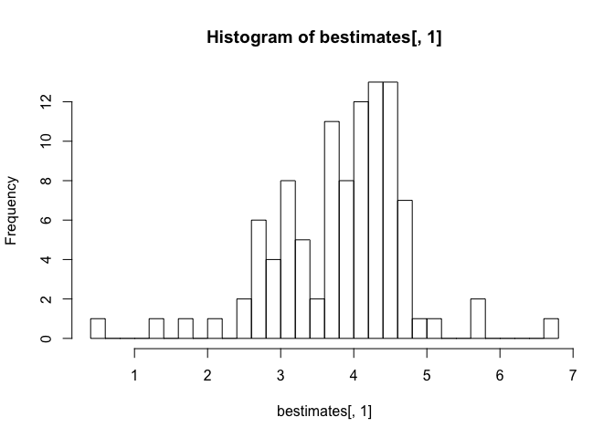
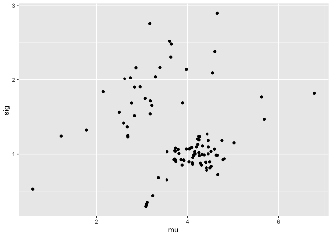
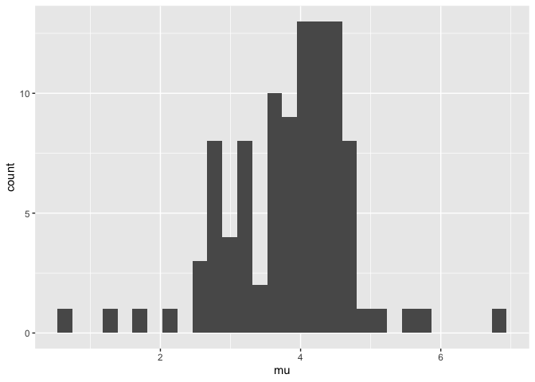
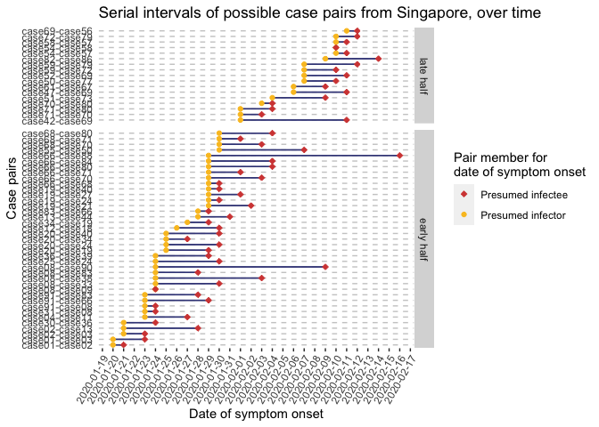
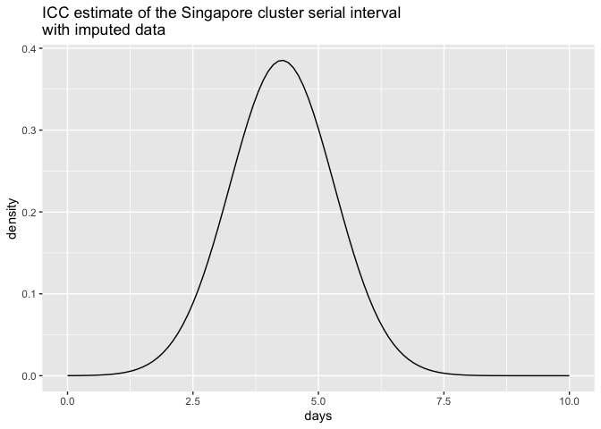

## Singapore data 
Thanks to EpiCoronaHack Cluster team. These data are manually entered from postings from the Government of Singapore website: [website](https://www.moh.gov.sg/covid-19). Data includes the 93 cases confirmed between Jan 19 to Feb 26, 2020. Date of symptom onset, close contacts and a few transmission clusters were identified for many of the Singapore cases.

Here we will upload and examine the data prior to analysis. 

```r
#spdata <- read_csv("data/COVID-19_Singapore_formated_dates.csv")
spdata <-read_csv("data/COVID-19_Singapore_data_revised.csv", col_types = list(presumed_infected_date = col_datetime()))

# Ensure properly imported
glimpse(spdata)
```

```
## Observations: 93
## Variables: 25
## $ CaseID                 <dbl> 1, 2, 3, 26, 4, 5, 6, 7, 8, 9, 10, 11, 12, 13,…
## $ `Related cases`        <chr> "2,3", "1,3", "1,2", "13", "11", NA, NA, NA, "…
## $ `Cluster links`        <chr> NA, NA, NA, NA, NA, NA, NA, NA, "9,31,33,38,83…
## $ `Relationship notes`   <chr> NA, NA, "Son of 1", "Daughter of 13", NA, NA, …
## $ Case                   <chr> "Case 1, 66M, Wuhan", "Case 2, 53F, Wuhan", "C…
## $ age                    <dbl> 66, 53, 37, 42, 36, 56, 56, 35, 56, 56, 56, 31…
## $ sex                    <chr> "M", "F", "M", "F", "M", "F", "M", "M", "F", "…
## $ country                <chr> "Singapore", "Singapore", "Singapore", "Singap…
## $ hospital               <chr> "Singapore General Hospital", "National Centre…
## $ presumed_infected_date <dttm> 2020-01-20, 2020-01-20, 2020-01-20, 2020-01-2…
## $ presumed_reason        <chr> "Arrived from Wuhan", "Arrived from Wuhan", "A…
## $ last_poss_exposure     <date> 2020-01-20, 2020-01-20, 2020-01-20, 2020-01-2…
## $ contact_based_exposure <date> NA, NA, NA, NA, NA, NA, NA, NA, NA, NA, NA, N…
## $ start_source           <date> 2019-12-31, 2020-01-01, 2020-01-03, NA, 2020-…
## $ end_source             <date> 2020-01-20, 2020-01-20, 2020-01-20, 2020-01-2…
## $ date_onset_symptoms    <date> 2020-01-20, 2020-01-21, 2020-01-23, NA, 2020-…
## $ date_quarantine        <date> NA, NA, NA, NA, NA, NA, NA, NA, NA, NA, NA, 2…
## $ date_hospital          <date> 2020-01-22, 2020-01-22, 2020-01-23, 2020-01-2…
## $ date_confirmation      <date> 2020-01-23, 2020-01-24, 2020-01-24, 2020-02-0…
## $ outcome                <chr> "Discharged", "Discharged", "Discharged", "Dis…
## $ date_discharge         <date> 2020-02-19, 2020-02-07, 2020-02-21, 2020-02-0…
## $ travel_history         <chr> "Wuhan", "Wuhan", "Wuhan", "Wuhan", "Wuhan", "…
## $ additional_information <chr> "Travelled with Case 3 (son) and M1 (wife) ;MO…
## $ cluster                <chr> "Wuhan", "Wuhan", "Wuhan", "Wuhan", "Wuhan", "…
## $ citizenship            <chr> "China", "China", "China", "China", "China", "…
```

```r
#table(spdata$`Related cases`) # There is one cell with "\n", needs to be changed to 'NA'
spdata$`Related cases`[which(spdata$`Related cases` == "\n")] <- NA

# Rename columns 2, 3 and 4 so no spaces
spdata <- rename(spdata, related_cases = starts_with("Related"),
                 cluster_links = "Cluster links",
                 relationship_notes = starts_with("Relation"))

# Make sure we are seeing the number of missing data we are expecting
colSums(is.na(spdata))
```

```
##                 CaseID          related_cases          cluster_links 
##                      0                     42                     88 
##     relationship_notes                   Case                    age 
##                     64                      0                      0 
##                    sex                country               hospital 
##                      0                      0                      0 
## presumed_infected_date        presumed_reason     last_poss_exposure 
##                     16                     16                     65 
## contact_based_exposure           start_source             end_source 
##                     42                      7                      0 
##    date_onset_symptoms        date_quarantine          date_hospital 
##                     10                     78                      0 
##      date_confirmation                outcome         date_discharge 
##                      0                     31                     31 
##         travel_history additional_information                cluster 
##                      0                     55                     23 
##            citizenship 
##                      0
```

```r
# make sure dates parsed properly
range(spdata$presumed_infected_date, na.rm = T)
```

```
## [1] "2020-01-18 UTC" "2020-02-10 UTC"
```

```r
range(spdata$last_poss_exposure, na.rm = T)
```

```
## [1] "2020-01-18" "2020-02-09"
```

```r
range(spdata$contact_based_exposure, na.rm = T)
```

```
## [1] "2020-01-19" "2020-02-10"
```

```r
range(spdata$date_onset_symptoms, na.rm = T)
```

```
## [1] "2020-01-20" "2020-02-17"
```

```r
range(spdata$date_quarantine, na.rm = T)
```

```
## [1] "2020-01-26" "2020-02-25"
```

```r
range(spdata$date_hospital, na.rm = T)
```

```
## [1] "2020-01-22" "2020-02-25"
```

```r
range(spdata$date_confirmation, na.rm = T)
```

```
## [1] "2020-01-23" "2020-02-26"
```

```r
range(spdata$date_discharge, na.rm = T)
```

```
## [1] "2020-02-04" "2020-02-26"
```

```r
range(spdata$start_source, na.rm = T)
```

```
## [1] "2019-12-31" "2020-02-02"
```

```r
range(spdata$end_source, na.rm = T)
```

```
## [1] "2020-01-18" "2020-02-17"
```


**Missing data and imputation**: We have 10 cases that are missing date of symptom onset. We will start the analysis by just removing these cases from the dataset; however, we will then repeat the analysis when imputing the data to determine the effect of removing these cases.


```r
# Keep a copy of the original dataset with missing data for imputation later
spdata_org <- spdata

# Remove all the cases that do not have info on date of symptom onset 
spdata <- filter(spdata, !is.na(date_onset_symptoms)) 
  # This removes 10 cases; we will examine the effect of imputing these values later on 
```

**End_source and start_source columns**:

In order to determine ICC later, we need columns that define a window for possible start and end of exposure to the virus. These are now explicitly listed for both Tianjin and Singapore datasets in the 'start_source' and 'end_source' columns.

The rules for defining these start and end dates are as follows:

- For Wuhan travel cases, their end_source is equal to the time they travelled from Wuhan. In the absence of any other contact info, their start_source is equal to their symptom onset - 20 days, to account for wide uncertainty. 

- For cluster cases thought to originate from an index case (but with no further known dates of contact), the start source is set to the 1st symptom onset in the cluster - 7 days. The end date is set to the minimum of the earliest quarantine, hospitalization or hospitalization in the cluster, and the symptom onset date of the case in question. (We assume that once a case in a cluster was identified, people were well aware of this and stopped mixing).

- For cluster cases thought to originate from a specific meeting/event (e.g. company meeting at Grand Hyatt hotel), the start_source is set to the 1st known meeting day. The end_source is set to that day + 4. (4 to account for some error/uncertainty)

- For cases with no known contact or travel info, their start_source is their symptom onset - 20 and their end_source is their symptom onset date (essentially, we have no information on these cases)

If no other end time for the exposure is given (by a known epidemiological route) or if the end of the exposure time is after the time of symptom onset, we set the last exposure time to the symptom onset time. This is because they must have been exposed before symptom onset.

Because this is explicitly about the symptom onset, we removed those who don't have symptom onset defined. (But see effect of imputing those values later).   


```r
# Let's confirm that the end_source is always before or equal to the symptom onset date
sum(spdata$end_source>spdata$date_onset_symptoms) # =0. Good
```

```
## [1] 0
```

## Data description for manuscript
Here we will determine some of the summary statistics about the Tianjin dataset useful for our introduction.

```r
#Range of confirmed dates
(srng <- range(spdata_org$date_confirmation))
```

```
## [1] "2020-01-23" "2020-02-26"
```

```r
#Number of recovered
(snotsick <- sum(!is.na(spdata_org$date_discharge)))
```

```
## [1] 62
```

```r
#Number died
(sdead <- sum(!is.na(spdata_org$death)))
```

```
## Warning: Unknown or uninitialised column: 'death'.
```

```
## [1] 0
```

```r
#Average (symptom onset - end exposure window)
(s.avgendexp <- mean(spdata_org$date_onset_symptoms - spdata_org$end_source, na.rm = T))
```

```
## Time difference of 1.71 days
```

```r
(s.sdendexp <- sd(spdata_org$date_onset_symptoms - spdata_org$end_source, na.rm = T))
```

```
## [1] 3.01
```

```r
#Average time between symtom onset and date confirmation
(s.avgtest <- mean(spdata_org$date_confirmation - spdata_org$date_onset_symptoms, na.rm = T))
```

```
## Time difference of 7.43 days
```

```r
(s.sdtest <- sd(spdata_org$date_confirmation - spdata_org$date_onset_symptoms, na.rm = T))
```

```
## [1] 5.28
```

```r
#Average duration of hospitalization (date_discharged - date_hospitalization)
(s.avghosp <- mean(spdata_org$date_discharge - spdata_org$date_hospital, na.rm = T))
```

```
## Time difference of 13.3 days
```

```r
(s.sdhosp <- sd(spdata_org$date_discharge - spdata_org$date_hospital, na.rm = T))
```

```
## [1] 6.01
```
New confirmed cases in the Tianjin dataset occured between 2020-01-23 to 2020-02-26. The number of recovered patients is 62/93. (74.699%), while the number of patients who had died is 0 (0%). The average time between symptom onset and end of possible exposure window is 1.711 (sd 3.014). The average time between symptom onset and case confirmation is 7.434 (sd 5.276). The duration of hospitalization is on average 13.274 (sd 6.014).


## Estimates of serial interval from Singapore data (without imputation)
We will estimate the serial interval using the 'interval case to case' approach given in Vink et al (https://academic.oup.com/aje/article/180/9/865/2739204). 

The dataset has several instances where a putative infector or contact is known. These are listed in the 'related_cases' column. We first make a graph in which nodes are individuals and edges are present from cases listed as possible sources, to the cases for whom they are possible sources. 

```r
spnodes <- spdata$CaseID

## How to extract caseIDs from related_cases column - there are multiple values in some cells, separated by commas
  #The +1 is because the comma splits between 2 related caseIDs (i.e. related cases with only 1 entry will have no comma!) 
max(str_count(spdata$related_cases, pattern = ",") + 1, 
    na.rm = T) 
```

```
## [1] 7
```

```r
  #7 max within one cell

# Split into separate columns
spdata <- separate(spdata,
                      col = related_cases,
                      into = paste("contactID", 1:7, sep = "_"),
                      fill = "right")

# Turn into numeric values
spdata <- mutate(spdata, 
                    contactID_1 = as.numeric(contactID_1),
                    contactID_2 = as.numeric(contactID_2),
                    contactID_3 = as.numeric(contactID_3),
                    contactID_4 = as.numeric(contactID_4),
                    contactID_5 = as.numeric(contactID_5),
                    contactID_6 = as.numeric(contactID_6),
                    contactID_7 = as.numeric(contactID_7))

# Select down to columns of interest
spedges <- select(spdata, c(CaseID, starts_with("contactID")))

# Remove rows with NAs for at least one contact
spedges <- filter(spedges, !is.na(spedges$contactID_1)) #43 CasesIDs with 1 or more possible contacts
```

Both visNetwork and igraph require an edge list with "from" and "to" nodes. So for each row of spedges we create entries like these.

```r
singedges = data.frame(from=2,to=1) 

for (n in 1:nrow(spedges)) {
 for (k in 2:ncol(spedges)) { 
   if (!is.na(spedges[n,k])) {
     singedges=rbind(singedges, c(spedges[[n,k]],spedges[[n,1]])) 
   }  
   }
}
singedges=singedges[-1,]
# create undirected graph by removing duplicates
undir=data.frame(from = pmin(singedges[,1],singedges[,2]),  
                 to = pmax(singedges[,1], singedges[,2]))
undir = unique(undir)
undir = undir[-which(undir[,1]==undir[,2]),]
```

As relationships in the 'related_cases' column were not directional, we need to make sure the cases labelled as "from" (aka the infectors) actually got the virus prior to those in the "to" column (aka the infectees). It is reasonable to assume that cases that were infected first will show signs of infection first, so within case-pairs we will assign the case with the earliest date of symptom onset as the "from" (infector) case and the case with the later date of symptom onset as "to".

To do this, let's start by making a new dataset from our case pairs ('undir') that contains date of symptom onset for each case. We will make a few new columns, both for determining which case has the earliest date of symptom onset, as well as to plot serial intervals over time later on. 


```r
# Make a smaller dataset of original spdata that contains only the CaseID and date of symptom onset
spdata_sympt <- select(spdata_org, CaseID, date_onset_symptoms)

# Add the date of symptom onset -for the caseID of the 'from' case - to the case pairs dataset (undir)
  #Do some renaming so the join is based on the caseID in the from column and that name of date column reflects this
names(spdata_sympt) <- str_replace(names(spdata_sympt), "CaseID", "from")
undir_dates <- left_join(undir, spdata_sympt, by = "from")
names(undir_dates) <- str_replace(names(undir_dates), "date_onset_symptoms", "from_sympt_date")

# Repeat, but add the date of symptom onset for the caseID of the 'to' case
names(spdata_sympt) <- str_replace(names(spdata_sympt), "from", "to")
undir_dates <- left_join(undir_dates, spdata_sympt, by = "to")
names(undir_dates) <- str_replace(names(undir_dates), "date_onset_symptoms", "to_sympt_date")

# Now add some extra columns which give us the raw serial interval (i.e. number of days between symptom onset in infector-infectee pairs)
  #As well as the absolute value of the serial interval (as some cases in the "from" and "to" columns should be switched around!)
  #And finally a 'direction' column in case we need to sort out which directions the arrows should be going in for a network graph and where we have missing dates
undir_dates <- mutate(undir_dates, earliest_sympt_onset = pmin(to_sympt_date, from_sympt_date, na.rm = T), 
                                   raw_serial_interval = to_sympt_date - from_sympt_date,   #5 NAs because only 1 case in the pair has a date of symptom onset
                                   abs_serial_interval = abs(raw_serial_interval))
```

Now we need to split the dataset apart so that we can switch around the directionality of presumed transmission for case-pairs where the serial interval is negative. Easiest way to do this is to rename columns and then join back to the other parts of the dataset, based on the column names.


```r
# Split dataset into positive (or 0) serial interval vs. negative vs. NA 
  #A negative serial interval means our "to" and "from" cases are mixed up
pos <- filter(undir_dates, raw_serial_interval >= 0)
neg <- filter(undir_dates, raw_serial_interval < 0)
onlyone <- filter(undir_dates, is.na(raw_serial_interval)) #Keep to make columns for graphs later

# Negative dataset needs the column headers changed to reflect that the 'from' and 'to' columns are backwards
  #as we are assuming that the 'case with the earliest onset of symptoms would have been infected first, 
  #and passed on the infection to the other case in the pair
names(neg)
```

```
## [1] "from"                 "to"                   "from_sympt_date"     
## [4] "to_sympt_date"        "earliest_sympt_onset" "raw_serial_interval" 
## [7] "abs_serial_interval"
```

```r
names(neg)[1] <- "to"
names(neg)[2] <- "from"
names(neg)[3] <- "to_sympt_date"
names(neg)[4] <- "from_sympt_date"
names(neg)
```

```
## [1] "to"                   "from"                 "to_sympt_date"       
## [4] "from_sympt_date"      "earliest_sympt_onset" "raw_serial_interval" 
## [7] "abs_serial_interval"
```

```r
# Now bind the rows of the seperated datasets back together based on column names
  #Must use dplyr::bind_rows to bind based on column name rather than position
undir_dates <- bind_rows(pos, neg, onlyone)

# For plotting - Add a column with padded to and from caseID numbers so they print in numerical order
  #Add a zero on the left of the number so all numbers have two digits  
undir_dates$pto <- str_pad(undir_dates$to, width = 2, side = "left", pad = "0")
undir_dates$pfrom <- str_pad(undir_dates$from, width = 2, side = "left", pad = "0")

# For plotting - Make a new column with case pair ID
undir_dates <- mutate(undir_dates, pairID = factor(paste("case", pfrom, "-", "case", pto, sep = "")))

rm(pos, neg, onlyone)
```

From this edge list we can use visNetwork to visualise the graph. Make 'group' based on source of probably infection. Colours are from the infection source column (but we could have a better colour scheme, like date of symptom onset). 

```r
# Turn 'presumed_reason' into lower case and get trim any whitespace so don't have issues with case sensitivity, etc
spdata$presumed_reason <- str_to_lower(spdata$presumed_reason)
spdata$presumed_reason <- str_trim(spdata$presumed_reason)
#table(spdata$presumed_reason)
sum(is.na(spdata$presumed_reason)) #16 NAs
```

```
## [1] 16
```

```r
# Make a new column where we group the 'presumed_reason' under a label (known relationship, gathering, wuhan travel) for each of the above three groups
spdata <- mutate(spdata, presumed_reason_group = case_when(!is.na(str_match(presumed_reason, "wuhan|airport")) ~ "Wuhan travel", 
                          #'airport' case (CaseID 17) does not have 'wuhan' in reason but does have it under 'Case' column that they are from Wuhan
                                                           !is.na(str_match(presumed_reason, "symptom onset|via")) ~ "Known relationship",
                                                           !is.na(str_match(presumed_reason, "grace")) ~ "Grace Assembly of God",
                                                           !is.na(str_match(presumed_reason, "grand")) ~ "Grand Hyatt Singapore",
                                                           !is.na(str_match(presumed_reason, "life")) ~ "Life Church",
                                                           !is.na(str_match(presumed_reason, "seletar")) ~ "Seletar Aerospace Heights",
                                                           !is.na(str_match(presumed_reason, "yong")) ~ "Yong Thai Hang",
                                                           is.na(presumed_reason) ~ "Unknown",
                                                           TRUE ~ "other")) #should not be any other, so is just a double check this has run correctly, especially as dataset grows
table(spdata$presumed_reason_group)
```

```
## 
##     Grace Assembly of God     Grand Hyatt Singapore        Known relationship 
##                        22                         3                         6 
##               Life Church Seletar Aerospace Heights                   Unknown 
##                         6                         5                        16 
##              Wuhan travel            Yong Thai Hang 
##                        17                         8
```

```r
# Save this object for plotting incidence curve by infection source group (figure 1b)
#save(spdata, file = "data/Singapore_cleaned_infection_source_groups.rdata")
```

We also need to make a data frame of the edges (indicating direction of probable transmission) and nodes (the cases).


```r
# Make data frame of edges, where the cases as the 'earliest' date of symptom onset are labeled as the "from" cases
  #First need to remove any cases missing date of symptom onset that were added back in from the 'related_cases' column
fedges <- filter(undir_dates, !is.na(raw_serial_interval))
fedges <- select(fedges, from, to)
fedges = data.frame(from = paste("case", fedges[ ,1], sep=""), 
                     to = paste("case", fedges[ ,2], sep=""))
fedges$arrows <- "to"  

# Save this object so we can use it to plot Fig4 Network diagram
#save(fedges, file = "data/singapore_edges_for_network_plot.rdata")

# Make data frame of nodes
nodes.df <- data.frame(id=paste("case",spdata$CaseID,sep=""), label=spdata$CaseID, group=spdata$presumed_reason_group)

# Save this object so in case we can use it to plot Fig4 Network diagram
#save(nodes.df, file = "data/singapore_nodes_for_network_plot.rdata")

glimpse(nodes.df)
```

```
## Observations: 83
## Variables: 3
## $ id    <fct> case1, case2, case3, case4, case5, case6, case7, case8, case9, …
## $ label <dbl> 1, 2, 3, 4, 5, 6, 7, 8, 9, 10, 11, 12, 13, 14, 16, 18, 17, 48, …
## $ group <fct> Wuhan travel, Wuhan travel, Wuhan travel, Wuhan travel, Wuhan t…
```

```r
spdata$graphID = paste("case",spdata$CaseID,sep="")
visNetwork(nodes.df, fedges) %>% visLegend() 
```

<!--html_preserve--><div id="htmlwidget-51098584d74b8c0b22d4" style="width:672px;height:480px;" class="visNetwork html-widget"></div>
<script type="application/json" data-for="htmlwidget-51098584d74b8c0b22d4">{"x":{"nodes":{"id":["case1","case2","case3","case4","case5","case6","case7","case8","case9","case10","case11","case12","case13","case14","case16","case18","case17","case48","case49","case51","case53","case54","case57","case58","case60","case61","case62","case63","case67","case68","case70","case71","case73","case74","case78","case80","case81","case84","case88","case30","case36","case39","case31","case33","case38","case83","case90","case91","case29","case32","case35","case37","case41","case43","case46","case50","case55","case59","case64","case82","case85","case89","case92","case93","case42","case47","case52","case56","case69","case44","case77","case72","case79","case86","case66","case19","case20","case21","case24","case25","case27","case34","case40"],"label":[1,2,3,4,5,6,7,8,9,10,11,12,13,14,16,18,17,48,49,51,53,54,57,58,60,61,62,63,67,68,70,71,73,74,78,80,81,84,88,30,36,39,31,33,38,83,90,91,29,32,35,37,41,43,46,50,55,59,64,82,85,89,92,93,42,47,52,56,69,44,77,72,79,86,66,19,20,21,24,25,27,34,40],"group":["Wuhan travel","Wuhan travel","Wuhan travel","Wuhan travel","Wuhan travel","Wuhan travel","Wuhan travel","Wuhan travel","Wuhan travel","Wuhan travel","Wuhan travel","Wuhan travel","Wuhan travel","Wuhan travel","Wuhan travel","Wuhan travel","Wuhan travel","Grace Assembly of God","Grace Assembly of God","Grace Assembly of God","Grace Assembly of God","Grace Assembly of God","Grace Assembly of God","Grace Assembly of God","Grace Assembly of God","Grace Assembly of God","Grace Assembly of God","Grace Assembly of God","Grace Assembly of God","Grace Assembly of God","Grace Assembly of God","Grace Assembly of God","Grace Assembly of God","Grace Assembly of God","Grace Assembly of God","Grace Assembly of God","Grace Assembly of God","Grace Assembly of God","Grace Assembly of God","Grand Hyatt Singapore","Grand Hyatt Singapore","Grand Hyatt Singapore","Life Church","Life Church","Life Church","Life Church","Life Church","Life Church","Unknown","Unknown","Unknown","Unknown","Unknown","Unknown","Unknown","Unknown","Unknown","Unknown","Unknown","Unknown","Unknown","Unknown","Unknown","Unknown","Seletar Aerospace Heights","Seletar Aerospace Heights","Seletar Aerospace Heights","Seletar Aerospace Heights","Seletar Aerospace Heights","Known relationship","Known relationship","Known relationship","Known relationship","Known relationship","Known relationship","Yong Thai Hang","Yong Thai Hang","Yong Thai Hang","Yong Thai Hang","Yong Thai Hang","Yong Thai Hang","Yong Thai Hang","Yong Thai Hang"]},"edges":{"from":["case1","case1","case2","case4","case8","case8","case8","case8","case8","case12","case2","case54","case54","case61","case66","case68","case68","case68","case66","case70","case66","case71","case51","case66","case66","case66","case30","case36","case50","case59","case59","case82","case42","case47","case52","case13","case72","case19","case19","case19","case19","case20","case20","case20","case91","case31","case58","case71","case91","case91","case55","case69","case83","case20","case34","case25"],"to":["case2","case3","case3","case11","case9","case83","case90","case38","case33","case18","case13","case57","case58","case67","case68","case70","case71","case80","case70","case80","case71","case80","case73","case80","case84","case88","case36","case39","case77","case72","case79","case86","case69","case69","case69","case44","case79","case21","case24","case27","case40","case24","case34","case40","case8","case8","case57","case70","case83","case66","case50","case56","case66","case19","case19","case24"],"arrows":["to","to","to","to","to","to","to","to","to","to","to","to","to","to","to","to","to","to","to","to","to","to","to","to","to","to","to","to","to","to","to","to","to","to","to","to","to","to","to","to","to","to","to","to","to","to","to","to","to","to","to","to","to","to","to","to"]},"nodesToDataframe":true,"edgesToDataframe":true,"options":{"width":"100%","height":"100%","nodes":{"shape":"dot"},"manipulation":{"enabled":false}},"groups":["Wuhan travel","Grace Assembly of God","Grand Hyatt Singapore","Life Church","Unknown","Seletar Aerospace Heights","Known relationship","Yong Thai Hang"],"width":null,"height":null,"idselection":{"enabled":false},"byselection":{"enabled":false},"main":null,"submain":null,"footer":null,"background":"rgba(0, 0, 0, 0)","legend":{"width":0.2,"useGroups":true,"position":"left","ncol":1,"stepX":100,"stepY":100,"zoom":true}},"evals":[],"jsHooks":[]}</script><!--/html_preserve-->

Now we estimate the serial interval using the ICC method; for this we first construct a graph. The "interval case to case" data are from identifying a putative first infector each small cluster in the graph, and finding the times between symptom onset in the first observed case and the others. See Vink et al. 


```r
sgraph = graph_from_edgelist(as.matrix(fedges[,1:2]), directed = FALSE)
ccs = components(sgraph)
ccs
```

```
## $membership
##  case1  case2  case3  case4 case11  case8  case9 case83 case90 case38 case33 
##      1      1      1      2      2      3      3      3      3      3      3 
## case12 case18 case13 case54 case57 case58 case61 case67 case66 case68 case70 
##      4      4      1      5      5      5      6      6      3      3      3 
## case71 case80 case51 case73 case84 case88 case30 case36 case39 case50 case77 
##      3      3      7      7      3      3      8      8      8      9      9 
## case59 case72 case79 case82 case86 case42 case69 case47 case52 case44 case19 
##     10     10     10     11     11     12     12     12     12      1     13 
## case21 case24 case27 case40 case20 case34 case91 case31 case55 case56 case25 
##     13     13     13     13     13     13      3      3      9     12     13 
## 
## $csize
##  [1]  5  2 15  2  3  2  2  3  3  3  2  5  8
## 
## $no
## [1] 13
```

```r
spdata$component=vapply(spdata$graphID, function(x)
  { if (x %in% names(ccs$membership)) { return(ccs$membership[match(x, names(ccs$membership))])
  } else { 
    return(NA)}}, FUN.VALUE = 3)
```

Now knowing the components of the graph I can extract the ICC intervals. 
I did this in a few ways (commented out lines): taking the first case for each cluster to be the first reported symptoms (I get a 5 day serial interval); the first start exposure time (now there are negative ICCs so I get a 4.5 day serial interval) and the latest end exposure time.

Extract ICC interval data: a function 


```r
getICCs <- function(thisdata, ccs, K, orderby= "onset" ) {
  iccs=1
for (n in 1:max(ccs$membership)) {
  mycases  = which(thisdata$component==n)
  if (orderby == "onset")
  {  myonsets = sort(thisdata$date_onset_symptoms[mycases])[1:min(K, length(mycases))]}
  if (orderby == "exposure") {
 myonsets =thisdata$date_onset_symptoms[mycases][order(thisdata$end_source[mycases])][1:min(K,length(mycases))]
 # myonsets =  spdata$date_onset_symptoms[mycases[order(spdata$start_source[mycases])]] # alternative also ORDERS by earliest exposure 
 
 }
  iccs =c(iccs, myonsets[-1]-myonsets[1])
}
  return(iccs[-1]) 
  }
```


```r
icc3 = getICCs(spdata,ccs,3)
icc4 = getICCs(spdata,ccs,4)
icc5 = getICCs(spdata,ccs,5)
icc6 = getICCs(spdata,ccs,6)
icc_expose = getICCs(spdata, ccs, 4, orderby ="exposure")
```

#### Serial inteval estimates (Table 1 and Table S3) 
Note that the first 4 rows is with using the first 3 to 6 cases per cluster, based on ordering by date of symptom onset; while the last row is with 4 cases per cluster, but ordered by date in the 'end_source' (end of presumed exposure window) column instead.


```r
source("TianjinSI_VinkWallinga_CC.R")

myest3 = serial_mix_est(data=icc3, N=100, startmu=10, startsig =4)
```

```
## [1] 5.98 2.92
## [1] 4.63 2.35
## [1] 4.07 1.96
## [1] 3.84 1.70
## [1] 3.76 1.53
## [1] 3.77 1.41
## [1] 3.81 1.31
## [1] 3.88 1.22
## [1] 3.93 1.15
## [1] 3.98 1.11
## [1] 4.00 1.08
## [1] 4.02 1.07
## [1] 4.02 1.06
## [1] 4.03 1.06
## [1] 4.03 1.06
## [1] 4.03 1.06
## [1] 4.03 1.06
## [1] 4.03 1.06
## [1] 4.03 1.06
## [1] 4.03 1.06
## [1] 4.03 1.06
## [1] 4.03 1.06
## [1] 4.03 1.06
## [1] 4.03 1.06
## [1] 4.03 1.06
## [1] 4.03 1.06
## [1] 4.03 1.06
## [1] 4.03 1.06
## [1] 4.03 1.06
## [1] 4.03 1.06
## [1] 4.03 1.06
## [1] 4.03 1.06
## [1] 4.03 1.06
## [1] 4.03 1.06
## [1] 4.03 1.06
## [1] 4.03 1.06
## [1] 4.03 1.06
## [1] 4.03 1.06
## [1] 4.03 1.06
## [1] 4.03 1.06
## [1] 4.03 1.06
## [1] 4.03 1.06
## [1] 4.03 1.06
## [1] 4.03 1.06
## [1] 4.03 1.06
## [1] 4.03 1.06
## [1] 4.03 1.06
## [1] 4.03 1.06
## [1] 4.03 1.06
## [1] 4.03 1.06
## [1] 4.03 1.06
## [1] 4.03 1.06
## [1] 4.03 1.06
## [1] 4.03 1.06
## [1] 4.03 1.06
## [1] 4.03 1.06
## [1] 4.03 1.06
## [1] 4.03 1.06
## [1] 4.03 1.06
## [1] 4.03 1.06
## [1] 4.03 1.06
## [1] 4.03 1.06
## [1] 4.03 1.06
## [1] 4.03 1.06
## [1] 4.03 1.06
## [1] 4.03 1.06
## [1] 4.03 1.06
## [1] 4.03 1.06
## [1] 4.03 1.06
## [1] 4.03 1.06
## [1] 4.03 1.06
## [1] 4.03 1.06
## [1] 4.03 1.06
## [1] 4.03 1.06
## [1] 4.03 1.06
## [1] 4.03 1.06
## [1] 4.03 1.06
## [1] 4.03 1.06
## [1] 4.03 1.06
## [1] 4.03 1.06
## [1] 4.03 1.06
## [1] 4.03 1.06
## [1] 4.03 1.06
## [1] 4.03 1.06
## [1] 4.03 1.06
## [1] 4.03 1.06
## [1] 4.03 1.06
## [1] 4.03 1.06
## [1] 4.03 1.06
## [1] 4.03 1.06
## [1] 4.03 1.06
## [1] 4.03 1.06
## [1] 4.03 1.06
## [1] 4.03 1.06
## [1] 4.03 1.06
## [1] 4.03 1.06
## [1] 4.03 1.06
## [1] 4.03 1.06
## [1] 4.03 1.06
## [1] 4.03 1.06
```

```r
myest4 = serial_mix_est(data=icc4, N=100, startmu=10, startsig =4)
```

```
## [1] 6.48 2.91
## [1] 5.32 2.57
## [1] 4.66 2.30
## [1] 4.28 2.06
## [1] 4.05 1.87
## [1] 3.93 1.72
## [1] 3.88 1.59
## [1] 3.88 1.48
## [1] 3.92 1.39
## [1] 3.98 1.30
## [1] 4.04 1.21
## [1] 4.10 1.14
## [1] 4.13 1.10
## [1] 4.15 1.07
## [1] 4.16 1.06
## [1] 4.16 1.06
## [1] 4.16 1.06
## [1] 4.17 1.06
## [1] 4.17 1.06
## [1] 4.17 1.06
## [1] 4.17 1.06
## [1] 4.17 1.06
## [1] 4.17 1.06
## [1] 4.17 1.06
## [1] 4.17 1.06
## [1] 4.17 1.06
## [1] 4.17 1.06
## [1] 4.17 1.06
## [1] 4.17 1.06
## [1] 4.17 1.06
## [1] 4.17 1.06
## [1] 4.17 1.06
## [1] 4.17 1.06
## [1] 4.17 1.06
## [1] 4.17 1.06
## [1] 4.17 1.06
## [1] 4.17 1.06
## [1] 4.17 1.06
## [1] 4.17 1.06
## [1] 4.17 1.06
## [1] 4.17 1.06
## [1] 4.17 1.06
## [1] 4.17 1.06
## [1] 4.17 1.06
## [1] 4.17 1.06
## [1] 4.17 1.06
## [1] 4.17 1.06
## [1] 4.17 1.06
## [1] 4.17 1.06
## [1] 4.17 1.06
## [1] 4.17 1.06
## [1] 4.17 1.06
## [1] 4.17 1.06
## [1] 4.17 1.06
## [1] 4.17 1.06
## [1] 4.17 1.06
## [1] 4.17 1.06
## [1] 4.17 1.06
## [1] 4.17 1.06
## [1] 4.17 1.06
## [1] 4.17 1.06
## [1] 4.17 1.06
## [1] 4.17 1.06
## [1] 4.17 1.06
## [1] 4.17 1.06
## [1] 4.17 1.06
## [1] 4.17 1.06
## [1] 4.17 1.06
## [1] 4.17 1.06
## [1] 4.17 1.06
## [1] 4.17 1.06
## [1] 4.17 1.06
## [1] 4.17 1.06
## [1] 4.17 1.06
## [1] 4.17 1.06
## [1] 4.17 1.06
## [1] 4.17 1.06
## [1] 4.17 1.06
## [1] 4.17 1.06
## [1] 4.17 1.06
## [1] 4.17 1.06
## [1] 4.17 1.06
## [1] 4.17 1.06
## [1] 4.17 1.06
## [1] 4.17 1.06
## [1] 4.17 1.06
## [1] 4.17 1.06
## [1] 4.17 1.06
## [1] 4.17 1.06
## [1] 4.17 1.06
## [1] 4.17 1.06
## [1] 4.17 1.06
## [1] 4.17 1.06
## [1] 4.17 1.06
## [1] 4.17 1.06
## [1] 4.17 1.06
## [1] 4.17 1.06
## [1] 4.17 1.06
## [1] 4.17 1.06
## [1] 4.17 1.06
```

```r
myest5 = serial_mix_est(data=icc5, N=100, startmu=10, startsig =4)
```

```
## [1] 7.11 3.07
## [1] 6.04 2.82
## [1] 5.34 2.58
## [1] 4.88 2.32
## [1] 4.59 2.06
## [1] 4.43 1.84
## [1] 4.36 1.65
## [1] 4.35 1.48
## [1] 4.38 1.33
## [1] 4.41 1.21
## [1] 4.43 1.14
## [1] 4.44 1.10
## [1] 4.44 1.09
## [1] 4.43 1.09
## [1] 4.43 1.09
## [1] 4.43 1.09
## [1] 4.43 1.09
## [1] 4.43 1.09
## [1] 4.43 1.09
## [1] 4.43 1.09
## [1] 4.43 1.09
## [1] 4.43 1.09
## [1] 4.43 1.09
## [1] 4.43 1.09
## [1] 4.43 1.09
## [1] 4.43 1.09
## [1] 4.43 1.09
## [1] 4.43 1.09
## [1] 4.43 1.09
## [1] 4.43 1.09
## [1] 4.43 1.09
## [1] 4.43 1.09
## [1] 4.43 1.09
## [1] 4.43 1.09
## [1] 4.43 1.09
## [1] 4.43 1.09
## [1] 4.43 1.09
## [1] 4.43 1.09
## [1] 4.43 1.09
## [1] 4.43 1.09
## [1] 4.43 1.09
## [1] 4.43 1.09
## [1] 4.43 1.09
## [1] 4.43 1.09
## [1] 4.43 1.09
## [1] 4.43 1.09
## [1] 4.43 1.09
## [1] 4.43 1.09
## [1] 4.43 1.09
## [1] 4.43 1.09
## [1] 4.43 1.09
## [1] 4.43 1.09
## [1] 4.43 1.09
## [1] 4.43 1.09
## [1] 4.43 1.09
## [1] 4.43 1.09
## [1] 4.43 1.09
## [1] 4.43 1.09
## [1] 4.43 1.09
## [1] 4.43 1.09
## [1] 4.43 1.09
## [1] 4.43 1.09
## [1] 4.43 1.09
## [1] 4.43 1.09
## [1] 4.43 1.09
## [1] 4.43 1.09
## [1] 4.43 1.09
## [1] 4.43 1.09
## [1] 4.43 1.09
## [1] 4.43 1.09
## [1] 4.43 1.09
## [1] 4.43 1.09
## [1] 4.43 1.09
## [1] 4.43 1.09
## [1] 4.43 1.09
## [1] 4.43 1.09
## [1] 4.43 1.09
## [1] 4.43 1.09
## [1] 4.43 1.09
## [1] 4.43 1.09
## [1] 4.43 1.09
## [1] 4.43 1.09
## [1] 4.43 1.09
## [1] 4.43 1.09
## [1] 4.43 1.09
## [1] 4.43 1.09
## [1] 4.43 1.09
## [1] 4.43 1.09
## [1] 4.43 1.09
## [1] 4.43 1.09
## [1] 4.43 1.09
## [1] 4.43 1.09
## [1] 4.43 1.09
## [1] 4.43 1.09
## [1] 4.43 1.09
## [1] 4.43 1.09
## [1] 4.43 1.09
## [1] 4.43 1.09
## [1] 4.43 1.09
## [1] 4.43 1.09
```

```r
myest6 = serial_mix_est(data=icc6, N=100, startmu=10, startsig =4)
```

```
## [1] 7.02 2.94
## [1] 6.03 2.61
## [1] 5.45 2.31
## [1] 5.10 2.02
## [1] 4.93 1.76
## [1] 4.86 1.55
## [1] 4.84 1.38
## [1] 4.83 1.27
## [1] 4.81 1.21
## [1] 4.79 1.18
## [1] 4.78 1.16
## [1] 4.77 1.16
## [1] 4.76 1.16
## [1] 4.76 1.16
## [1] 4.76 1.15
## [1] 4.76 1.15
## [1] 4.76 1.15
## [1] 4.76 1.15
## [1] 4.76 1.15
## [1] 4.76 1.15
## [1] 4.76 1.15
## [1] 4.76 1.15
## [1] 4.76 1.15
## [1] 4.76 1.15
## [1] 4.76 1.15
## [1] 4.76 1.15
## [1] 4.76 1.15
## [1] 4.76 1.15
## [1] 4.76 1.15
## [1] 4.76 1.15
## [1] 4.76 1.15
## [1] 4.76 1.15
## [1] 4.76 1.15
## [1] 4.76 1.15
## [1] 4.76 1.15
## [1] 4.76 1.15
## [1] 4.76 1.15
## [1] 4.76 1.15
## [1] 4.76 1.15
## [1] 4.76 1.15
## [1] 4.76 1.15
## [1] 4.76 1.15
## [1] 4.76 1.15
## [1] 4.76 1.15
## [1] 4.76 1.15
## [1] 4.76 1.15
## [1] 4.76 1.15
## [1] 4.76 1.15
## [1] 4.76 1.15
## [1] 4.76 1.15
## [1] 4.76 1.15
## [1] 4.76 1.15
## [1] 4.76 1.15
## [1] 4.76 1.15
## [1] 4.76 1.15
## [1] 4.76 1.15
## [1] 4.76 1.15
## [1] 4.76 1.15
## [1] 4.76 1.15
## [1] 4.76 1.15
## [1] 4.76 1.15
## [1] 4.76 1.15
## [1] 4.76 1.15
## [1] 4.76 1.15
## [1] 4.76 1.15
## [1] 4.76 1.15
## [1] 4.76 1.15
## [1] 4.76 1.15
## [1] 4.76 1.15
## [1] 4.76 1.15
## [1] 4.76 1.15
## [1] 4.76 1.15
## [1] 4.76 1.15
## [1] 4.76 1.15
## [1] 4.76 1.15
## [1] 4.76 1.15
## [1] 4.76 1.15
## [1] 4.76 1.15
## [1] 4.76 1.15
## [1] 4.76 1.15
## [1] 4.76 1.15
## [1] 4.76 1.15
## [1] 4.76 1.15
## [1] 4.76 1.15
## [1] 4.76 1.15
## [1] 4.76 1.15
## [1] 4.76 1.15
## [1] 4.76 1.15
## [1] 4.76 1.15
## [1] 4.76 1.15
## [1] 4.76 1.15
## [1] 4.76 1.15
## [1] 4.76 1.15
## [1] 4.76 1.15
## [1] 4.76 1.15
## [1] 4.76 1.15
## [1] 4.76 1.15
## [1] 4.76 1.15
## [1] 4.76 1.15
## [1] 4.76 1.15
```

```r
myest_exp= serial_mix_est(data=icc_expose, N=100, startmu=10, startsig =4)
```

```
## [1] 6.69 3.16
## [1] 5.56 2.85
## [1] 4.95 2.61
## [1] 4.60 2.42
## [1] 4.38 2.28
## [1] 4.25 2.15
## [1] 4.16 2.05
## [1] 4.11 1.96
## [1] 4.08 1.88
## [1] 4.07 1.80
## [1] 4.08 1.73
## [1] 4.09 1.66
## [1] 4.12 1.58
## [1] 4.15 1.50
## [1] 4.18 1.42
## [1] 4.21 1.34
## [1] 4.23 1.28
## [1] 4.25 1.23
## [1] 4.25 1.20
## [1] 4.26 1.18
## [1] 4.26 1.17
## [1] 4.26 1.17
## [1] 4.26 1.17
## [1] 4.26 1.17
## [1] 4.26 1.17
## [1] 4.26 1.17
## [1] 4.26 1.17
## [1] 4.26 1.17
## [1] 4.26 1.17
## [1] 4.26 1.17
## [1] 4.26 1.17
## [1] 4.26 1.17
## [1] 4.26 1.17
## [1] 4.26 1.17
## [1] 4.26 1.17
## [1] 4.26 1.17
## [1] 4.26 1.17
## [1] 4.26 1.17
## [1] 4.26 1.17
## [1] 4.26 1.17
## [1] 4.26 1.17
## [1] 4.26 1.17
## [1] 4.26 1.17
## [1] 4.26 1.17
## [1] 4.26 1.17
## [1] 4.26 1.17
## [1] 4.26 1.17
## [1] 4.26 1.17
## [1] 4.26 1.17
## [1] 4.26 1.17
## [1] 4.26 1.17
## [1] 4.26 1.17
## [1] 4.26 1.17
## [1] 4.26 1.17
## [1] 4.26 1.17
## [1] 4.26 1.17
## [1] 4.26 1.17
## [1] 4.26 1.17
## [1] 4.26 1.17
## [1] 4.26 1.17
## [1] 4.26 1.17
## [1] 4.26 1.17
## [1] 4.26 1.17
## [1] 4.26 1.17
## [1] 4.26 1.17
## [1] 4.26 1.17
## [1] 4.26 1.17
## [1] 4.26 1.17
## [1] 4.26 1.17
## [1] 4.26 1.17
## [1] 4.26 1.17
## [1] 4.26 1.17
## [1] 4.26 1.17
## [1] 4.26 1.17
## [1] 4.26 1.17
## [1] 4.26 1.17
## [1] 4.26 1.17
## [1] 4.26 1.17
## [1] 4.26 1.17
## [1] 4.26 1.17
## [1] 4.26 1.17
## [1] 4.26 1.17
## [1] 4.26 1.17
## [1] 4.26 1.17
## [1] 4.26 1.17
## [1] 4.26 1.17
## [1] 4.26 1.17
## [1] 4.26 1.17
## [1] 4.26 1.17
## [1] 4.26 1.17
## [1] 4.26 1.17
## [1] 4.26 1.17
## [1] 4.26 1.17
## [1] 4.26 1.17
## [1] 4.26 1.17
## [1] 4.26 1.17
## [1] 4.26 1.17
## [1] 4.26 1.17
## [1] 4.26 1.17
## [1] 4.26 1.17
```

```r
mm=rbind(myest3, myest4, myest5,myest6, myest_exp)
colnames(mm)=c("mu","sig")
mm=as.data.frame(mm)
mm$NumCasesPerCluster=c( 3,4, 5, 6, 4) 
mm$ordering = c("Onset","Onset","Onset","Onset","LastExposure")
print(mm[,c(4,3,1,2)]) 
```

```
##               ordering NumCasesPerCluster   mu  sig
## myest3           Onset                  3 4.03 1.06
## myest4           Onset                  4 4.17 1.06
## myest5           Onset                  5 4.43 1.09
## myest6           Onset                  6 4.76 1.15
## myest_exp LastExposure                  4 4.26 1.17
```


```r
days = seq(from=0, to=10, by=0.1) 
 sp.density= dnorm(days, mean = myest4[1], sd = myest4[2])
ggplot(data=data.frame(days=days, density=sp.density), aes(x=days,y=density)) + geom_line() + ggtitle("ICC estimate of the Singapore cluster serial interval")
#ggsave(file="final_figures/sing_serialint.pdf", height = 4, width = 6)
```

Notice that the serial interval gets longer if we include more cases per cluster (because the mixture of 4 pathways in Vink et al does not include longer transmission chains, which forces the assumption that everyone in the cluster was infected by the initial case, which in turn lengthens the estimated serial interval). We do not know the true infection pathways but it is reasonable not to constrain the model to enforce that most are infected by the first few cases. 

**The mean SI (using first 4 cases per cluster) is 4.166.** The standard deviation of the serial intervals is 1.057.

#### Determining the confidence interval for the mean serial interval 
We need CIs for the mean. For this we use bootstrapping. The bootstrapping is done on the serial interval estimate with 4 cases per cluster and ordered by date of symptom onset.


```r
# bootstrap analysis
Nboot=100

bestimates=myest4 

# NOTE this loop had errors a few times; I just restarted it. 
for (kk in 1:Nboot) {
  bdata = sample(x=icc4, size = length(icc4), replace = T)
  bestimates = rbind(bestimates, serial_mix_est(data=bdata, N=100, startmu=10, startsig =4))
  
  print(paste("loop iteration #", kk, sep = ": "))
}

#bestimates <- bestimates[-1, ] #Remove the non-bootstrapped row (i.e. the myest4 object)
save(bestimates, file = "data/sing_boots_100.Rdata")
```


```r
load("data/sing_boots_100.Rdata") # in case in Rmd with above evals set to FALSE 
hist(bestimates[,1],breaks = 30)
```

<!-- -->

```r
bootdf=data.frame(mu=bestimates[,1], sig=bestimates[,2])
ggplot(bootdf, aes(x=mu, y=sig))+geom_point()
```

<!-- -->

```r
ggplot(bootdf, aes(x=mu))+geom_histogram()
```

```
## `stat_bin()` using `bins = 30`. Pick better value with `binwidth`.
```

<!-- -->

```r
# ggsave(file = "final_figures/FigS1_bootst_SI_sing.pdf", width = 6, height = 4)
```


```r
#load("data/sing_boots_100.Rdata") # in case in Rmd with above evals set to FALSE 
mean(bestimates[,1])  # mean of the mean serial intervals
```

```
## [1] 3.83
```

```r
median(bestimates[,1])
```

```
## [1] 4
```

```r
sd(bestimates[,1]) # sd of the MEAN serial intervals 
```

```
## [1] 0.882
```

```r
mean(bestimates[,2]) # mean of the sd serial intervals
```

```
## [1] 1.24
```

```r
sd(bestimates[,2]) #sd of the sd serial intervals
```

```
## [1] 0.538
```
The mean of the mean serial intervals is 3.83 days and the standard deviation of these means is 0.882. 
**The bootstrapped 95% range for the mean serial interval is (2.438, 5.894).**


## Effect of time on serial interval estimates
To see the effects of the passage of time on the raw serial intervals, we will plot all possible infector-infectee pairs and the difference in their dates of symptom onset. To do this, we need a dataframe that has (1) case pairs (= 'undir'), (2) dates of symptom onset for both individuals in that pair, and (3) difference in days between those pairs.


```r
# Add an extra column that groups serial interval based on length 
  #We will do every two days, as otherwise there are too many bars next to each other!
undir_dates <- mutate(undir_dates, si_groups = factor(case_when(abs_serial_interval == 0 ~ "0",
                                                         abs_serial_interval == 1 | abs_serial_interval == 2 ~ "1 to 2",
                                                         abs_serial_interval == 3 | abs_serial_interval == 4 ~ "3 to 4",
                                                         abs_serial_interval == 5 | abs_serial_interval == 6 ~ "5 to 6",
                                                         abs_serial_interval == 7 | abs_serial_interval == 8 ~ "7 to 8",
                                                         abs_serial_interval == 9 | abs_serial_interval == 10 ~ "9 to 10",
                                                         abs_serial_interval > 10 ~ "over 10",
                                                         is.na(abs_serial_interval) ~ NA_character_,
                                                         T ~ "other")))
```

#### Graphs of raw serial intervals

Now let's turn this into a dot plot and a bar chart so we can see if and how serial interval changes over time. The dates on the x-axis are the earliest date of symptom onset from each infected pair.


```r
### A) Histogram - length of serial interval on the y-axis
#Transform 'undir_dates' into a better format for making a bar chart...need counts of serial intervals as a factor
g_dates <- undir_dates %>% 
            group_by(earliest_sympt_onset, as.integer(abs_serial_interval)) %>% 
            summarise(count_si = n())  #Still seems to want this to be continous for some reason...
names(g_dates)[2] <- "serial_interval"
g_dates <- filter(g_dates, !is.na(serial_interval))

g_dates$count_si <- as.factor(g_dates$count_si)

#Define an object for fill colors - based on viridis colors?
count.cols <- c(#"1" = "#21908CFF", #Nicest teal color
                "1" = "#22A884FF",
                "2" = "#2A788EFF", 
                "3" = "#414487FF") 

#Plot
  #Note that the width of the columns are uneven; to fix this need a dataframe with zeros 
  #for the dates/serial_interval combinations that don't have a count
  #But that takes quite a bit of coding so I'm just going to ignore it for now as its not going in the manuscript
ggplot(g_dates, aes(x = earliest_sympt_onset, y = serial_interval)) +
  #The columns really need to be BESIDE each other, or it is really hard to see the actual length of the serial intervals
  geom_col(aes(fill = count_si), position = "dodge") +
  scale_fill_manual(name = "Number of serial intevals \n of each length", values = count.cols) +
  scale_x_date(date_breaks = "1 day") +
  scale_y_continuous(breaks = seq(from = 0, to = 20, by = 2)) +
  theme(axis.text.x = element_text(angle = 60, hjust = 1),
        panel.background = element_rect(fill = "white")) +
  labs(title = "Length of serial intervals in Singapore, over time",
       y = "Length of serial intervals",
       x = "Date of first onset of symptoms within case pairs")
```

<!-- -->

```r
### B) Histogram  - count of serial intervals on the y-axis
#Define count by serial interval group
sig_dates <- filter(undir_dates, !is.na(si_groups))

sig_dates <- sig_dates %>% 
            group_by(earliest_sympt_onset, si_groups) %>% 
            summarise(count_sig = n())  #Still seems to want this to be continous for some reason...
names(sig_dates)[2] <- "serial_interval_group"

#Define colors
sig_col <- c("0" = "#440154FF",      
             "1 to 2" = "#443A83FF", 
             "3 to 4" = "#31688EFF", 
             "5 to 6" = "#21908CFF",
             "7 to 8"  = "#35B779FF",
             "9 to 10" = "#8FD744FF",
             "over 10"  = "#FDE725FF")


#Plot
  #Note that the width of the columns are uneven; to fix this need a dataframe with zeros 
  #for the dates/serial_interval combinations that don't have a count
  #But that takes quite a bit of coding so I'm just going to ignore it for now as its not going in the manuscript
ggplot(sig_dates, aes(x = earliest_sympt_onset, y = count_sig, fill = serial_interval_group)) +
  #The columns really need to be BESIDE each other, or it is really hard to see the actual length of the serial intervals
  geom_col(position = "dodge") +
  scale_fill_manual(name = "Length of serial intervals", values = sig_col) +
  scale_x_date(date_breaks = "1 day") +
  scale_y_continuous(breaks = seq(from = 0, to = 4, by = 1)) +
  theme(axis.text.x = element_text(angle = 60, hjust = 1),
        panel.background = element_rect(fill = "white")) +
  labs(title = "Length of serial intervals in Singapore, over time",
       y = "Count of case-pairs",
       x = "Date of first onset of symptoms within case pairs")
```

<!-- -->

```r
###~~~~~~~~~~~ C) Cleveland dotplot of raw serial intervals per possible case pair ~~~~~~~~~~~~~~~~~~~~~~~~~~~~###
  # This is the plot that has the easiest visual interpretation, so we will use it in our final manuscript

# We want to exclude any case-pairs that have NA for length of serial interval
  #i.e. one of the pair does not have a date of symptom onset
undir_dates_org <- undir_dates  #Just in case....
undir_dates <- filter(undir_dates, !is.na(raw_serial_interval)) #Removes 5 NAs

#Pivot the to/from dates of symptom onset column to a long format, so that can make a legend based on this variable
undir_dotplot <- pivot_longer(undir_dates, 
                              cols = contains("sympt_date"),
                              names_to = "pair_member",
                              values_to = "onset_date")

#Let's rename the values so it makes more sense in the legend
undir_dotplot$pair_member <- str_replace(undir_dotplot$pair_member, pattern = "from_sympt_date", replacement = "Presumed infector")
undir_dotplot$pair_member <- str_replace(undir_dotplot$pair_member, pattern = "to_sympt_date", replacement = "Presumed infectee")

#Make the Cleveland dotplot
p <- ggplot(undir_dotplot, aes(y = reorder(pairID, earliest_sympt_onset))) +
          geom_segment(aes(x = earliest_sympt_onset, xend = earliest_sympt_onset + abs_serial_interval, yend = pairID), 
                       color = "#404788FF") +
          #geom_point(aes(x = from_sympt_date), shape = 21, fill = "#FAC127FF", color = "#FAC127FF") +
          #geom_point(aes(x = to_sympt_date), shape = 23, fill = "#D44842FF", color = "#D44842FF") +
          geom_point(aes(x = onset_date, color = pair_member, fill = pair_member, shape = pair_member)) +
          scale_x_date(date_breaks = "1 day") +
          scale_color_manual(name = "Pair member for \ndate of symptom onset", values = c("#D44842FF", "#FAC127FF")) +
          scale_fill_manual(name = "Pair member for \ndate of symptom onset", values = c("#D44842FF", "#FAC127FF")) +
          scale_shape_manual(name = "Pair member for \ndate of symptom onset", values = c(23, 21)) +
          theme(axis.text.x = element_text(angle = 60, hjust = 1),
                axis.ticks.y = element_blank(),
                panel.grid.major.x = element_blank(),
                panel.grid.minor.x = element_blank(),
                panel.grid.major.y = element_line(colour = "grey80", linetype = "dashed"),
                panel.background = element_rect(fill = "white")) +
          labs(title = "Serial intervals of possible case pairs from Singapore, over time",
               x = "Date of symptom onset",
               y = "Case pairs")
p
```

<!-- -->

```r
# Write to PDF
# pdf("final_figures/Dotplot_raw_serial_intervals_Singapore.pdf", 
     #family = "Times", 
#     width = 8.5, height = 11)

# p

# dev.off()
```

#### Direct serial interval estimates: all possible case-pairs
To determine an estimate of the raw serial intevals, we will find the mean, median, and standard deviation of all possible case-pairs. Note that this is the raw data where cases without date of symptom onset have been removed (i.e. NOT imputed!).

```r
#OLD WAY OF DIRECTLY ESTIMATING S.I. from Singapore data (without imputation)
#The simplest serial interval estimate we can make with these data is a direct estimate based on the time of symptoms of the presumed infector, and the time of symptoms of the case. However, this does not account for the fact that the presumed infector is not necessarily the infector. There are missing intermediate cases (with reasonable probability), or two cases could both be infected by a third unknown case.
#directSI = spdata$date_onset_symptoms - spdata$symp_presumed_infector
#directSI = as.numeric(directSI[!is.na(directSI)])
#mean(directSI)
#sd(directSI)
```


```r
### Arrange the dataset by the date of earliest symptom onset for each case pair
undir_dates <- arrange(undir_dates, earliest_sympt_onset)

### Calculate the mean and median for all possible case-pairs
all_scp <- undir_dates %>% 
        summarize(mean_direct_si = mean(abs_serial_interval),
                  median_direct_si = median(abs_serial_interval),
                  sd_direct_si = sd(abs_serial_interval))
```

The mean direct serial interval of the possible case-pairs is 4.054, with a standard deviation of 3.387: giving a confidence interval around the mean of (-2.584, 10.692). The median of the direct serial interval 3.5.

#### Effect of time on direct serial interval estimates: splitting possible case-pairs in half by earliest date of symptom onset
To determine the effect of time on the raw serial intevals, we will split the case-pairs into early and late, and find the median, mean, and standard deviation. Early cases are those case-pairs where the earlier first date of symptom onset for the pair ('earliest_sympt_onset') is on or before Jan 31, 2020, and late cases are those with earliest_sympt_onset after Jan 31, 2020. 
Remember that this is the raw data where cases without date of symptom onset have been removed (i.e. NOT imputed data). 


```r
### Add a column that specifies if case-pairs are part of "early onset" or "late onset"
  #based on which half of the case-pairs they fall into 
# Need to arrange the dataset by the date of earliest symptom onset for each case pair
undir_dates <- arrange(undir_dates, earliest_sympt_onset)

# Define half of the dataset...if just want to split dataset 50:50 by # of case-pairs, rather than by date
#half <- nrow(undir_dates) / 2 

# Define which pairID fall into the early and later half of the dataset...if splitting in half, rather than by date
  #***NOTE THAT THIS DOES ARBITARILY SPLIT SOME PAIRS ON THE SAME DAY OF EARLIEST SYMPT ONSET INTO DIFFERENT HALVES***
#early_half <- undir_dates$pairID[1:half] 
#early_half <- droplevels(early_half)

#late_half <- undir_dates$pairID[half+1:nrow(undir_dates)] #as half is even, need to add 1
#late_half <- droplevels(late_half)

# Define which pairID fall into the early and later half of the dataset; based on dates prior to or on Jan 31st = early
early_half <- filter(undir_dates, earliest_sympt_onset <= "2020-01-31")
early_half <- early_half$pairID
early_half <- droplevels(early_half)

late_half <- filter(undir_dates, earliest_sympt_onset > "2020-01-31")
late_half <- late_half$pairID
late_half <- droplevels(late_half)

# Make new column indicating which case-pair belongs to which half of the dataset
undir_dates <- mutate(undir_dates, portion_of_pairs = case_when(pairID %in% early_half ~ "early half",
                                                                pairID %in% late_half ~"late half",
                                                                T ~ "other")) #Sanity check
undir_dates$portion_of_pairs <- factor(undir_dates$portion_of_pairs, 
                                       levels = c("late half", "early half"))

### Calculate the mean and median for each of the two halves
e <- undir_dates %>% 
        filter(portion_of_pairs == "early half") %>% 
        summarize(mean_early = mean(abs_serial_interval),
                  median_early = median(abs_serial_interval),
                  sd_early = sd(abs_serial_interval))

l <- undir_dates %>% 
        filter(portion_of_pairs == "late half") %>% 
        summarize(mean_late = mean(abs_serial_interval),
                  median_late = median(abs_serial_interval),
                  sd_late = sd(abs_serial_interval))
```

The mean serial interval for the **early** half of the case-pairs is 4.436, with a standard deviation of 3.698, and a median of 4. The mean serial interval for the **late** half of the case-pairs is 3.176, with a standard deviation of 2.404, and a median of 3.

This version of the Cleveland dotplot shows which half of the case-pairs was used to calculate each summary statistic.


```r
###  Cleveland dotplot of raw serial intervals, facetted by portion of dataset used to do mean, median and sd calculations
#Pivot the to/from dates of symptom onset column to a long format, so that can make a legend based on this variable
undir_dotplot2 <- pivot_longer(undir_dates, 
                              cols = contains("sympt_date"),
                              names_to = "pair_member",
                              values_to = "onset_date")

#Let's rename the values so it makes more sense in the legend
undir_dotplot2$pair_member <- str_replace(undir_dotplot2$pair_member, pattern = "from_sympt_date", replacement = "Presumed infector")
undir_dotplot2$pair_member <- str_replace(undir_dotplot2$pair_member, pattern = "to_sympt_date", replacement = "Presumed infectee")

#Make the Cleaveland dotplot; this time FACET by portion_of_pairs
p2 <- ggplot(undir_dotplot2, aes(y = reorder(pairID, earliest_sympt_onset))) +
          geom_segment(aes(x = earliest_sympt_onset, xend = earliest_sympt_onset + abs_serial_interval, yend = pairID), 
                       color = "#404788FF") +
          geom_point(aes(x = onset_date, color = pair_member, fill = pair_member, shape = pair_member)) +
          facet_grid(portion_of_pairs ~ .,
                     scales = "free_y", space = "free_y") +
          scale_x_date(date_breaks = "1 day") +
          scale_color_manual(name = "Pair member for \ndate of symptom onset", values = c("#D44842FF", "#FAC127FF")) +
          scale_fill_manual(name = "Pair member for \ndate of symptom onset", values = c("#D44842FF", "#FAC127FF")) +
          scale_shape_manual(name = "Pair member for \ndate of symptom onset", values = c(23, 21)) +
          theme(axis.text.x = element_text(angle = 60, hjust = 1),
                axis.ticks.y = element_blank(),
                panel.grid.major.x = element_blank(),
                panel.grid.minor.x = element_blank(),
                panel.grid.major.y = element_line(colour = "grey80", linetype = "dashed"),
                panel.background = element_rect(fill = "white")) +
          labs(title = "Serial intervals of possible case pairs from Singapore, over time",
               x = "Date of symptom onset",
               y = "Case pairs")
p2
```

<!-- -->

```r
# Write to PDF
# pdf("final_figures/Dotplot_raw_serial_intervals_Singapore_facetted_in_half.pdf", 
     #family = "Times", 
#   width = 8.5, height = 11)

# p2

# dev.off()
```

## Imputataion of missing data (Supplementary materials and Table S5)
We want to see what the effect of cases with missing dates of symptom onset has on our estimates of serial intervals. To do this, we will impute the missing data by:
missing date of symptom onset = confirmation date - mean(confirmation data- symptom onset date)...where the mean is taken over the cases that do have a symptom onset date present. We will use the copy made of the original data so that we can repeat the full estimation process using the data with imputed dates of symptom onset.


```r
# Figure out which cases are missing date of symptom onset
no_date <- which(is.na(spdata_org$date_onset_symptoms))
spdata_org$CaseID[no_date] # 10 of them
```

```
##  [1] 26 45 15 76 87 22 23 75 65 28
```

```r
#Do all of the cases missing date of symptom onset have a date of confirmation? 
sum(is.na(spdata_org$date_confirmation[no_date])) #Yes! 
```

```
## [1] 0
```

```r
# Figure out the mean(confirmation date - symptom onset date) for cases that HAVE a symptom onset date
avg_date_diff <- spdata_org %>% 
                    filter(!is.na(date_onset_symptoms)) %>% 
                    select(CaseID, date_confirmation, date_onset_symptoms) %>% 
                    summarise(mean(date_confirmation - date_onset_symptoms)) %>% 
                    pluck(1) 
avg_date_diff   #Notice that this is a 'difftime' class variable; may become important later 
```

```
## Time difference of 7.43 days
```

```r
# Distribution of dates of confirmation for imputed cases
missing_rng <- range(spdata_org$date_confirmation[no_date])
table(spdata_org$date_confirmation[no_date])
```

```
## 
## 2020-01-31 2020-02-03 2020-02-04 2020-02-05 2020-02-10 2020-02-14 2020-02-16 
##          1          2          1          1          1          1          2 
## 2020-02-21 
##          1
```

```r
# Range of dates of confirmation for original analysis
org_rng <- range(spdata$date_confirmation)


# Impute the missing date of symptom onset values by each cases' date of confirmation - avg_date_diff
imp_data <- spdata_org
imp_data$dso_imputed = if_else(is.na(imp_data$date_onset_symptoms),
                                     imp_data$date_confirmation - avg_date_diff,
                                     imp_data$date_onset_symptoms) 
```
**The average difference between date of confirmation and date of symptom onset (for cases in the original analysis aka those cases WITH date of symptom onset) is 7.434. The range of date of confirmation for cases in the original analysis is 2020-01-23, 2020-02-26, while range of date of confirmation for cases missing date of symptom onset (aka imputed cases) is 2020-01-31, 2020-02-21.**

Now we can re-run the serial estimates based on the imputed date of symptom onset column (dso_imputed).

Step 1: The start and end source columns have already been calculated and added to the dataset, so no need to re-calculate. 

Step 2: split related cases column so that we can obtain nodes and edges for clusters.


```r
imp_nodes <- imp_data$CaseID

## How to extract caseIDs from related_cases column - there are multiple values in some cells, separated by commas
  #The +1 is because the comma splits between 2 related caseIDs (i.e. related cases with only 1 entry will have no comma!) 
max(str_count(imp_data$related_cases, pattern = ",") + 1, 
    na.rm = T) 
```

```
## [1] 7
```

```r
  #7 max within one cell

# Split into separate columns
imp_data <- separate(imp_data,
                      col = related_cases,
                      into = paste("contactID", 1:7, sep = "_"),
                      fill = "right")

# Turn into numeric values
imp_data <- mutate(imp_data, 
                    contactID_1 = as.numeric(contactID_1),
                    contactID_2 = as.numeric(contactID_2),
                    contactID_3 = as.numeric(contactID_3),
                    contactID_4 = as.numeric(contactID_4),
                    contactID_5 = as.numeric(contactID_5),
                    contactID_6 = as.numeric(contactID_6),
                    contactID_7 = as.numeric(contactID_7))

# Select down to columns of interest
imp_edges <- select(imp_data, c(CaseID, starts_with("contactID")))

# Remove rows with NAs for at least one contact
imp_edges <- filter(imp_edges, !is.na(imp_edges$contactID_1)) 

# Create a data frame with case pairs to indicate 'from' and 'to' cases for the definition of our nodes and edges later on
singedges_idf = data.frame(from=2,to=1) 

for (n in 1:nrow(imp_edges)) {
 for (k in 2:ncol(imp_edges)) { 
   if (!is.na(imp_edges[n,k])) {
     singedges_idf=rbind(singedges_idf, c(imp_edges[[n,k]],imp_edges[[n,1]])) 
   }  
   }
}

# Remove the first row we manually added
singedges_idf=singedges_idf[-1,]

# create undirected graph by removing duplicates
undir_i=data.frame(from = pmin(singedges_idf[,1],singedges_idf[,2]),  
                 to = pmax(singedges_idf[,1], singedges_idf[,2]))
undir_i = unique(undir_i)
undir_i = undir_i[-which(undir_i[,1]==undir_i[,2]),]
```

Step 3: ensure that the "from" cases have the earliest date of symptom onset and the "to" cases have the later date of symptom onset


```r
# Make a smaller dataset of original imp_data that contains only the CaseID and imputed date of symptom onset
imp_data_sympt <- select(imp_data, CaseID, dso_imputed)

# Add the date of symptom onset -for the caseID of the 'from' case - to the case pairs dataset (undir_i)
  #Do some renaming so the join is based on the caseID in the from column and that name of date column reflects this
names(imp_data_sympt) <- str_replace(names(imp_data_sympt), "CaseID", "from")
undir_i_dates <- left_join(undir_i, imp_data_sympt, by = "from")
names(undir_i_dates) <- str_replace(names(undir_i_dates), "dso_imputed", "from_sympt_date")

# Repeat, but add the date of symptom onset for the caseID of the 'to' case
names(imp_data_sympt) <- str_replace(names(imp_data_sympt), "from", "to")
undir_i_dates <- left_join(undir_i_dates, imp_data_sympt, by = "to")
names(undir_i_dates) <- str_replace(names(undir_i_dates), "dso_imputed", "to_sympt_date")

# Now add some extra columns which give us the raw serial interval (i.e. number of days between symptom onset in infector-infectee pairs)
  #As well as the absolute value of the serial interval (as some cases in the "from" and "to" columns should be switched around!)
  #And finally a 'direction' column in case we need to sort out which directions the arrows should be going in for a network graph and where we have missing dates
undir_i_dates <- mutate(undir_i_dates, earliest_sympt_onset = pmin(to_sympt_date, from_sympt_date, na.rm = T), 
                                   raw_serial_interval = to_sympt_date - from_sympt_date,   #5 NAs because only 1 case in the pair has a date of symptom onset
                                   abs_serial_interval = abs(raw_serial_interval))
```

Now we need to split the dataset apart so that we can switch around the directionality of presumed transmission for case-pairs where the serial interval is negative. Easiest way to do this is to rename columns and then join back to the other parts of the dataset, based on the column names.


```r
# Split dataset into positive (or 0) serial interval vs. negative vs. NA 
  #A negative serial interval means our "to" and "from" cases are mixed up
pos <- filter(undir_i_dates, raw_serial_interval >= 0)
neg <- filter(undir_i_dates, raw_serial_interval < 0)

# Negative dataset needs the column headers changed to reflect that the 'from' and 'to' columns are backwards
  #as we are assuming that the 'case with the earliest onset of symptoms would have been infected first, 
  #and passed on the infection to the other case in the pair
names(neg)
```

```
## [1] "from"                 "to"                   "from_sympt_date"     
## [4] "to_sympt_date"        "earliest_sympt_onset" "raw_serial_interval" 
## [7] "abs_serial_interval"
```

```r
names(neg)[1] <- "to"
names(neg)[2] <- "from"
names(neg)[3] <- "to_sympt_date"
names(neg)[4] <- "from_sympt_date"
names(neg)
```

```
## [1] "to"                   "from"                 "to_sympt_date"       
## [4] "from_sympt_date"      "earliest_sympt_onset" "raw_serial_interval" 
## [7] "abs_serial_interval"
```

```r
# Now bind the rows of the seperated datasets back together based on column names
  #Must use dplyr::bind_rows to bind based on column name rather than position
undir_i_dates <- bind_rows(pos, neg)

# For plotting - Add a column with padded to and from caseID numbers so they print in numerical order
  #Add a zero on the left of the number so all numbers have two digits  
undir_i_dates$pto <- str_pad(undir_i_dates$to, width = 2, side = "left", pad = "0")
undir_i_dates$pfrom <- str_pad(undir_i_dates$from, width = 2, side = "left", pad = "0")

# For plotting - Make a new column with case pair ID
undir_i_dates <- mutate(undir_i_dates, pairID = factor(paste("case", pfrom, "-", "case", pto, sep = "")))
```

Step 4: make a network diagram. This won't be our manuscript figure (it's not as pretty...) but gives us that picture here without copying that script here too. This involves making a column that gives a cluster group based on the presumed reason of infection.


```r
# Turn 'presumed_reason' into lower case and get trim any whitespace so don't have issues with case sensitivity, etc
imp_data$presumed_reason <- str_to_lower(imp_data$presumed_reason)
imp_data$presumed_reason <- str_trim(imp_data$presumed_reason)
#table(imp_data$presumed_reason)
sum(is.na(imp_data$presumed_reason)) 
```

```
## [1] 16
```

```r
# Make a new column where we group the 'presumed_reason' under a label (known relationship, gathering, wuhan travel) for each of the above three groups
imp_data <- mutate(imp_data, presumed_reason_group = case_when(!is.na(str_match(presumed_reason, "wuhan|airport")) ~ "Wuhan travel", 
                          #'airport' case (CaseID 17) does not have 'wuhan' in reason but does have it under 'Case' column that they are from Wuhan
                                                           !is.na(str_match(presumed_reason, "symptom onset|via")) ~ "Known relationship",
                                                           !is.na(str_match(presumed_reason, "grace")) ~ "Grace Assembly of God",
                                                           !is.na(str_match(presumed_reason, "grand")) ~ "Grand Hyatt Singapore",
                                                           !is.na(str_match(presumed_reason, "life")) ~ "Life Church",
                                                           !is.na(str_match(presumed_reason, "seletar")) ~ "Seletar Aerospace Heights",
                                                           !is.na(str_match(presumed_reason, "yong")) ~ "Yong Thai Hang",
                                                           is.na(presumed_reason) ~ "Unknown",
                                                           TRUE ~ "other")) #should not be any other, so is just a double check this has run correctly, especially as dataset grows
table(imp_data$presumed_reason_group)
```

```
## 
##     Grace Assembly of God     Grand Hyatt Singapore        Known relationship 
##                        22                         3                         8 
##               Life Church Seletar Aerospace Heights                   Unknown 
##                         6                         5                        16 
##              Wuhan travel            Yong Thai Hang 
##                        24                         9
```

```r
# Make data frame of edges; no missing dates (all imputed) so no NAs to filter out first
fedges_i <- select(undir_i_dates, from, to)
fedges_i = data.frame(from = paste("case", fedges_i[ ,1], sep=""), 
                     to = paste("case", fedges_i[ ,2], sep=""))
fedges_i$arrows <- "to"  

# Make data frame of nodes
nodes.df.i <- data.frame(id=paste("case",imp_data$CaseID,sep=""), label=imp_data$CaseID, group=imp_data$presumed_reason_group)
glimpse(nodes.df.i)
```

```
## Observations: 93
## Variables: 3
## $ id    <fct> case1, case2, case3, case26, case4, case5, case6, case7, case8,…
## $ label <dbl> 1, 2, 3, 26, 4, 5, 6, 7, 8, 9, 10, 11, 12, 13, 14, 16, 18, 45, …
## $ group <fct> Wuhan travel, Wuhan travel, Wuhan travel, Wuhan travel, Wuhan t…
```

```r
imp_data$graphID = paste("case", imp_data$CaseID, sep="")
visNetwork(nodes.df.i, fedges_i) %>% visLegend() 
```

<!--html_preserve--><div id="htmlwidget-dddc36365aeeddf74690" style="width:672px;height:480px;" class="visNetwork html-widget"></div>
<script type="application/json" data-for="htmlwidget-dddc36365aeeddf74690">{"x":{"nodes":{"id":["case1","case2","case3","case26","case4","case5","case6","case7","case8","case9","case10","case11","case12","case13","case14","case16","case18","case45","case17","case15","case76","case87","case22","case23","case48","case49","case51","case53","case54","case57","case58","case60","case61","case62","case63","case67","case68","case70","case71","case73","case74","case78","case80","case81","case84","case88","case30","case36","case39","case31","case33","case38","case83","case90","case91","case29","case32","case35","case37","case41","case43","case46","case50","case55","case59","case64","case82","case85","case89","case92","case93","case42","case47","case52","case56","case69","case44","case75","case77","case65","case72","case79","case86","case66","case19","case20","case21","case24","case25","case27","case28","case34","case40"],"label":[1,2,3,26,4,5,6,7,8,9,10,11,12,13,14,16,18,45,17,15,76,87,22,23,48,49,51,53,54,57,58,60,61,62,63,67,68,70,71,73,74,78,80,81,84,88,30,36,39,31,33,38,83,90,91,29,32,35,37,41,43,46,50,55,59,64,82,85,89,92,93,42,47,52,56,69,44,75,77,65,72,79,86,66,19,20,21,24,25,27,28,34,40],"group":["Wuhan travel","Wuhan travel","Wuhan travel","Wuhan travel","Wuhan travel","Wuhan travel","Wuhan travel","Wuhan travel","Wuhan travel","Wuhan travel","Wuhan travel","Wuhan travel","Wuhan travel","Wuhan travel","Wuhan travel","Wuhan travel","Wuhan travel","Wuhan travel","Wuhan travel","Wuhan travel","Wuhan travel","Wuhan travel","Wuhan travel","Wuhan travel","Grace Assembly of God","Grace Assembly of God","Grace Assembly of God","Grace Assembly of God","Grace Assembly of God","Grace Assembly of God","Grace Assembly of God","Grace Assembly of God","Grace Assembly of God","Grace Assembly of God","Grace Assembly of God","Grace Assembly of God","Grace Assembly of God","Grace Assembly of God","Grace Assembly of God","Grace Assembly of God","Grace Assembly of God","Grace Assembly of God","Grace Assembly of God","Grace Assembly of God","Grace Assembly of God","Grace Assembly of God","Grand Hyatt Singapore","Grand Hyatt Singapore","Grand Hyatt Singapore","Life Church","Life Church","Life Church","Life Church","Life Church","Life Church","Unknown","Unknown","Unknown","Unknown","Unknown","Unknown","Unknown","Unknown","Unknown","Unknown","Unknown","Unknown","Unknown","Unknown","Unknown","Unknown","Seletar Aerospace Heights","Seletar Aerospace Heights","Seletar Aerospace Heights","Seletar Aerospace Heights","Seletar Aerospace Heights","Known relationship","Known relationship","Known relationship","Known relationship","Known relationship","Known relationship","Known relationship","Known relationship","Yong Thai Hang","Yong Thai Hang","Yong Thai Hang","Yong Thai Hang","Yong Thai Hang","Yong Thai Hang","Yong Thai Hang","Yong Thai Hang","Yong Thai Hang"]},"edges":{"from":["case1","case1","case2","case13","case4","case8","case8","case8","case8","case8","case12","case2","case76","case22","case54","case54","case61","case66","case68","case68","case68","case66","case70","case66","case71","case51","case66","case66","case66","case30","case36","case50","case50","case59","case59","case82","case42","case47","case52","case13","case26","case41","case55","case72","case19","case19","case19","case19","case19","case20","case20","case20","case91","case31","case58","case71","case91","case91","case55","case69","case83","case20","case34","case25","case28"],"to":["case2","case3","case3","case26","case11","case9","case83","case90","case38","case33","case18","case13","case87","case23","case57","case58","case67","case68","case70","case71","case80","case70","case80","case71","case80","case73","case80","case84","case88","case36","case39","case65","case77","case72","case79","case86","case69","case69","case69","case44","case44","case75","case65","case79","case21","case24","case27","case28","case40","case24","case34","case40","case8","case8","case57","case70","case83","case66","case50","case56","case66","case19","case19","case24","case27"],"arrows":["to","to","to","to","to","to","to","to","to","to","to","to","to","to","to","to","to","to","to","to","to","to","to","to","to","to","to","to","to","to","to","to","to","to","to","to","to","to","to","to","to","to","to","to","to","to","to","to","to","to","to","to","to","to","to","to","to","to","to","to","to","to","to","to","to"]},"nodesToDataframe":true,"edgesToDataframe":true,"options":{"width":"100%","height":"100%","nodes":{"shape":"dot"},"manipulation":{"enabled":false}},"groups":["Wuhan travel","Grace Assembly of God","Grand Hyatt Singapore","Life Church","Unknown","Seletar Aerospace Heights","Known relationship","Yong Thai Hang"],"width":null,"height":null,"idselection":{"enabled":false},"byselection":{"enabled":false},"main":null,"submain":null,"footer":null,"background":"rgba(0, 0, 0, 0)","legend":{"width":0.2,"useGroups":true,"position":"left","ncol":1,"stepX":100,"stepY":100,"zoom":true}},"evals":[],"jsHooks":[]}</script><!--/html_preserve-->

Step 5: determine the ICC intervals by extracting the components of the network graph list. Need to update the 'getICC' function defined earlier so it uses the column with imputed date of symptom onset (or else get NAs!).


```r
sgraph_i = graph_from_edgelist(as.matrix(fedges_i[,1:2]), directed = FALSE)
ccs_imp = components(sgraph_i)
ccs_imp
```

```
## $membership
##  case1  case2  case3 case13 case26  case4 case11  case8  case9 case83 case90 
##      1      1      1      1      1      2      2      3      3      3      3 
## case38 case33 case12 case18 case76 case87 case22 case23 case54 case57 case58 
##      3      3      4      4      5      5      6      6      7      7      7 
## case61 case67 case66 case68 case70 case71 case80 case51 case73 case84 case88 
##      8      8      3      3      3      3      3      9      9      3      3 
## case30 case36 case39 case50 case65 case77 case59 case72 case79 case82 case86 
##     10     10     10     11     11     11     12     12     12     13     13 
## case42 case69 case47 case52 case44 case41 case75 case55 case19 case21 case24 
##     14     14     14     14      1     15     15     11     16     16     16 
## case27 case28 case40 case20 case34 case91 case31 case56 case25 
##     16     16     16     16     16      3      3     14     16 
## 
## $csize
##  [1]  6  2 15  2  2  2  3  2  2  3  4  3  2  5  2  9
## 
## $no
## [1] 16
```

```r
imp_data$component=vapply(imp_data$graphID, function(x)
  { if (x %in% names(ccs_imp$membership)) { return(ccs_imp$membership[match(x, names(ccs_imp$membership))])
  } else { 
    return(NA)}}, FUN.VALUE = 3)

#Need to have a new function that uses the column with imputed dates of symptom onset
getICCs_imputed <- function(thisdata, ccs, K, orderby= "onset" ) {
  iccs=1
for (n in 1:max(ccs$membership)) {
  mycases  = which(thisdata$component==n)
  if (orderby == "onset")
  {  myonsets = sort(thisdata$dso_imputed[mycases])[1:min(K, length(mycases))]}
  if (orderby == "exposure") {
 myonsets =thisdata$dso_imputed[mycases][order(thisdata$end_source[mycases])][1:min(K,length(mycases))]
 # myonsets =  spdata$dso_imputed[mycases[order(spdata$start_source[mycases])]] # alternative also ORDERS by earliest exposure 
 
 }
  iccs =c(iccs, myonsets[-1]-myonsets[1])
}
  return(iccs[-1]) 
  }

icc3_i = getICCs_imputed(imp_data,ccs_imp,3)
icc4_i = getICCs_imputed(imp_data,ccs_imp,4)
icc5_i = getICCs_imputed(imp_data,ccs_imp,5)
icc6_i = getICCs_imputed(imp_data,ccs_imp,6)
icc_expose_i = getICCs_imputed(imp_data, ccs_imp, 4, orderby ="exposure")
```

Step 6: determine the serial interval estimates by using the method from Vink et al. Use the 'serial_mix_est' function sourced earlier.


```r
myest3_i = serial_mix_est(data=icc3_i, N=100, startmu=10, startsig =4)
```

```
## [1] 5.71 2.27
## [1] 5.08 2.04
## [1] 4.74 1.92
## [1] 4.50 1.82
## [1] 4.34 1.72
## [1] 4.23 1.62
## [1] 4.17 1.51
## [1] 4.14 1.40
## [1] 4.14 1.28
## [1] 4.16 1.18
## [1] 4.17 1.11
## [1] 4.18 1.08
## [1] 4.18 1.06
## [1] 4.18 1.05
## [1] 4.18 1.05
## [1] 4.18 1.05
## [1] 4.18 1.05
## [1] 4.18 1.05
## [1] 4.18 1.05
## [1] 4.18 1.05
## [1] 4.18 1.05
## [1] 4.18 1.05
## [1] 4.18 1.05
## [1] 4.18 1.05
## [1] 4.18 1.05
## [1] 4.18 1.05
## [1] 4.18 1.05
## [1] 4.18 1.05
## [1] 4.18 1.05
## [1] 4.18 1.05
## [1] 4.18 1.05
## [1] 4.18 1.05
## [1] 4.18 1.05
## [1] 4.18 1.05
## [1] 4.18 1.05
## [1] 4.18 1.05
## [1] 4.18 1.05
## [1] 4.18 1.05
## [1] 4.18 1.05
## [1] 4.18 1.05
## [1] 4.18 1.05
## [1] 4.18 1.05
## [1] 4.18 1.05
## [1] 4.18 1.05
## [1] 4.18 1.05
## [1] 4.18 1.05
## [1] 4.18 1.05
## [1] 4.18 1.05
## [1] 4.18 1.05
## [1] 4.18 1.05
## [1] 4.18 1.05
## [1] 4.18 1.05
## [1] 4.18 1.05
## [1] 4.18 1.05
## [1] 4.18 1.05
## [1] 4.18 1.05
## [1] 4.18 1.05
## [1] 4.18 1.05
## [1] 4.18 1.05
## [1] 4.18 1.05
## [1] 4.18 1.05
## [1] 4.18 1.05
## [1] 4.18 1.05
## [1] 4.18 1.05
## [1] 4.18 1.05
## [1] 4.18 1.05
## [1] 4.18 1.05
## [1] 4.18 1.05
## [1] 4.18 1.05
## [1] 4.18 1.05
## [1] 4.18 1.05
## [1] 4.18 1.05
## [1] 4.18 1.05
## [1] 4.18 1.05
## [1] 4.18 1.05
## [1] 4.18 1.05
## [1] 4.18 1.05
## [1] 4.18 1.05
## [1] 4.18 1.05
## [1] 4.18 1.05
## [1] 4.18 1.05
## [1] 4.18 1.05
## [1] 4.18 1.05
## [1] 4.18 1.05
## [1] 4.18 1.05
## [1] 4.18 1.05
## [1] 4.18 1.05
## [1] 4.18 1.05
## [1] 4.18 1.05
## [1] 4.18 1.05
## [1] 4.18 1.05
## [1] 4.18 1.05
## [1] 4.18 1.05
## [1] 4.18 1.05
## [1] 4.18 1.05
## [1] 4.18 1.05
## [1] 4.18 1.05
## [1] 4.18 1.05
## [1] 4.18 1.05
## [1] 4.18 1.05
```

```r
myest4_i = serial_mix_est(data=icc4_i, N=100, startmu=10, startsig =4)
```

```
## [1] 6.61 2.73
## [1] 5.76 2.45
## [1] 5.29 2.30
## [1] 4.98 2.19
## [1] 4.76 2.11
## [1] 4.60 2.04
## [1] 4.47 1.98
## [1] 4.38 1.91
## [1] 4.31 1.85
## [1] 4.26 1.79
## [1] 4.23 1.72
## [1] 4.21 1.65
## [1] 4.21 1.58
## [1] 4.22 1.49
## [1] 4.24 1.40
## [1] 4.26 1.29
## [1] 4.27 1.19
## [1] 4.29 1.11
## [1] 4.29 1.06
## [1] 4.28 1.05
## [1] 4.28 1.04
## [1] 4.28 1.04
## [1] 4.28 1.04
## [1] 4.28 1.04
## [1] 4.28 1.04
## [1] 4.27 1.04
## [1] 4.27 1.04
## [1] 4.27 1.04
## [1] 4.27 1.04
## [1] 4.27 1.04
## [1] 4.27 1.04
## [1] 4.27 1.04
## [1] 4.27 1.04
## [1] 4.27 1.04
## [1] 4.27 1.04
## [1] 4.27 1.04
## [1] 4.27 1.04
## [1] 4.27 1.04
## [1] 4.27 1.04
## [1] 4.27 1.04
## [1] 4.27 1.04
## [1] 4.27 1.04
## [1] 4.27 1.04
## [1] 4.27 1.04
## [1] 4.27 1.04
## [1] 4.27 1.04
## [1] 4.27 1.04
## [1] 4.27 1.04
## [1] 4.27 1.04
## [1] 4.27 1.04
## [1] 4.27 1.04
## [1] 4.27 1.04
## [1] 4.27 1.04
## [1] 4.27 1.04
## [1] 4.27 1.04
## [1] 4.27 1.04
## [1] 4.27 1.04
## [1] 4.27 1.04
## [1] 4.27 1.04
## [1] 4.27 1.04
## [1] 4.27 1.04
## [1] 4.27 1.04
## [1] 4.27 1.04
## [1] 4.27 1.04
## [1] 4.27 1.04
## [1] 4.27 1.04
## [1] 4.27 1.04
## [1] 4.27 1.04
## [1] 4.27 1.04
## [1] 4.27 1.04
## [1] 4.27 1.04
## [1] 4.27 1.04
## [1] 4.27 1.04
## [1] 4.27 1.04
## [1] 4.27 1.04
## [1] 4.27 1.04
## [1] 4.27 1.04
## [1] 4.27 1.04
## [1] 4.27 1.04
## [1] 4.27 1.04
## [1] 4.27 1.04
## [1] 4.27 1.04
## [1] 4.27 1.04
## [1] 4.27 1.04
## [1] 4.27 1.04
## [1] 4.27 1.04
## [1] 4.27 1.04
## [1] 4.27 1.04
## [1] 4.27 1.04
## [1] 4.27 1.04
## [1] 4.27 1.04
## [1] 4.27 1.04
## [1] 4.27 1.04
## [1] 4.27 1.04
## [1] 4.27 1.04
## [1] 4.27 1.04
## [1] 4.27 1.04
## [1] 4.27 1.04
## [1] 4.27 1.04
## [1] 4.27 1.04
```

```r
myest5_i = serial_mix_est(data=icc5_i, N=100, startmu=10, startsig =4)
```

```
## [1] 6.89 2.75
## [1] 6.10 2.45
## [1] 5.67 2.26
## [1] 5.41 2.13
## [1] 5.24 2.02
## [1] 5.12 1.93
## [1] 5.04 1.85
## [1] 4.97 1.78
## [1] 4.92 1.71
## [1] 4.87 1.64
## [1] 4.82 1.57
## [1] 4.77 1.49
## [1] 4.72 1.40
## [1] 4.66 1.29
## [1] 4.59 1.18
## [1] 4.52 1.07
## [1] 4.47 1.01
## [1] 4.433 0.986
## [1] 4.419 0.982
## [1] 4.413 0.981
## [1] 4.412 0.981
## [1] 4.411 0.981
## [1] 4.411 0.981
## [1] 4.411 0.981
## [1] 4.411 0.981
## [1] 4.411 0.981
## [1] 4.411 0.981
## [1] 4.411 0.981
## [1] 4.411 0.981
## [1] 4.411 0.981
## [1] 4.411 0.981
## [1] 4.411 0.981
## [1] 4.411 0.981
## [1] 4.411 0.981
## [1] 4.411 0.981
## [1] 4.411 0.981
## [1] 4.411 0.981
## [1] 4.411 0.981
## [1] 4.411 0.981
## [1] 4.411 0.981
## [1] 4.411 0.981
## [1] 4.411 0.981
## [1] 4.411 0.981
## [1] 4.411 0.981
## [1] 4.411 0.981
## [1] 4.411 0.981
## [1] 4.411 0.981
## [1] 4.411 0.981
## [1] 4.411 0.981
## [1] 4.411 0.981
## [1] 4.411 0.981
## [1] 4.411 0.981
## [1] 4.411 0.981
## [1] 4.411 0.981
## [1] 4.411 0.981
## [1] 4.411 0.981
## [1] 4.411 0.981
## [1] 4.411 0.981
## [1] 4.411 0.981
## [1] 4.411 0.981
## [1] 4.411 0.981
## [1] 4.411 0.981
## [1] 4.411 0.981
## [1] 4.411 0.981
## [1] 4.411 0.981
## [1] 4.411 0.981
## [1] 4.411 0.981
## [1] 4.411 0.981
## [1] 4.411 0.981
## [1] 4.411 0.981
## [1] 4.411 0.981
## [1] 4.411 0.981
## [1] 4.411 0.981
## [1] 4.411 0.981
## [1] 4.411 0.981
## [1] 4.411 0.981
## [1] 4.411 0.981
## [1] 4.411 0.981
## [1] 4.411 0.981
## [1] 4.411 0.981
## [1] 4.411 0.981
## [1] 4.411 0.981
## [1] 4.411 0.981
## [1] 4.411 0.981
## [1] 4.411 0.981
## [1] 4.411 0.981
## [1] 4.411 0.981
## [1] 4.411 0.981
## [1] 4.411 0.981
## [1] 4.411 0.981
## [1] 4.411 0.981
## [1] 4.411 0.981
## [1] 4.411 0.981
## [1] 4.411 0.981
## [1] 4.411 0.981
## [1] 4.411 0.981
## [1] 4.411 0.981
## [1] 4.411 0.981
## [1] 4.411 0.981
## [1] 4.411 0.981
```

```r
myest6_i = serial_mix_est(data=icc6_i, N=100, startmu=10, startsig =4)
```

```
## [1] 7.07 2.76
## [1] 6.32 2.43
## [1] 5.92 2.21
## [1] 5.68 2.03
## [1] 5.54 1.88
## [1] 5.45 1.77
## [1] 5.39 1.69
## [1] 5.35 1.63
## [1] 5.31 1.59
## [1] 5.28 1.55
## [1] 5.26 1.53
## [1] 5.23 1.51
## [1] 5.20 1.49
## [1] 5.18 1.47
## [1] 5.16 1.46
## [1] 5.14 1.44
## [1] 5.11 1.42
## [1] 5.09 1.40
## [1] 5.07 1.39
## [1] 5.05 1.37
## [1] 5.02 1.35
## [1] 4.99 1.32
## [1] 4.97 1.30
## [1] 4.94 1.27
## [1] 4.91 1.25
## [1] 4.87 1.22
## [1] 4.84 1.19
## [1] 4.81 1.16
## [1] 4.79 1.14
## [1] 4.76 1.12
## [1] 4.74 1.10
## [1] 4.73 1.10
## [1] 4.72 1.09
## [1] 4.72 1.09
## [1] 4.71 1.08
## [1] 4.71 1.08
## [1] 4.71 1.08
## [1] 4.71 1.08
## [1] 4.71 1.08
## [1] 4.71 1.08
## [1] 4.71 1.08
## [1] 4.71 1.08
## [1] 4.71 1.08
## [1] 4.71 1.08
## [1] 4.71 1.08
## [1] 4.71 1.08
## [1] 4.71 1.08
## [1] 4.71 1.08
## [1] 4.71 1.08
## [1] 4.71 1.08
## [1] 4.71 1.08
## [1] 4.71 1.08
## [1] 4.71 1.08
## [1] 4.71 1.08
## [1] 4.71 1.08
## [1] 4.71 1.08
## [1] 4.71 1.08
## [1] 4.71 1.08
## [1] 4.71 1.08
## [1] 4.71 1.08
## [1] 4.71 1.08
## [1] 4.71 1.08
## [1] 4.71 1.08
## [1] 4.71 1.08
## [1] 4.71 1.08
## [1] 4.71 1.08
## [1] 4.71 1.08
## [1] 4.71 1.08
## [1] 4.71 1.08
## [1] 4.71 1.08
## [1] 4.71 1.08
## [1] 4.71 1.08
## [1] 4.71 1.08
## [1] 4.71 1.08
## [1] 4.71 1.08
## [1] 4.71 1.08
## [1] 4.71 1.08
## [1] 4.71 1.08
## [1] 4.71 1.08
## [1] 4.71 1.08
## [1] 4.71 1.08
## [1] 4.71 1.08
## [1] 4.71 1.08
## [1] 4.71 1.08
## [1] 4.71 1.08
## [1] 4.71 1.08
## [1] 4.71 1.08
## [1] 4.71 1.08
## [1] 4.71 1.08
## [1] 4.71 1.08
## [1] 4.71 1.08
## [1] 4.71 1.08
## [1] 4.71 1.08
## [1] 4.71 1.08
## [1] 4.71 1.08
## [1] 4.71 1.08
## [1] 4.71 1.08
## [1] 4.71 1.08
## [1] 4.71 1.08
## [1] 4.71 1.08
```

```r
myest_exp_i = serial_mix_est(data=icc_expose_i, N=100, startmu=10, startsig =4)
```

```
## [1] 6.78 2.96
## [1] 5.91 2.67
## [1] 5.47 2.52
## [1] 5.21 2.42
## [1] 5.03 2.36
## [1] 4.91 2.31
## [1] 4.83 2.28
## [1] 4.77 2.25
## [1] 4.72 2.23
## [1] 4.69 2.21
## [1] 4.67 2.20
## [1] 4.65 2.18
## [1] 4.64 2.17
## [1] 4.63 2.16
## [1] 4.62 2.16
## [1] 4.62 2.15
## [1] 4.61 2.14
## [1] 4.61 2.14
## [1] 4.61 2.13
## [1] 4.61 2.13
## [1] 4.61 2.13
## [1] 4.61 2.12
## [1] 4.61 2.12
## [1] 4.61 2.12
## [1] 4.61 2.12
## [1] 4.61 2.12
## [1] 4.61 2.11
## [1] 4.61 2.11
## [1] 4.61 2.11
## [1] 4.61 2.11
## [1] 4.61 2.11
## [1] 4.61 2.11
## [1] 4.62 2.11
## [1] 4.62 2.11
## [1] 4.62 2.11
## [1] 4.62 2.11
## [1] 4.62 2.11
## [1] 4.62 2.11
## [1] 4.62 2.11
## [1] 4.62 2.11
## [1] 4.62 2.11
## [1] 4.62 2.11
## [1] 4.62 2.11
## [1] 4.62 2.11
## [1] 4.62 2.11
## [1] 4.62 2.11
## [1] 4.62 2.11
## [1] 4.62 2.11
## [1] 4.62 2.11
## [1] 4.62 2.11
## [1] 4.62 2.11
## [1] 4.62 2.11
## [1] 4.62 2.11
## [1] 4.62 2.11
## [1] 4.62 2.11
## [1] 4.62 2.11
## [1] 4.62 2.11
## [1] 4.62 2.11
## [1] 4.62 2.11
## [1] 4.62 2.11
## [1] 4.62 2.11
## [1] 4.62 2.11
## [1] 4.62 2.11
## [1] 4.62 2.11
## [1] 4.62 2.11
## [1] 4.62 2.11
## [1] 4.62 2.11
## [1] 4.62 2.11
## [1] 4.62 2.11
## [1] 4.62 2.11
## [1] 4.62 2.11
## [1] 4.62 2.11
## [1] 4.62 2.11
## [1] 4.62 2.11
## [1] 4.62 2.11
## [1] 4.62 2.11
## [1] 4.62 2.11
## [1] 4.62 2.11
## [1] 4.62 2.11
## [1] 4.62 2.11
## [1] 4.62 2.11
## [1] 4.62 2.11
## [1] 4.62 2.11
## [1] 4.62 2.11
## [1] 4.62 2.11
## [1] 4.62 2.11
## [1] 4.62 2.11
## [1] 4.62 2.11
## [1] 4.62 2.11
## [1] 4.62 2.11
## [1] 4.62 2.11
## [1] 4.62 2.11
## [1] 4.62 2.11
## [1] 4.62 2.11
## [1] 4.62 2.11
## [1] 4.62 2.11
## [1] 4.62 2.11
## [1] 4.62 2.11
## [1] 4.62 2.11
## [1] 4.62 2.11
```

```r
mm=rbind(myest3_i, myest4_i, myest5_i, myest6_i, myest_exp_i)
colnames(mm)=c("mu","sig")
mm=as.data.frame(mm)
mm$NumCasesPerCluster=c( 3,4, 5, 6, 4) 
mm$ordering = c("Onset","Onset","Onset","Onset","LastExposure")
print(mm[,c(4,3,1,2)]) 
```

```
##                 ordering NumCasesPerCluster   mu   sig
## myest3_i           Onset                  3 4.18 1.052
## myest4_i           Onset                  4 4.27 1.036
## myest5_i           Onset                  5 4.41 0.981
## myest6_i           Onset                  6 4.71 1.080
## myest_exp_i LastExposure                  4 4.62 2.107
```


```r
### Make a density plot of the ICC estimate
days = seq(from=0, to=10, by=0.1) 
sp.density= dnorm(days, mean = myest4_i[1], sd = myest4_i[2])

ggplot(data=data.frame(days=days, density=sp.density), aes(x=days,y=density)) +
    geom_line() + 
    ggtitle("ICC estimate of the Singapore cluster serial interval \nwith imputed data")
```

<!-- -->

```r
# ggsave(file="final_figures/sing_serialint_imputed.pdf", height = 4, width = 6)
```
**The mean SI using imputed date of symptom onset (estimated with first 4 cases per cluster) is 4.275.** The standard deviation of the serial intervals is 1.036.


Step 7: determine the 95% confidence intervals for the mean serial estimate through bootstrapping.


```r
# bootstrap analysis
Nboot=100

bestimates_i = myest4_i 

# NOTE this loop had errors a few times; I just restarted it. 
for (kk in 1:Nboot) {
  bdata = sample(x=icc4_i, size = length(icc4_i), replace = T)
  bestimates_i = rbind(bestimates_i, serial_mix_est(data=bdata, N=100, startmu=10, startsig =4))
  
  print(paste("loop iteration #", kk, sep = ": "))
}

bestimates_i <- bestimates_i[-1, ] #Remove the non-bootstrapped row (i.e. the myest4_i object)
# save(bestimates_i, file = "data/sing_boots_100_imputed.Rdata")
```


```r
load("data/sing_boots_100_imputed.Rdata") # in case in Rmd with above evals set to FALSE 
hist(bestimates_i[ ,1], breaks = 30)
```

<!-- -->

```r
bootdf_i = data.frame(mu=bestimates_i[,1], sig=bestimates_i[,2])
ggplot(bootdf_i, aes(x=mu, y=sig)) + geom_point()
```

<!-- -->

```r
ggplot(bootdf_i, aes(x=mu)) + geom_histogram()
```

```
## `stat_bin()` using `bins = 30`. Pick better value with `binwidth`.
```

<!-- -->

```r
# ggsave(file = "final_figures/bootst_SI_sing_imputed.pdf", width = 6, height = 4)
```


```r
#load("data/sing_boots_100_imputed.Rdata") # in case in Rmd with above evals set to FALSE 
mean(bestimates_i[,1])  # mean of the MEAN serial intervals (with imputed dates of symptom onset)
```

```
## [1] 4.31
```

```r
median(bestimates_i[,1])
```

```
## [1] 4.3
```

```r
sd(bestimates_i[,1]) # sd of the MEAN serial intervals (with imputed dates of symptom onset)
```

```
## [1] 1.03
```

```r
mean(bestimates_i[,2]) # mean of the SD serial intervals (with imputed dates of symptom onset)
```

```
## [1] 1.5
```

```r
sd(bestimates_i[,2]) #sd of the SD serial intervals (with imputed dates of symptom onset)
```

```
## [1] 0.629
```

The mean of the mean serial intervals with imputed dates of symptom onset is4.311 days and the standard deviation of these means is 1.031. 
**The bootstrapped 95% range for the mean serial interval with imputed dates of symptom onset is (2.253, 6.297). This is using imputed date of symptom onset and estimated with first 4 cases per cluster.**


## Presymptomatic transmission

#### R0 estimation 
We estimate R0 from Wallinga and Lipsitch Proc. Roy. Soc. B 2007 using the equation $R=\exp{r \mu - 1/2 r^2 \sigma^2}$. To obtain CIs for R, we could use our bootstrap estimates of $\mu$ and $\sigma^2$ and simply resample R using this equation. 

Jung et al Scenario 1


```r
load("data/sing_boots_100.Rdata")
myrate=0.15

Rs=0*(1:100) 
for (n in 1:100) {
  Rs[n]= exp(myrate*bestimates[n,1] - 0.5*(myrate)^2*bestimates[n,2]^2)
}
hist(Rs,breaks = 30)
```

<!-- -->

```r
mean(Rs)
```

```
## [1] 1.76
```

```r
sd(Rs)
```

```
## [1] 0.232
```

```r
quantile(Rs, probs = c(0.025, 0.975))
```

```
##  2.5% 97.5% 
##  1.30  2.17
```

The mean R is 1.756 and the range is (1.301, 2.211), based on the 1.96 standard deviations from the mean. This agrees closely with the above quantiles. 

#### Additional (uninteresting we think)  - Jung et al Scenario 2 (faster doubling time, higher R values ) 

```r
myrate=0.29
Rs=0*(1:100) 
for (n in 1:100) {
  Rs[n]= exp(myrate*bestimates[n,1] - 0.5*(myrate)^2*bestimates[n,2]^2)
}
hist(Rs,breaks = 30)
mean(Rs)
quantile(Rs, probs = c(0.025, 0.975))
```
