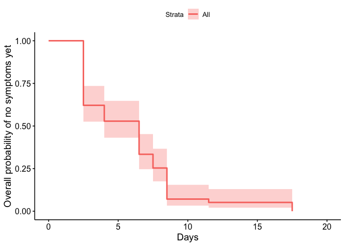
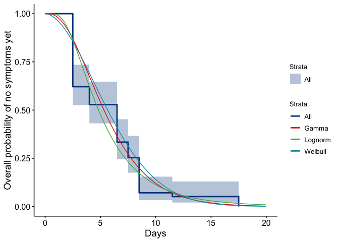
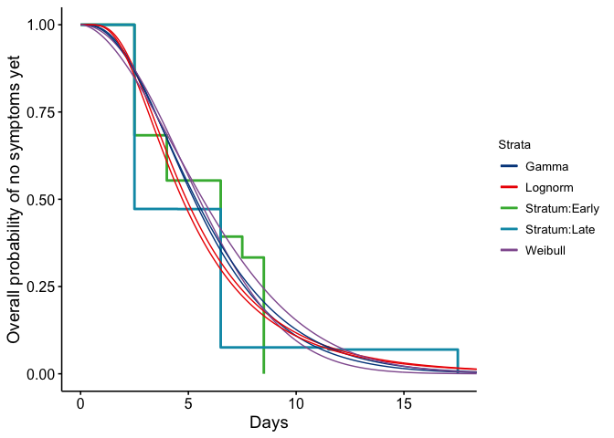

  


## Data 

Thanks to EpiCoronaHack Cluster team. These data are manually entered from postings from the Government of Singapore website: [website](https://www.moh.gov.sg/covid-19).
  


```r
#spdata <- read_csv("data/COVID-19_Singapore_data_revised.csv")
spdata <-read_csv("data/COVID-19_Singapore_data_revised.csv", col_types = list(presumed_infected_date = col_datetime())) # JS: this seems to make the dates read in correctly

# Ensure properly imported
glimpse(spdata)
```

```
## Observations: 93
## Variables: 25
## $ CaseID                 <dbl> 1, 2, 3, 26, 4, 5, 6, 7, 8, 9, 10, 11, 12, 13,…
## $ `Related cases`        <chr> "2,3", "1,3", "1,2", "13", "11", NA, NA, NA, "…
## $ `Cluster links`        <chr> NA, NA, NA, NA, NA, NA, NA, NA, "9,31,33,38,83…
## $ `Relationship notes`   <chr> NA, NA, "Son of 1", "Daughter of 13", NA, NA, …
## $ Case                   <chr> "Case 1, 66M, Wuhan", "Case 2, 53F, Wuhan", "C…
## $ age                    <dbl> 66, 53, 37, 42, 36, 56, 56, 35, 56, 56, 56, 31…
## $ sex                    <chr> "M", "F", "M", "F", "M", "F", "M", "M", "F", "…
## $ country                <chr> "Singapore", "Singapore", "Singapore", "Singap…
## $ hospital               <chr> "Singapore General Hospital", "National Centre…
## $ presumed_infected_date <dttm> 2020-01-20, 2020-01-20, 2020-01-20, 2020-01-2…
## $ presumed_reason        <chr> "Arrived from Wuhan", "Arrived from Wuhan", "A…
## $ last_poss_exposure     <date> 2020-01-20, 2020-01-20, 2020-01-20, 2020-01-2…
## $ contact_based_exposure <date> NA, NA, NA, NA, NA, NA, NA, NA, NA, NA, NA, N…
## $ start_source           <date> 2019-12-31, 2020-01-01, 2020-01-03, NA, 2020-…
## $ end_source             <date> 2020-01-20, 2020-01-20, 2020-01-20, 2020-01-2…
## $ date_onset_symptoms    <date> 2020-01-20, 2020-01-21, 2020-01-23, NA, 2020-…
## $ date_quarantine        <date> NA, NA, NA, NA, NA, NA, NA, NA, NA, NA, NA, 2…
## $ date_hospital          <date> 2020-01-22, 2020-01-22, 2020-01-23, 2020-01-2…
## $ date_confirmation      <date> 2020-01-23, 2020-01-24, 2020-01-24, 2020-02-0…
## $ outcome                <chr> "Discharged", "Discharged", "Discharged", "Dis…
## $ date_discharge         <date> 2020-02-19, 2020-02-07, 2020-02-21, 2020-02-0…
## $ travel_history         <chr> "Wuhan", "Wuhan", "Wuhan", "Wuhan", "Wuhan", "…
## $ additional_information <chr> "Travelled with Case 3 (son) and M1 (wife) ;MO…
## $ cluster                <chr> "Wuhan", "Wuhan", "Wuhan", "Wuhan", "Wuhan", "…
## $ citizenship            <chr> "China", "China", "China", "China", "China", "…
```

```r
colSums(is.na(spdata))
```

```
##                 CaseID          Related cases          Cluster links 
##                      0                     41                     88 
##     Relationship notes                   Case                    age 
##                     64                      0                      0 
##                    sex                country               hospital 
##                      0                      0                      0 
## presumed_infected_date        presumed_reason     last_poss_exposure 
##                     16                     16                     65 
## contact_based_exposure           start_source             end_source 
##                     42                      7                      0 
##    date_onset_symptoms        date_quarantine          date_hospital 
##                     10                     78                      0 
##      date_confirmation                outcome         date_discharge 
##                      0                     31                     31 
##         travel_history additional_information                cluster 
##                      0                     55                     23 
##            citizenship 
##                      0
```

```r
# Rename columns 2, 3 and 4 so no spaces
spdata <- rename(spdata, related_cases = starts_with("Related"),
                 cluster_links = "Cluster links",
                 relationship_notes = starts_with("Relation"))

# make sure dates parsed properly
range(spdata$presumed_infected_date, na.rm = T)
```

```
## [1] "2020-01-18 UTC" "2020-02-10 UTC"
```

```r
range(spdata$last_poss_exposure, na.rm = T)
```

```
## [1] "2020-01-18" "2020-02-09"
```

```r
range(spdata$contact_based_exposure, na.rm = T)
```

```
## [1] "2020-01-19" "2020-02-10"
```

```r
range(spdata$date_onset_symptoms, na.rm = T)
```

```
## [1] "2020-01-20" "2020-02-17"
```

```r
range(spdata$date_quarantine, na.rm = T)
```

```
## [1] "2020-01-26" "2020-02-25"
```

```r
range(spdata$date_hospital, na.rm = T)
```

```
## [1] "2020-01-22" "2020-02-25"
```

```r
range(spdata$date_confirmation, na.rm = T)
```

```
## [1] "2020-01-23" "2020-02-26"
```

```r
range(spdata$date_discharge, na.rm = T)
```

```
## [1] "2020-02-04" "2020-02-26"
```

```r
range(spdata$start_source, na.rm = T)
```

```
## [1] "2019-12-31" "2020-02-02"
```

```r
range(spdata$end_source, na.rm = T)
```

```
## [1] "2020-01-18" "2020-02-17"
```

```r
spdata <- filter(spdata, !is.na(date_onset_symptoms)) #Remove all the cases that do not have info on date of symptom onset # NOTE: 10 of these
```

## Incubation period (without accounting for intermediates)

The incubation period is the time between exposure and the onset of symptoms. We estimate this directly from the stated start and end times for cases' exposure windows. These are now explicitly listed for both Tianjin and Singapore datasets in the 'start_source' and 'end_source' columns.

The rules for defining these start and end dates are as follows:

- For Wuhan travel cases, their end_source is equal to the time they travelled from Wuhan. In the absence of any other contact info, their start_source is equal to their symptom onset - 20 days, to account for wide uncertainty. 

- For cluster cases thought to originate from an index case (but with no further known dates of contact), the start source is set to the 1st symptom onset in the cluster - 7 days. The end date is set to the minimum of the earliest quarantine, hospitalization or hospitalization in the cluster, and the symptom onset date of the case in question. (We assume that once a case in a cluster was identified, people were well aware of this and stopped mixing).

- For cluster cases thought to originate from a specific meeting/event (e.g. company meeting at Grand Hyatt hotel), the start_source is set to the 1st known meeting day. The end_source is set to that day + 4. (4 to account for some error/uncertainty)

- For cases with no known contact or travel info, their start_source is their symptom onset - 20 and their end_source is their symptom onset date (essentially, we have no information on these cases)

If no other end time for the exposure is given (by a known epidemiological route) or if the end of the exposure time is after the time of symptom onset, we set the last exposure time to the symptom onset time. This is because they must have been exposed before symptom onset.


```r
# Let's confirm that the end_source is always before or equal to the symptom onset date
sum(spdata$end_source>spdata$date_onset_symptoms) # =0. Good
```

```
## [1] 0
```


```r
spdata$minIncTimes <- spdata$date_onset_symptoms - spdata$end_source
spdata$maxIncTimes <- spdata$date_onset_symptoms - spdata$start_source
```


We assume that incubation times have to be at least 1 day, based on prior knowledge. We set the maximum incubation times as at least 3 days, to take into account some uncertainty on symptom onset reporting.


```r
#spdata = filter(spdata, maxIncTimes > 2)
spdata$maxIncTimes = pmax(3, spdata$maxIncTimes)
spdata$minIncTimes = pmax(1, spdata$minIncTimes)
```


We use survival analysis in the icenReg package to make parametric estimates, and we use the regular survival package to estimate the time to onset of symptoms. 


```r
ggsurvplot(
fit <- survfit(Surv(spdata$minIncTimes, spdata$maxIncTimes, type="interval2") ~ 1, data = spdata), 
xlab="Days",
ylab = "Overall probability of no symptoms yet")
```

<!-- -->


Just try one where data are stratifed by whether the person has a last possible exposure given, or not. 


```r
spcopy = spdata; spcopy$has_last = as.factor(!(is.na(spdata$last_poss_exposure)))
spcopyfit <- ic_par(Surv(spcopy$minIncTimes, spcopy$maxIncTimes, type="interval2") ~ has_last, data = spcopy, dist = "weibull")
summary(spcopyfit) 
```

```
## 
## Model:  Cox PH
## Dependency structure assumed: Independence
## Baseline:  weibull 
## Call: ic_par(formula = Surv(spcopy$minIncTimes, spcopy$maxIncTimes, 
##     type = "interval2") ~ has_last, data = spcopy, dist = "weibull")
## 
##              Estimate Exp(Est) Std.Error z-value        p
## log_shape       0.597    1.817     0.112    5.35 8.81e-08
## log_scale       1.941    6.967     0.093   20.87 0.00e+00
## has_lastTRUE   -0.699    0.497     0.387   -1.80 7.10e-02
## 
## final llk =  -44.1 
## Iterations =  4
```

```r
getFitEsts(spcopyfit, newdata = data.frame(has_last=as.factor(TRUE)), p
                      =c(0.025, 0.05, 0.25, 0.5, 0.75, 0.95, 0.975))
```

```
## [1]  1.23  1.82  4.70  7.62 11.16 17.06 19.13
```

```r
getFitEsts(spcopyfit, newdata = data.frame(has_last=as.factor(FALSE)), p
                      =c(0.025, 0.05, 0.25, 0.5, 0.75, 0.95, 0.975))
```

```
## [1]  0.84  1.24  3.20  5.19  7.60 11.61 13.02
```

```r
ggsurvplot(
fit <- survfit(Surv(spcopy$minIncTimes, spcopy$maxIncTimes, type="interval2") ~ spcopy$has_last), data = spcopy, 
xlab="Days",
ylab = "Overall probability of no symptoms yet",
surv.median.line = c('hv'))
```

<!-- -->

```r
#ggsave("inc_sing_by_haslastexp.pdf", height = 6, width = 8)
```


 We use interval censoring, because we know only that exposure was some time between the minimum and maximum possible values. 


```r
# sum(is.na(spdata$minIncTimes)) # 0

# to switch: choose from these two lines

# spfirst = spcopy[which(spcopy$has_last ==TRUE),]
getthreefits=function(spfirst) {
myfit <- ic_par(Surv(spfirst$minIncTimes, spfirst$maxIncTimes, type="interval2") ~ 1, data = spdata, dist = "weibull")


myfit_gamma<- ic_par(Surv(spfirst$minIncTimes, spfirst$maxIncTimes, type="interval2") ~ 1, data = spdata, dist = "gamma")


myfit_lnorm =  ic_par(Surv(spfirst$minIncTimes, spfirst$maxIncTimes, type="interval2") ~ 1, data = spdata, dist = "lnorm")
return(list(myfit=myfit, myfit_gamma=myfit_gamma, myfit_lnorm=myfit_lnorm))
}

allthree=getthreefits(spdata)
myfit=allthree$myfit
myfit_gamma=allthree$myfit_gamma
myfit_lnorm=allthree$myfit_lnorm
```


We want to report (1) the parameters for these fits and the quantiles (including median). This describes the distribution.

Then we want to report (2) the resulting mean (95% CI for the mean). This describes our uncertainty in the distribution. 

(1) For the point estimates, get the parameters and quantiles for these  distributions. For Weibull and gamma distributions, the two parameters are shape and scale. For log normal they are mu and sdlog. 


```r
getQuantileDF <- function(myfit,myfit_gamma,myfit_lnorm) {
interqs=getFitEsts(myfit, newdata = NULL, p=c(0.025, 0.25, 0.5, 0.75,0.975)) #
interqs_gamma <- getFitEsts(myfit_gamma, newdata=NULL,  p
                      =c(0.025, 0.25, 0.5, 0.75, 0.975))

interqs_lnorm <- getFitEsts(myfit_lnorm, newdata=NULL,  p
                      =c(0.025,  0.25, 0.5, 0.75, 0.975))
mm=rbind(interqs, interqs_gamma, interqs_lnorm)
colnames(mm)=paste("q_",c(0.025, 0.25, 0.5, 0.75, 0.975),sep="")

df=as.data.frame(mm); df$distr =c("Weibull","Gamma","Log normal")
df$par1=c(exp(myfit$coefficients[1]), exp(myfit_gamma$coefficients[1]), 
          myfit_lnorm$coefficients[1])
df$par2=c(exp(myfit$coefficients[2]), exp(myfit_gamma$coefficients[2]), 
          exp(myfit_lnorm$coefficients[2]))
rownames(df)=NULL

return(df[,c(6,7,8,1:5)])
}

getQuantileDF(myfit,myfit_gamma,myfit_lnorm)
```

```
##        distr par1 par2 q_0.025 q_0.25 q_0.5 q_0.75 q_0.975
## 1    Weibull 1.83 6.91   0.924   3.50  5.66   8.27    14.1
## 2      Gamma 3.05 1.95   1.251   3.45  5.32   7.78    14.3
## 3 Log normal 1.57 0.60   1.489   3.22  4.83   7.24    15.7
```


(2) Now we want the mean and 95% CIs on this mean. The "myfit" objects contain the estimates and covariance for these. Without wanting to code up the theory, the quick approach is to resample the shape and scale with appropriate covariance and compute the resampled means, then take the 95\% CIs. The functional form is different for the three different distributions. 


```r
getMeanCI <- function(statfit, dist = "weibull") {
  if (dist == "weibull") {
  x=exp(rmvnorm(n=10000, mean = statfit$coefficients, sigma=statfit$var))
  mymeans=x[,2]*gamma(1+1/x[,1]) # shape, scale for weibull 
  par1=exp(statfit$coefficients[1])
   par2=exp(statfit$coefficients[2])
  par1range=c(exp(log(par1)-1.96*sqrt(statfit$var[1,1])), exp(log(par1)+1.96*sqrt(myfit$var[1,1])))
   par2range=c(exp(log(par2)-1.96*sqrt(statfit$var[2,2])), exp(log(par2)+1.96*sqrt(myfit$var[2,2])))
  }
  if (dist == "gamma") {
      x=exp(rmvnorm(n=10000, mean = statfit$coefficients, sigma=statfit$var)) # shape, scale for gamma
      mymeans = x[,1]*x[,2] # gamma: mean  is shape*scale
  par1=exp(statfit$coefficients[1])
   par2=exp(statfit$coefficients[2])
  par1range=c(exp(log(par1)-1.96*sqrt(statfit$var[1,1])), exp(log(par1)+1.96*sqrt(myfit$var[1,1])))
   par2range=c(exp(log(par2)-1.96*sqrt(statfit$var[2,2])), exp(log(par2)+1.96*sqrt(myfit$var[2,2])))
  }
  if (dist == "lognorm") {
  x=rmvnorm(n=10000, mean = statfit$coefficients, sigma=statfit$var) 
  # these are the log of the mean, and the log of sd? 
  # mean is exp(mu + 0.5 sig^2) 
  mymeans=exp(x[,1]+0.5*exp(x[,2])^2) # i think
  par1=statfit$coefficients[1]
   par2=exp(statfit$coefficients[2])
    par1range=c(par1-1.96*sqrt(statfit$var[1,1]), par1+1.96*sqrt(myfit$var[1,1]))
   par2range=c(exp(statfit$coefficients[2]-1.96*sqrt(statfit$var[2,2])), exp(statfit$coefficients[2]+1.96*sqrt(statfit$var[2,2])))
  }
return(list(par1=par1,par2=par2, par1range=par1range, par2range=par2range, means=mymeans, qs = quantile(mymeans, probs = c(0.025, 0.5, 0.975)), meanmeans=mean(mymeans), sdmeans=sd(mymeans)))
}
```

**Table 1 (without intermediates) and Appendix Table 1** for unstratified mean incubation period and CI for these fits: 


```r
getMeanCI_DF = function(myfit,myfit_gamma,myfit_lnorm) {
out_weib=getMeanCI(statfit = myfit, dist = "weibull")
out_gamm = getMeanCI(statfit =myfit_gamma, dist = "gamma")
out_lnorm=getMeanCI(statfit =myfit_lnorm, dist="lognorm")
return(data.frame(par1s=c(out_weib$par1, 
                          out_gamm$par1, 
                          out_lnorm$par1),
                   par1lower=c(out_weib$par1range[1], 
                          out_gamm$par1range[1], 
                          out_lnorm$par1range[1]),
                  par1upper=c(out_weib$par1range[2], 
                          out_gamm$par1range[2], 
                          out_lnorm$par1range[2]), # there is a better way .. but.
                  par2s=c(out_weib$par2, 
                          out_gamm$par2, 
                          out_lnorm$par2),
               par2lower=c(out_weib$par2range[1], 
                          out_gamm$par2range[1], 
                          out_lnorm$par2range[1]),
                  par2upper=c(out_weib$par2range[2], 
                          out_gamm$par2range[2], 
                          out_lnorm$par2range[2]), # there is a better way .. but.
                  means=c(out_weib$meanmeans, 
                          out_gamm$meanmeans, 
                          out_lnorm$meanmeans),
           meanlower=c(out_weib$qs[1], out_gamm$qs[1],
                     out_lnorm$qs[1]),
           meanupper=c(out_weib$qs[3],out_gamm$qs[3],
                     out_lnorm$qs[3])))
}
getMeanCI_DF(myfit,myfit_gamma,myfit_lnorm)
```

```
##   par1s par1lower par1upper par2s par2lower par2upper means meanlower meanupper
## 1  1.83      1.45      2.30  6.91     5.766     8.289  6.18      5.16      7.38
## 2  3.05      2.00      3.84  1.95     1.234     2.343  5.99      4.97      7.14
## 3  1.57      1.38      1.81  0.60     0.475     0.759  5.84      4.76      7.08
```

Here is a plot of the estimated distribution together with the empirical survival curve from the data. This is Figure 44a (upper panel) in the manuscript.

### Generating figure 4a above panel for paper (not stratified)
This is to plot the Kaplan-Meier survival curve and estimated probability distribution of days post-infection for a case not to be showing symptoms yet (using three possible distributions: weibull, gamma, and log-normal).


```r
spdays <- seq(0,20, by=0.05)

ggsp = ggsurvplot(
fit=survfit(Surv(spdata$minIncTimes, spdata$maxIncTimes, type="interval2")~1, data=spdata), combine = TRUE,
xlab="Days",  ylab = "Overall probability of no symptoms yet", palette = "lancet",legend=c('right'))

pdata <- data.frame(days=rep(spdays,3),  
            fitsurv=c(1-pweibull(spdays, shape = exp(myfit$coefficients[1]), scale = exp(myfit$coefficients[2])),
        1-pgamma(spdays,  shape = exp(myfit_gamma$coefficients[1]), scale = exp(myfit_gamma$coefficients[2])),
        1-plnorm(spdays,  meanlog = myfit_lnorm$coefficients[1], sdlog = exp(myfit_lnorm$coefficients[2]))),distn=c(rep("Weibull", length(spdays)), rep("Gamma",length(spdays)), rep("Lognorm", length(spdays)) )) 
                                                            
ggsp$plot+geom_line(data = pdata, aes(x = days, y = fitsurv, color=distn))
```

<!-- -->

```r
#  ggsave(filename = "final_figures/Fig4a_inc_Sing_all.pdf", width = 8, height = 6)
```

### Generating Table 1 and Figure 4a below panel for paper (stratified into early and late)
Finally, we want to do this all again but stratifying the data between early occurring cases and late. 


```r
spcopy$is_early = (spdata$date_onset_symptoms < ymd("2020-02-01"))
earlydata = spcopy[which(spcopy$is_early==TRUE),]
latedata=spcopy[which(spcopy$is_early==FALSE),]
```


Fit to the three distributions: 


```r
Eallthree=getthreefits(earlydata)
Lallthree=getthreefits(latedata)
```

EARLY: parameter point estimates and the quantiles


```r
getQuantileDF(Eallthree[[1]],Eallthree[[2]], Eallthree[[3]])
```

```
##        distr par1  par2 q_0.025 q_0.25 q_0.5 q_0.75 q_0.975
## 1    Weibull 2.05 6.587    1.10   3.59  5.51   7.72    12.4
## 2      Gamma 3.22 1.818    1.30   3.46  5.26   7.61    13.8
## 3 Log normal 1.59 0.598    1.52   3.28  4.91   7.35    15.9
```

LATE: parameter point estimates and the quantiles


```r
getQuantileDF(Lallthree[[1]],Lallthree[[2]], Lallthree[[3]])
```

```
##        distr par1  par2 q_0.025 q_0.25 q_0.5 q_0.75 q_0.975
## 1    Weibull 1.75 6.989   0.858   3.43  5.67   8.42    14.7
## 2      Gamma 2.96 2.034   1.220   3.44  5.35   7.87    14.6
## 3 Log normal 1.55 0.606   1.439   3.14  4.72   7.11    15.5
```

EARLY: how variable are these point estimates? Look at mean and 95\% CI (**Table 1 (without intermediates) and Appendix Table 2**)


```r
getMeanCI_DF(Eallthree[[1]],Eallthree[[2]], Eallthree[[3]])
```

```
##   par1s par1lower par1upper par2s par2lower par2upper means meanlower meanupper
## 1  2.05      1.34      2.58 6.587     5.077     7.897  5.92      4.47      7.62
## 2  3.22      1.67      4.05 1.818     0.847     2.180  5.91      4.50      7.64
## 3  1.59      1.33      1.82 0.598     0.421     0.848  6.02      4.49      8.03
```

LATE: how variable are these point estimates? Look at mean and 95\% CI (**Table 1 (without intermediates) and Appendix Table 2**)


```r
getMeanCI_DF(Lallthree[[1]],Lallthree[[2]], Lallthree[[3]])
```

```
##   par1s par1lower par1upper par2s par2lower par2upper means meanlower meanupper
## 1  1.75      1.29      2.21 6.989     5.408     8.380  6.30      4.87      8.09
## 2  2.96      1.68      3.72 2.034     1.132     2.439  6.06      4.70      7.67
## 3  1.55      1.25      1.78 0.606     0.441     0.834  5.79      4.29      7.63
```


### Generating Fig 4a below panel for the paper (stratified)
This is to plot the Kaplan-Meier survival curves and estimated probability distribution of days post-infection for a case not to be showing symptoms yet, when stratifying the data pre and post quarantine procedures in China. As per tables above, having a specified last possible exposure date (which are all on or before Jan 30, 2020) is the cut-off for what defines an "early" case. 


```r
#generating figure 3 below panel from the paper
spdays <- seq(0,20, by=0.05)

fit1<-survfit(Surv(earlydata$minIncTimes, earlydata$maxIncTimes, type="interval2")~1, data=earlydata)
fit2<-survfit(Surv(latedata$minIncTimes, latedata$maxIncTimes, type="interval2")~1, data=latedata)

fit <- list(early = fit1, late = fit2)
ggsp2=ggsurvplot(fit, data = spcopy, combine = TRUE, # Combine curves
             # Clean risk table
           xlab="Days",  ylab = "Overall probability of no symptoms yet", palette = "lancet",legend.labs=c("Stratum:Early","Stratum:Late"),legend=c('right'))
```

```
## Warning: Vectorized input to `element_text()` is not officially supported.
## Results may be unexpected or may change in future versions of ggplot2.

## Warning: Vectorized input to `element_text()` is not officially supported.
## Results may be unexpected or may change in future versions of ggplot2.

## Warning: Vectorized input to `element_text()` is not officially supported.
## Results may be unexpected or may change in future versions of ggplot2.
```

```r
pdata <- data.frame(days=rep(spdays,3),  
            fitsurv=c(1-pweibull(spdays, shape = exp(Eallthree$myfit$coefficients[1]), scale = exp(Eallthree$myfit$coefficients[2])),
        1-pgamma(spdays,  shape = exp(Eallthree$myfit_gamma$coefficients[1]), scale = exp(Eallthree$myfit_gamma$coefficients[2])),
        1-plnorm(spdays,  meanlog = Eallthree$myfit_lnorm$coefficients[1], sdlog = exp(Eallthree$myfit_lnorm$coefficients[2]))),distn=c(rep("Weibull", length(spdays)), rep("Gamma",length(spdays)), rep("Lognorm", length(spdays)) )) 
                                                            
pdata1 <- data.frame(days=rep(spdays,3),  
            fitsurv=c(1-pweibull(spdays, shape = exp(Lallthree$myfit$coefficients[1]), scale = exp(Lallthree$myfit$coefficients[2])),
        1-pgamma(spdays,  shape = exp(Lallthree$myfit_gamma$coefficients[1]), scale = exp(Lallthree$myfit_gamma$coefficients[2])),
        1-plnorm(spdays,  meanlog = Lallthree$myfit_lnorm$coefficients[1], sdlog = exp(Lallthree$myfit_lnorm$coefficients[2]))),distn=c(rep("Weibull", length(spdays)), rep("Gamma",length(spdays)), rep("Lognorm", length(spdays)) )) 
                                                            
ggsp2$plot + geom_line(data = pdata, aes(x = days, y = fitsurv,color=distn)) +geom_line(data = pdata1, aes(x = days, y = fitsurv,color=distn)) 
```

<!-- -->

```r
#  ggsave(filename = "final_figures/Fig4a_inc_Sing_strata.pdf", width = 8, height = 6)
```


