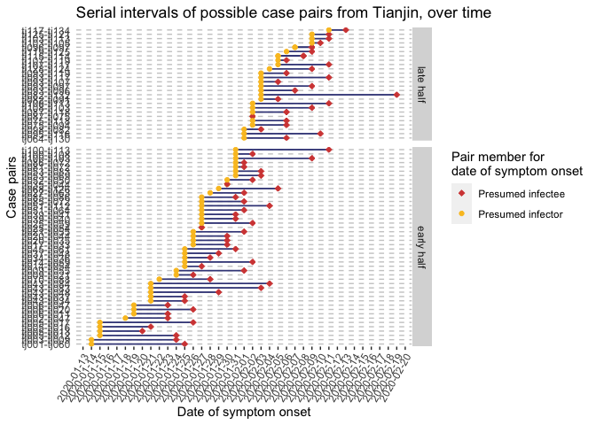

## Data 

Thanks to Dongxuan Chen and Louxin Zhang. These data are from three main sources:

* source1: http://wsjk.tj.gov.cn/col/col87/index.html#!uid=259&pageNum=1 (Tianjin health commission official website, for daily announcements)

* source2: https://weibo.com/u/2967529507 (Jinyun News, Tianjin offical local media weibo account, for patient symptom onset reference)

* source3: https://m.weibo.cn/status/IrrHI1FHm?jumpfrom=weibocom (another Tianjin local media weibo link, for mall cluster reference)


```r
tdata=read.csv("data/Tianjin135cases_revised.csv",na.strings = "", stringsAsFactors = F)
tdata$symptom_onset=as.Date(tdata$symptom_onset, format = "%d/%m/%Y")
tdata$start_source=as.Date(tdata$start_source, format = "%d/%m/%Y")
tdata$end_source=as.Date(tdata$end_source,format = "%d/%m/%Y" )
tdata$confirm_date=as.Date(tdata$confirm_date,format = "%d/%m/%Y" )
str(tdata)
```

```
## 'data.frame':	135 obs. of  13 variables:
##  $ case_id                              : chr  "TJ1" "TJ2" "TJ3" "TJ4" ...
##  $ gender                               : chr  "F" "M" "F" "M" ...
##  $ age                                  : int  59 57 68 40 46 56 29 39 57 30 ...
##  $ symptom_onset                        : Date, format: "2020-01-14" "2020-01-18" ...
##  $ symptom_type                         : chr  "NA" "NA" "NA" "NA" ...
##  $ confirm_date                         : Date, format: "2020-01-21" "2020-01-21" ...
##  $ Infection_source                     : chr  "Wuhan" "Wuhan; train import" "Wuhan" "Wuhan" ...
##  $ start_source                         : Date, format: "2020-01-05" NA ...
##  $ end_source                           : Date, format: "2020-01-14" "2020-01-18" ...
##  $ severity                             : chr  "severe" "severe" "severe" "normal" ...
##  $ death                                : chr  NA NA NA NA ...
##  $ recorrection.for.start.and.end.source: chr  "symptom onset as ending source " "added end source" NA NA ...
##  $ notes                                : chr  "sometimes Tianjin didn't mention the patient's severity" "Tianjin didn't tell which patient got cured, but they report death cases" "source1: http://wsjk.tj.gov.cn/col/col87/index.html#!uid=259&pageNum=1 (Tianjin health commission official webs"| __truncated__ "source2: https://weibo.com/u/2967529507 (Jinyun News, Tianjin offical local media weibo account, for patient sy"| __truncated__ ...
```

```r
glimpse(tdata)
```

```
## Observations: 135
## Variables: 13
## $ case_id                               <chr> "TJ1", "TJ2", "TJ3", "TJ4", "TJ…
## $ gender                                <chr> "F", "M", "F", "M", "M", "M", "…
## $ age                                   <int> 59, 57, 68, 40, 46, 56, 29, 39,…
## $ symptom_onset                         <date> 2020-01-14, 2020-01-18, 2020-0…
## $ symptom_type                          <chr> "NA", "NA", "NA", "NA", "sore t…
## $ confirm_date                          <date> 2020-01-21, 2020-01-21, 2020-0…
## $ Infection_source                      <chr> "Wuhan", "Wuhan; train import",…
## $ start_source                          <date> 2020-01-05, NA, NA, NA, NA, NA…
## $ end_source                            <date> 2020-01-14, 2020-01-18, 2020-0…
## $ severity                              <chr> "severe", "severe", "severe", "…
## $ death                                 <chr> NA, NA, NA, NA, NA, NA, NA, NA,…
## $ recorrection.for.start.and.end.source <chr> "symptom onset as ending source…
## $ notes                                 <chr> "sometimes Tianjin didn't menti…
```


## Estimates of serial interval from Tianjin data (without imputation)

We will estimate the serial interval using the 'interval case to case' approach given in Vink et al (https://academic.oup.com/aje/article/180/9/865/2739204). 

Note that we are removing cases that do NOT have a date of symptom onset to determine the ICC. There are 10 cases without symptom onset, but all have a confirmation date. We will re-run the estimates with imputed data a little later on. 

```r
# Make a copy of the original dataset for use later on in imputed serial interval estimates
tdata_org <- tdata

# Remove any cases that are missing data for date of symptom onset
tdata <- tdata[which(!is.na(tdata$symptom_onset)),]  #removes 10 observations
```

We need to fix a data entry error in Infection_source column, where TJ is listed as JN. This WILLL affect the node/edges used later, so important to fix this here.

```r
tdata$Infection_source <- str_replace(tdata$Infection_source, pattern = "JN", replacement = "TJ")
```

Now let's make a column which groups all the information in the 'Infection_source' column into categories. Because the infection_source column can contain multiple possible sources of infection (for a handful of cases), it is important to consistently apply a decision rule for when each case would be assigned to a particular infection source group. Here we are emphasizing the Wuhan/Hubei and other known mall outbreak clusters over known interpersonal relationships, as it seems to best represent the introduction of the outbreak. **These groups are NOT used in the estimation of the serial intervals - only to help visualize the network graph.**

Decision rule applied to source_group label classification:

1. Known outbreak cluster locations (e.g. Wuhan/Hubei, mall, or church) *highest priority*

2. Known close relationship to another case (i. family; ii. work; iii. other known direct contact)

3. Known travel history to non-outbreak locations or unclear destinations

4. Any other listed associations (e.g. being part of a particular at-risk group such as airport worker)

5. No known source of possible viral exposure *lowest priority*


```r
# Make a column for sensible groupings for Tianjin, based on the reason why the case was exposed
# Turn 'Infection_source' into lower case and get trim any whitespace so don't have issues with case sensitivity, etc
tdata$Infection_source <- str_to_lower(tdata$Infection_source)
tdata$Infection_source <- str_trim(tdata$Infection_source)
#table(tdata$Infection_source)
sum(is.na(tdata$Infection_source)) #1 NA
```

```
## [1] 1
```

```r
#Create a duplicated Infection_source column for the purposes of string manipulation so we can appropriately group sources of infection
tdata$Infection_source_dup <- tdata$Infection_source

#Change the string "person" to "individual" or else it will get picked up as a relative (matches "son") in the code below
tdata$Infection_source_dup <- str_replace_all(tdata$Infection_source_dup, pattern = "person", replacement = "individual")

#Case TJ27 is infected by a coworker from Wuhan, so we want the source label to be coworker, not Wuhan
  #so need to remove "Wuhan" from the reason or it will get labeled as Wuhan below
tdata$Infection_source_dup <- str_replace(tdata$Infection_source_dup, 
                                          pattern = "coworker of a individual from wuhan",
                                          replacement = "coworker")

#Note that the order the data are selected in is VERY important to which case goes into which source_group category
  #For those that meet multiple criteria (e.g. wuhan; tj1), the str_match which is highest in the case_when call (i.e. "wuhan|hubei") will have priority over those matching later 
  #so that the 'source' column contain "wuhan; tj1" would be labelled as infection from a "wuhan" rather than from a "known relationship" origin 

#See what happens when we emphasize the wuhan and travel cases over known relationships
  #This seems logical, given that the epicenter of the outbreak was Wuhan
tdata <- mutate(tdata, source_group = case_when(!is.na(str_match(Infection_source_dup, "wuhan|hubei")) ~ "Wuhan and Hubei", #Priority 1
                                                  !is.na(str_match(Infection_source_dup, "mall|store|shopper|shopping")) ~ "Mall", #Priority 1
                                                  !is.na(str_match(Infection_source_dup, "family|relative|wife|mother|son|sister|daughter|brother|husband|duaghtor|whife|hunsband")) ~ "Relative", #Priority 2
                                                  !is.na(str_match(Infection_source_dup, "coworker|business|workplace|colleague|colleage")) ~ "Coworker", #Priority 2
                                                  !is.na(str_match(Infection_source_dup, "tj|patient")) ~ "Other relationship", #Priority 2
                                                  !is.na(str_match(Infection_source_dup, "train|travel|trip|hebei|dalian")) ~ "Other travel", #Priority 3
                                                  !is.na(str_match(Infection_source_dup, "unknown|unclear")) ~ "Unknown", #Priority 5
                                                  is.na(Infection_source_dup) ~ "Unknown", #Priority 5
                                                  T ~ "other")) #there should be none of these, so this is just a sanity check!  

#Remove the duplicated infection source column which is no longer necessary
tdata <- select(tdata, -Infection_source_dup)

#What is distribution of probably source of infection (grouped)?
table(tdata$source_group) 
```

```
## 
##           Coworker               Mall Other relationship       Other travel 
##                  8                 28                 14                  8 
##           Relative            Unknown    Wuhan and Hubei 
##                 35                  7                 25
```

```r
# Save this object for plotting incidence curve by infection source group (figure 2b)
#save(tdata, file = "data/Tianjin_cleaned_infection_source_groups.rdata")
```

The dataset has quite a few instances where a putative infector or contact is known. These are listed in the 'Infection_source' column. We first make a graph in which nodes are individuals and edges are present from cases listed as possible sources, to the cases for whom they are possible sources. These are extracted regardless of which infection source group label has been applied.


```r
mynodes <- tdata$case_id

#Transform everything to lower case to make sure there aren't any issues with matching due to case inconsistencies
mynodes <- str_to_lower(mynodes) 
tdata$case_id <- str_to_lower(tdata$case_id)

edges = data.frame(from=mynodes[9],to=mynodes[21],stringsAsFactors = F ) # i read this one manually 

for (id in 1:nrow(tdata)) {
tonode=tdata$case_id[id]
fromnodes=str_extract_all(tdata$Infection_source[id], "tj\\d+", simplify = T) #in lower case due to above early/late split on infection source
  if (length(fromnodes)>0) {
    for (k in 1:length(fromnodes)) {
      edges=rbind(edges, c(fromnodes[k], tonode))
    }
  }
}
head(edges)
```

```
##   from   to
## 1  tj9 tj21
## 2  tj3  tj9
## 3  tj6 tj11
## 4  tj5 tj12
## 5  tj5 tj13
## 6  tj5 tj16
```

```r
edges=edges[-1,] #Remove the initial relationship we gave so it isn't duplicated
edges=edges[-which(is.na(edges[,1])),] # NAs arose from a few empty entries for Infection_source 
```

We need to make sure the cases labelled as "from" (aka the infectors) actually got the virus prior to those in the "to" column (aka the infectees). It is reasonable to assume that cases that were infected first will show signs of infection first, so within case-pairs we will assign the case with the earliest date of symptom onset as the "from" (infector) case and the case with the later date of symptom onset as "to".

To do this, let's start by making a new dataset from our case pairs ('undir') that contains date of symptom onset for each case. We will make a few new columns, both for determining which case has the earliest date of symptom onset, as well as to plot serial intervals over time later on. 

```r
# Make a smaller dataset of original spdata that contains only the CaseID and date of symptom onset
tdata_sympt <- select(tdata, case_id, symptom_onset)

# Add the date of symptom onset -for the caseID of the 'from' case - to the case pairs dataset (edges)
  #Do some renaming so the join is based on the caseID in the from column and that name of date column reflects this
names(tdata_sympt) <- str_replace(names(tdata_sympt), "case_id", "from")
undir_tdates <- left_join(edges, tdata_sympt, by = "from")
names(undir_tdates) <- str_replace(names(undir_tdates), "symptom_onset", "from_sympt_date")

# Repeat, but add the date of symptom onset for the caseID of the 'to' case
names(tdata_sympt) <- str_replace(names(tdata_sympt), "from", "to")
undir_tdates <- left_join(undir_tdates, tdata_sympt, by = "to")
names(undir_tdates) <- str_replace(names(undir_tdates), "symptom_onset", "to_sympt_date")

# Now add some extra columns which give us the raw serial interval (i.e. number of days between symptom onset in infector-infectee pairs)
  #As well as the absolute value of the serial interval (as some cases in the "from" and "to" columns should be switched around!)
  #And finally a 'direction' column in case we need to sort out which directions the arrows should be going in for a network graph and where we have missing dates
undir_tdates <- mutate(undir_tdates, earliest_sympt_onset = pmin(to_sympt_date, from_sympt_date, na.rm = T), 
                                   raw_serial_interval = to_sympt_date - from_sympt_date,   
                                   abs_serial_interval = abs(raw_serial_interval))
```

Now we need to split the dataset apart so that we can switch around the directionality of presumed transmission for case-pairs where the serial interval is negative. Easiest way to do this is to rename columns and then join back to the other parts of the dataset, based on the column names. This actually doesn't affect the serial inteval estimates, but makes the directionality on the network graph more likely to reflect the biology.

```r
# Split dataset into positive (or 0) serial interval vs. negative vs. NA 
  #A negative serial interval means our "to" and "from" cases are mixed up
pos <- filter(undir_tdates, raw_serial_interval >= 0)
neg <- filter(undir_tdates, raw_serial_interval < 0)
onlyone <- filter(undir_tdates, is.na(raw_serial_interval)) #3 NAs where date of symptom onset is not known; keep for making columns for now

# Negative dataset needs the column headers changed to reflect that the 'from' and 'to' columns are backwards
  #as we are assuming that the 'case with the earliest onset of symptoms would have been infected first, 
  #and passed on the infection to the other case in the pair
names(neg)
```

```
## [1] "from"                 "to"                   "from_sympt_date"     
## [4] "to_sympt_date"        "earliest_sympt_onset" "raw_serial_interval" 
## [7] "abs_serial_interval"
```

```r
names(neg)[1] <- "to"
names(neg)[2] <- "from"
names(neg)[3] <- "to_sympt_date"
names(neg)[4] <- "from_sympt_date"
names(neg)
```

```
## [1] "to"                   "from"                 "to_sympt_date"       
## [4] "from_sympt_date"      "earliest_sympt_onset" "raw_serial_interval" 
## [7] "abs_serial_interval"
```

```r
# Now bind the rows of the seperated datasets back together based on column names
  #Must use dplyr::bind_rows to bind based on column name rather than position
undir_tdates <- bind_rows(pos, neg, onlyone)

# For plotting - Add a column with padded to and from caseID numbers so they print in numerical order
  #Add a zero on the left of the number so all numbers have three digits  
undir_tdates$pto <- str_replace(undir_tdates$to, pattern = "tj", replacement = "")
undir_tdates$pto <- str_pad(undir_tdates$pto, width = 3, side = "left", pad = "0")

undir_tdates$pfrom <- str_replace(undir_tdates$from, pattern = "tj", replacement = "")
undir_tdates$pfrom <- str_pad(undir_tdates$pfrom, width = 3, side = "left", pad = "0")

# For plotting - Make a new column with case pair ID
undir_tdates <- mutate(undir_tdates, pairID = factor(paste("tj", pfrom, "-", "tj", pto, sep = "")))

rm(pos, neg, onlyone)
```

From the edge list we can use visNetwork to visualise the graph. Colours are from the infection source group column. 

```r
# Make data frame of edges, where the cases as the 'earliest' date of symptom onset are labeled as the "from" cases
  #Filter down to cases that do NOT have NAs for date of symptom onset (some added back in by being related cases)
tedges <- filter(undir_tdates, !is.na(raw_serial_interval))
tedges <- select(tedges, from, to)
tedges$arrows <- "to" 

# Select down to only the unique cases-pairs 
  #Note that if you keep the negative serial intervals as negatives, there are no duplicates; 
  #But instead there are two instances where you get a loop (tj114-tj115 and tj96-tj97)
  #ex) tj114 is supposed to infect tj115 and tj115 is supposed to infect tj114
tedges <- distinct(tedges)

# Save this object so we can use it to plot Fig4 Network diagram
#save(tedges, file = "data/tianjin_edges_for_network_plot.rdata")

# Make a data frames of nodes
nodes = data.frame(id=tdata$case_id, 
                   label=tdata$case_id,
                   group=tdata$source_group)

# Save this object so we can use it to plot Fig4 Network diagram
#save(nodes, file = "data/tianjin_nodes_for_network_plot.rdata")

# Plot a network graph here too, just so it's all visible in one md
visNetwork(nodes, tedges) %>% visLegend()
```

<!--html_preserve--><div id="htmlwidget-1aee73cbc26e64cda35b" style="width:672px;height:480px;" class="visNetwork html-widget"></div>
<script type="application/json" data-for="htmlwidget-1aee73cbc26e64cda35b">{"x":{"nodes":{"id":["tj1","tj2","tj3","tj4","tj5","tj6","tj7","tj8","tj9","tj10","tj11","tj12","tj13","tj14","tj15","tj16","tj17","tj18","tj19","tj20","tj21","tj22","tj23","tj24","tj25","tj26","tj27","tj28","tj29","tj30","tj31","tj32","tj33","tj34","tj35","tj36","tj37","tj39","tj40","tj41","tj42","tj43","tj44","tj45","tj47","tj48","tj49","tj50","tj51","tj52","tj53","tj54","tj55","tj56","tj57","tj58","tj59","tj60","tj61","tj62","tj63","tj64","tj65","tj66","tj67","tj68","tj69","tj70","tj71","tj72","tj73","tj74","tj75","tj76","tj77","tj78","tj79","tj80","tj81","tj82","tj83","tj84","tj85","tj86","tj87","tj88","tj89","tj90","tj91","tj92","tj93","tj94","tj95","tj96","tj97","tj98","tj100","tj103","tj105","tj106","tj107","tj108","tj109","tj110","tj111","tj112","tj113","tj114","tj115","tj116","tj117","tj118","tj119","tj120","tj121","tj122","tj124","tj125","tj126","tj128","tj130","tj131","tj132","tj133","tj134"],"label":["tj1","tj2","tj3","tj4","tj5","tj6","tj7","tj8","tj9","tj10","tj11","tj12","tj13","tj14","tj15","tj16","tj17","tj18","tj19","tj20","tj21","tj22","tj23","tj24","tj25","tj26","tj27","tj28","tj29","tj30","tj31","tj32","tj33","tj34","tj35","tj36","tj37","tj39","tj40","tj41","tj42","tj43","tj44","tj45","tj47","tj48","tj49","tj50","tj51","tj52","tj53","tj54","tj55","tj56","tj57","tj58","tj59","tj60","tj61","tj62","tj63","tj64","tj65","tj66","tj67","tj68","tj69","tj70","tj71","tj72","tj73","tj74","tj75","tj76","tj77","tj78","tj79","tj80","tj81","tj82","tj83","tj84","tj85","tj86","tj87","tj88","tj89","tj90","tj91","tj92","tj93","tj94","tj95","tj96","tj97","tj98","tj100","tj103","tj105","tj106","tj107","tj108","tj109","tj110","tj111","tj112","tj113","tj114","tj115","tj116","tj117","tj118","tj119","tj120","tj121","tj122","tj124","tj125","tj126","tj128","tj130","tj131","tj132","tj133","tj134"],"group":["Wuhan and Hubei","Wuhan and Hubei","Wuhan and Hubei","Wuhan and Hubei","Other travel","Other travel","Wuhan and Hubei","Wuhan and Hubei","Wuhan and Hubei","Wuhan and Hubei","Relative","Relative","Relative","Wuhan and Hubei","Wuhan and Hubei","Relative","Coworker","Wuhan and Hubei","Wuhan and Hubei","Coworker","Relative","Other travel","Wuhan and Hubei","Wuhan and Hubei","Wuhan and Hubei","Wuhan and Hubei","Coworker","Other travel","Wuhan and Hubei","Wuhan and Hubei","Wuhan and Hubei","Other travel","Relative","Mall","Relative","Relative","Coworker","Other relationship","Relative","Relative","Unknown","Coworker","Relative","Wuhan and Hubei","Coworker","Coworker","Wuhan and Hubei","Mall","Mall","Relative","Mall","Relative","Other relationship","Other relationship","Mall","Mall","Wuhan and Hubei","Wuhan and Hubei","Wuhan and Hubei","Other travel","Other relationship","Other relationship","Other travel","Mall","Wuhan and Hubei","Mall","Relative","Unknown","Mall","Unknown","Mall","Mall","Mall","Other relationship","Unknown","Mall","Other relationship","Mall","Other relationship","Mall","Mall","Relative","Other relationship","Relative","Mall","Relative","Mall","Mall","Relative","Mall","Mall","Relative","Unknown","Relative","Relative","Coworker","Unknown","Relative","Relative","Other travel","Relative","Relative","Relative","Unknown","Mall","Other relationship","Relative","Relative","Relative","Relative","Other relationship","Relative","Other relationship","Relative","Relative","Mall","Mall","Relative","Other relationship","Relative","Other relationship","Mall","Mall","Mall","Mall"]},"edges":{"from":["tj3","tj6","tj5","tj5","tj5","tj5","tj6","tj9","tj17","tj20","tj34","tj39","tj39","tj20","tj35","tj2","tj6","tj37","tj43","tj14","tj25","tj9","tj21","tj14","tj25","tj1","tj45","tj27","tj51","tj53","tj87","tj43","tj53","tj43","tj85","tj70","tj82","tj75","tj93","tj93","tj96","tj100","tj103","tj93","tj100","tj51","tj100","tj103","tj108","tj115","tj95","tj93","tj107","tj75","tj87","tj93","tj107","tj119","tj68","tj64","tj82","tj117","tj43","tj43","tj52","tj81","tj85","tj86","tj98","tj108","tj125","tj128"],"to":["tj9","tj11","tj12","tj13","tj16","tj17","tj20","tj21","tj33","tj35","tj36","tj40","tj41","tj44","tj44","tj47","tj47","tj48","tj48","tj54","tj54","tj55","tj55","tj59","tj59","tj60","tj61","tj63","tj64","tj69","tj75","tj83","tj83","tj84","tj86","tj88","tj91","tj94","tj96","tj97","tj97","tj103","tj105","tj107","tj108","tj112","tj113","tj113","tj113","tj114","tj116","tj117","tj117","tj118","tj118","tj119","tj119","tj125","tj126","tj130","tj132","tj134","tj34","tj37","tj50","tj72","tj72","tj72","tj82","tj103","tj121","tj124"],"arrows":["to","to","to","to","to","to","to","to","to","to","to","to","to","to","to","to","to","to","to","to","to","to","to","to","to","to","to","to","to","to","to","to","to","to","to","to","to","to","to","to","to","to","to","to","to","to","to","to","to","to","to","to","to","to","to","to","to","to","to","to","to","to","to","to","to","to","to","to","to","to","to","to"]},"nodesToDataframe":true,"edgesToDataframe":true,"options":{"width":"100%","height":"100%","nodes":{"shape":"dot"},"manipulation":{"enabled":false}},"groups":["Wuhan and Hubei","Other travel","Relative","Coworker","Mall","Other relationship","Unknown"],"width":null,"height":null,"idselection":{"enabled":false},"byselection":{"enabled":false},"main":null,"submain":null,"footer":null,"background":"rgba(0, 0, 0, 0)","legend":{"width":0.2,"useGroups":true,"position":"left","ncol":1,"stepX":100,"stepY":100,"zoom":true}},"evals":[],"jsHooks":[]}</script><!--/html_preserve-->

The interval case to case (ICC) data are the times between the (presumed) index case for a small cluster and the other cases in the cluster. The Vink et al approach allows these intervals to be one of 4 types, and estimates the serial interval and the probability of each type. To extract ICC intervals, we let the clusters be the components of the graph, and we let the presumed index case be the first to develop symptoms. For each cluster, we subtract the index cases' symptom time from the symtom times of the rest of the cluster (or just the first few; it turns out that the estimate is not sensitive to this). This results in a list of time intervals between symptom onset in presumed index cases and symptom onset in other cases in the same cluster (graph component). 


First construct the graph


```r
tgraph = graph_from_edgelist(as.matrix(edges[,1:2]), directed = FALSE)
ccs=components(tgraph)

tdata$component=vapply(tdata$case_id, function(x)
  { if (x %in% names(ccs$membership)) { return(ccs$membership[match(x, names(ccs$membership))])
  } else { 
    return(NA)}}, FUN.VALUE = 3)
```


Extract ICC interval data: a function 

```r
 getICCs <- function(thisdata, ccs, K, orderby= "onset" ) {
  iccs=1
    for (n in 1:max(ccs$membership)) {
      mycases  = which(thisdata$component==n)
      if (orderby == "onset")
          {  myonsets = sort(thisdata$symptom_onset[mycases])[1:min(K, length(mycases))]}
        if (orderby == "exposure") {
          myonsets =thisdata$symptom_onset[mycases][order(thisdata$end_source[mycases])][1:min(K,length(mycases))]
          }
      iccs =c(iccs, myonsets[-1]-myonsets[1])
        }
    return(iccs[-1]) 
    }
```


Note that we are removing cases that do NOT have a date of symptom onset to determine the ICC. There are 10 cases without symptom onset, but all have a confirmation date.


```r
icc3 = getICCs(tdata,ccs,3)
icc4 = getICCs(tdata,ccs,4)
icc5 = getICCs(tdata,ccs,5)
icc6 = getICCs(tdata,ccs,6)
icc_expose = getICCs(tdata, ccs, 4, orderby ="exposure")
```


Perform the estimate using the Vink et al method, and display the result:


```r
source("TianjinSI_VinkWallinga_CC.R")
myest3 = serial_mix_est(data=icc3, N=100, startmu=10, startsig =4)
```

```
## [1] 6.68 2.99
## [1] 5.44 2.48
## [1] 4.79 1.99
## [1] 4.44 1.57
## [1] 4.27 1.27
## [1] 4.21 1.11
## [1] 4.19 1.04
## [1] 4.18 1.01
## [1] 4.18 1.00
## [1] 4.18 1.00
## [1] 4.176 0.999
## [1] 4.175 0.999
## [1] 4.175 0.998
## [1] 4.175 0.998
## [1] 4.175 0.998
## [1] 4.175 0.998
## [1] 4.175 0.998
## [1] 4.175 0.998
## [1] 4.175 0.998
## [1] 4.175 0.998
## [1] 4.175 0.998
## [1] 4.175 0.998
## [1] 4.175 0.998
## [1] 4.175 0.998
## [1] 4.175 0.998
## [1] 4.175 0.998
## [1] 4.175 0.998
## [1] 4.175 0.998
## [1] 4.175 0.998
## [1] 4.175 0.998
## [1] 4.175 0.998
## [1] 4.175 0.998
## [1] 4.175 0.998
## [1] 4.175 0.998
## [1] 4.175 0.998
## [1] 4.175 0.998
## [1] 4.175 0.998
## [1] 4.175 0.998
## [1] 4.175 0.998
## [1] 4.175 0.998
## [1] 4.175 0.998
## [1] 4.175 0.998
## [1] 4.175 0.998
## [1] 4.175 0.998
## [1] 4.175 0.998
## [1] 4.175 0.998
## [1] 4.175 0.998
## [1] 4.175 0.998
## [1] 4.175 0.998
## [1] 4.175 0.998
## [1] 4.175 0.998
## [1] 4.175 0.998
## [1] 4.175 0.998
## [1] 4.175 0.998
## [1] 4.175 0.998
## [1] 4.175 0.998
## [1] 4.175 0.998
## [1] 4.175 0.998
## [1] 4.175 0.998
## [1] 4.175 0.998
## [1] 4.175 0.998
## [1] 4.175 0.998
## [1] 4.175 0.998
## [1] 4.175 0.998
## [1] 4.175 0.998
## [1] 4.175 0.998
## [1] 4.175 0.998
## [1] 4.175 0.998
## [1] 4.175 0.998
## [1] 4.175 0.998
## [1] 4.175 0.998
## [1] 4.175 0.998
## [1] 4.175 0.998
## [1] 4.175 0.998
## [1] 4.175 0.998
## [1] 4.175 0.998
## [1] 4.175 0.998
## [1] 4.175 0.998
## [1] 4.175 0.998
## [1] 4.175 0.998
## [1] 4.175 0.998
## [1] 4.175 0.998
## [1] 4.175 0.998
## [1] 4.175 0.998
## [1] 4.175 0.998
## [1] 4.175 0.998
## [1] 4.175 0.998
## [1] 4.175 0.998
## [1] 4.175 0.998
## [1] 4.175 0.998
## [1] 4.175 0.998
## [1] 4.175 0.998
## [1] 4.175 0.998
## [1] 4.175 0.998
## [1] 4.175 0.998
## [1] 4.175 0.998
## [1] 4.175 0.998
## [1] 4.175 0.998
## [1] 4.175 0.998
## [1] 4.175 0.998
```

```r
myest4 = serial_mix_est(data=icc4, N=100, startmu=10, startsig =4)
```

```
## [1] 7.23 3.20
## [1] 6.10 2.63
## [1] 5.53 2.30
## [1] 5.14 2.01
## [1] 4.85 1.72
## [1] 4.63 1.44
## [1] 4.49 1.21
## [1] 4.40 1.06
## [1] 4.357 0.986
## [1] 4.335 0.955
## [1] 4.324 0.943
## [1] 4.319 0.939
## [1] 4.316 0.937
## [1] 4.315 0.936
## [1] 4.315 0.936
## [1] 4.314 0.936
## [1] 4.314 0.935
## [1] 4.314 0.935
## [1] 4.314 0.935
## [1] 4.314 0.935
## [1] 4.314 0.935
## [1] 4.314 0.935
## [1] 4.314 0.935
## [1] 4.314 0.935
## [1] 4.314 0.935
## [1] 4.314 0.935
## [1] 4.314 0.935
## [1] 4.314 0.935
## [1] 4.314 0.935
## [1] 4.314 0.935
## [1] 4.314 0.935
## [1] 4.314 0.935
## [1] 4.314 0.935
## [1] 4.314 0.935
## [1] 4.314 0.935
## [1] 4.314 0.935
## [1] 4.314 0.935
## [1] 4.314 0.935
## [1] 4.314 0.935
## [1] 4.314 0.935
## [1] 4.314 0.935
## [1] 4.314 0.935
## [1] 4.314 0.935
## [1] 4.314 0.935
## [1] 4.314 0.935
## [1] 4.314 0.935
## [1] 4.314 0.935
## [1] 4.314 0.935
## [1] 4.314 0.935
## [1] 4.314 0.935
## [1] 4.314 0.935
## [1] 4.314 0.935
## [1] 4.314 0.935
## [1] 4.314 0.935
## [1] 4.314 0.935
## [1] 4.314 0.935
## [1] 4.314 0.935
## [1] 4.314 0.935
## [1] 4.314 0.935
## [1] 4.314 0.935
## [1] 4.314 0.935
## [1] 4.314 0.935
## [1] 4.314 0.935
## [1] 4.314 0.935
## [1] 4.314 0.935
## [1] 4.314 0.935
## [1] 4.314 0.935
## [1] 4.314 0.935
## [1] 4.314 0.935
## [1] 4.314 0.935
## [1] 4.314 0.935
## [1] 4.314 0.935
## [1] 4.314 0.935
## [1] 4.314 0.935
## [1] 4.314 0.935
## [1] 4.314 0.935
## [1] 4.314 0.935
## [1] 4.314 0.935
## [1] 4.314 0.935
## [1] 4.314 0.935
## [1] 4.314 0.935
## [1] 4.314 0.935
## [1] 4.314 0.935
## [1] 4.314 0.935
## [1] 4.314 0.935
## [1] 4.314 0.935
## [1] 4.314 0.935
## [1] 4.314 0.935
## [1] 4.314 0.935
## [1] 4.314 0.935
## [1] 4.314 0.935
## [1] 4.314 0.935
## [1] 4.314 0.935
## [1] 4.314 0.935
## [1] 4.314 0.935
## [1] 4.314 0.935
## [1] 4.314 0.935
## [1] 4.314 0.935
## [1] 4.314 0.935
## [1] 4.314 0.935
```

```r
myest5 = serial_mix_est(data=icc5, N=100, startmu=10, startsig =4)
```

```
## [1] 7.55 3.09
## [1] 6.66 2.66
## [1] 6.18 2.45
## [1] 5.85 2.29
## [1] 5.58 2.13
## [1] 5.37 1.98
## [1] 5.18 1.83
## [1] 5.02 1.67
## [1] 4.87 1.52
## [1] 4.74 1.37
## [1] 4.64 1.24
## [1] 4.55 1.14
## [1] 4.50 1.07
## [1] 4.47 1.04
## [1] 4.45 1.02
## [1] 4.44 1.01
## [1] 4.43 1.00
## [1] 4.43 1.00
## [1] 4.43 1.00
## [1] 4.426 0.999
## [1] 4.426 0.999
## [1] 4.426 0.999
## [1] 4.425 0.999
## [1] 4.425 0.999
## [1] 4.425 0.999
## [1] 4.425 0.999
## [1] 4.425 0.999
## [1] 4.425 0.999
## [1] 4.425 0.999
## [1] 4.425 0.999
## [1] 4.425 0.999
## [1] 4.425 0.999
## [1] 4.425 0.999
## [1] 4.425 0.999
## [1] 4.425 0.999
## [1] 4.425 0.999
## [1] 4.425 0.999
## [1] 4.425 0.999
## [1] 4.425 0.999
## [1] 4.425 0.999
## [1] 4.425 0.999
## [1] 4.425 0.999
## [1] 4.425 0.999
## [1] 4.425 0.999
## [1] 4.425 0.999
## [1] 4.425 0.999
## [1] 4.425 0.999
## [1] 4.425 0.999
## [1] 4.425 0.999
## [1] 4.425 0.999
## [1] 4.425 0.999
## [1] 4.425 0.999
## [1] 4.425 0.999
## [1] 4.425 0.999
## [1] 4.425 0.999
## [1] 4.425 0.999
## [1] 4.425 0.999
## [1] 4.425 0.999
## [1] 4.425 0.999
## [1] 4.425 0.999
## [1] 4.425 0.999
## [1] 4.425 0.999
## [1] 4.425 0.999
## [1] 4.425 0.999
## [1] 4.425 0.999
## [1] 4.425 0.999
## [1] 4.425 0.999
## [1] 4.425 0.999
## [1] 4.425 0.999
## [1] 4.425 0.999
## [1] 4.425 0.999
## [1] 4.425 0.999
## [1] 4.425 0.999
## [1] 4.425 0.999
## [1] 4.425 0.999
## [1] 4.425 0.999
## [1] 4.425 0.999
## [1] 4.425 0.999
## [1] 4.425 0.999
## [1] 4.425 0.999
## [1] 4.425 0.999
## [1] 4.425 0.999
## [1] 4.425 0.999
## [1] 4.425 0.999
## [1] 4.425 0.999
## [1] 4.425 0.999
## [1] 4.425 0.999
## [1] 4.425 0.999
## [1] 4.425 0.999
## [1] 4.425 0.999
## [1] 4.425 0.999
## [1] 4.425 0.999
## [1] 4.425 0.999
## [1] 4.425 0.999
## [1] 4.425 0.999
## [1] 4.425 0.999
## [1] 4.425 0.999
## [1] 4.425 0.999
## [1] 4.425 0.999
## [1] 4.425 0.999
```

```r
myest6 = serial_mix_est(data=icc6, N=100, startmu=10, startsig =4)
```

```
## [1] 7.92 3.25
## [1] 7.03 2.82
## [1] 6.55 2.60
## [1] 6.22 2.45
## [1] 5.96 2.32
## [1] 5.75 2.19
## [1] 5.56 2.06
## [1] 5.39 1.93
## [1] 5.24 1.80
## [1] 5.10 1.66
## [1] 4.97 1.52
## [1] 4.85 1.39
## [1] 4.75 1.28
## [1] 4.68 1.19
## [1] 4.62 1.13
## [1] 4.59 1.10
## [1] 4.57 1.08
## [1] 4.56 1.06
## [1] 4.55 1.06
## [1] 4.54 1.06
## [1] 4.54 1.05
## [1] 4.54 1.05
## [1] 4.54 1.05
## [1] 4.54 1.05
## [1] 4.54 1.05
## [1] 4.54 1.05
## [1] 4.54 1.05
## [1] 4.54 1.05
## [1] 4.54 1.05
## [1] 4.54 1.05
## [1] 4.54 1.05
## [1] 4.54 1.05
## [1] 4.54 1.05
## [1] 4.54 1.05
## [1] 4.54 1.05
## [1] 4.54 1.05
## [1] 4.54 1.05
## [1] 4.54 1.05
## [1] 4.54 1.05
## [1] 4.54 1.05
## [1] 4.54 1.05
## [1] 4.54 1.05
## [1] 4.54 1.05
## [1] 4.54 1.05
## [1] 4.54 1.05
## [1] 4.54 1.05
## [1] 4.54 1.05
## [1] 4.54 1.05
## [1] 4.54 1.05
## [1] 4.54 1.05
## [1] 4.54 1.05
## [1] 4.54 1.05
## [1] 4.54 1.05
## [1] 4.54 1.05
## [1] 4.54 1.05
## [1] 4.54 1.05
## [1] 4.54 1.05
## [1] 4.54 1.05
## [1] 4.54 1.05
## [1] 4.54 1.05
## [1] 4.54 1.05
## [1] 4.54 1.05
## [1] 4.54 1.05
## [1] 4.54 1.05
## [1] 4.54 1.05
## [1] 4.54 1.05
## [1] 4.54 1.05
## [1] 4.54 1.05
## [1] 4.54 1.05
## [1] 4.54 1.05
## [1] 4.54 1.05
## [1] 4.54 1.05
## [1] 4.54 1.05
## [1] 4.54 1.05
## [1] 4.54 1.05
## [1] 4.54 1.05
## [1] 4.54 1.05
## [1] 4.54 1.05
## [1] 4.54 1.05
## [1] 4.54 1.05
## [1] 4.54 1.05
## [1] 4.54 1.05
## [1] 4.54 1.05
## [1] 4.54 1.05
## [1] 4.54 1.05
## [1] 4.54 1.05
## [1] 4.54 1.05
## [1] 4.54 1.05
## [1] 4.54 1.05
## [1] 4.54 1.05
## [1] 4.54 1.05
## [1] 4.54 1.05
## [1] 4.54 1.05
## [1] 4.54 1.05
## [1] 4.54 1.05
## [1] 4.54 1.05
## [1] 4.54 1.05
## [1] 4.54 1.05
## [1] 4.54 1.05
## [1] 4.54 1.05
```

```r
myest_exp= serial_mix_est(data=icc_expose, N=100, startmu=10, startsig =4)
```

```
## [1] 7.32 3.54
## [1] 6.21 3.20
## [1] 5.69 2.99
## [1] 5.40 2.84
## [1] 5.24 2.71
## [1] 5.15 2.61
## [1] 5.09 2.52
## [1] 5.06 2.45
## [1] 5.04 2.38
## [1] 5.03 2.31
## [1] 5.04 2.25
## [1] 5.04 2.20
## [1] 5.05 2.14
## [1] 5.07 2.08
## [1] 5.09 2.02
## [1] 5.11 1.97
## [1] 5.13 1.91
## [1] 5.15 1.84
## [1] 5.17 1.78
## [1] 5.19 1.72
## [1] 5.20 1.66
## [1] 5.21 1.60
## [1] 5.22 1.55
## [1] 5.22 1.51
## [1] 5.21 1.47
## [1] 5.21 1.44
## [1] 5.20 1.42
## [1] 5.19 1.40
## [1] 5.18 1.38
## [1] 5.17 1.37
## [1] 5.16 1.36
## [1] 5.15 1.35
## [1] 5.15 1.34
## [1] 5.14 1.33
## [1] 5.13 1.32
## [1] 5.13 1.32
## [1] 5.12 1.31
## [1] 5.12 1.31
## [1] 5.12 1.30
## [1] 5.11 1.30
## [1] 5.11 1.29
## [1] 5.11 1.29
## [1] 5.11 1.29
## [1] 5.10 1.29
## [1] 5.10 1.28
## [1] 5.10 1.28
## [1] 5.10 1.28
## [1] 5.10 1.28
## [1] 5.10 1.28
## [1] 5.10 1.28
## [1] 5.10 1.28
## [1] 5.10 1.28
## [1] 5.09 1.27
## [1] 5.09 1.27
## [1] 5.09 1.27
## [1] 5.09 1.27
## [1] 5.09 1.27
## [1] 5.09 1.27
## [1] 5.09 1.27
## [1] 5.09 1.27
## [1] 5.09 1.27
## [1] 5.09 1.27
## [1] 5.09 1.27
## [1] 5.09 1.27
## [1] 5.09 1.27
## [1] 5.09 1.27
## [1] 5.09 1.27
## [1] 5.09 1.27
## [1] 5.09 1.27
## [1] 5.09 1.27
## [1] 5.09 1.27
## [1] 5.09 1.27
## [1] 5.09 1.27
## [1] 5.09 1.27
## [1] 5.09 1.27
## [1] 5.09 1.27
## [1] 5.09 1.27
## [1] 5.09 1.27
## [1] 5.09 1.27
## [1] 5.09 1.27
## [1] 5.09 1.27
## [1] 5.09 1.27
## [1] 5.09 1.27
## [1] 5.09 1.27
## [1] 5.09 1.27
## [1] 5.09 1.27
## [1] 5.09 1.27
## [1] 5.09 1.27
## [1] 5.09 1.27
## [1] 5.09 1.27
## [1] 5.09 1.27
## [1] 5.09 1.27
## [1] 5.09 1.27
## [1] 5.09 1.27
## [1] 5.09 1.27
## [1] 5.09 1.27
## [1] 5.09 1.27
## [1] 5.09 1.27
## [1] 5.09 1.27
## [1] 5.09 1.27
```

```r
mm=rbind(myest3, myest4, myest5,myest6, myest_exp)
colnames(mm)=c("mu","sig")
mm=as.data.frame(mm)
mm$NumCasesPerCluster=c( 3, 4, 5, 6, 4) 
mm$ordering = c("Onset","Onset","Onset","Onset","LastExposure")
print(mm[,c(4,3,1,2)]) 
```

```
##               ordering NumCasesPerCluster   mu   sig
## myest3           Onset                  3 4.17 0.998
## myest4           Onset                  4 4.31 0.935
## myest5           Onset                  5 4.43 0.999
## myest6           Onset                  6 4.54 1.052
## myest_exp LastExposure                  4 5.09 1.270
```

The mean SI is 4.314. The standard deviation of the serial intervals is 0.935.


```r
### Make a density plot of the ICC estimate
days = seq(from=0, to=10, by=0.1) 
sp.density= dnorm(days, mean = myest4[1], sd = myest4[2])

ggplot(data=data.frame(days=days, density=sp.density), aes(x=days,y=density)) +
    geom_line() + 
    ggtitle("ICC estimate of the Tianjin cluster serial interval")
```

<!-- -->

```r
# ggsave(file="final_figures/tianjin_serialint.pdf", height = 4, width = 6)
```

We need CIs for the mean. For this we use bootstrapping. 

Bootstrap analysis code - have left it set to eval=FALSE in the Rmd because it takes time. Bootstraps are saved in the data folder and named "tianjin_bootstraps_100.Rdata". 

```r
# bootstrap analysis
Nboot=100
bestimates_tj = myest4 
for (kk in 1:Nboot) {
  bdata = sample(x=icc4, size = length(icc4), replace = T)
  bestimates_tj = rbind(bestimates_tj, serial_mix_est(data=bdata, N=100, startmu=10, startsig =4))
  print(paste("loop iteration #", kk, sep = ": "))
}

bestimates_tj <- bestimates_tj[-1, ] #Remove the non-bootstrapped row (i.e. the myest4 object)
# save(bestimates_tj, file = "data/tianjin_boots_100.Rdata")
```


```r
load("data/tianjin_boots_100.Rdata")
mean(bestimates_tj[,1]) # mean of the mean serial intervals
```

```
## [1] 4.49
```

```r
median(bestimates_tj[,1])
```

```
## [1] 4.36
```

```r
mean(bestimates_tj[,2]) # sd of the sd serial intervals 
```

```
## [1] 0.995
```

```r
sd(bestimates_tj[,1]) # sd of the MEAN serial intervals 
```

```
## [1] 0.716
```

The 95% range for the mean serial interval is (2.911, 5.717).

The following makes a histogram of the bootstrapped mean serial interval (using a cluster size of 4).

```r
hist(bestimates_tj[,1],breaks = 10)
```

<!-- -->

```r
bootdf=data.frame(mu=bestimates_tj[,1], sig=bestimates_tj[,2])

ggplot(bootdf, aes(x=mu, y=sig)) + geom_point()
```

<!-- -->

```r
ggplot(bootdf, aes(x=mu)) + geom_histogram()
```

```
## `stat_bin()` using `bins = 30`. Pick better value with `binwidth`.
```

<!-- -->

```r
# ggsave(file = "final_figures/FigS1_bootst_SI_tianjin_revised.pdf", width = 6, height = 4)
```

## Effect of time on serial interval estimates
To see the effects of the passage of time on the raw serial intervals, we will plot all possible infector-infectee pairs and the difference in their dates of symptom onset. To do this, we need a dataframe that has (1) case pairs (= 'undir'), (2) dates of symptom onset for both individuals in that pair, and (3) difference in days between those pairs. This has been done above and is in the 'undir_tdates' object.

#### Dotplot of raw serial intervals
Now let's turn this into a dot plot and a bar chart so we can see if and how serial interval changes over time. The dates on the x-axis are the earliest date of symptom onset from each infected pair. 

```r
###  Cleveland dotplot of raw serial intervals per possible case pair 

# We want to exclude any case-pairs that have NA for length of serial interval
  #i.e. one of the pair does not have a date of symptom onset
undir_tdates_org <- undir_tdates  #Just in case....
undir_tdates <- filter(undir_tdates, !is.na(raw_serial_interval))

#Pivot the to/from dates of symptom onset column to a long format, so that can make a legend based on this variable
undir_dotplot <- pivot_longer(undir_tdates, 
                              cols = contains("sympt_date"),
                              names_to = "pair_member",
                              values_to = "onset_date")

#Let's rename the values so it makes more sense in the legend
undir_dotplot$pair_member <- str_replace(undir_dotplot$pair_member, pattern = "from_sympt_date", replacement = "Presumed infector")
undir_dotplot$pair_member <- str_replace(undir_dotplot$pair_member, pattern = "to_sympt_date", replacement = "Presumed infectee")

#Make the Cleaveland dotplot
p <- ggplot(undir_dotplot, aes(y = reorder(pairID, earliest_sympt_onset))) +
          geom_segment(aes(x = earliest_sympt_onset, xend = earliest_sympt_onset + abs_serial_interval, yend = pairID), 
                       color = "#404788FF") +
          geom_point(aes(x = onset_date, color = pair_member, fill = pair_member, shape = pair_member)) +
          scale_x_date(date_breaks = "1 day") +
          scale_color_manual(name = "Pair member for \ndate of symptom onset", values = c("#D44842FF", "#FAC127FF")) +
          scale_fill_manual(name = "Pair member for \ndate of symptom onset", values = c("#D44842FF", "#FAC127FF")) +
          scale_shape_manual(name = "Pair member for \ndate of symptom onset", values = c(23, 21)) +
          theme(axis.text.x = element_text(angle = 60, hjust = 1),
                axis.ticks.y = element_blank(),
                panel.grid.major.x = element_blank(),
                panel.grid.minor.x = element_blank(),
                panel.grid.major.y = element_line(colour = "grey80", linetype = "dashed"),
                panel.background = element_rect(fill = "white")) +
          labs(title = "Serial intervals of possible case pairs from Tianjin, over time",
               x = "Date of symptom onset",
               y = "Case pairs")
p
```

<!-- -->

```r
# Write to PDF
# pdf("final_figures/Dotplot_raw_serial_intervals_Tianjin.pdf", 
       #family = "Times", 
#     width = 8.5, height = 11)

# p

# dev.off()
```

Notice that there are 3 possible case-pairs where the serial interval is zero; these show up with a single point/diamond and no solid line.

#### Direct serial interval estimates: all possible case-pairs
To determine an estimate of the raw serial intevals, we will find the mean, median, and standard deviation of all possible case-pairs. Note that this is the raw data where cases without date of symptom onset have been removed (i.e. NOT imputed!).

```r
### Arrange the dataset by the date of earliest symptom onset for each case pair
undir_tdates <- arrange(undir_tdates, earliest_sympt_onset)

### Calculate the mean and median for each of the two halves
all_cp <- undir_tdates %>% 
          summarize(mean_direct_si = mean(abs_serial_interval),
                    median_direct_si = median(abs_serial_interval),
                    sd_direct_si = sd(abs_serial_interval))
```

The mean direct serial interval of the possible case-pairs is 4.986, with a standard deviation of 3.337: giving a confidence interval around the mean of (-1.554, 11.527). The median of the direct serial interval 4.


#### Effect of time on direct serial interval estimates: splitting possible case-pairs in half by earliest date of symptom onset
To determine the effect of time on the raw serial intevals, we will split the case-pairs into early and late, and find the median, mean, and standard deviation. Early cases are those case-pairs where the earlier first date of symptom onset for the pair ('earliest_sympt_onset') is on or before Jan 31, 2020, and late cases are those with earliest_sympt_onset after Jan 31, 2020. 
Remember that this is the raw data where cases without date of symptom onset have been removed (i.e. NOT imputed data). 

```r
### Add a column that specifies if case-pairs are part of "early onset" or "late onset"
  #based on which half of the case-pairs they fall into 
# Need to arrange the dataset by the date of earliest symptom onset for each case pair
undir_tdates <- arrange(undir_tdates, earliest_sympt_onset)

# Define half of the dataset...if just want to split dataset 50:50 by # of case-pairs, rather than by date
#half <- nrow(undir_tdates) / 2 

# Define which pairID fall into the early and later half of the dataset...if splitting in half, rather than by date
  #***NOTE THAT THIS DOES ARBITARILY SPLIT SOME PAIRS ON THE SAME DAY OF EARLIEST SYMPT ONSET INTO DIFFERENT HALVES***
#early_half <- undir_tdates$pairID[1:floor(half)] #use floor to round 'half' down
#early_half <- droplevels(early_half)

#late_half <- undir_tdates$pairID[ceiling(half):nrow(undir_tdates)] #use ceiling to round 'half' up
#late_half <- droplevels(late_half)

# Define which pairID fall into the early and later half of the dataset; based on dates prior to or on Jan 31st = early
early_half <- filter(undir_tdates, earliest_sympt_onset <= "2020-01-31")
early_half <- early_half$pairID
early_half <- droplevels(early_half)

late_half <- filter(undir_tdates, earliest_sympt_onset > "2020-01-31")
late_half <- late_half$pairID
late_half <- droplevels(late_half)

# Make new column indicating which case-pair belongs to which half of the dataset
undir_tdates <- mutate(undir_tdates, portion_of_pairs = case_when(pairID %in% early_half ~ "early half",
                                                                  pairID %in% late_half ~"late half",
                                                                  T ~ "other")) #Sanity check
undir_tdates$portion_of_pairs <- factor(undir_tdates$portion_of_pairs, 
                                        levels = c("late half", "early half"))

### Calculate the mean and median for each of the two halves
e <- undir_tdates %>% 
        filter(portion_of_pairs == "early half") %>% 
        summarize(mean_early = mean(abs_serial_interval),
                  median_early = median(abs_serial_interval),
                  sd_early = sd(abs_serial_interval))

l <- undir_tdates %>% 
        filter(portion_of_pairs == "late half") %>% 
        summarize(mean_late = mean(abs_serial_interval),
                  median_late = median(abs_serial_interval),
                  sd_late = sd(abs_serial_interval))
```

The mean serial interval for the **early** half of the case-pairs is 5.478, with a standard deviation of 3.285, and a median of 4.5. The mean serial interval for the **late** half of the case-pairs is 4.179, with a standard deviation of 3.323, and a median of 3.

This version of the Cleveland dotplot shows which half of the case-pairs was used to calculate each summary statistic.

```r
###  Cleveland dotplot of raw serial intervals, facetted by portion of dataset used to do mean, median and sd calculations
#Pivot the to/from dates of symptom onset column to a long format, so that can make a legend based on this variable
undir_dotplot2 <- pivot_longer(undir_tdates, 
                              cols = contains("sympt_date"),
                              names_to = "pair_member",
                              values_to = "onset_date")

#Let's rename the values so it makes more sense in the legend
undir_dotplot2$pair_member <- str_replace(undir_dotplot2$pair_member, pattern = "from_sympt_date", replacement = "Presumed infector")
undir_dotplot2$pair_member <- str_replace(undir_dotplot2$pair_member, pattern = "to_sympt_date", replacement = "Presumed infectee")

#Make the Cleaveland dotplot; this time FACET by portion_of_pairs
p2 <- ggplot(undir_dotplot2, aes(y = reorder(pairID, earliest_sympt_onset))) +
          geom_segment(aes(x = earliest_sympt_onset, xend = earliest_sympt_onset + abs_serial_interval, yend = pairID), 
                       color = "#404788FF") +
          geom_point(aes(x = onset_date, color = pair_member, fill = pair_member, shape = pair_member)) +
          facet_grid(portion_of_pairs ~ .,
                     scales = "free_y", space = "free_y") +
          scale_x_date(date_breaks = "1 day") +
          scale_color_manual(name = "Pair member for \ndate of symptom onset", values = c("#D44842FF", "#FAC127FF")) +
          scale_fill_manual(name = "Pair member for \ndate of symptom onset", values = c("#D44842FF", "#FAC127FF")) +
          scale_shape_manual(name = "Pair member for \ndate of symptom onset", values = c(23, 21)) +
          theme(axis.text.x = element_text(angle = 60, hjust = 1),
                axis.ticks.y = element_blank(),
                panel.grid.major.x = element_blank(),
                panel.grid.minor.x = element_blank(),
                panel.grid.major.y = element_line(colour = "grey80", linetype = "dashed"),
                panel.background = element_rect(fill = "white")) +
          labs(title = "Serial intervals of possible case pairs from Tianjin, over time",
               x = "Date of symptom onset",
               y = "Case pairs")
p2
```

<!-- -->

```r
# Write to PDF
# pdf("final_figures/Dotplot_raw_serial_intervals_Tianjin_facetted_in_half.pdf", 
     #family = "Times", 
#     width = 8.5, height = 11)

# p2

# dev.off()
```

## Imputataion of missing data
We want to see what the effect of cases with missing dates of symptom onset has on our estimates of serial intervals. To do this, we will impute the missing data by:
missing date of symptom onset = confirmation date - mean(confirmation data- symptom onset date)...where the mean is taken over the cases that do have a symptom onset date present. We will use the copy made of the original data so that we can repeat the full estimation process using the data with imputed dates of symptom onset.


```r
# Figure out which cases are missing date of symptom onset
no_date <- which(is.na(tdata_org$symptom_onset)) #10 of them
tdata_org$case_id[no_date]
```

```
##  [1] "TJ38"  "TJ46"  "TJ99"  "TJ101" "TJ102" "TJ104" "TJ123" "TJ127" "TJ129"
## [10] "TJ135"
```

```r
#Do all of the cases missing date of symptom onset have a date of confirmation? 
sum(is.na(tdata_org$confirm_date[no_date])) #Yes! 
```

```
## [1] 0
```

```r
# Figure out the mean(confirmation date - symptom onset date) for cases that HAVE a symptom onset date
avg_date_diff <- tdata_org %>% 
                    filter(!is.na(symptom_onset)) %>% 
                    select(case_id, confirm_date, symptom_onset) %>% 
                    summarise(mean(confirm_date - symptom_onset)) %>% 
                    pluck(1) 
avg_date_diff   #Notice that this is a 'difftime' class variable; may become important later?? 
```

```
## Time difference of 5.23 days
```

```r
# Impute the missing date of symptom onset values by each cases' date of confirmation - avg_date_diff
imp_tdata <- tdata_org
imp_tdata$dso_imputed = if_else(is.na(imp_tdata$symptom_onset),
                                     imp_tdata$confirm_date - avg_date_diff,
                                     imp_tdata$symptom_onset) 
```

Now we can re-run the serial estimates based on the imputed date of symptom onset column (dso_imputed).

Step 1: make the source_group column where we group data in the infection source columns into categories. This categorization is based on the same decision rules as above and is not used in the actual calculation of the serial interval estimates.


```r
# Make a column for sensible groupings for Tianjin, based on the reason why the case was exposed
# Turn 'Infection_source' into lower case and get trim any whitespace so don't have issues with case sensitivity, etc
imp_tdata$Infection_source <- str_to_lower(imp_tdata$Infection_source)
imp_tdata$Infection_source <- str_trim(imp_tdata$Infection_source)
#table(imp_tdata$Infection_source)
sum(is.na(imp_tdata$Infection_source)) #1 NA
```

```
## [1] 1
```

```r
#Create a duplicated Infection_source column for the purposes of string manipulation so we can appropriately group sources of infection
imp_tdata$Infection_source_dup <- imp_tdata$Infection_source

#Change the string "person" to "individual" or else it will get picked up as a relative (matches "son") in the code below
imp_tdata$Infection_source_dup <- str_replace_all(imp_tdata$Infection_source_dup, pattern = "person", replacement = "individual")

#Case TJ27 is infected by a coworker from Wuhan, so we want the source label to be coworker, not Wuhan
  #so need to remove "Wuhan" from the reason or it will get labeled as Wuhan below
imp_tdata$Infection_source_dup <- str_replace(imp_tdata$Infection_source_dup, 
                                            pattern = "coworker of a individual from wuhan",
                                            replacement = "coworker")

#Note that the order the data are selected in is VERY important to which case goes into which source_group category
  #For those that meet multiple criteria (e.g. wuhan; tj1), the str_match which is highest in the case_when call (i.e. "wuhan|hubei") will have priority over those matching later 
  #so that the 'source' column contain "wuhan; tj1" would be labelled as infection from a "wuhan" rather than from a "known relationship" origin 

#See what happens when we emphasize the wuhan and travel cases over known relationships
  #This seems logical, given that the epicenter of the outbreak was Wuhan
imp_tdata <- mutate(imp_tdata, source_group = case_when(!is.na(str_match(Infection_source_dup, "wuhan|hubei")) ~ "Wuhan and Hubei", #Priority 1
                                                  !is.na(str_match(Infection_source_dup, "mall|store|shopper|shopping")) ~ "Mall", #Priority 1
                                                  !is.na(str_match(Infection_source_dup, "family|relative|wife|mother|son|sister|daughter|brother|husband|duaghtor|whife|hunsband")) ~ "Relative", #Priority 2
                                                  !is.na(str_match(Infection_source_dup, "coworker|business|workplace|colleague|colleage")) ~ "Coworker", #Priority 2
                                                  !is.na(str_match(Infection_source_dup, "tj|patient")) ~ "Other relationship", #Priority 2
                                                  !is.na(str_match(Infection_source_dup, "train|travel|trip|hebei|dalian")) ~ "Other travel", #Priority 3
                                                  !is.na(str_match(Infection_source_dup, "unknown|unclear")) ~ "Unknown", #Priority 5
                                                  is.na(Infection_source_dup) ~ "Unknown", #Priority 5
                                                  T ~ "other")) #there should be none of these, so this is just a sanity check!  

#Remove the duplicated infection source column which is no longer necessary
imp_tdata <- select(imp_tdata, -Infection_source_dup)

#What is distribution of probably source of infection (grouped) using the imputed data?
table(imp_tdata$source_group) 
```

```
## 
##           Coworker               Mall Other relationship       Other travel 
##                  8                 30                 16                  8 
##           Relative            Unknown    Wuhan and Hubei 
##                 40                  8                 25
```


Step 2: split related cases column so that we can obtain nodes and edges for clusters.


```r
mynodes_i <- imp_tdata$case_id

#Transform everything to lower case to make sure there aren't any issues with matching due to case inconsistencies
mynodes_i <- str_to_lower(mynodes_i) 
imp_tdata$case_id <- str_to_lower(imp_tdata$case_id)

edges_i = data.frame(from=mynodes_i[9],to=mynodes_i[21],stringsAsFactors = F ) # i read this one manually 

for (id in 1:nrow(imp_tdata)) {
tonode=imp_tdata$case_id[id]
fromnodes=str_extract_all(imp_tdata$Infection_source[id], "tj\\d+", simplify = T) #in lower case due to above early/late split on infection source
  if (length(fromnodes)>0) {
    for (k in 1:length(fromnodes)) {
      edges_i=rbind(edges_i, c(fromnodes[k], tonode))
    }
  }
}
head(edges_i)
```

```
##   from   to
## 1  tj9 tj21
## 2  tj3  tj9
## 3  tj6 tj11
## 4  tj5 tj12
## 5  tj5 tj13
## 6  tj5 tj16
```

```r
edges_i=edges_i[-1,] #Remove the initial relationship we gave so it isn't duplicated
edges_i=edges_i[-which(is.na(edges_i[,1])),] # NAs arose from a few empty entries for Infection_source 
```

Step 3: ensure that the "from" cases have the earliest date of symptom onset and the "to" cases have the later date of symptom onset.


```r
# Make a smaller dataset of original spdata that contains only the CaseID and date of symptom onset
imp_tdata_sympt <- select(imp_tdata, case_id, dso_imputed)

# Add the date of symptom onset -for the caseID of the 'from' case - to the case pairs dataset (edges_i)
  #Do some renaming so the join is based on the caseID in the from column and that name of date column reflects this
names(imp_tdata_sympt) <- str_replace(names(imp_tdata_sympt), "case_id", "from")
undir_timp <- left_join(edges_i, imp_tdata_sympt, by = "from")
names(undir_timp) <- str_replace(names(undir_timp), "dso_imputed", "from_sympt_date")

# Repeat, but add the date of symptom onset for the caseID of the 'to' case
names(imp_tdata_sympt) <- str_replace(names(imp_tdata_sympt), "from", "to")
undir_timp <- left_join(undir_timp, imp_tdata_sympt, by = "to")
names(undir_timp) <- str_replace(names(undir_timp), "dso_imputed", "to_sympt_date")

# Now add some extra columns which give us the raw serial interval (i.e. number of days between symptom onset in infector-infectee pairs)
  #As well as the absolute value of the serial interval (as some cases in the "from" and "to" columns should be switched around!)
  #And finally a 'direction' column in case we need to sort out which directions the arrows should be going in for a network graph and where we have missing dates
undir_timp <- mutate(undir_timp, earliest_sympt_onset = pmin(to_sympt_date, from_sympt_date, na.rm = T), 
                                   raw_serial_interval = to_sympt_date - from_sympt_date,   
                                   abs_serial_interval = abs(raw_serial_interval))

# Split dataset into positive (or 0) serial interval vs. negative vs. NA 
  #A negative serial interval means our "to" and "from" cases are mixed up
pos <- filter(undir_timp, raw_serial_interval >= 0)
neg <- filter(undir_timp, raw_serial_interval < 0)
onlyone <- filter(undir_timp, is.na(raw_serial_interval)) #0 NAs where date of symptom onset is not known because of imputation

# Negative dataset needs the column headers changed to reflect that the 'from' and 'to' columns are backwards
  #as we are assuming that the 'case with the earliest onset of symptoms would have been infected first, 
  #and passed on the infection to the other case in the pair
names(neg)
```

```
## [1] "from"                 "to"                   "from_sympt_date"     
## [4] "to_sympt_date"        "earliest_sympt_onset" "raw_serial_interval" 
## [7] "abs_serial_interval"
```

```r
names(neg)[1] <- "to"
names(neg)[2] <- "from"
names(neg)[3] <- "to_sympt_date"
names(neg)[4] <- "from_sympt_date"
names(neg)
```

```
## [1] "to"                   "from"                 "to_sympt_date"       
## [4] "from_sympt_date"      "earliest_sympt_onset" "raw_serial_interval" 
## [7] "abs_serial_interval"
```

```r
# Now bind the rows of the seperated datasets back together based on column names
  #Must use dplyr::bind_rows to bind based on column name rather than position
undir_timp <- bind_rows(pos, neg)

# For plotting - Add a column with padded to and from caseID numbers so they print in numerical order
  #Add a zero on the left of the number so all numbers have three digits  
undir_timp$pto <- str_replace(undir_timp$to, pattern = "tj", replacement = "")
undir_timp$pto <- str_pad(undir_timp$pto, width = 3, side = "left", pad = "0")

undir_timp$pfrom <- str_replace(undir_timp$from, pattern = "tj", replacement = "")
undir_timp$pfrom <- str_pad(undir_timp$pfrom, width = 3, side = "left", pad = "0")

# For plotting - Make a new column with case pair ID
undir_timp <- mutate(undir_timp, pairID = factor(paste("tj", pfrom, "-", "tj", pto, sep = "")))

rm(pos, neg, onlyone)
```

Step 4: make a network diagram. This won't be our manuscript figure (it's not as pretty...and our manuscript does NOT use the imputed dataset) but gives us that picture here without copying that script here too. 

```r
# Make data frame of edges_i, where the cases as the 'earliest' date of symptom onset are labeled as the "from" cases
tedges_i <- select(undir_timp, from, to)
tedges_i$arrows <- "to" 

# Select down to only the unique cases-pairs 
  #Note that if you keep the negative serial intervals as negatives, there are no duplicates; 
  #But instead there are two instances where you get a loop (tj114-tj115 and tj96-tj97)
  #ex) tj114 is supposed to infect tj115 and tj115 is supposed to infect tj114
tedges_i <- distinct(tedges_i)

# Make a data frames of nodes
nodes = data.frame(id=imp_tdata$case_id, 
                   label=imp_tdata$case_id,
                   group=imp_tdata$source_group)

# Plot network graph
visNetwork(nodes, tedges_i) %>% visLegend()
```

<!--html_preserve--><div id="htmlwidget-8cfbe20b64abf60107c7" style="width:672px;height:480px;" class="visNetwork html-widget"></div>
<script type="application/json" data-for="htmlwidget-8cfbe20b64abf60107c7">{"x":{"nodes":{"id":["tj1","tj2","tj3","tj4","tj5","tj6","tj7","tj8","tj9","tj10","tj11","tj12","tj13","tj14","tj15","tj16","tj17","tj18","tj19","tj20","tj21","tj22","tj23","tj24","tj25","tj26","tj27","tj28","tj29","tj30","tj31","tj32","tj33","tj34","tj35","tj36","tj37","tj38","tj39","tj40","tj41","tj42","tj43","tj44","tj45","tj46","tj47","tj48","tj49","tj50","tj51","tj52","tj53","tj54","tj55","tj56","tj57","tj58","tj59","tj60","tj61","tj62","tj63","tj64","tj65","tj66","tj67","tj68","tj69","tj70","tj71","tj72","tj73","tj74","tj75","tj76","tj77","tj78","tj79","tj80","tj81","tj82","tj83","tj84","tj85","tj86","tj87","tj88","tj89","tj90","tj91","tj92","tj93","tj94","tj95","tj96","tj97","tj98","tj99","tj100","tj101","tj102","tj103","tj104","tj105","tj106","tj107","tj108","tj109","tj110","tj111","tj112","tj113","tj114","tj115","tj116","tj117","tj118","tj119","tj120","tj121","tj122","tj123","tj124","tj125","tj126","tj127","tj128","tj129","tj130","tj131","tj132","tj133","tj134","tj135"],"label":["tj1","tj2","tj3","tj4","tj5","tj6","tj7","tj8","tj9","tj10","tj11","tj12","tj13","tj14","tj15","tj16","tj17","tj18","tj19","tj20","tj21","tj22","tj23","tj24","tj25","tj26","tj27","tj28","tj29","tj30","tj31","tj32","tj33","tj34","tj35","tj36","tj37","tj38","tj39","tj40","tj41","tj42","tj43","tj44","tj45","tj46","tj47","tj48","tj49","tj50","tj51","tj52","tj53","tj54","tj55","tj56","tj57","tj58","tj59","tj60","tj61","tj62","tj63","tj64","tj65","tj66","tj67","tj68","tj69","tj70","tj71","tj72","tj73","tj74","tj75","tj76","tj77","tj78","tj79","tj80","tj81","tj82","tj83","tj84","tj85","tj86","tj87","tj88","tj89","tj90","tj91","tj92","tj93","tj94","tj95","tj96","tj97","tj98","tj99","tj100","tj101","tj102","tj103","tj104","tj105","tj106","tj107","tj108","tj109","tj110","tj111","tj112","tj113","tj114","tj115","tj116","tj117","tj118","tj119","tj120","tj121","tj122","tj123","tj124","tj125","tj126","tj127","tj128","tj129","tj130","tj131","tj132","tj133","tj134","tj135"],"group":["Wuhan and Hubei","Wuhan and Hubei","Wuhan and Hubei","Wuhan and Hubei","Other travel","Other travel","Wuhan and Hubei","Wuhan and Hubei","Wuhan and Hubei","Wuhan and Hubei","Relative","Relative","Relative","Wuhan and Hubei","Wuhan and Hubei","Relative","Coworker","Wuhan and Hubei","Wuhan and Hubei","Coworker","Relative","Other travel","Wuhan and Hubei","Wuhan and Hubei","Wuhan and Hubei","Wuhan and Hubei","Coworker","Other travel","Wuhan and Hubei","Wuhan and Hubei","Wuhan and Hubei","Other travel","Relative","Mall","Relative","Relative","Coworker","Relative","Other relationship","Relative","Relative","Unknown","Coworker","Relative","Wuhan and Hubei","Relative","Coworker","Coworker","Wuhan and Hubei","Mall","Mall","Relative","Mall","Relative","Other relationship","Other relationship","Mall","Mall","Wuhan and Hubei","Wuhan and Hubei","Wuhan and Hubei","Other travel","Other relationship","Other relationship","Other travel","Mall","Wuhan and Hubei","Mall","Relative","Unknown","Mall","Unknown","Mall","Mall","Mall","Other relationship","Unknown","Mall","Other relationship","Mall","Other relationship","Mall","Mall","Relative","Other relationship","Relative","Mall","Relative","Mall","Mall","Relative","Mall","Mall","Relative","Unknown","Relative","Relative","Coworker","Mall","Unknown","Relative","Unknown","Relative","Relative","Relative","Other travel","Relative","Relative","Relative","Unknown","Mall","Other relationship","Relative","Relative","Relative","Relative","Other relationship","Relative","Other relationship","Relative","Relative","Mall","Relative","Mall","Relative","Other relationship","Other relationship","Relative","Other relationship","Other relationship","Mall","Mall","Mall","Mall","Mall"]},"edges":{"from":["tj3","tj6","tj5","tj5","tj5","tj5","tj6","tj9","tj17","tj20","tj34","tj32","tj39","tj39","tj20","tj35","tj32","tj2","tj6","tj37","tj43","tj14","tj25","tj9","tj21","tj38","tj14","tj1","tj45","tj27","tj51","tj53","tj87","tj43","tj53","tj43","tj85","tj70","tj82","tj75","tj93","tj93","tj96","tj64","tj95","tj100","tj95","tj101","tj103","tj93","tj100","tj102","tj51","tj100","tj103","tj108","tj115","tj95","tj93","tj107","tj75","tj87","tj93","tj107","tj95","tj116","tj119","tj68","tj93","tj107","tj119","tj121","tj72","tj85","tj86","tj64","tj99","tj82","tj117","tj43","tj43","tj52","tj81","tj85","tj86","tj98","tj108","tj125","tj128"],"to":["tj9","tj11","tj12","tj13","tj16","tj17","tj20","tj21","tj33","tj35","tj36","tj38","tj40","tj41","tj44","tj44","tj46","tj47","tj47","tj48","tj48","tj54","tj54","tj55","tj55","tj56","tj59","tj60","tj61","tj63","tj64","tj69","tj75","tj83","tj83","tj84","tj86","tj88","tj91","tj94","tj96","tj97","tj97","tj99","tj101","tj103","tj104","tj104","tj105","tj107","tj108","tj109","tj112","tj113","tj113","tj113","tj114","tj116","tj117","tj117","tj118","tj118","tj119","tj119","tj123","tj123","tj125","tj126","tj127","tj127","tj127","tj127","tj129","tj129","tj129","tj130","tj130","tj132","tj134","tj34","tj37","tj50","tj72","tj72","tj72","tj82","tj103","tj121","tj124"],"arrows":["to","to","to","to","to","to","to","to","to","to","to","to","to","to","to","to","to","to","to","to","to","to","to","to","to","to","to","to","to","to","to","to","to","to","to","to","to","to","to","to","to","to","to","to","to","to","to","to","to","to","to","to","to","to","to","to","to","to","to","to","to","to","to","to","to","to","to","to","to","to","to","to","to","to","to","to","to","to","to","to","to","to","to","to","to","to","to","to","to"]},"nodesToDataframe":true,"edgesToDataframe":true,"options":{"width":"100%","height":"100%","nodes":{"shape":"dot"},"manipulation":{"enabled":false}},"groups":["Wuhan and Hubei","Other travel","Relative","Coworker","Mall","Other relationship","Unknown"],"width":null,"height":null,"idselection":{"enabled":false},"byselection":{"enabled":false},"main":null,"submain":null,"footer":null,"background":"rgba(0, 0, 0, 0)","legend":{"width":0.2,"useGroups":true,"position":"left","ncol":1,"stepX":100,"stepY":100,"zoom":true}},"evals":[],"jsHooks":[]}</script><!--/html_preserve-->

Step 5: determine the ICC intervals by extracting the components of the network graph list. Need to update the 'getICC' function defined earlier so it uses the column with imputed date of symptom onset (or else get NAs!).
First construct the graph

```r
tgraph_i = graph_from_edgelist(as.matrix(tedges_i[,1:2]), directed = FALSE)
ccs_i=components(tgraph_i)

imp_tdata$component=vapply(imp_tdata$case_id, function(x)
  { if (x %in% names(ccs_i$membership)) { return(ccs_i$membership[match(x, names(ccs_i$membership))])
  } else { 
    return(NA)}}, FUN.VALUE = 3)
```

Extract ICC interval data: a function 

```r
 getICC_i <- function(thisdata, ccs, K, orderby= "onset" ) {
  iccs=1
    for (n in 1:max(ccs$membership)) {
      mycases  = which(thisdata$component==n)
      if (orderby == "onset")
          {  myonsets = sort(thisdata$dso_imputed[mycases])[1:min(K, length(mycases))]}
        if (orderby == "exposure") {
          myonsets =thisdata$dso_imputed[mycases][order(thisdata$end_source[mycases])][1:min(K,length(mycases))]
          }
      iccs =c(iccs, myonsets[-1]-myonsets[1])
        }
    return(iccs[-1]) 
    }
```


Note that this time we are using **imputed data** for 10 cases that are missing a date of symptom onset in order to determine the ICC. 

```r
icc3_i = getICC_i(imp_tdata,ccs_i,3)
icc4_i = getICC_i(imp_tdata,ccs_i,4)
icc5_i = getICC_i(imp_tdata,ccs_i,5)
icc6_i = getICC_i(imp_tdata,ccs_i,6)
icc_expose_i = getICC_i(imp_tdata, ccs_i, 4, orderby ="exposure")
```


Step 6: determine the serial interval estimates by using the method from Vink et al. Use the 'serial_mix_est' function sourced earlier.

```r
#source("TianjinSI_VinkWallinga_CC.R")
myest3_i = serial_mix_est(data=icc3_i, N=100, startmu=10, startsig =4)
```

```
## [1] 6.28 2.89
## [1] 5.01 2.09
## [1] 4.52 1.46
## [1] 4.38 1.10
## [1] 4.353 0.959
## [1] 4.349 0.919
## [1] 4.35 0.91
## [1] 4.352 0.908
## [1] 4.353 0.907
## [1] 4.353 0.907
## [1] 4.353 0.907
## [1] 4.353 0.907
## [1] 4.353 0.907
## [1] 4.353 0.907
## [1] 4.353 0.907
## [1] 4.353 0.907
## [1] 4.353 0.907
## [1] 4.353 0.907
## [1] 4.353 0.907
## [1] 4.353 0.907
## [1] 4.353 0.907
## [1] 4.353 0.907
## [1] 4.353 0.907
## [1] 4.353 0.907
## [1] 4.353 0.907
## [1] 4.353 0.907
## [1] 4.353 0.907
## [1] 4.353 0.907
## [1] 4.353 0.907
## [1] 4.353 0.907
## [1] 4.353 0.907
## [1] 4.353 0.907
## [1] 4.353 0.907
## [1] 4.353 0.907
## [1] 4.353 0.907
## [1] 4.353 0.907
## [1] 4.353 0.907
## [1] 4.353 0.907
## [1] 4.353 0.907
## [1] 4.353 0.907
## [1] 4.353 0.907
## [1] 4.353 0.907
## [1] 4.353 0.907
## [1] 4.353 0.907
## [1] 4.353 0.907
## [1] 4.353 0.907
## [1] 4.353 0.907
## [1] 4.353 0.907
## [1] 4.353 0.907
## [1] 4.353 0.907
## [1] 4.353 0.907
## [1] 4.353 0.907
## [1] 4.353 0.907
## [1] 4.353 0.907
## [1] 4.353 0.907
## [1] 4.353 0.907
## [1] 4.353 0.907
## [1] 4.353 0.907
## [1] 4.353 0.907
## [1] 4.353 0.907
## [1] 4.353 0.907
## [1] 4.353 0.907
## [1] 4.353 0.907
## [1] 4.353 0.907
## [1] 4.353 0.907
## [1] 4.353 0.907
## [1] 4.353 0.907
## [1] 4.353 0.907
## [1] 4.353 0.907
## [1] 4.353 0.907
## [1] 4.353 0.907
## [1] 4.353 0.907
## [1] 4.353 0.907
## [1] 4.353 0.907
## [1] 4.353 0.907
## [1] 4.353 0.907
## [1] 4.353 0.907
## [1] 4.353 0.907
## [1] 4.353 0.907
## [1] 4.353 0.907
## [1] 4.353 0.907
## [1] 4.353 0.907
## [1] 4.353 0.907
## [1] 4.353 0.907
## [1] 4.353 0.907
## [1] 4.353 0.907
## [1] 4.353 0.907
## [1] 4.353 0.907
## [1] 4.353 0.907
## [1] 4.353 0.907
## [1] 4.353 0.907
## [1] 4.353 0.907
## [1] 4.353 0.907
## [1] 4.353 0.907
## [1] 4.353 0.907
## [1] 4.353 0.907
## [1] 4.353 0.907
## [1] 4.353 0.907
## [1] 4.353 0.907
## [1] 4.353 0.907
```

```r
myest4_i = serial_mix_est(data=icc4_i, N=100, startmu=10, startsig =4)
```

```
## [1] 7.04 3.07
## [1] 5.95 2.45
## [1] 5.42 2.09
## [1] 5.06 1.78
## [1] 4.78 1.46
## [1] 4.59 1.17
## [1] 4.482 0.977
## [1] 4.433 0.899
## [1] 4.414 0.874
## [1] 4.407 0.867
## [1] 4.405 0.865
## [1] 4.404 0.865
## [1] 4.404 0.864
## [1] 4.403 0.864
## [1] 4.403 0.864
## [1] 4.403 0.864
## [1] 4.403 0.864
## [1] 4.403 0.864
## [1] 4.403 0.864
## [1] 4.403 0.864
## [1] 4.403 0.864
## [1] 4.403 0.864
## [1] 4.403 0.864
## [1] 4.403 0.864
## [1] 4.403 0.864
## [1] 4.403 0.864
## [1] 4.403 0.864
## [1] 4.403 0.864
## [1] 4.403 0.864
## [1] 4.403 0.864
## [1] 4.403 0.864
## [1] 4.403 0.864
## [1] 4.403 0.864
## [1] 4.403 0.864
## [1] 4.403 0.864
## [1] 4.403 0.864
## [1] 4.403 0.864
## [1] 4.403 0.864
## [1] 4.403 0.864
## [1] 4.403 0.864
## [1] 4.403 0.864
## [1] 4.403 0.864
## [1] 4.403 0.864
## [1] 4.403 0.864
## [1] 4.403 0.864
## [1] 4.403 0.864
## [1] 4.403 0.864
## [1] 4.403 0.864
## [1] 4.403 0.864
## [1] 4.403 0.864
## [1] 4.403 0.864
## [1] 4.403 0.864
## [1] 4.403 0.864
## [1] 4.403 0.864
## [1] 4.403 0.864
## [1] 4.403 0.864
## [1] 4.403 0.864
## [1] 4.403 0.864
## [1] 4.403 0.864
## [1] 4.403 0.864
## [1] 4.403 0.864
## [1] 4.403 0.864
## [1] 4.403 0.864
## [1] 4.403 0.864
## [1] 4.403 0.864
## [1] 4.403 0.864
## [1] 4.403 0.864
## [1] 4.403 0.864
## [1] 4.403 0.864
## [1] 4.403 0.864
## [1] 4.403 0.864
## [1] 4.403 0.864
## [1] 4.403 0.864
## [1] 4.403 0.864
## [1] 4.403 0.864
## [1] 4.403 0.864
## [1] 4.403 0.864
## [1] 4.403 0.864
## [1] 4.403 0.864
## [1] 4.403 0.864
## [1] 4.403 0.864
## [1] 4.403 0.864
## [1] 4.403 0.864
## [1] 4.403 0.864
## [1] 4.403 0.864
## [1] 4.403 0.864
## [1] 4.403 0.864
## [1] 4.403 0.864
## [1] 4.403 0.864
## [1] 4.403 0.864
## [1] 4.403 0.864
## [1] 4.403 0.864
## [1] 4.403 0.864
## [1] 4.403 0.864
## [1] 4.403 0.864
## [1] 4.403 0.864
## [1] 4.403 0.864
## [1] 4.403 0.864
## [1] 4.403 0.864
## [1] 4.403 0.864
```

```r
myest5_i = serial_mix_est(data=icc5_i, N=100, startmu=10, startsig =4)
```

```
## [1] 7.6 3.1
## [1] 6.72 2.62
## [1] 6.28 2.42
## [1] 5.97 2.28
## [1] 5.72 2.15
## [1] 5.50 2.01
## [1] 5.30 1.85
## [1] 5.11 1.68
## [1] 4.93 1.49
## [1] 4.77 1.29
## [1] 4.64 1.11
## [1] 4.554 0.994
## [1] 4.512 0.941
## [1] 4.49 0.92
## [1] 4.484 0.913
## [1] 4.481 0.911
## [1] 4.48 0.91
## [1] 4.48 0.91
## [1] 4.48 0.91
## [1] 4.479 0.909
## [1] 4.479 0.909
## [1] 4.479 0.909
## [1] 4.479 0.909
## [1] 4.479 0.909
## [1] 4.479 0.909
## [1] 4.479 0.909
## [1] 4.479 0.909
## [1] 4.479 0.909
## [1] 4.479 0.909
## [1] 4.479 0.909
## [1] 4.479 0.909
## [1] 4.479 0.909
## [1] 4.479 0.909
## [1] 4.479 0.909
## [1] 4.479 0.909
## [1] 4.479 0.909
## [1] 4.479 0.909
## [1] 4.479 0.909
## [1] 4.479 0.909
## [1] 4.479 0.909
## [1] 4.479 0.909
## [1] 4.479 0.909
## [1] 4.479 0.909
## [1] 4.479 0.909
## [1] 4.479 0.909
## [1] 4.479 0.909
## [1] 4.479 0.909
## [1] 4.479 0.909
## [1] 4.479 0.909
## [1] 4.479 0.909
## [1] 4.479 0.909
## [1] 4.479 0.909
## [1] 4.479 0.909
## [1] 4.479 0.909
## [1] 4.479 0.909
## [1] 4.479 0.909
## [1] 4.479 0.909
## [1] 4.479 0.909
## [1] 4.479 0.909
## [1] 4.479 0.909
## [1] 4.479 0.909
## [1] 4.479 0.909
## [1] 4.479 0.909
## [1] 4.479 0.909
## [1] 4.479 0.909
## [1] 4.479 0.909
## [1] 4.479 0.909
## [1] 4.479 0.909
## [1] 4.479 0.909
## [1] 4.479 0.909
## [1] 4.479 0.909
## [1] 4.479 0.909
## [1] 4.479 0.909
## [1] 4.479 0.909
## [1] 4.479 0.909
## [1] 4.479 0.909
## [1] 4.479 0.909
## [1] 4.479 0.909
## [1] 4.479 0.909
## [1] 4.479 0.909
## [1] 4.479 0.909
## [1] 4.479 0.909
## [1] 4.479 0.909
## [1] 4.479 0.909
## [1] 4.479 0.909
## [1] 4.479 0.909
## [1] 4.479 0.909
## [1] 4.479 0.909
## [1] 4.479 0.909
## [1] 4.479 0.909
## [1] 4.479 0.909
## [1] 4.479 0.909
## [1] 4.479 0.909
## [1] 4.479 0.909
## [1] 4.479 0.909
## [1] 4.479 0.909
## [1] 4.479 0.909
## [1] 4.479 0.909
## [1] 4.479 0.909
## [1] 4.479 0.909
```

```r
myest6_i = serial_mix_est(data=icc6_i, N=100, startmu=10, startsig =4)
```

```
## [1] 7.91 3.23
## [1] 7.02 2.75
## [1] 6.58 2.54
## [1] 6.27 2.40
## [1] 6.03 2.29
## [1] 5.82 2.18
## [1] 5.64 2.06
## [1] 5.47 1.93
## [1] 5.29 1.79
## [1] 5.13 1.63
## [1] 4.96 1.45
## [1] 4.81 1.27
## [1] 4.70 1.11
## [1] 4.63 1.02
## [1] 4.587 0.977
## [1] 4.569 0.959
## [1] 4.561 0.953
## [1] 4.56 0.95
## [1] 4.556 0.949
## [1] 4.555 0.949
## [1] 4.555 0.948
## [1] 4.555 0.948
## [1] 4.555 0.948
## [1] 4.555 0.948
## [1] 4.555 0.948
## [1] 4.555 0.948
## [1] 4.555 0.948
## [1] 4.555 0.948
## [1] 4.555 0.948
## [1] 4.555 0.948
## [1] 4.555 0.948
## [1] 4.555 0.948
## [1] 4.555 0.948
## [1] 4.555 0.948
## [1] 4.555 0.948
## [1] 4.555 0.948
## [1] 4.555 0.948
## [1] 4.555 0.948
## [1] 4.555 0.948
## [1] 4.555 0.948
## [1] 4.555 0.948
## [1] 4.555 0.948
## [1] 4.555 0.948
## [1] 4.555 0.948
## [1] 4.555 0.948
## [1] 4.555 0.948
## [1] 4.555 0.948
## [1] 4.555 0.948
## [1] 4.555 0.948
## [1] 4.555 0.948
## [1] 4.555 0.948
## [1] 4.555 0.948
## [1] 4.555 0.948
## [1] 4.555 0.948
## [1] 4.555 0.948
## [1] 4.555 0.948
## [1] 4.555 0.948
## [1] 4.555 0.948
## [1] 4.555 0.948
## [1] 4.555 0.948
## [1] 4.555 0.948
## [1] 4.555 0.948
## [1] 4.555 0.948
## [1] 4.555 0.948
## [1] 4.555 0.948
## [1] 4.555 0.948
## [1] 4.555 0.948
## [1] 4.555 0.948
## [1] 4.555 0.948
## [1] 4.555 0.948
## [1] 4.555 0.948
## [1] 4.555 0.948
## [1] 4.555 0.948
## [1] 4.555 0.948
## [1] 4.555 0.948
## [1] 4.555 0.948
## [1] 4.555 0.948
## [1] 4.555 0.948
## [1] 4.555 0.948
## [1] 4.555 0.948
## [1] 4.555 0.948
## [1] 4.555 0.948
## [1] 4.555 0.948
## [1] 4.555 0.948
## [1] 4.555 0.948
## [1] 4.555 0.948
## [1] 4.555 0.948
## [1] 4.555 0.948
## [1] 4.555 0.948
## [1] 4.555 0.948
## [1] 4.555 0.948
## [1] 4.555 0.948
## [1] 4.555 0.948
## [1] 4.555 0.948
## [1] 4.555 0.948
## [1] 4.555 0.948
## [1] 4.555 0.948
## [1] 4.555 0.948
## [1] 4.555 0.948
## [1] 4.555 0.948
```

```r
myest_exp_i= serial_mix_est(data=icc_expose_i, N=100, startmu=10, startsig =4)
```

```
## [1] 7.61 3.35
## [1] 6.66 2.97
## [1] 6.18 2.72
## [1] 5.90 2.53
## [1] 5.71 2.37
## [1] 5.58 2.23
## [1] 5.48 2.11
## [1] 5.40 1.98
## [1] 5.33 1.86
## [1] 5.27 1.74
## [1] 5.20 1.62
## [1] 5.13 1.49
## [1] 5.06 1.37
## [1] 4.99 1.25
## [1] 4.92 1.14
## [1] 4.87 1.05
## [1] 4.84 1.00
## [1] 4.824 0.972
## [1] 4.817 0.958
## [1] 4.814 0.952
## [1] 4.813 0.949
## [1] 4.812 0.948
## [1] 4.812 0.948
## [1] 4.812 0.948
## [1] 4.812 0.948
## [1] 4.812 0.948
## [1] 4.812 0.948
## [1] 4.812 0.948
## [1] 4.812 0.948
## [1] 4.812 0.948
## [1] 4.812 0.948
## [1] 4.812 0.948
## [1] 4.812 0.948
## [1] 4.812 0.948
## [1] 4.812 0.948
## [1] 4.812 0.948
## [1] 4.812 0.948
## [1] 4.812 0.948
## [1] 4.812 0.948
## [1] 4.812 0.948
## [1] 4.812 0.948
## [1] 4.812 0.948
## [1] 4.812 0.948
## [1] 4.812 0.948
## [1] 4.812 0.948
## [1] 4.812 0.948
## [1] 4.812 0.948
## [1] 4.812 0.948
## [1] 4.812 0.948
## [1] 4.812 0.948
## [1] 4.812 0.948
## [1] 4.812 0.948
## [1] 4.812 0.948
## [1] 4.812 0.948
## [1] 4.812 0.948
## [1] 4.812 0.948
## [1] 4.812 0.948
## [1] 4.812 0.948
## [1] 4.812 0.948
## [1] 4.812 0.948
## [1] 4.812 0.948
## [1] 4.812 0.948
## [1] 4.812 0.948
## [1] 4.812 0.948
## [1] 4.812 0.948
## [1] 4.812 0.948
## [1] 4.812 0.948
## [1] 4.812 0.948
## [1] 4.812 0.948
## [1] 4.812 0.948
## [1] 4.812 0.948
## [1] 4.812 0.948
## [1] 4.812 0.948
## [1] 4.812 0.948
## [1] 4.812 0.948
## [1] 4.812 0.948
## [1] 4.812 0.948
## [1] 4.812 0.948
## [1] 4.812 0.948
## [1] 4.812 0.948
## [1] 4.812 0.948
## [1] 4.812 0.948
## [1] 4.812 0.948
## [1] 4.812 0.948
## [1] 4.812 0.948
## [1] 4.812 0.948
## [1] 4.812 0.948
## [1] 4.812 0.948
## [1] 4.812 0.948
## [1] 4.812 0.948
## [1] 4.812 0.948
## [1] 4.812 0.948
## [1] 4.812 0.948
## [1] 4.812 0.948
## [1] 4.812 0.948
## [1] 4.812 0.948
## [1] 4.812 0.948
## [1] 4.812 0.948
## [1] 4.812 0.948
## [1] 4.812 0.948
```

```r
mm=rbind(myest3_i, myest4_i, myest5_i,myest6_i, myest_exp_i)
colnames(mm)=c("mu","sig")
mm=as.data.frame(mm)
mm$NumCasesPerCluster=c( 3, 4, 5, 6, 4) 
mm$ordering = c("Onset","Onset","Onset","Onset","LastExposure")
print(mm[,c(4,3,1,2)]) 
```

```
##                 ordering NumCasesPerCluster   mu   sig
## myest3_i           Onset                  3 4.35 0.907
## myest4_i           Onset                  4 4.40 0.864
## myest5_i           Onset                  5 4.48 0.909
## myest6_i           Onset                  6 4.55 0.948
## myest_exp_i LastExposure                  4 4.81 0.948
```

The mean SI is 4.403. The standard deviation of the serial intervals is 0.864.

```r
### Make a density plot of the ICC estimate
days = seq(from=0, to=10, by=0.1) 
sp.density_i= dnorm(days, mean = myest4_i[1], sd = myest4_i[2])

ggplot(data=data.frame(days=days, density=sp.density_i), aes(x=days,y=density)) +
    geom_line() + 
    ggtitle("ICC estimate of the Tianjin cluster serial interval \nwith imputed data")
```

<!-- -->

```r
# ggsave(file="final_figures/tianjin_serialint_imputed.pdf", height = 4, width = 6)
```


Step 7: determine the 95% confidence intervals for the mean serial estimate through bootstrapping.

```r
# bootstrap analysis
Nboot=100
tbestimates_i = myest4_i 
for (kk in 1:Nboot) {
  bdata = sample(x=icc4_i, size = length(icc4_i), replace = T)
  tbestimates_i = rbind(tbestimates_i, serial_mix_est(data=bdata, N=100, startmu=10, startsig =4))
  print(paste("loop iteration #", kk, sep = ": "))
}

tbestimates_i <- tbestimates_i[-1, ] #Remove the non-bootstrapped row (i.e. the myest4_i object)
# save(tbestimates_i, file = "data/tianjin_boots_100_imputed.Rdata")
```


```r
load("data/tianjin_boots_100_imputed.Rdata")
mean(tbestimates_i[,1]) # mean of the mean serial intervals
```

```
## [1] 4.53
```

```r
median(tbestimates_i[,1])
```

```
## [1] 4.44
```

```r
mean(tbestimates_i[,2]) # sd of the sd serial intervals 
```

```
## [1] 0.941
```

```r
sd(tbestimates_i[,1]) # sd of the MEAN serial intervals 
```

```
## [1] 0.585
```

The 95% range for the mean serial interval is (3.257, 5.46).

The following makes a histogram of the bootstrapped mean serial interval (using a cluster size of 4).

```r
hist(tbestimates_i[,1],breaks = 10)
```

<!-- -->

```r
bootdf_i=data.frame(mu=tbestimates_i[,1], sig=tbestimates_i[,2])

ggplot(bootdf_i, aes(x=mu, y=sig)) + geom_point()
```

<!-- -->

```r
ggplot(bootdf_i, aes(x=mu)) + geom_histogram()
```

```
## `stat_bin()` using `bins = 30`. Pick better value with `binwidth`.
```

<!-- -->

```r
# ggsave(file = "final_figures/bootst_SI_tianjin_imputed.pdf", width = 6, height = 4)
```

## Presymptomatic transmission from original submission code
Currently not run and have not done associated trouble-shooting to ensure works for revised manuscript.
#### R0 estimation
We estimate R0 from Wallinga and Lipsitch Proc. Roy. Soc. B 2007 using the equation $R=\exp{r \mu - 1/2 r^2 \sigma^2}$. To obtain CIs for R, we use our bootstrap estimates of $\mu$ and $\sigma^2$ and simply resample R using this equation. 

Jung et al Scenario 1


```r
 load("tianjin_bootstraps.Rdata") # in case in Rmd with above evals set to FALSE 
myrate=0.15

Rs=0*(1:100) 
for (n in 1:100) {
  Rs[n]= exp(myrate*bestimates[n,1] - 0.5*(myrate)^2*bestimates[n,2]^2)
}
hist(Rs,breaks = 30)
mean(Rs)
sd(Rs)
hist(Rs)
quantile(Rs, probs = c(0.025, 0.975))
```


```r
#This should NOT be in R code, but rather in rmd text BUT I've done this so I can hash it out or the file won't knit

#The mean R is `r mean(Rs)` and the range is (`r mean(Rs)-1.96*sd(Rs)`, `r mean(Rs)+1.96*sd(Rs)`), based on the 1.96 standard deviations from the mean.  This agrees closely with the above quantiles. 
```

#### Additional (uninteresting, we think) points we explored: 
The direct infections from case 34 according to the figure at https://mp.weixin.qq.com/s/x4HBXGFw5vnWU7nXXdyWVg. These were not included in the paper because the links were compiled by volunteers and they differed from the offical reports. 


```r
tdata$direct34=FALSE
contacts_fig = c(43,37,53,83,89,131,124,48,71,51,57,58,
                 66,68,50,73,74,87,78,80,36,92,110,111)
contacts_id=paste("TJ",contacts_fig,sep="")
tdata$direct34[match(contacts_id, tdata$case_id)]=TRUE
# now i need to subtract 34's onset time from these infectees' onset times 
SI34s= as.numeric(tdata$symptom_onset[which(tdata$direct34)])-as.numeric(tdata$symptom_onset[which(tdata$case_id=="TJ34")])
mean(as.numeric((SI34s)))# don't actually need all the as.numerics 
sd(SI34s)
```
Scenario 2: leads to  high R values, not in keeping with most analyses to date. 


```r
myrate=0.29
Rs=0*(1:100) 
for (n in 1:100) {
  Rs[n]= exp(myrate*bestimates[n,1] - 0.5*(myrate)^2*bestimates[n,2]^2)
}
hist(Rs,breaks = 30)
mean(Rs)
quantile(Rs, probs = c(0.025, 0.975))
```


